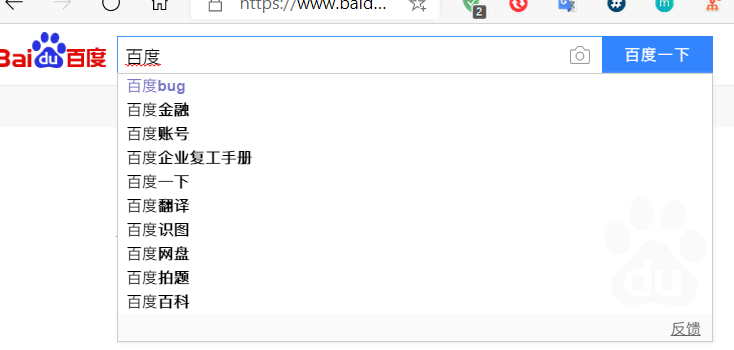
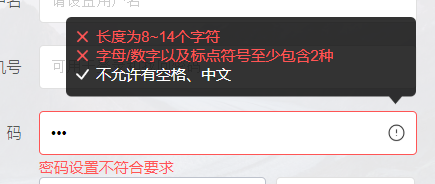
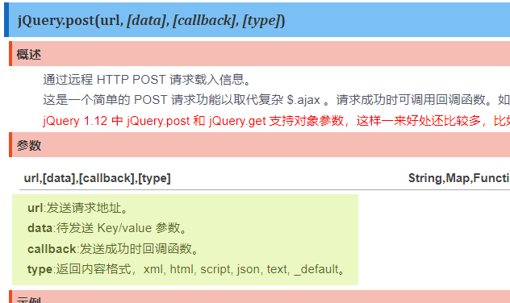

#### 前言

---

> 早年网站登录如果失败需要刷新整个页面，页面部分内容更新也要刷整个页面才能显示。
>
> 而现如今大部分网站，都采用局部刷新，例如注册时，两次输入密码不同，就会有消息提示.. 提示部分就是部分刷新出来的。
>
> 在采用局部刷新时，可以刷新页面部分信息。

---


# JSON

> 什么是JSON?

- **JavaScript Object Notation (JS对象标记)**
- 一种轻量级的数据交换格式，目前使用广泛。

> 语法格式

- 对象标识为**键值对**
- 花括号保存对象
- 方括号保存数组
- 数据之间用逗号分隔

> JS与Json的关系、及相互转换
>
> - Json 相当于就是 JS对象的字符串形式
> - `JSON.parse` json字符串转JS对象
> - `JSON.stringfy()` JS对象转json字符串

```javascript
// JSON转JS对象
var person = JSON.parse('{"name":"sakura","age"=20,"sex":"男"}');
/*  person
age: 20
name: "sakura"
sex: "男"
*/
```

```javascript
// JS对象转JSON字符串
var person = {
    name:"官宇辰",
    age:19,
    sex:"男"
}
var person_json = JSON.stringfy(person);
```

> 前后端分离，使得数据交换变得异常重要!!JSON在其中起到了关键的作用


# Ajax

> 什么是Ajax？

- **Asynchronous JavaScript and XML （异步的JavaScript和XML）**
- 一种网页部分刷新的技术
- 不是一门编程语言，而是一种用于创建更好更快以及交互性更强的Web应用程序的技术

应用场景：

- 搜索预测



- 密码格式判断



> 通常只是网页的一小部分在更新，而整个网页并没有刷新。


Ajax的核心是`XMLHttpRequest`对象（XHR）。

XHR为向服务器发生请求和解析服务器响应提供了接口，可以以异步的方式从服务器获取新数据。



> 重要的几个参数：
>
> - url：发生请求的地址
> - data：发送请求时携带的key:value参数
> - success：发送成功的回调函数
>   - data：封装的服务器响应的数据
>   - status：状态

- 代码示例

  - 前端

  ```jsp
  <%@ page contentType="text/html;charset=UTF-8" language="java" %>
  <html>
  <head>
      <title>AjaxTest</title>
      <script src="${pageContext.request.contextPath}/static/jquery-3.4.1.js"></script>
      <script>
          function a1() {
              // 所有参数
              // url:待载入的页面的地址
              // data:待发送的key:value 参数
              // success:载入成功的回调函数
                  // data: 封装了服务器返回的数据
                  // status: 状态
  
              $.post({
                  url:"${pageContext.request.contextPath}/ajaxtest",
                  data:{"username":$("#username").val()},
                  success:function (data) {
                      if (data.toString()=="OK"){ //返回OK时：
                          $("#msg").css("color","yellowgreen");
                      } else {
                          $("#msg").css("color","red");
                      }
                      $("#msg").html(data); // 将返回数据显示到页面中
                  }
              })
          }
      </script>
  </head>
  <body>
      <%--失去焦点时执行a1()--%>
      <input type="text" id="username" onblur="a1()">
      <%--用于动态插入数据--%>
      <span id="msg" ></span>
  </body>
  </html>
  ```

  - 后端控制层

  ```java
  public class AjaxTest extends HttpServlet {
      @Override
      protected void doGet(HttpServletRequest req, HttpServletResponse resp) throws ServletException, IOException {
          resp.setCharacterEncoding("utf-8");
          resp.setContentType("text/html");
          req.setCharacterEncoding("utf-8");
  		
          
          String msg = ""; // 用于返回的数据
          
          String username = req.getParameter("username");// 从前端获取数据
          // 数据判断
          if (username.equals("admin")) {
              msg = "OK";
          } else {
              msg = "用户名有误";
          }
          // 响应回数据
          resp.getWriter().print(msg);
      }
  
      @Override
      protected void doPost(HttpServletRequest req, HttpServletResponse resp) throws ServletException, IOException {
          doGet(req, resp);
      }
  }
  ```

  ```xml
  <servlet>
      <servlet-name>AjaxTest</servlet-name>
      <servlet-class>com.sakura.controller.AjaxTest</servlet-class>
  </servlet>
  <servlet-mapping>
      <servlet-name>AjaxTest</servlet-name>
      <!--对应前端请求的地址-->
      <url-pattern>/ajaxtest</url-pattern> 
  </servlet-mapping>
  ```

  

