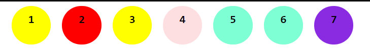
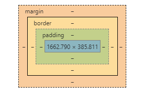
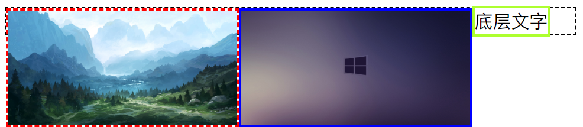
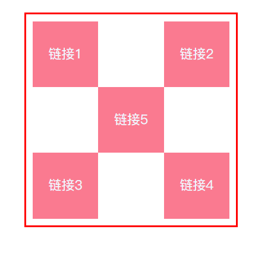
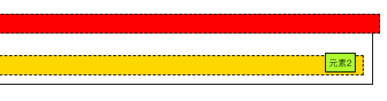
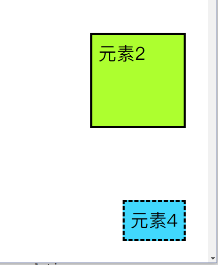
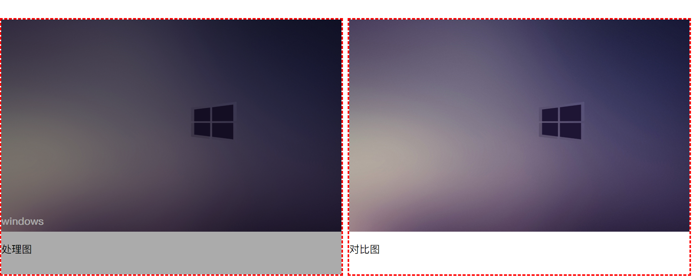

[TOC]


# CSS学习入门

## 1、CSS初级

- 什么是CSS

  ==Cascading Style Sheet 层叠样式表==

  字体，颜色，边距，

- 发展史
  - CSS1.0
  - CSS2.0 ：DIV+CSS,(提出了HTML与CSS结构分离的思想、SEO)
  - CSS2.1  ：浮动定位
  - CSS3.0：圆角、阴影、动画（浏览器兼容性问题）

- 入门语法

  ```css
  选择器{
      声明1;
      声明2;
      ...;
  }
  ```

  >  声明都使用分号结尾。

- CSS与HTML结构分离的优势：

  1. 内容与表现分离
  2. 网页结构表现统一、可以实现复用
  3. 样式十分丰富
  4. 建议使用独立于Html的CSS文件
  5. 利用SEO、容易被搜索引擎收录（VUE?!）

- CSS的文件导入方式（**就近原则**）

  1. **行内样式**，标签元素中，增加style属性（不推荐）

  2. **内部样式**，写在html文件的head块内，用style标签

  3. **外部样式**

     - 链接式

       ```html
       <link rel="stylesheet" href="css/style.css">
       ```
       
     - 导入式(css2.1特有的)

       ```html
       <style>
               @import url("css/style.css");
       </style>
       ```

       

## 2、CSS选择器

> 作用：选择页面上的某个或者某一类元素

### 2.1 基本选择器

#### 1、标签选择器

> 会选择所有的文件下所有的同名标签元素

```css
标签名{
    声明1;
    声明2;
    ...
}
```


#### 2、类选择器

> 可以多个标签归类，统一管理，代码复用

```css
.类名{
    声明1;
    声明2;
    ...
}
```


#### 3、id选择器

> 给标签添加id属性（保证ID全局唯一），可以定向编辑样式

```css
#id名{
    声明1;
    声明2;
    ...
}
```


> **优先级：id选择器>class选择器>标签选择器**


### 2.2、层次选择器

- 后代选择器

  ```css
  body p{
      声明;
      ...
  }
  body 标签里面所有的 p标签中内容样式都手影响
  ```

- 子选择器

  ```css
  body>p{
      声明;
      ...
  }
  body 标签的子标签中的p标签中内容样式受影响
  ```

- 相邻兄弟选择器

  ```css
  .类名 + p{
      声明;
      ...
  }
  p标签元素类名为..与之相邻（同辈）的下一个p标签中内容样式受影响（只选择一个！）
  ```

- 通用选择器

  ```css
  .target ~p{
      声明;
  }
  在此标签后的所有同辈的p标签中内容样式受影响
  ```

### 2.3、结构伪类选择器

```css
伪类:条件{
 ...   
}
/* 选中 ul中第一个子元素 */
ul li:first-child{
    background-color: red;
}

/* 选中 ul中最后一个子元素 */
ul li:last-child{
    background-color: greenyellow;
}


选择 p元素的父级元素的子元素，并锁定第n个,并且是p元素则生效
p:nth-child(n){
    background-color: blue;
}

/* 选中父类子元素中第n个与 p同类型的元素 */
p:nth-of-type(n){
    background-color: burlywood;
}
```

### 2.4、属性选择器

- *= 包含
- ^= 以...开头
- $= 以....结尾

```css
/* 选中带id属性的元素 */
a[id]{
    background-color: red;
}
/* 选中id为third的a标签元素 */
a[id = "third"]{
    background-color: greenyellow;
}
/* 选中class中有 ba的a标签元素 */
a[class *= "ba"]{
    background-color: #FEDFE1;
}
/* 选中href属性中以https开头的a标签元素 */
a[href ^= https]{
    background-color: blueviolet;
}
/* 以com结尾的 */
a[href $= com]{
    background-color: yellow;
}
```

```html
<!DOCTYPE html>
<html lang="en">
<head>
    <meta charset="UTF-8">
    <meta name="viewport" content="width=device-width, initial-scale=1.0">
    <title>属性选择器</title>
    <link rel="stylesheet" href="css/style4.css">
</head>
<body>
    <a href="https://www.baidu.com" class="ball">1</a>
    <a href="" id="second">2</a>
    <a href="https://www.163.com" class="ball" id="third">3</a>
    <a href="./index.html" class="ball">4</a>
    <a href="5akura">5</a>
    <a href="F:/GitProject/GitLearn/MarkDown/HTML学习文件/resourse/image/testImg.png">
        6
    </a>
    <a href="https://www.google.cn" title="google" target="_blank">7</a>
</body>
</html>
```



---


## 3、网页美化

- Span标签：重点突出的文字、使用span标签、没有特殊意义、约定俗成。

### 3.1、字体样式

- font-size、font-family、font-weight...

```css
/* 字体样式 */
body{
    font-family:Consolas,'华文中宋';
}
h1{
    font-size: 50px;
}
.p1{
    font-weight: bold;
}
.p2{
    color: #2EA9DF;
    font-style: italic;
}
```


### 3.2、文本样式

- 颜色、对齐方式、首行缩进、行高、下划线...

```css
/* 文本样式 */
#title2{
    /* 文本对齐方式 */
    text-align: center;
    font-size: 50px;
}
.p3{
    /* 首行缩进 */
    text-indent: 2em;
    /* 文本高度 */
    height: 40px;
    /* 行高 */
    line-height: 10px;
    /* 下划线  删除线  上划线*/
    text-decoration:underline;
    text-decoration: line-through;
    text-decoration: overline;

    color: rgba(203, 24, 24, 0.673);
}

.text1,.images{
    /* 水平对齐（需要参照） */
    vertical-align: middle;
}
```

### 3.3、超链接伪类

```css
a{
    text-decoration: none;
    color: black;
    
}
a:hover{
    color: tomato;
    font-size: 25px;
}
a:active{
    color: green;
}
a:visited{
    color: #2EA9DF;
}
/* 阴影
阴影颜色,水平偏移,垂直偏移,模糊半径
*/
span{
    text-shadow: aqua 3px -3px 2px;
}
```

### 3.5、列表

```css
#nav{
    width: 277px;
    background-color: rgb(239, 239, 226);
}

#title3{
    font-size: 20px;
    font-weight: bold;
    text-indent: 1em;
    line-height: 40px;
    background-color: rgb(239, 110, 45);
}
ul{
    background-color: rgb(239, 239, 226);
}

ul li{
    height: 25px;
    list-style: none;
    /* list style
    none:无
    circle 空心圆
    decimal 数字
    square 方形
    */
    text-indent: 1em;
}

ul>li>a{
    text-decoration: none;
    font-size: 16px;
    color: black;
}

ul>li>a:hover{
    color: #ea6a29f4;
    background-color: rgba(251, 151, 101, 0.3);
    text-decoration: underline;
}
```

### 3.6、渐变

```css
background-color: #FFFFFF;
background-image: linear-gradient(180deg, #FFFFFF 0%, #6284FF 50%, #FF0000 100%);
/*参考网站
https://www.grabient.com/
*/
```


## 4、盒子模型



- margin：外边距

- padding : 内边距

- border: 边框

  > margin：0 auto;  有时可以用于图层居中显示

### 4.1、边框

```CSS
#arch{
    width: 50px;
    height: 50px;
    border: 1px solid red;
    background-color: greenyellow;
    border-radius: 50px 0px 0px 0px;
    margin: 0px 0px 0px 20px;
    box-shadow: 1px 1px 100px gold;
}
```


## 5、浮动

- 块级元素(一个独占一行)
  - `h1`-`h6`；`p`；`div`；`列表`
- 行内元素（一行可以有多个）
  - `span`,`a`,`img`

> 行内元素可以被包含在块级元素中，反之则不行

### 5.1、display

```css
/* display:
block 转化为块元素
inline 转为 行内元素
inline-block 是块元素 但是有行内元素的特性
可以在一行显示
*/

div{
    width: 200px;
    height: 200px;
    border: 2px solid red;
    display: inline;
}

span{
    width: 100px;
    height: 100px;
    border: 2px solid greenyellow;
    display: inline-block;
}
```

### 5.2、float（浮动）

```css
.image1{
    width:200px;
    height:100px;
    border: 2px dashed red;
    display: inline-block;
    float: right;
}
.image2{
    width:200px;
    height:100px;
    border: 2px solid blue;
    display: inline-block;
    float: right;
}
```

### 5.3、父级边框塌陷问题



- clear

```css
clear:both /* 两边都不允许有浮动*/
clear:left /* 左侧都不允许有浮动*/
clear:right /* 右侧都不允许有浮动*/
clear:none 
```

#### 解决方案

##### 1、 增加父级元素高度

(若元素有固定高度，则会受影响)

```css
.botton{
    border: 1px dashed black;
    height: 300px;
}
```

##### 2、设置一个空的div，用于消除浮动

(代码中避免出现空div)

```css
<div class="clear"></div>

.clear{
    clear:both;
    margin: 0;
    padding:0;
}
```

#####  3、overflow

（内容会被截取）

```css
/* 父级元素中增加一个overflow*/
overflow:hidden
溢出部分自动隐藏
```

##### 4、父类添加一个伪类:after

（推荐使用）

```css
.botton::after{
    content: " ";
    display: block;
    clear: both;
}
```


### 5.4、display与float对比

| float       | 浮动会脱离标准文档流，会解决父级边框塌陷的问题 |
| ----------- | ---------------------------------------------- |
| **display** | **方向无法控制**                               |


## 6、定位

### 6.1、相对定位  relative

- position:relative

```css
/* 相对于初始位置 偏移 */
    position: relative;
    top: -30px;
    left: 30px;
/* 不会脱离父级，原来的位置被保留*/
```

- 练习

- 

  ```css
  #botton2{
      margin: 40px auto;
      padding: 10px;
      border: 3px solid red;
      height: 300px;
      width: 300px;
  }
  .links{
      background-color: rgb(250, 122, 144);
      width: 100px;
      height: 100px;
      text-align: center;
  }
  a{
      line-height: 100px;
      text-decoration: none;
      font-size: 20px;
      color: aliceblue;
  }
  .links:hover{
      background-color: rgb(103, 212, 255);
  }
  
  #link2,#link4{
      position: relative;
      left: 200px;
      top: -100px;
  }
  
  #link5{
      position: relative;
      left: 100px;
      top: -300px;
  }
  ```


### 6.2、绝对定位  absolute

- 初始位置会丢失，不在标准文档流中
- 没有父级元素相对定位的前提下，相对于浏览器的边框定位
- 若父级元素存在定位，通常相对于父级元素定位
- 在父级元素范围内移动



```css
#botton{
    margin: 40px;
    padding: 5px;
    border: 2px solid black;
    /*父级元素定位*/
    position: relative;
}

#element2{
    margin: 10px;
    padding: 5px;
    background-color: greenyellow;
    border: 2px solid black;
    /* 相对于父级元素绝对定位 */
    position: absolute;
    bottom: 10px;
    right: 20px;
}
```


### 6.3、固定定位  fixed




### 6.4、z-index(类似图层)

- 背景透明度



```css
#botton3{
    width: 400px;
    height: 300px;
    overflow: hidden;
    border: 2px dashed red;
    font-size: 12px;
    line-height: 25px;
    position: relative;
    display: inline-block;
}
#image{
    z-index: 50;
}
#tag{
    position: absolute;
    bottom: 50px;
    left: 0px;
    color: white;
    font-weight: bold;
    
    z-index: 5;
}

#bg{
    height: 400px;
    width: 500px;
    background-color:black;
    /* 透明度 */
    opacity: 0.33;
    position: absolute;
    top: 0px;
    left: 0px;
    
    z-index: 10;
}
```


## **网页动画（特效）**

