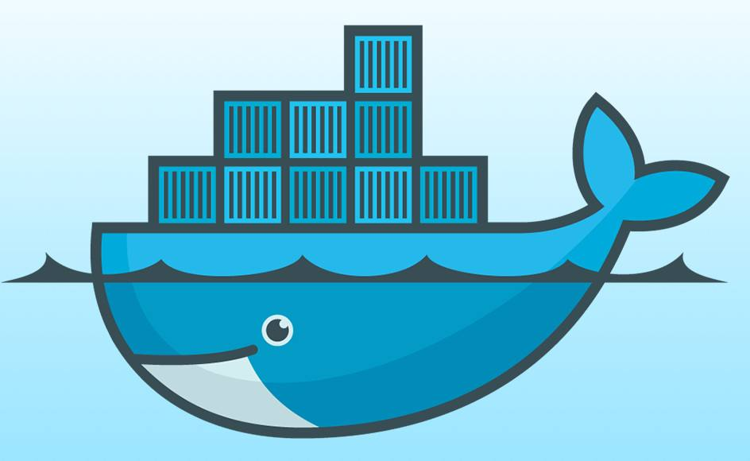
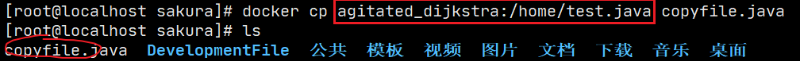
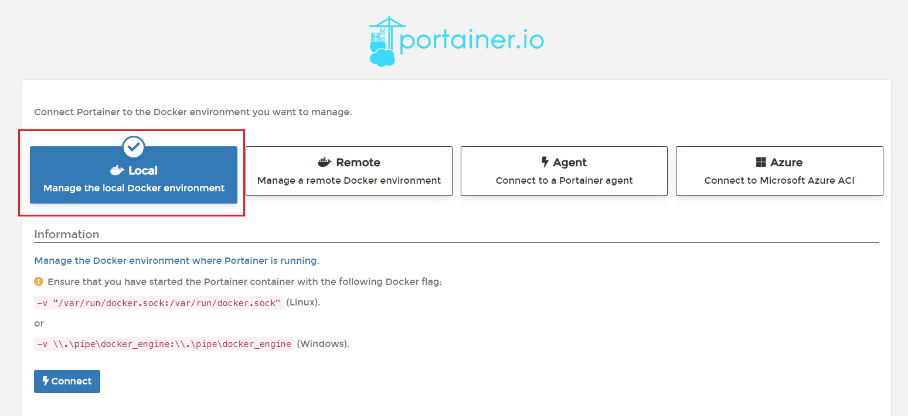
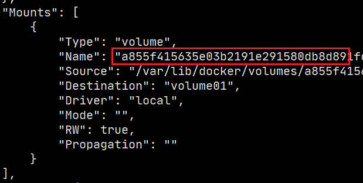
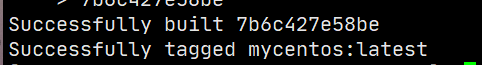
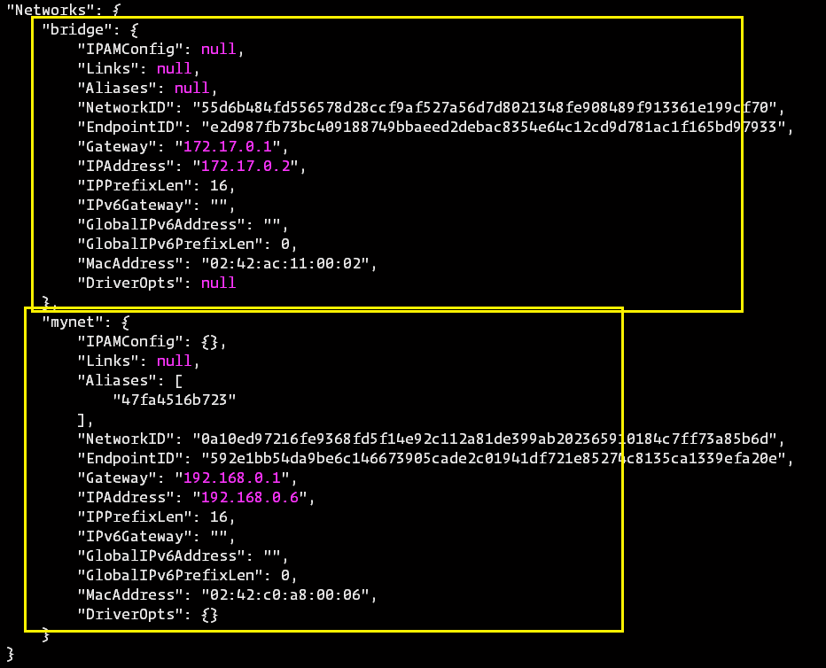

[toc]

# Docker



## 是什么

Docker 是一个开源的应用容器引擎，基于 Go 语言 并遵从 Apache2.0 协议开源。
Docker 可以让开发者打包他们的应用以及依赖包到一个轻量级、可移植的容器中，然后发布到任何流行的 Linux 机器上，也可以实现虚拟化。==（容器虚拟化技术）==
容器是完全使用==沙箱机制==，其灵感来源于集装箱，相互之间不会有任何接口（类似 iPhone 的 app）,更重要的是容器性能开销极低。


## 解决什么问题

场景一：
开发环境、测试环境和部署上线环境的不同的话，就可能项目在某个机器上可以运行，而到另一台机器上就不能运行。这就是环境的不一致导致的问题。

场景二：
你的开发机器坏了，需要重新安装，没有备份的话，所有的环境就需要重新安装，直接劝退。

场景三：
当前服务的压力大，需要对服务器进行快速扩容，此时不论是安装虚拟机还是租赁云服务器都很慢。

解决方案：
使用Docker，就可以在项目打包的时候==连带环境打包==，即使是一台全新的机器，就可以直接运行。这就是带环境安装。


## Docker历史

2010年，几个IT愤青。在美国成立了一家公司==dotCloud==,做一些pass的云计算服务，LXC有关的容器技术。

这种容器化技术的命名就是Docker。

起初的诞生并没有引起行业的注意。

2013年，对Docker进行了开源，然后一发不可收拾。之后每个月都会发布一个版本。

2014年4月9日，Docker1.0发布！

火爆的原因：

- 在此之前使用的虚拟机（类似VM等），使用软件虚拟硬件相当笨重，虽然同属于虚拟化技术，而主打容器技术的Docker相对来说**轻巧无比**
- 对应的使用虚拟机启动巨慢！但是Docker也就是一眨眼的时间


## 三个基本概念

- **镜像（Image）**：Docker 镜像（Image），就相当于是一个 root 文件系统。比如官方镜像 ubuntu:16.04 就包含了完整的一套 Ubuntu16.04 最小系统的 root 文件系统。镜像是一个==只读模板==。
- **容器（Container）**：镜像（Image）和容器（Container）的关系，就像是面向对象程序设计中的类和实例一样，镜像是静态的定义，容器是镜像运行时的实体。容器可以被创建、启动、停止、删除、暂停等。每个容器是相互隔离的。==可以把容器看作一个简易的Linux环境==
- **仓库（Repository）**：仓库可看着一个代码控制中心，用来==保存镜像==，官方的DockerHub，国内可以使用阿里云。


## Docker优点

Docker 是一个用于开发，交付和运行应用程序的开放平台。Docker 使您能够将应用程序与基础架构分开，从而可以快速交付软件。借助 Docker，您可以与管理应用程序相同的方式来管理基础架构。通过利用 Docker 的方法来快速交付，测试和部署代码，您可以大大减少编写代码和在生产环境中运行代码之间的延迟。

### 1、快速，一致地交付您的应用程序

Docker 允许开发人员使用您提供的应用程序或服务的本地容器在标准化环境中工作，从而简化了开发的生命周期。

容器非常适合持续集成和持续交付（CI / CD）工作流程，请考虑以下示例方案：

- 您的开发人员在本地编写代码，并使用 Docker 容器与同事共享他们的工作。
- 他们使用 Docker 将其应用程序推送到测试环境中，并执行自动或手动测试。
- 当开发人员发现错误时，他们可以在开发环境中对其进行修复，然后将其重新部署到测试环境中，以进行测试和验证。
- 测试完成后，将修补程序推送给生产环境，就像将更新的镜像推送到生产环境一样简单。

### 2、响应式部署和扩展

Docker 是基于容器的平台，允许高度可移植的工作负载。Docker 容器可以在开发人员的本机上，数据中心的物理或虚拟机上，云服务上或混合环境中运行。

Docker 的可移植性和轻量级的特性，还可以使您轻松地完成动态管理的工作负担，并根据业务需求指示，实时扩展或拆除应用程序和服务。

### 3、在同一硬件上运行更多工作负载

Docker 轻巧快速。它为基于虚拟机管理程序的虚拟机提供了可行、经济、高效的替代方案，因此您可以利用更多的计算能力来实现业务目标。Docker 非常适合于高密度环境以及中小型部署，而您可以用更少的资源做更多的事情。


## Docker安装(Yaml安装)

CentOS7上运行Docker，内核版本3.10+，64位

1. 把yum包更新到最新

   ```shell
   yum update
   ```

2. 安装需要的软件包， yum-util 提供yum-config-manager功能，另外两个是devicemapper驱动依赖的

   ```shell
   yum install -y yum-utils device-mapper-persistent-data lvm2
   ```

3. 设置镜像源（选择其中一个,国内推荐阿里云）

   ```txt
   yum-config-manager --add-repo http://download.docker.com/linux/centos/docker-ce.repo（中央仓库）
   
   yum-config-manager --add-repo http://mirrors.aliyun.com/docker-ce/linux/centos/docker-ce.repo（阿里仓库）
   ```

4. 可以查看所有仓库中所有docker版本，并选择特定版本安装

   ```shell
   yum list docker-ce --showduplicates | sort -r
   ```

5. 安装Docker 

   ```shell
   yum install docker-ce-版本号 # 不指定版本号默认下载最新版
   ```

6. 启动Docker，然后加入后台启动

   ```shell
   systemctl start docker # 启动docker
   systemctl enable  docker # 开启后台启动
   ```

7. 配置镜像加速器

   ```shell
   # 1.创建目录及文件
   mkdir -p /etc/docker
   # 2.创建json配置文件并，配置阿里云所给的加速器地址
   sudo tee /etc/docker/daemon.json <<-'EOF'
   {
     "registry-mirrors": ["https://ghy1ex06.mirror.aliyuncs.com"]
   }
   EOF
   
   # 然后保存退出 重新加载配置
   sudo systemctl daemon-reload
   sudo systemctl restart docker
   ```

   

## Docker卸载

1. 停止docker服务

   ```shell
   systemctl stop docker
   ```

2. 移除已安装的安装包

   ```shell
   yum -y remove docker-ce
   ```

3. 清除残留文件

   ```shell
   rm -rf /var/lib/docker
   ```

4. 检查是否删除完全

   ```shell
   yum list|grep docker
   ```


## Docker和VM对比


Docker直接利用宿主机的硬件，容器之间相互的独立，VM需要安装笨重的OS。所以使用Docker要比使用虚拟机来配置安装环境更加便捷。

|                | Docker容器              | 虚拟机（VM）               |
| -------------- | ----------------------- | -------------------------- |
| **操作系统**   | 与宿主机共享OS          | 宿主机OS上运行虚拟机OS     |
| **存储大小**   | 硬件小，便于存储与传输  | 镜像庞大（vmdk,vdi等）     |
| **运行性能**   | 几乎无额外性能损失      | 操作系统额外的CPU,内存消耗 |
| **移植性**     | 轻便，灵活，适用于Linux | 笨重，与虚拟机耦合度高     |
| **硬件亲和性** | 面向软件开发者          | 面向硬件运维者             |
| **部署速度**   | 快速，秒级              | 较慢，10以上               |


## Docker HelloWorld流程简单回顾

1. Docker run helloworld,命令执行，首先搜索本地仓库查找镜像

   

2. 若本地有对应的镜像，直接启动。

3. 若没有找到则到远程仓库下载镜像然后启动运行


## Docker运行原理


Docker是一个**Client-Server**结构的系统，Docker守护进程（Docker daemon）运行在主机上， 然后通过Socket连接从客户端访问，守护进程从客户端接受命令并管理运行在主机上的容器。 **容器，是一个运行时环境，就是我们前面说到的集装箱。**


## Docker命令

### 帮助命令

`docker version  `|` docker info` 查看docker相关的一些信息。

`docker help` 查看帮助文档。


### 镜像命令

`docker images` 查看主机上的镜像信息


tomcat中集成了JDK等运行所需要的所有环境。

选项：

- `-a` ：列出本地所有镜像
- `-q` ：查询只显示镜像ID
- `--digests`：显示镜像的摘要信息。

---

`docker search xxx`在镜像仓库搜索xxx镜像。

选项

- `-s num`：列举点赞数超过num的镜像

  
  
  

---

`docker pull xxx` 从镜像仓库下载xxx镜像,==分层下载==

`docker rmi xxx` 删除xxx镜像，通常会由于镜像在容器中被引用而删除失败，使用`-f`参数可以进行强制删除。

骚操作：

`docker rmi -f $(docker images -aq)`删除全部的镜像


### 容器命令

`docker container ls`：列举本地容器信息


---

`docker run [选项] xxx `：创建一个容器并启动xxx

选项：

- `--name`：指定容器名字

- `-d`：后台运行，并返回容器ID

- `-i`：以交互模式运行容器，通常与-t共同使用

- `-t`：为容器重新分配伪输入中断

- `-p`：指定端口映射（==由于沙箱机制，容器中开启的端口外界是不能之间访问的，只有容器内部可以访问，所有需要进行端口映射==）

  - ip:hostPort:containerPort

  - ip::containerPort

  - **hostPort:containerPort**（最常用）

    
    
    

- `-P`：随机端口映射

> 注意：
>
> ==想要在后台启动进程，就需要一个对应的的前台进程==


----

`docker ps` 查看正在运行的容器


选项：

`-a`：查询正在运行和历史运行的容器


`-n`：最近新创建n个容器

`-q`：只显示容器编号

---


`exit`(关闭再退出)或者`ctrl+P+Q`不关闭直接退出容器

`docker exec -it 容器id 命令`在容器外进行操作


`docker exec -it 容器id /bin/bash`


`docker attach 容器ID`以上两个命令都可以重新进入容器


区别：

- 前者在容器中启动了新的进程
- 后者直接”推门进入“


将容器中的文件拷贝到主机中：

`docker cp 容器名字:拷贝文件或目录 拷贝目标位置或文件名`



---

`docker stop xxx`通过容器名或容器id关闭容器

`docker kill xxx`强制关闭容器

`docker restart xxx`通过容器名或容器id重启容器

`docker start xxx`...启动容器


`docker create xxx` 创建一个容器

`docker rm xxx` 通过容器ID删除容器


`docker logs -f -t --tail n 容器ID`查看容器日志

选项：

- `-f`跟随最新的日志打印
- `-t`显示时间戳
- `--tail n`显示最后n行 


`docker stats 容器名`：查看docker中运行资源占用情况


`docker inspect 容器Id/容器名` 查看容器的详细信息。


## Docker可视化（非重点）

- portainer

  ```shell
  docker run -d -p 8080:9000 \
  --restart=always \
  -v /var/run/docker.sock:/var/run/docker.sock \
  --name prtainer-test \
  docker.io/portainer/portainer
  ```

  
  
  当8080端口开放后，外网通过8080端口就可以进入可视化界面


选择本地




主界面


一些详细信息


## Docker镜像讲解

### 镜像加载原理

> 实际上Docker的镜像是由==层层文件堆叠起来的==
>
> bootfs：主要包含bootloader和kernel（也就是我们虚拟机的内核）
>
> rootfs：就相当于运行在内核之上的不同发行版本的os（Ubuntu、Centos）
>
> 新镜像是从 base 镜像一层一层叠加生成的。每安装一个软件，就在现有镜像的基础上增加一层。
>
> 问什么 Docker 镜像要采用这种分层结构呢？
> 最大的一个好处就是 - ==共享资源，节省空间。==


这种文件分层的思想在Docker中无处不在，

### 关于联合文件系统（UnionFS）

> 联合文件系统（UnionFS）是一种分层、轻量级并且高性能的文件系统，它支持对文件系统的修改作为一次提交来一层层的叠加，同时可以将不同目录挂载到同一个虚拟文件系统下。
>
> 不同 Docker 容器就可以共享一些基础的文件系统层，同时再加上自己独有的改动层，大大提高了存储的效率。


### 提交自定义镜像

当一些环境的配置十分复杂时，每次启动都需要重新配置十分繁琐，我们可以在已有镜像的基础上，在原有的层级上添加一些自定的操作，然后重新形成我们自己的镜像，并且可以将其提交，然后供其他人pull使用。

`docker commit -a="author_name" -m="commit_info" 容器id/容器名 new_image_name`

例如我们在aliyun上pull的tomcat中每次都要将webapp.dist中的内容cp到webapp中才能正常访问页面，这样的话我们每次启动tomcat都需要设置一遍，现在我们可以对其进行修改 然后commit，从此后就使用我们commit的镜像就可以。】


## Docker数据卷

在使用Docker镜像搭建环境的时候，总有个问题就是，由于容器的沙箱机制，导致容器里面的文件系统，和Docker宿主的机的文件系统是隔离的，==一旦我们删除了容器，其对应的所有文件信息也会被连带删除==，这样并不符合我们的开发预定（例如MySQL的数据库文件我们就需要持久化到本地，而不是放在容器中！），有什么办法可以将容器内的文件同步到宿主机上呢？


**Docker数据卷（Docker volume）**就是专门解决这个问题的；

- 可以将容器内部的文件挂载到宿主机上，即使容器删除数据依然存放在本地。Nice!
- 挂载后的文件在容器内部和本机上挂载的目录是双向绑定的！在容器没有被删除的情况下，无论那一边修改了内容都会进行同步！Nice!

使用命令(以MySQL为例)：

`docker run -it -d -p 3307:3306 -e MYSQL_ROOT_PASSWORD=123456 `

`-v /home/sakura/mysql_data:/var/lib/mysql`

> 关键在于第二行 `-v` 表示我们要进行数据卷挂载！后面紧接 `本机目录:容器内要挂载的目录/文件`
>
> 示例中就是将 /var/lib/mysql(即我们容器内数据库文件)挂载到本地的/home/sakura/mysql_data目录下


测试一下：


双向同步测试：


通过`docker inspect`来查看一下挂载信息(Mounts)：


### 具名挂载与匿名挂载

除了这种指定了路径的挂载方式，还可以分为**具名挂载，匿名挂载**顾名思义，挂载是可以取名的。

`-v 挂载目录`：这种只指定了容器挂载路径的成为匿名挂载


> 一般情况下，不指定主机路径，默认的挂载路径在`/var/lib/docker/volume`下，一个以挂载名命名的文件夹。
>
> 
>
> 

这种匿名挂载方式不便于我们定位，再来说一说**具名挂载**

`-v 挂载名:容器内要挂载的目录`：与指定路径挂载方式唯一的区别是具名挂载的`:`前面不是某个路径，所以不是以`/`开头的；

```shell
docker run -it -v juming:/home centos
```


还是这个路径，不过挂载名变成了我们可以区分的，所以==推荐使用具名挂载！==


对应Docker Volume有专门的命令：`docker volume COMMAND`

`ls`:列出所有挂载信息

```shell
# 显示所有挂载
[root@localhost mysql_data]# docker volume ls
DRIVER              VOLUME NAME
local               1bb3cf88444d84e62d997ffd61e9586eebdb05f655bd6d3269d85c635baa3cc2
local               3a971a25e8d5a757aed5673e1749671e15ddea34cbf13124a593dc528ac4ca5e
local               3ac002a76a011383416604ebd62302db5a17f7b7a121ea16d8c732aa1f9e350b
...
```

`inspect`：可以通过指定挂载名来查看具体的信息

```shell
# 查看详细信息
[root@localhost mysql_data]# docker volume inspect juming 
[
    {
        "CreatedAt": "2020-05-18T23:07:03+08:00",
        "Driver": "local",
        "Labels": null,
        "Mountpoint": "/var/lib/docker/volumes/juming/_data",
        "Name": "juming",
        "Options": null,
        "Scope": "local"
    }
]
```

`create`：创建一个卷

`rm`：删除一个或多个卷

`prune`：删除本地所有未被使用的卷


**小知识：**

`docker run -it -v xxx:/xxx/xxx:or ..`或者`docker run -it -v xxx:/xxx/xxx:wr ..`

在容器挂载路径后还有一个参数 **or或rw**

这个参数是用于挂载后，==限制容器对被挂载文件的操作权限。==


### 初识Dockerfile

刚才我们是通过在启动运行镜像的时候通过`-v`命令参数来挂载，如果我们要挂载的数量比较多的时候，就不太方便，所以采用第二种方式就是使用`Dockerfile`。

==Dockerfile是专门用于生成镜像的脚本文件==，镜像结构是层级结构，Dockerfile中每一条命令就可以视为一层。我们可以通过编写Dockerfile来生成我们期望的镜像，把一些复杂的步骤放到镜像生成的步骤中，然后我们直接使用生成的镜像就OK;

我们先来写一个简易的Dockerfile，注意Dockerfile中所有的命令==关键字都是大写！==

```dockerfile
FROM centos #选择镜像基层
VOLUME ["volume01"] # 挂载目录,这里采用匿名挂载
CMD echo "--------End--------"
CMD /bin/bash
```

以上这些命令都会在创建镜像时执行：

`docker build -f dockerfile -t imageName:tag`

-f 参数后指定用于生成镜像的dockerfile

-t 参数写镜像名和标签


创建过程也能看出，每条命令都是在一个容器中运行然后移除过渡容器，最终形成我们自己的镜像。↓


现在由于我们已经把挂载信息写在了镜像创建的dockerfile中，所以我们直接启动就能看到挂载的文件；


同样我们可以使用Docker inspect查看镜像的信息，检查挂载目录在本机的位置


依然是这个熟悉的位置，并且确定就是一个匿名挂载。并且和我们之前进行挂载的效果一模一样：




现在完成了宿主机与容器之间的数据互通，那能不能做到**容器之间的数据互通**呢？


### 数据卷容器

通常我们的MySQL之间要进行数据共享，就需要容器之间能够数据共享。

既然我们容器可以与宿主机进行数据互通，那可不可以将宿主机当作一个中介，来实现容器间的数据互通呢？

在启动时通过 `--volumes-from 容器名`参数就可将指定容器的数据拷贝使用，并且是==双向绑定==


```shell
[root@localhost volumes]# docker run -it --name centos02 --volumes-from centos01 sakura/centos:1.0
```

通过以上这个命令我们就成功将centos01容器中的数据完全拷贝了一份到centos02中，通过查看文件就能看出，即使一方修改了文件另外一方也可以看到。

我们来看看他们分别的挂载信息：

centos01:


centos02:


可以发现，两个容器在本地的挂载地址是一模一样的，也就证明确实==宿主机充当的一个中介的作用==。

至于这个挂载文件的生命周期

> 直到没有一个容器再使用这个文件，宣告生命周期结束，但是本地会保留一份记录。
>
> 就算其中任何一个容器被终止，也不会影响原有的文件持久化。


## Dockerfile

学习Dockerfile意味着我们可以按自己需求来定制我们个人的镜像了，所有DockerHub中的镜像都是通过Dockerfile构建而成的。

我们来一下使用Dockerfile构建镜像的过程：

图中我们的一条Dockerfile指令都会单独执行，并产生一个镜像层，最终生成一个完整的镜像，然后在读写层进行我们的操作。


### Dockerfile指令

- 所有的Dockerfile指令关键字均是大写
- Dockerfile中指令是从上到下顺次执行。


`FROM`：设置基础镜像

> 最基层的镜像是scratch，dockerhub中90%的镜像都是基于这个

`COPY/ADD`：构建镜像时复制文件到镜像中

`VOLUME`：设置容器文件挂载

`CMD/ENTRYPOINT`：虽然两者都是在容器启动时执行命令，但是有些许区别：

> CMD：始终只有最后一个生效，命令会覆盖之前的
>
> ENTRYPOINT：以追加方式设置命令

`RUN`：指定镜像构建时运行的脚本

`WORKDIR`：是cd的变身，设置工作目录，是RUN，CMD，COPY，ADD的工作目录

`EXPOSE`：指定容器暴露的端口

`ENV`：配置容器的环境变量


### 实战：创建我们自己的增强centos

在官方给出的centos镜像中，我们得到的是一个阉割版本的centos，一些命令是无法使用的，比如vim、ifconfig等，我们可以使用Dockerfile创建一个我们自己的“增强版”

```dockerfile
FROM centos

MAINTAINER 5akura

ENV WORKDIR /root
WORKDIR $WORKDIR

EXPOSE 80
# 由于官方给出的yum镜像源是CentOS的我们要将其就行备份然后替换为aliyun的
RUN mv /etc/yum.repos.d/CentOS-Base.repo /etc/yum.repos.d/CentOS-Base.repo.backup
RUN mv /etc/yum.repos.d/CentOS-Extras.repo /etc/yum.repos.d/CentOS-Extras.repo.backup
RUN mv /etc/yum.repos.d/CentOS-AppStream.repo /etc/yum.repos.d/CentOS-AppStream.repo.backup
RUN mv /etc/yum.repos.d/CentOS-centosplus.repo /etc/yum.repos.d/CentOS-centosplus.repo.backup
RUN curl -o /etc/yum.repos.d/CentOS-Base.repo http://mirrors.aliyun.com/repo/Centos-8.repo
RUN yum clean all
RUN yum makecache
RUN yum -y install vim
RUN yum -y install net-tools
CMD echo "-------end---------"
CMD /bin/bash
```

我们使用Docker build命令来创建我们的镜像：

```shell
docker build -f dockerfile -t mycentos .
```




这里就有了我们创建好的镜像，直接使用即可。


之前无法正常使用的命令现在都可以使用了。并且进入容器后直接进入工作目录(WORKDIR)


除此以外，我们还可以使用`docker history`来查看某一个特定容器的构建过程


### CMD和ENTRYPOINT区别

两个命令的作用都是在运行创建容器时执行一段命令，但是它们之间还是细微的差别

**CMD-test**

> ```dockerfile
> FROM centos
> CMD ["ls","-a"]
> CMD ["ls","-l"]
> CMD ["pwd"]
> ```
>
> 创建镜像后，执行结果：
>
> ```shell
> [root@localhost docker-test-volumes]# docker run test-cmd
> / # pwd的效果
> ```
>
> ==说明始终只有最后一个cmd生效==
>
> ```shell
> [root@localhost docker-test-volumes]# docker run test-cmd ls
> bin
> dev
> etc
> home
> lib
> lib64
> ```
>
> ==我们在启动时写的命令 会覆盖dockerfile中的CMD==

我们再来来测试一下ENTRYPOINT

**ENTRYPOINT-test**

> ```dockerfile
> FROM centos
> ENTRYPOINT ["ls","-a"]
> ENTRYPOINT ["ls","-l"]
> ENTRYPOINT ["pwd"]
> ```
>
> 创建镜像执行结果：
>
> ```shell
> [root@localhost docker-test-volumes]# docker run entrypoint-test
> / 
> ```
>
> 与CMD一致
>
> ```shell
> [root@localhost docker-test-volumes]# docker run entrypoint-test ls -l
> pwd: invalid option -- 'l'
> Try 'pwd --help' for more information.
> ```
>
> ==区别来了：==
>
> 在CMD中docker run中增加的命令参数是将原有的pwd覆盖掉了
>
> 在ENTRYPOINT则是在pwd后面进行追加，所以才会报错。


----

### 综合练习：创建DIY Tomcat并发布应用

 ```dockerfile
FROM mycentos
ENV WORKDIR /usr/local

ADD apache-tomcat-9.0.30.tar.gz /usr/local
ADD jdk-8u251-linux-x64.rpm /usr/local
WORKDIR $WORKDIR

RUN rpm -ivh jdk-8u251-linux-x64.rpm

# 环境变量
ENV JAVA_HOME /usr/java/jdk1.8.0_251-amd64
ENV CLASSPATH $JAVA_HOME/lib/dt.jar:$JAVA_HOME/lib/tools.jar
ENV CATALINA_HOME /usr/local/apache-tomcat-9.0.30
ENV CATALINA_BASH /usr/local/apache-tomcat-9.0.30
ENV PATH $PATH:$JAVA_HOME/bin:$CATALINA_HOME/lib:$CATALINA_HOME/bin

EXPOSE 8080
ENTRYPOINT ["/usr/local/apache-tomcat-9.0.30/bin/catalina.sh","run"]
 ```

用以上命令创建完镜像之后，使用镜像启动，并将webapps中的test目录以及日志logs目录挂载到本地，方便我们后续部署应用和调试查看日志信息。

```shell
docker run -d -p 9090:8080 -v ...
```

然后我们使用curl命令来测试一下是否可以正常访问：

```shell
curl localhost:9090
```


到此为止，我们已经掌握了docker镜像的获取、使用、创建，还剩下最后一步就是将自己的镜像上传到DockerHub或者阿里云镜像仓库。


使用命令`docker push`，在此之前我们必须先登录dockerhub帐号：`docker login -u 用户名` 

相关操作，参考阿里云也给出的官方文档：


**docker全流程**


---


## Docker网络

> 由于Docker采用的沙箱机制，那么每一个独立的容器也会有一套完全独立网络的系统，在使用Docker创建tomcat容器的时候，我们却可以通过宿主机去访问到容器内部。这是由于Docker采用虚拟网卡技术，并使用桥接的方式接入我们的Linux中。这种技术又称虚拟网络设备==veth-pair==

  我们现在开始学习Docker的网络：

先使用`ip addr`或者`ifconfig`命令来查看我们Linux的网络信息：


显然这里的Docker0网卡就是我们需要了解的东西，在后面其实它的作用相当于一个路由器起到了路由转发的功能。

现在我们先启动一个tomcat，然后我们查看Linux的网卡情况：

```shell
docker run -it -d -P --name mytomca01 mytomcat
```

发现多出来一个网卡：


网卡名是：`vethbe861dd@if10`，编号是`11`可以肯定这个网卡是一个虚拟出来的设备，并且和我们启动的Tomcat容器有紧密的关系，现在我们进入容器内部查看一下网卡情况

```shell
docker exec mytomca01 ip addr
```


这片网卡的名是：`eth0@if11`，编号是`10`，再看看上面那个那片网卡的信息，两边网卡之间有不简单的关系。

我们来尝试相互ping一下网络：


相互都能够Ping通，那么他们之间是一个什么样的关系呢？

> 就要回到最开始提到的veth-pair了，宿主机和容器之间就是通过这样一对接口来实现互相通信的，使用==这两个的虚拟网卡架起了一座桥相互通信，并且中间有docker0这块网卡对这些桥进行管理。==
>
> ==容器内部就使用这座桥然后通过Linux去访问外部的网。但是外部是无法Ping通docker容器。==

我们再来看看容器之间的网络通信：

再启动一个tomcat容器

```shell
docker run -itd -P --name mytomcat02 mytomcat
```


又多出一个网卡，通过上面的案例，可以猜到容器内部的网卡名是：`eth0@if13`，编号是`12`


话不多说我们之间开始尝试两个容器相互Ping：


发现是可以相互ping通的，那么大概的模型就是这样：


Docker0和这些容器之间的网卡之间有一座桥，相当于一个中转站，通过编号的网卡名来识别是那个容器发来的信息。并通过对应的接口接收。

这些虚拟网卡设备会在我们关闭或者移除容器的时候，自动移除。


**新问题出现：**

比如在分布式中，我们需要通过网络来完成对其他主机上的服务调用(这里我们服务代替容器)，在SpringCloud中，基础的服务注册与发现是通过IP去调用服务，但是考虑到IP可能变更的情况，随后使用Feign是通过服务名去调用服务，很好解决了这一问题

> 那么在Docker中，每次容器重启都会重新分配IP，也就意味着这是一个必须解决的问题，如偶然的一次数据库服务器宕机，那么重新启动后IP重新分配原来的服务通过ip无法再次获取。那么有什么办法可以实现通过容器名，来访问容器呢?

### --link

在启动容器时候，通过--link，将此容器的网络链接到目标容器上，就可以实现通过目标容器的容器名访问。

```shell
[root@localhost ~]# docker run -it -d -P --name mytomcat01 mytomcat
[root@localhost ~]# docker run -it -d -P --name mytomcat02 --link mytomcat01 mytomcat
```


此时貌似是通过 容器名访问的，其实不然。

> 通过截图中就可以看到 在执行ping mytomcat01的时候还是去ping对应的ip，相当于只是给这个ip取了mytomcat01的别名，类似于Windows修改host文件一样。差不多是localhost和127.0.0.1的关系。

在其/etc/hosts文件中就存放者这个秘密：


那我们来测试一下当ip变化时，还能不能Ping通吧：

> 经过测试无论mytomcat01的IP怎么变化，mytomcat02都总是能够定位到mytomcat01的ip，并且在两者都处于关闭的情况下，必须先启动mytomcat01再才能启动mytomcat02，但是当前者宕机之后，重启ip发生了变化，mytomcat02的hosts文件中的ip也会随着变化。


所以说算是实现了这个功能，但是其底层还是通过ip去访问。

参考博客：<https://www.cnblogs.com/jinyuanliu/p/10862972.html>；

<https://www.cnblogs.com/panwenbin-logs/p/11177607.html>


### 网络模式

现在我们再学习一个docker与网络项目的命令`docker network`(命令使用方式参考 --help)

使用docker network ls查看已经创建的网络


共有四种模式：

- host

  > Docker使用的网络实际上和宿主机一样，在容器内看到的网卡ip是宿主机上的ip。

- bridge(桥接模式,默认)

  > ==bridge模式是Docker默认的网络设置==，此模式会为每一个容器分配Network Namespace、设置IP等，并将一个主机上的Docker容器连接到一个==虚拟网桥==上。

- none

  > 这种模式下不会配置任何网络。

- container

  > ==多个容器==使用共同的网络看到的ip是一样的。

除此四个网络模式之外，docker还支持我们创建自定义网络模式：`docker network create xxx`


为什么确定brige是默认的网络模式呢？

> 首先我们看看一下上面截图中名为bridge的网络模式：`docker network inspect bridge`

看两个关键的地方：


这个172.17.0.1是不是非常熟悉，他就是我们网卡中见过的docker0

在下面的Options中可以发现这个网桥的名字是docker0


通过ip addr也能查到docker0的ip


其次还有一个位置：就是使用这个网络模式容器列表


同样我们查看容器的network信息也能发现关联的信息：


首先是bridge表明的网络的模式名是bridge，并给除了网络模式的id，这个id正是我们上面查看的bridge。


**那么是如何设置网络模式的呢？**

> 其实在容器启动的时候的有一个 --net的选项可以指定网络模式，缺省值是：`--net=bridge`


### 自定义网络模式

我们上面说到使用`docker network create`创建自定义的网络模式(使用--help查看帮助手册)。

我们可以创建一个专用的网络，且不会影响到此网络之外的其他网络。

参照bridge网络模式，需要设置几个参数：

- 子网络：subnet

- 网关：Gateway

  

这两个参数都是相对于我们创建的网络模式，不影响其他网络。

```shell
docker network create --subnet 192.168.0.0/16 --gateway 192.168.0.1 mynet
# 192.168.0.0/16 16位网络号，剩余16位都是主机号
# 网关是 192.168.0.1
# 网络名是mynet
```

```
NETWORK ID          NAME                DRIVER              SCOPE
0a10ed97216f        mynet               bridge              local
```

我们来简单看看我们创建的网络模式信息：


还没有任何容器加入到这个网络中，我们现在去创建几个容器

```shell
docker run -it -d -P --name=mytomcat01 --net=mynet mytomcat
docker run -it -d -P --name=mytomcat02 --net=mynet mytomcat
docker run -it -d -P --name=mytomcat03 --net=mynet mytomcat
```

然后我们查看其中一个容器的网络信息：


网络模式mynet 和 ip 地址都是有效的。

我们再看看mynet中是不是有我们添加的容器：


可以看到确实是有这三个容器，并且他们是在同一个子网下的，那么通过ip相互应该是可以Ping通的，那换成容器名字呢？

1. 主机上面依然只能用ip ping通

   

2. 容器之间：

   

   完全没有问题，那么我们看看hosts文件有没有被修改。

3. hosts文件

   

   没有修改的迹象。

4. 模拟宕机，重启ip变化

   

   仍然没有问题。

   

> 通过这种建立子网的方式，可以将需要相互调用的容器放在同一个网络模式下，以便他们通过容器名相互调用，相比--link在启动方面没有相互依赖的关系了。
>
> 并且这种方式是独立出来的一套网络环境，对于其他容器没有丝毫影响，外部的变化也影响内部。
>
> ==相比于--link这是一个更优解==


### 网络间联通

刚才我们使用自定义网络，形成了一个独立的网络系统，此网络系统外的除了主机以外的其他容器都是不能于这个网络中的容器通信的。


如图中的示意：不同网络下的的容器是无法相互ping通的(ip也不行)，其实在我们创建网络模式的时候，就出现了一个很有意思的事情，就是==主机上新增了一个虚拟网卡。==这个虚拟网卡与docker0是相同作用，只是作用的网络不同罢了。


当然创建容器时也会创建一对虚拟网卡，不过在使用我们自定义的网络模式时候，创建的网络系统的docker0换了扮演者：


这次docker0位置的换了我们创建的网关，即mynet。

> 那么就可以解释了，由于两个子网之间没有直接连接的链路，所以是不能相互通信的。

docker也提供了方法，可以让我们的一个子网中容器连通到另一个子网，然后实现与其他子网的容器通信：

`docker network connect [options] NETWORK CONTAINER `

```shell
# 将docker0子网中的mytomcat05 与mynet网络连通
docker network connect mynet mytomcat05
```

然后我们再来尝试ping一下mynet中的容器：


无论是通过ip还容器名都是可以ping通的！

**什么原理呢？**

- ip变化?

  

> 一看网络信息就发现，这个容器同时拥有了两个IP，相当于这个容器同时属于两个网络。

- 同样，容器的网络信息也会变化：

  


## 使用Docker运行SpringBoot打包镜像

1. 编写项目
2. Maven打包，测试本机运行
3. 编写Dockerfile，构建镜像
4. 发布运行

> 以后工作中我们交付时，只需要将应用构建成镜像即可。

在此之后：当我们部署使用镜像很多的时候，就要学习docker的容器编排、集群部署(k8s)等


## Docker Compose

