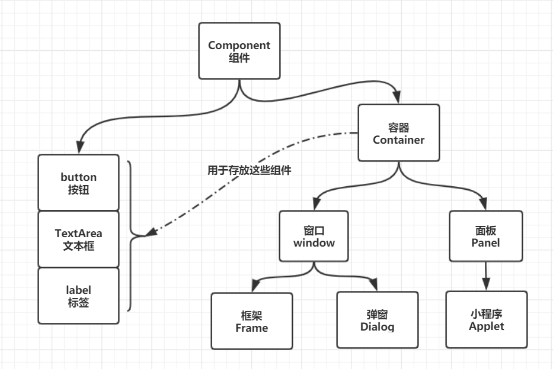
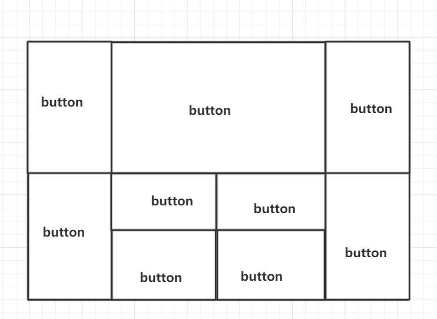
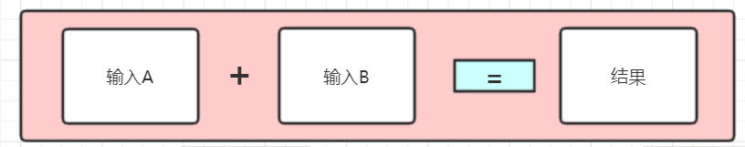

# GUI编程

> 组件

- 窗口
- 弹窗
- 面板
- 文本框
- 列表框
- 按钮
- 图片
- 监听事件
- 键盘事件

## 1、简介

- GUI核心技术:  Swing，AWT

> 为什么学习？

- 可以写出一些实用的小工具
- 了解MVC架构，了解监听。

##  2、AWT

### 2.1、AWT介绍

1. 包含了很多类和接口,GUI
2. 元素：窗口，按粘，文本框、…
3. java.awt
4. 主要构成



### 2.2、组件和容器

#### 1、Frame

```JAVA
package com.sakura.Awt_study01;

import java.awt.*;

/**
 * GUI的第一个界面
 *
 * @author 桜
 * 2020/2/19
 */
public class TestFrame {
    public static void main(String[] args) {

        //创建Frame类
        Frame frame = new Frame("我的第一个Java图形界面窗口");
        //设置可见性
        frame.setVisible(true);
        //设置窗口大小
        frame.setSize(400, 400);
        //设置背景颜色
        frame.setBackground(new Color(173, 211, 235));
        //弹出初始位置设置
        frame.setLocation(200, 200);
        //设置大小固定,窗口大小不可变
        frame.setResizable(false);
    }
}

```

- 对其进行封装

  ```java
  package com.sakura.Awt_study01;

  import java.awt.*;

  /**
   * 封装
   *
   * @author 桜
   * 2020/2/19
   */
  public class MyFrame extends Frame {
      static int id = 0; //使用多个窗口，设置一个计数器

      public MyFrame(int x, int y, int h, int w, Color color) {
          super("我的窗口" + (++id));
          setVisible(true);
          setBounds(x, y, h, w);
          setBackground(color);
      }
  }
  ```


#### 2、面板Panel

- 解决窗口关闭问题

```java
package com.sakura.Awt_study01;

import java.awt.*;
import java.awt.event.WindowAdapter;
import java.awt.event.WindowEvent;

/**
 *
 * 可以看成是一个空间 不能单独存在，必须依托窗口
 * @author 桜
 * 2020/2/19
 */
public class TestPanel {

    public static void main(String[] args) {
        MyFrame frame = new MyFrame(100, 100, 500, 500, new Color(0xADD3EB));
        //布局概念
        Panel panel = new Panel();

        //设置布局
        frame.setLayout(null);

        //panel设置坐标
        panel.setBounds(100, 100, 350, 350);//相对与Frame的坐标
        panel.setBackground(new Color(0xD8B7B0));

        //frame.add(panel),为Frame添加面板组件
        frame.add(panel);

        //监听时间，监听窗口关闭事件，System.exit(0)
        frame.addWindowListener(new WindowAdapter() {

            //窗口点击关闭时要做的事情
            @Override
            public void windowClosing(WindowEvent e) {
                super.windowClosing(e);
                //结束程序，关闭窗口
                System.exit(0);
            }
        });
    }
}

```

### 2.3、布局管理器

- 流式布局（默认）

  ```java
  package com.sakura.Awt_study01;

  import java.awt.*;

  /**
   * 流式布局
   * @author 桜
   * 2020/2/19
   */
  public class TestFlowLayout {
      public static void main(String[] args) {
          MyFrame frame = new MyFrame(50, 50, 500, 500, new Color(0xADD3EB));

          //组件-按钮
          Button button1 = new Button("button1");
          Button button2 = new Button("button2");
          Button button3 = new Button("button3");

          //设置为流式布局
          frame.setLayout(new FlowLayout(FlowLayout.RIGHT));

          frame.add(button1);
          frame.add(button2);
          frame.add(button3);

      }
  }

  ```


- 东西南北中

  ```java
  package com.sakura.Awt_study01;

  import java.awt.*;

  /**
   * 东西南北中布局
   * @author 桜
   * 2020/2/19
   */
  public class TestBorderLayout {
      public static void main(String[] args) {
          MyFrame frame = new MyFrame(50, 50, 200, 200, new Color(0xADD3EB));

          //组件-按钮
          Button button1 = new Button("East");
          Button button2 = new Button("West");
          Button button3 = new Button("South");
          Button button4 = new Button("North");
          Button button5 = new Button("Center");

          //按钮布局摆放
          frame.add(button1,BorderLayout.EAST);
          frame.add(button2,BorderLayout.WEST);
          frame.add(button3,BorderLayout.SOUTH);
          frame.add(button4, BorderLayout.NORTH);
          frame.add(button5, BorderLayout.CENTER);

      }
  }

  ```


- 表格布局

  ```java
  package com.sakura.Awt_study01;

  import java.awt.*;

  /**
   * 表格布局
   * @author 桜
   * 2020/2/19
   */
  public class TestGridLayout {
      public static void main(String[] args) {
          MyFrame frame = new MyFrame(50, 50, 500, 500, new Color(0xADD3EB));

          //组件-按钮
          Button button1 = new Button("button1");
          Button button2 = new Button("button2");
          Button button3 = new Button("button3");
          Button button4 = new Button("button4");
          Button button5 = new Button("button5");
          Button button6 = new Button("button6");

          //设置为表格布局  hgap:列间隔 vgap:行间距
          frame.setLayout(new GridLayout(3,2,15,30));

          frame.add(button1);
          frame.add(button2);
          frame.add(button3);
          frame.add(button4);
          frame.add(button5);
          frame.add(button6);

          frame.pack();//自适应布局
      }
  }

  ```

#### 4、练习





```java
package com.sakura.Awt_study01;

import java.awt.*;
import java.util.ArrayList;

/**
 * @author 桜
 * 2020/2/19
 */
public class TestLayout {
    public static void main(String[] args) {
        MyFrame frame = new MyFrame(100, 100, 500, 700, new Color(0xADD3EB));

        ArrayList<Button> buttons = new ArrayList<>();
        for (int i = 0; i < 10; i++) {
            buttons.add(new Button("Button"));
        }
        Panel panel1 = new Panel(new GridLayout(2,1));
        panel1.add(buttons.get(0));
        panel1.add(buttons.get(1));

        Panel panel2 = new Panel(new GridLayout(2,1));
        panel2.add(buttons.get(2));
        panel2.add(buttons.get(3));

        Panel panel3 = new Panel(new GridLayout(2,1));
        panel3.add(buttons.get(4));
        panel3.add(buttons.get(5));

        Panel panel4 = new Panel(new GridLayout(2, 2));
        panel4.add(buttons.get(6));
        panel4.add(buttons.get(7));
        panel4.add(buttons.get(8));
        panel4.add(buttons.get(9));

        Panel panel5 = new Panel(new GridLayout(2,1));
        panel5.add(panel3);
        panel5.add(panel4);

        frame.setLayout(new BorderLayout());
        frame.add(panel1,BorderLayout.WEST);
        frame.add(panel5,BorderLayout.CENTER);
        frame.add(panel2, BorderLayout.EAST);
        frame.pack();

    }
}

```


#### 5、总结

1. Frame是一个顶级窗口
2. Panel无法单独显示，必须添加到某个容器中，Panel本身也是一个容器
3. 布局管理器：
   - 流式布局
   - 东西南北中布局
   - 表格布局
4. 大小，定位，背景颜色，可见性，监听(==适配器模式==)

### 2.4、事件监听

事件监听：当某个事件发生的时候，干什么？

- 设置按钮监听

```java
package com.sakura.Awt_study02;

import com.sakura.Awt_study01.MyFrame;

import java.awt.*;
import java.awt.event.ActionEvent;
import java.awt.event.ActionListener;

/**
 * 事件监听
 * @author 桜
 * 2020/2/19
 */
public class TestActionEvent {
    public static void main(String[] args) {
        MyFrame frame = new MyFrame(200, 200, 200, 200, new Color(0xADD3EB));
        Button button = new Button("button");

        // 因为 addActionListener() 需要一个ActionListener, 所以我们需要构造一个ActionListener
        MyActionListener myActionListener = new MyActionListener();
        // 也可以使用lambda表达式
        button.addActionListener((actionEvent)->{
            System.out.println("你按下了一次按钮");
        });

        frame.add(button, BorderLayout.CENTER);
        frame.pack();
    }
}

class MyActionListener implements ActionListener {

    @Override
    public void actionPerformed(ActionEvent e) {
        // 按下按钮后的动作
        System.out.println("你按下了一次按钮");
    }
}
```


- 多个按钮共用一个监听，实现不同响应

```java
package com.sakura.Awt_study02;

import com.sakura.Awt_study01.MyFrame;

import java.awt.*;
import java.awt.event.ActionEvent;
import java.awt.event.ActionListener;

/**
 * 多个按钮实现一个监听类
 *
 * @author 桜
 * 2020/2/19
 */
public class TestActionEvent02 {
    public static void main(String[] args) {
        MyFrame frame = new MyFrame(200, 200, 200, 200, new Color(0xADD3EB));
        Button button = new Button("start");
        Button button2 = new Button("stop");

        // 设置了后在事件监听的时候，事件调用getActionCommand()会得到已设置好的值
        // 若不设置，默认为按钮的标签名
        // 可以多个按钮只写一个监听类，通过获得的信息来判断按下的是哪个按钮，做出不同响应
        button2.setActionCommand("停止");

        MyActionListener_02 myActionListener = new MyActionListener_02();
        button.addActionListener(myActionListener);
        button2.addActionListener(myActionListener);

        frame.add(button, BorderLayout.NORTH);
        frame.add(button2, BorderLayout.SOUTH);
        frame.pack();
    }
}

class MyActionListener_02 implements ActionListener {

    @Override
    public void actionPerformed(ActionEvent e) {
        if (e.getActionCommand().equals("start")) {
            System.out.println("按下了开始按钮");
        } else {
            System.out.println("按下的一个按钮，获得信息：" + e.getActionCommand());
        }
    }
}
```

- 利用文本框监听做一个简单的密码框

```java
package com.sakura.Awt_study02;

import java.awt.*;
import java.awt.event.WindowAdapter;
import java.awt.event.WindowEvent;

/**
 * 文本框使用
 * @author 桜
 * 2020/2/19
 */
public class TestText01 {
    public static void main(String[] args) {
        new MyFrame();
    }
}

class MyFrame extends Frame {
    public MyFrame() {
        super("文本框");
        TextField textField = new TextField();
        add(textField);

        // 当按下Enter时触发事件
        textField.addActionListener(e -> {
            TextField text = (TextField) e.getSource(); //getSource()返回一个Object
            System.out.println(text.getText());//获取文本框的文本
            //获取文本后，事件结束，将文本置为空串
            text.setText("");
        });

        // 设置输入时文本替换字符
        textField.setEchoChar('*');
        pack();
        setVisible(true);
        close();
    }

    public void close(){
        addWindowListener(new WindowAdapter() {
            @Override
            public void windowClosing(WindowEvent e) {
                super.windowClosing(e);
                System.out.println("窗口关闭");
                System.exit(0);
            }
        });
    }
}
```

### 2.5 简易计算器（组合+内部类回顾复习）

> ==OOP原则: 组合优先于继承==



---

- 面向对象思想 使用组合

  > 不要使用继承，多态会使代码变得复杂，==组合的优先度更高==

``` java
package com.sakura.Awt_study02;

import java.awt.*;
import java.awt.event.ActionEvent;
import java.awt.event.ActionListener;
import java.awt.event.WindowAdapter;
import java.awt.event.WindowEvent;

/**
 * 使用组合 面向对象思想
 * @author 桜
 * 2020/2/19
 */
public class TestCalc {
    public static void main(String[] args) {
        new Calculater();
    }
}

//计算器类
class Calculater extends Frame {
    //属性
    TextField num1 = null;
    TextField num2 = null;
    TextField result = null;
    Button getResult = null;
    Label plus = null;

    //方法
    public void loadFrame() {
        //三个文本框 columns：可输入的最大字符长度
        num1 = new TextField(10);
        num2 = new TextField(10);
        result = new TextField(20);
        //一个按钮
        getResult = new Button("=");
        // 一个标签 ”+“号
        plus = new Label("+");

        //添加监听器
        MyCalcActionListener myCalcActionListener = new MyCalcActionListener(this);
        getResult.addActionListener(myCalcActionListener);

        //设置布局
        setBackground(new Color(0xADD3EB));
        setLayout(new FlowLayout(FlowLayout.LEADING));
        add(num1);
        add(plus);
        add(num2);
        add(getResult);
        add(result);
        pack();

        setVisible(true);
    }

    public Calculater() throws HeadlessException {
        super("简易加法器");
        loadFrame();
        addWindowListener(new WindowAdapter() {
            @Override
            public void windowClosing(WindowEvent e) {
                super.windowClosing(e);
                System.exit(0);
            }
        });
    }
}

//监听器类
class MyCalcActionListener implements ActionListener {

    //获取计算器这个对象  一个类中组合另外一个类
    Calculater calculater = null;


    public MyCalcActionListener(Calculater calc) {
        this.calculater = calc;
    }

    @Override
    public void actionPerformed(ActionEvent e) {

        //获得加数与被加数
        int num1 = 0;
        int num2 = 0;
        try {
            num1 = Integer.parseInt(calculater.num1.getText());
            num2 = Integer.parseInt(calculater.num2.getText());
            //运算后 按等号 结果放入至文本框
            calculater.result.setText((num1+num2)+"");
            //清除前两个框
            calculater.num1.setText("");
            calculater.num2.setText("");
        } catch (NumberFormatException ex) {
            System.out.println("请输入数字！");
        }
    }
}
```
---
- 内部类写法

  > 内部类的最大好处就是可以畅通无阻地访问外部类的方法与属性

```java
package com.sakura.Awt_study02;

import java.awt.*;
import java.awt.event.ActionEvent;
import java.awt.event.ActionListener;
import java.awt.event.WindowAdapter;
import java.awt.event.WindowEvent;

/**
 * 使用组合 面向对象思想
 * @author 桜
 * 2020/2/19
 */
public class TestCalc {
    public static void main(String[] args) {
        new Calculater();
    }
}

//计算器类
class Calculater extends Frame {
    //属性
    private TextField num1 = null;
    private TextField num2 = null;
    private TextField result = null;
    private Button getResult = null;
    private Label plus = null;

    //方法
    public void loadFrame() {
        //三个文本框 columns：可输入的最大字符长度
        num1 = new TextField(10);
        num2 = new TextField(10);
        result = new TextField(20);
        //一个按钮
        getResult = new Button("=");
        // 一个标签 ”+“号
        plus = new Label("+");

        //添加监听器
        MyCalcActionListener myCalcActionListener = new MyCalcActionListener();
        getResult.addActionListener(myCalcActionListener);

        //设置布局
        setBackground(new Color(0xADD3EB));
        setLayout(new FlowLayout(FlowLayout.LEADING));
        add(num1);
        add(plus);
        add(num2);
        add(getResult);
        add(result);
        pack();

        setVisible(true);
    }
    //监听器类
    private class MyCalcActionListener implements ActionListener {

        @Override
        public void actionPerformed(ActionEvent e) {

            //获得加数与被加数
            int n1 = 0;
            int n2 = 0;
            try {
                n1 = Integer.parseInt(num1.getText());
                n2 = Integer.parseInt(num2.getText());
                //运算后 按等号 结果放入至文本框
                result.setText((n1+n2)+"");
                //清除前两个框
                num1.setText("");
                num2.setText("");
            } catch (NumberFormatException ex) {
                System.out.println("请输入数字！");
            }
        }
    }

    public Calculater() throws HeadlessException {
        super("简易加法器");
        loadFrame();
        addWindowListener(new WindowAdapter() {
            @Override
            public void windowClosing(WindowEvent e) {
                super.windowClosing(e);
                System.exit(0);
            }
        });
    }
}


```

- 思考: 局部内部类还可以改写成Lambda表达式！

---

### 2.6、画笔

```java
package com.sakura.Awt_study03;

import java.awt.*;

/**
 * @author 桜
 * 2020/2/19
 */
public class TestPaint {
    public static void main(String[] args) {
        new MyPaint().loadFrame();
    }
}

class MyPaint extends Frame{

    public void loadFrame() {
        setBounds(200, 200, 700, 500);
        setVisible(true);
    }

    //画笔
    @Override
    public void paint(Graphics g) {
        super.paint(g);
        // 画笔 设置颜色
        Color color = g.getColor();//获取初始颜色 便于还原
        g.setColor(new Color(0xFC1F3F));
        g.fillRect(100, 100, 200, 300);


        //画笔用完颜色还原
        g.setColor(color);
        g.fillRect(100,200,100,400);
    }
}
```


### 2.7、鼠标监听

- 目的：实现鼠标画画

```java
{
    //监听鼠标当前的位置，需要集合来存储这个点
    ArrayList<Point> points;

    public MyFrame(String title) throws HeadlessException {
        super(title);
        setBounds(200, 200, 500, 500);
        setVisible(true);
        // 存鼠标点击的点
        points = new ArrayList<>();

        this.addMouseListener(new MymouseListener());

    }

    @Override
    public void paint(Graphics g) {
        Iterator<Point> iterator = points.iterator();
        while (iterator.hasNext()) {
            Point point = iterator.next();
            g.setColor(Color.blue);
            g.fillOval(point.x, point.y, 10, 10);
        }
    }

    //鼠标监听（适配器模式）
    private class MymouseListener extends MouseAdapter {
        @Override
        public void mousePressed(MouseEvent e) {
            super.mousePressed(e);
            MyFrame frame = (MyFrame) e.getSource();
            frame.points.add(e.getPoint());//将鼠标点击的点添加到集合

            //每次点击一次鼠标都需要重新画一遍
            frame.repaint();
        }
    }

}
```


### 2.8、窗口监听

- 常用：窗口关闭，窗口激活

```java
package com.sakura.Awt_study03;

import java.awt.*;
import java.awt.event.WindowAdapter;
import java.awt.event.WindowEvent;

/**
 * @author 桜
 * 2020/2/20
 */
public class TestWindowListener {
    public static void main(String[] args) {
        new WindowFrame();
    }
}

class WindowFrame extends Frame {
    public WindowFrame() {
        setBackground(new Color(0xADD3EB));
        setBounds(200, 200, 100, 100);
        setVisible(true);
        addWindowListener(new MyWindowListener());
    }

    class MyWindowListener extends WindowAdapter {
        //关闭窗口
        @Override
        public void windowClosing(WindowEvent e) {
            super.windowClosing(e);
            setVisible(false);
            System.exit(0);
        }
        //激活窗口
        @Override
        public void windowActivated(WindowEvent e) {
            super.windowActivated(e);
            System.out.println("窗口被激活！");
        }
    }

}
```


### 2.9、键盘监听

```java
package com.sakura.Awt_study03;

import java.awt.*;
import java.awt.event.KeyAdapter;
import java.awt.event.KeyEvent;

/**
 * @author 桜
 * 2020/2/20
 */
public class TestKeyListener {
    public static void main(String[] args) {
        new KeyFrame();
    }
}

class KeyFrame extends Frame {

    public KeyFrame() throws HeadlessException {
        setBounds(200, 200, 100, 100);
        setVisible(true);

        addKeyListener(new KeyAdapter() {
            @Override
            public void keyPressed(KeyEvent e) {
                //获取按下的键的键码
                int keyCode = e.getKeyCode();
                if (keyCode == KeyEvent.VK_E) {
                    System.out.println("我是快乐托儿索");
                }
            }
        });
    }

}
```

## 3、Swing

- AWT的==升级版==

### 3.1、简单使用

```java
package com.sakura.Swing_study01;

import javax.swing.*;
import java.awt.*;

/**
 * Swing学习
 *
 * @author 桜
 * 2020/2/20
 */
public class JFrameDemo extends JFrame{
    public void init() {
        Container c = this.getContentPane();
        setBounds(100, 100, 200, 200);
        c.setBackground(new Color(0xADD3EB));
        setVisible(true);

        c.add(new JLabel("大大的标签啊！！"));


        setDefaultCloseOperation(WindowConstants.EXIT_ON_CLOSE);
    }

    public static void main(String[] args) {
        new JFrameDemo().init();
    }
}

```

### 3.2、Dialog弹窗

- 默认带有关闭事件

```java
package com.sakura.Swing_study01;

import javax.swing.*;
import java.awt.*;

/**
 * @author 桜
 * 2020/2/20
 */
public class DialogDemo extends JFrame {
    public DialogDemo() throws HeadlessException {
        setVisible(true);
        setSize(700, 500);
        setDefaultCloseOperation(EXIT_ON_CLOSE);

        Container c = getContentPane();
        //绝对布局
        c.setLayout(null);

        //按钮
        JButton button = new JButton("点击有惊喜");
        button.setBounds(30, 30, 200, 50);
        button.addActionListener(e ->{
            //弹窗
            new MyDialog(this);
        });


        c.add(button);
    }

    public static void main(String[] args) {
        new DialogDemo();
    }
}

class MyDialog extends JDialog {
    public MyDialog(Frame owner) {
        super(owner);
        this.setVisible(true);
        setSize(150, 150);
        Container contentPane = getContentPane();
        contentPane.add(new JLabel("惊喜就是弹窗！！"));
    }
}
```


### 3.3、JLabel标签

- 设置图标

  ```java
  package com.sakura.Swing_study01;

  import javax.swing.*;
  import java.awt.*;
  import java.net.URL;

  /**
   * @author 桜
   * 2020/2/20
   */
  public class IconTest extends JFrame {
      public IconTest() {
          JLabel label = new JLabel("图标");
          //获取图片url
          URL url = IconTest.class.getResource("test.jpeg");
          ImageIcon imageIcon = new ImageIcon(url);

          label.setIcon(imageIcon);
          label.setHorizontalAlignment(SwingConstants.CENTER);

          Container contentPane = getContentPane();
          contentPane.add(label);

          setDefaultCloseOperation(EXIT_ON_CLOSE);
          setBounds(100, 100, 200, 200);
          setVisible(true);
      }

      public static void main(String[] args) {
          new IconTest();
      }
  }

  ```

### 3.4、面板

```java
package com.sakura.Swing_study01;

import javax.swing.*;
import java.awt.*;

/**
 * @author 桜
 * 2020/2/20
 */
public class JPanelTest extends JFrame {

    public JPanelTest() {
        Container container = getContentPane();

        container.setLayout(new GridLayout(2, 1, 10, 10));

        JPanel jPanel = new JPanel(new GridLayout(1, 3));
        JPanel jPane2 = new JPanel(new GridLayout(2, 2));
        jPanel.add(new JButton("1"));
        jPanel.add(new JButton("1"));
        jPanel.add(new JButton("1"));
        jPane2.add(new JButton("2"));
        jPane2.add(new JButton("2"));
        jPane2.add(new JButton("2"));
        jPane2.add(new JButton("2"));

        container.add(jPanel);
        container.add(jPane2);
        setVisible(true);
        setSize(300, 400);
        setDefaultCloseOperation(EXIT_ON_CLOSE);

    }

    public static void main(String[] args) {
        new JPanelTest();
    }
}

```
---

- JScrollDemo(带滚动条)

```java
package com.sakura.Swing_study01;

import javax.swing.*;
import java.awt.*;

/**
 * @author 桜
 * 2020/2/20
 */
public class JScrollDemo extends JFrame {
    public JScrollDemo() {
        Container container = getContentPane();

        //文本域
        JTextArea jTextArea = new JTextArea(20, 50);
        jTextArea.setText("这是一个文本域");

        JScrollPane jScrollPane = new JScrollPane(jTextArea);


        container.add(jScrollPane);

        setVisible(true);
        setBounds(100, 100, 200, 150);
        setDefaultCloseOperation(EXIT_ON_CLOSE);
    }

    public static void main(String[] args) {
        new JScrollDemo();
    }
}

```


### 3.5、单选/复选框

- 单选框及分组

```java
package com.sakura.Swing_study02;

import javax.swing.*;
import java.awt.*;

/**
 * @author 桜
 * 2020/2/20
 */
public class radioButtonTest extends JFrame {
    public radioButtonTest() throws HeadlessException {
        Container container = getContentPane();

        // 单选框
        JRadioButton radioButton1 = new JRadioButton("只能选一个哦");
        JRadioButton radioButton2 = new JRadioButton("只能选一个哦");
        JRadioButton radioButton3 = new JRadioButton("只能选一个哦");

        // 分组，每组只能选一个
        ButtonGroup buttonGroup = new ButtonGroup();
        buttonGroup.add(radioButton1);
        buttonGroup.add(radioButton2);
        buttonGroup.add(radioButton3);

        container.add(radioButton1);
        container.add(radioButton2);
        container.add(radioButton3);

        container.setLayout(new FlowLayout(FlowLayout.LEADING));
        setVisible(true);
        setBounds(100, 100, 200, 200);
        setDefaultCloseOperation(EXIT_ON_CLOSE);
    }

    public static void main(String[] args) {
        new radioButtonTest();
    }
}

```

- 复选框

```java
package com.sakura.Swing_study02;

import javax.swing.*;
import java.awt.*;

/**
 * @author 桜
 * 2020/2/20
 */
public class CheakBoxTest extends JFrame {
    public CheakBoxTest() throws HeadlessException {
        Container container = getContentPane();


        //多选框
        JCheckBox checkBox1 = new JCheckBox("随便选");
        JCheckBox checkBox2 = new JCheckBox("随便选");
        JCheckBox checkBox3 = new JCheckBox("随便选");

        container.add(checkBox1);
        container.add(checkBox2);
        container.add(checkBox3);

        container.setLayout(new FlowLayout(FlowLayout.LEADING));
        setVisible(true);
        setBounds(100, 100, 200, 200);
        setDefaultCloseOperation(EXIT_ON_CLOSE);
    }

    public static void main(String[] args) {
        new CheakBoxTest();
    }
}

```


### 3.6、下拉框/列表

- 下拉框

```java
package com.sakura.Swing_study03;

import javax.swing.*;
import java.awt.*;

/**
 * 下拉框
 * @author 桜
 * 2020/2/20
 */
public class TestCombobox extends JFrame {

    public TestCombobox() {
        Container container = getContentPane();

        JComboBox<String> comboBox = new JComboBox<>();

        comboBox.addItem(null);
        comboBox.addItem("2018");
        comboBox.addItem("2019");
        comboBox.addItem("2020");

        container.add(comboBox);
        setLayout(new FlowLayout(FlowLayout.LEFT));

        setBounds(100, 100, 200, 200);
        setVisible(true);
        setDefaultCloseOperation(EXIT_ON_CLOSE);

    }

    public static void main(String[] args) {
        new TestCombobox();
    }
}

```

- 列表

```java
package com.sakura.Swing_study03;

import javax.swing.*;
import java.awt.*;

/**
 * 列表
 * @author 桜
 * 2020/2/20
 */
public class TestCombobox02 extends JFrame {

    public TestCombobox02() {
        Container container = getContentPane();

        String[] content = {"2018", "2019", "2020","2021"};
        JList list = new JList(content);


        container.add(list);
        setLayout(new FlowLayout(FlowLayout.LEFT));

        setBounds(100, 100, 200, 200);
        setVisible(true);
        setDefaultCloseOperation(EXIT_ON_CLOSE);

    }

    public static void main(String[] args) {
        new TestCombobox02();
    }
}
```
