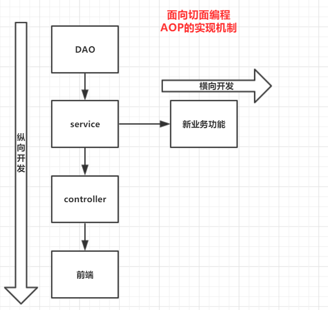

# 代理模式

> springAOP的底层

## 1、静态代理


### 角色分析

- **抽象角色**：一般为接口或抽象类，（真实角色委托代理做的事情）
- **真实角色**：带代理的角色。（有事情寻求代理的人）
- **代理角色**：代理真实角色，代理真实角色后，会做一些附属操作
- **客户**：去访问代理的人。（通过代理人与真实角色简介沟通的人）

### 代码

1. 抽象角色：

   ```java
   public interface Rent {
       public void rentHouse();
   }
   ```

2. 真实角色

   ```java
   public class Host implements Rent {
       @Override
       public void rentHouse() {
           System.out.println("房东要出租房子");
       }
   }
   ```

3. 代理角色

   ``` java
   public class StaticProxy implements Rent {
   
       private Host landlord;
   
       public StaticProxy() {
       }
   
       public StaticProxy(Host landlord) {
           this.landlord = landlord;
       }
   
       @Override
       public void rentHouse() {
           landlord.rentHouse();
       }
      
       // ...其他公共业务
   }
   ```

4. 客户端访问

   ``` java
   public class Client {
       public static void main(String[] args) {
           //创建房东
           Host lady = new Host();
           //创建代理， 代理房东做事情
           StaticProxy proxy = new StaticProxy(lady);
           proxy.rentHouse();
       }
   }
   ```

   

### 静态代理优缺点

> **优点:**

- 真实角色的操作更加存粹，简单。无需关注公共业务。
- 公共业务交由代理角色完成，分工更明确。
- 公共业务发生变化时，方便集中管理，只需要处理代理角色

> 缺点：

- 每一个真实角色就需要一个代理角色，代码量翻倍。




## 2、动态代理

- 底层大量使用==反射==

### 动态代理与静态代理

- 角色一样
- 动态代理的代理角色是动态生成的，不是固定的
- 动态代理分类：
  1. 基于接口的动态代理（JDK动态代理）
  2. 基于类的动态代理（cglib）
  3. java字节码实现（javasist）


### 两个类：

==Proxy==(java.lang.reflect)

- 用静态方法`newProxyInstance`来创建动态代理类实例对象的，因为只有得到了这个对象我们才能调用那些需要代理的方法。

==InvocationHandler==	(java.lang.reflect)

- 接口是给动态代理类实现的，负责处理被代理对象的操作的

``` java
public class ProxyInvocationHandler implements InvocationHandler {

    private Object target;

    public void setTarget(Object target) {
        this.target = target;
    }

    public Object getProxy() {
        return Proxy.newProxyInstance(target.getClass().getClassLoader(),
                target.getClass().getInterfaces(), this);
    }

    @Override
    public Object invoke(Object proxy, Method method, Object[] args) throws Throwable {
        AD();
        Object result = method.invoke(target, args);
        AD();
        return result;
    }

    public void AD() {
        System.out.println("打个广告打个广告");
    }
}

public class Client {
    public static void main(String[] args) throws Throwable {
        //真实角色
        Host landload = new Host();
        ProxyInvocationHandler pih = new ProxyInvocationHandler();
        pih.setTarget(landload);
        Rent proxy = (Rent) pih.getProxy();
        proxy.rentHouse("3");
    }
}
```
