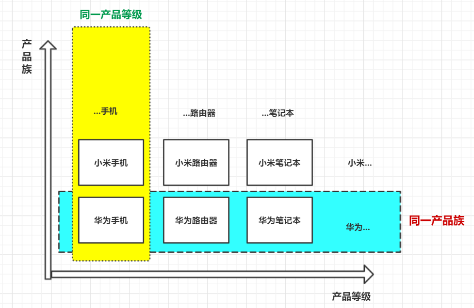

# 工厂模式

- 作用：

  - 实现创建者与调用者分离

- 核心本质:

  - 实例化对象不使用`new`，而是用工厂方法代替
  - 将选择实现类，创建对象统一管理和控制。从而将调用者和实现类解耦。

- 三种模式：

  - 简单工厂模式

    > 用来生成同一等级结构中的任意产品（对于增加新的产品，需要覆盖已有代码）

  - 工厂方法模式：

    > 用来生产同一等级结构中的固定产品（**支持添加任意产品**）

  - 抽象工厂模式：

    > 围绕一个超级工厂创建其他工厂，这个超级工厂又可以被视为生产其他工厂的工厂

- 小结：

  - 静态工厂模式

    > 虽然某种程度上不符合设计模式，但==实际使用最多！==

  - 工厂方法模式

    > 可以在不修改已有类的前提下，通过增加新的工厂实现横向扩展

  - 抽象工厂模式

    > 不可以增加产品，但可以增加产品种类

- 应用场景：

  1. JDK中Calendar的getInstance()方法
  2. JDBC中数据源的创建，Connection对象的获取
  3. Spring中IOC容器创建管理bean对象
  4. 反射中Class对象的newInstance()方法

## 抽象工厂模式

> 分清除产品等级与产品族

- 创建一个抽象工厂，相当于一个工厂的模板，后面创建的工厂都要实现这个抽象工厂接口。
- 抽象工厂规定产品等级，由真实工厂创建出产品族

> 缺陷：规定了产品级，同一产品族中，增加新产品困难
>
> ​			增加了系统的抽象性和理解难度

> 优点：具体的产品在应用层的代码隔离，无需关系创建细节。
>
> ​			将同级产品统一到一起创建

适用场景:

1. 客户端不依赖于产品类实例如何创建，实现等细节。
2. 强调一系列相关的产品对象（即同一产品族）一起使用创建对象需要大量代码。
3. 提供一个产品等级的库，不同族的同等级的产品以同样的接口出现，从而是客户端不依赖于具体实现。