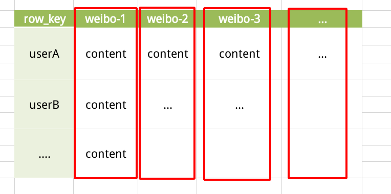
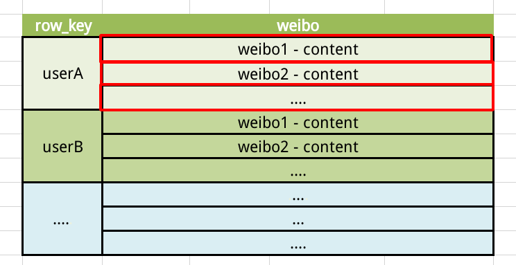
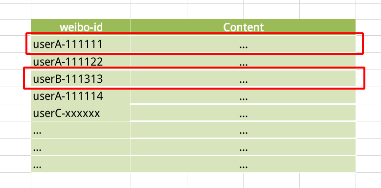
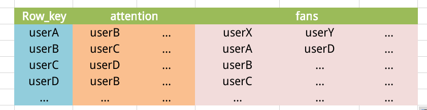
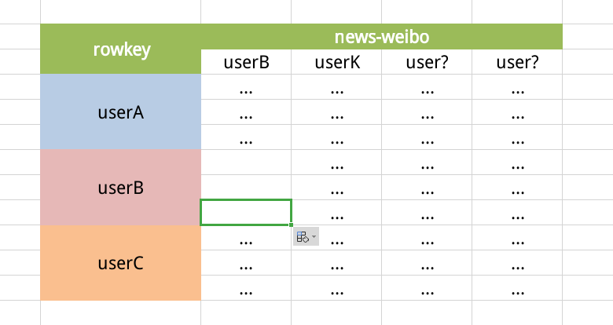

# HBase实操之谷粒微博

## 一、需求分析

1. 用户**发布微博**
2. 用户关注和用户粉丝<=>**用户建立关系**
3. 向关注用户**推送最新的消息**


## 二、基础表设计

> 微博内容表（content）

既然是用户发布微博，那么就必定要和用户的uid建立联系！！

- 如果使用uid作为content表的row_key：就只有两种存储扩展方式：

  - 列扩展

    

    这种扩展方式是可行的，但是考虑到用户发微博的频率不同，就会导致列增长过快！后续定位也会有一定的困难。

  - 单列行扩展

    

    这种方式其实是**不可用**的，单列存储内容的方式，每次用户发布微博的时候就会发生一次覆盖，之前的内容就放在了**历史版本（Versions）**中！然而VERSION是预先就定下来的，那么就会出现**版本溢出**的情况。所以这样就限定了用户发布微博的数量，否则用户就必须接受旧微博可能被覆盖的规则。

- 所以决定使用一种新的rowkey——uid+微博发布的时间戳（效果如图）

  

  ​	这样的rowkey保证了内容的良好扩展性，并且便于查找。


> 用户关系表（关注和粉丝）

提前说明：那种几百几千万粉丝数的情况我们暂时不考虑！

所以此表中我们只需要两个列族就可以搞定，attention和fans。关注和粉丝使用用户uid作为列，持续列增长。




> 用户信息表

用户的相关信息：uid，username，sex等…


> 用户使用初始化表或者叫收件箱表 (inbox表)

正常的服务中，用户打开应该先显示其关注的人的最新发布的若干条微博，那么就需要联系用户关系表和微博内容表，取出其所有的关注者，并作为列名，然后列的VERSION设置你要显示的微博数即可。

例如：显示用户关注用户的最新三条微博



表中虽然画的是这样，但是每行只会显示最新的微博内容，剩下那条是放在历史版本中的！！

-----


## 三、项目代码

###  3.1、基本工具类封装

HBaseUtils

```java
/**
 * 工具类
 * 1. 创建命名空间
 * 2. 判断表是否存在
 * 3. 创建表(添加列族)
 *
 * @author sakura
 * @date 2020/9/3 上午11:16
 */
public class HBaseUtils {

    /**
     * 创建命名空间
     *
     * @param namespace
     * @throws IOException
     */
    public static void createNamespace(String namespace) throws IOException {
        // 获取connection对象
        Connection connection = ConnectionFactory.createConnection(Constants.CONFIGURATION);
        // 使用connection对象获取admin对象
        Admin admin = connection.getAdmin();

        // 获取namespace描述器的Builder对象
        NamespaceDescriptor.Builder builder = NamespaceDescriptor.create(namespace);
        // 使用builder对象的build()方法 构建一个namespace描述器
        NamespaceDescriptor namespaceDescriptor = builder.build();

        // 使用admin对象创建命名空间
        admin.createNamespace(namespaceDescriptor);

        // 资源关闭
        admin.close();
        connection.close();
    }

    /**
     * 判断表是否存在
     * @param tableName
     * @return
     * @throws IOException
     */
    private static boolean tableExists(String tableName) throws IOException {
        boolean isExists = false;

        // 获取Connection对象和Admin对象
        Connection connection = ConnectionFactory.createConnection(Constants.CONFIGURATION);
        Admin admin = connection.getAdmin();

        // 使用admin对象判断表是否存在
        isExists = admin.tableExists(TableName.valueOf(tableName));

        // 资源关闭
        admin.close();
        connection.close();

        return isExists;
    }

    /**
     * 创建表并添加列族信息
     * @param tableName
     * @param version
     * @param columnFamilies
     * @throws IOException
     */
    public static void createTable(String tableName, int version, String... columnFamilies) throws IOException {
        // 判断是否传入了有效的列族
        if (columnFamilies.length <= 0) {
            System.out.println("请输入至少一个列族");
        }
        // 判断表是否存在
        if (tableExists(tableName)) {
            System.out.println(tableName + "表已经存在");
        }

        // 获取Connection、Admin对象
        Connection connection = ConnectionFactory.createConnection(Constants.CONFIGURATION);
        Admin admin = connection.getAdmin();

        // 创建表描述器
        HTableDescriptor hTableDescriptor = new HTableDescriptor(TableName.valueOf(tableName));

        // 循环创建列族描述器并增加列族
        for (String columnFamily : columnFamilies) {
            // 创建列族描述器
            HColumnDescriptor hColumnDescriptor = new HColumnDescriptor(columnFamily);
            // 设置VERSIONS
            hColumnDescriptor.setMaxVersions(version);
            // 添加列族
            hTableDescriptor.addFamily(hColumnDescriptor);
        }

        // Admin对象创建表
        admin.createTable(hTableDescriptor);

        // 关闭资源
        admin.close();
        connection.close();

    }

}
```

一些基本的通用操作使用工具类封装起来。（Namespace创建、Table是否存在验证、Table创建）等。。


常量封装，项目中常用且不会变更的常量封装为Constants类

```java
public class Constants {

    public static final String NAMESPACE = "weibo";

    public static final Configuration CONFIGURATION = HBaseConfiguration.create();

    /**
     * 微博内容表常量
     */
    public static final String CONTENT_TABLE = "weibo:content";
    public static final int CONTENT_TABLE_VERSION = 1;
    public static final String CONTENT_TABLE_CF = "info";

    /**
     * 用户关系表常量
     */
    public static final String RELATION_TABLE = "weibo:relation";
    public static final int RELATION_TABLE_VERSION = 1;
    public static final String RELATION_TABLE_CF1 = "attention";
    public static final String RELATION_TABLE_CF2 = "fans";

    /**
     * 收件箱表
     */
    public static final String INBOX_TABLE = "weibo:inbox";
    public static final int INBOX_TABLE_VERSION = 2;
    public static final String INBOX_TABLE_CF = "receive";
}
```


### 3.2、表操作类 HBaseDao

#### 3.2.1、发布微博

看似只是一个发布微博的简单操作，实际上涉及到三个表的信息。分为两个部分：

- 微博内容表增加行
- 微博发布者的粉丝的收件箱（inbox）更新

```java
/**
 * 一、发布微博
 * 二、推送给粉丝
 * @param uid
 * @param content
 * @throws IOException
 */
public static void publishWeibo(String uid, String content) throws IOException {
    Connection connection = ConnectionFactory.createConnection(Constants.CONFIGURATION);


    /**
     * 发布微博
     */
    // 获取微博内容表
    Table contentTable = connection.getTable(TableName.valueOf(Constants.CONTENT_TABLE));

    // 生成rowKey
    byte[] rowKey = (uid + "_" + System.currentTimeMillis()).getBytes();
    // 创建put对象并设置值
    Put put = new Put(rowKey);
    put.addColumn(Constants.CONTENT_TABLE_CF.getBytes(), "content".getBytes(), content.getBytes());

    // table对象调用put方法插入值
    contentTable.put(put);

    /**
     * 推送微博
     */
    // 获取用户关系表
    Table relationTable = connection.getTable(TableName.valueOf(Constants.RELATION_TABLE));

    // 获取当前用户的粉丝
    Get fansGet = new Get(uid.getBytes());
    fansGet.addFamily(Constants.RELATION_TABLE_CF2.getBytes());
    Result fans = relationTable.get(fansGet);

    // 创建一个集合存放inboxTable的put对象
    ArrayList<Put> inboxPuts = new ArrayList<Put>();

    // 遍历粉丝
    for (Cell cell : fans.rawCells()) {
        // 获取粉丝的uid
        byte[] fanRowKey = CellUtil.cloneQualifier(cell);
        // 创建Put对象并加入到集合中
        Put inboxPut = new Put(fanRowKey);
        inboxPut.addColumn(Constants.INBOX_TABLE_CF.getBytes(), uid.getBytes(), rowKey);
        inboxPuts.add(inboxPut);
    }

    // 推送微博
    if (inboxPuts.size() > 0) {
        // 获取inboxTable
        Table inboxTable = connection.getTable(TableName.valueOf(Constants.INBOX_TABLE));
        // put数据
        inboxTable.put(inboxPuts);
        // 关闭表资源
        inboxTable.close();
    }

    // 释放资源
    relationTable.close();
    contentTable.close();
    connection.close();
}
```

#### 3.2.2、关注用户

同样，关注用户也要分为两步完成：

- 修改用户关系表
- 变动操作者的inbox表

```java
/**
 * 关注用户
 * @param uid
 * @param attentions
 * @throws IOException
 */
public static void addAttention(String uid, String... attentions) throws IOException {
    Connection connection = ConnectionFactory.createConnection(Constants.CONFIGURATION);

    /**
     * 第一部分：改变用户关系表
     */

    // 获取用户关系表
    Table relationTable = connection.getTable(TableName.valueOf(Constants.RELATION_TABLE));

    // 校验是否勾选了关注
    if (attentions.length<=0) {
        System.out.println("请至少勾选一个关注用户");
        return;
    }

    // 创建操作者的Put对象
    Put operatorPut = new Put(uid.getBytes());

    // 创建一个List存放Put
    ArrayList<Put> putList = new ArrayList<Put>();

    // 遍历勾选的关注对象
    for (String attention : attentions) {
        // 操作者Put对象设置 attention列族Put一列(列名和列值均为关注者的uid) 单行多列插入
        operatorPut.addColumn(Constants.RELATION_TABLE_CF1.getBytes(), attention.getBytes(), attention.getBytes());

        // 创建被关注者的Put对象并加入到List中
        Put attentionPut = new Put(attention.getBytes());
        // 为Put对象设值，将操作者加入关注者的粉丝列族中
        attentionPut.addColumn(Constants.RELATION_TABLE_CF2.getBytes(), uid.getBytes(), uid.getBytes());
        putList.add(attentionPut);
    }

    putList.add(operatorPut);
    // 提交执行Put
    relationTable.put(putList);

    /**
     * 第二部分： 修改inbox表
     */

    // 1. 获取content表对象
    Table contentTable = connection.getTable(TableName.valueOf(Constants.CONTENT_TABLE));

    // 2. 创建一个操作对象的inbox表的put对象
    Put inboxPut = new Put(uid.getBytes());

    // 3. 遍历关注对象
    for (String attention : attentions) {

        // 4. 扫描content表 取出用户最近发布的微博
        Scan scan = new Scan((attention + "_").getBytes(), (attention + "|").getBytes());

        ResultScanner resultScanner = contentTable.getScanner(scan);

        // 获取一个时间戳 后面有用
        long ts = System.currentTimeMillis();

        // 遍历扫描结果,并加入inboxPut （注意此处可以进行适当优化）
        for (Result result : resultScanner) {
            // inbox表添加一列 列名为关注者uid,值为微博的RowKey
            inboxPut.addColumn(Constants.INBOX_TABLE_CF.getBytes(), attention.getBytes(), ts++, result.getRow());
        }

    }

    // 判断Put列表是否为空, 为空直接关闭资源
    if (!inboxPut.isEmpty()) {
        // 获取inbox表对象
        Table inboxTable = connection.getTable(TableName.valueOf(Constants.INBOX_TABLE));

        // 执行Put
        inboxTable.put(inboxPut);

        // 关闭表资源
        inboxTable.close();
    }

    // 释放其他资源
    contentTable.close();
    relationTable.close();
    connection.close();
}
```

> 这里有几个点需要注意一下：
>
> 第一部分的操作用户关系表不用多说，很好理解。就是一个单行多列Put和多行单列的PutList。
>
> ==关键在于第二部分 将关注者微博Put入用户的收件箱的操作==
>
> 1. 首先是扫描指定uid的用户的微博扫描，使用了Scan，并指定StartRow和StopRow。由于rowkey的特殊设计，`uid+_`到`uid|`就能扫描`uid`发布的所有微博。
>
> 2. 然后由于我使用的uid+timestamp形式的rowkey，所以**后发**的微博在使用scan扫描后出现在结果的末尾！！我们使用的是最无脑的Put，因为Inbox表设置了VERSIONS=3，所以只会保留最后三条。这种方式可行，但是当数据量特别大的时候，这种操作异常的耗时（3w条微博记录，那么前2w9997次Put都是无用功）。**最好的办法就是直接取出最新的前三条直接Put**，但是我们无法获取微博发布的时间戳。
>
>    所以我们要解决的问题就简化为：**让后发布的微博顺位靠前！**那就要对rowkey稍作修改，用一个固定的远大于时间戳的数字减去时间戳，然后将结果拼接到rowkey中（而不是直接使用时间戳）。细品细品，还有其他的方法。。总之就是**时间戳逆序的问题。**
>
>     
>
> 3. put到inbox表的时候，可能出现时间戳重叠导致多条数据最终查询的时候只有一条。所以我们最好手动设置一下Put的时间戳。**千万不要以为SLEEP能解决问题！！因为时间戳最终是服务端给的，并不和客户端这边挂钩，使用SLEEP ，只是客户端这边延迟操作，所有的Put操作都会到服务端集中执行分配时间戳**  或者不嫌麻烦也可以添加一条Put操作就执行一次。


#### 3.2.3、取关用户

不出意料还是两个部分的操作，分别对应两个表

- 删除用户关系表的粉丝和关注
- 删除inbox表中 用户取关对象对应的列

> 在删除的时候我们有个问题要考虑到：
>
> 当用户多次关注同一个用户的时候（在实际的生产情况下这种状况是不会发生的），我们在删除记录的时候使用的标记应该是DeleteColumu！而不应该是Delete!


```java
public static void cancelAttention(String uid, String... cancels) throws IOException {
    Connection connection = ConnectionFactory.createConnection(Constants.CONFIGURATION);
    /**
     * 第一部分：删除用户关系
     */
    // 获取用户关系表
    Table relationTable = connection.getTable(TableName.valueOf(Constants.RELATION_TABLE));

    // 创建一个操作者的删除对象
    Delete operatorDel = new Delete(uid.getBytes());

    // 创建一个List存放所有的Delete对象
    ArrayList<Delete> delList = new ArrayList<>();

    // 遍历取关的用户并为其创建Delete对象 并加入List
    for (String cancel : cancels) {
        // 从操作者的关注列表中移除 注意！！！保险起见使用addColumns！！
        operatorDel.addColumns(Constants.RELATION_TABLE_CF1.getBytes(), cancel.getBytes());

        // 创建被取关者的Delete对象
        Delete canceledDel = new Delete(cancel.getBytes());
        // 从fans列表中删除操作者
        canceledDel.addColumns(Constants.RELATION_TABLE_CF2.getBytes(), uid.getBytes());
        delList.add(canceledDel);
    }
    delList.add(operatorDel);
    // 执行删除
    relationTable.delete(delList);

    /**
     * 第二部分： 清理操作者的inbox表
     */
    // 创建操作者的inbox表的Delete对象
    Delete inboxDel = new Delete(uid.getBytes());
    // 遍历被取关的用户
    for (String cancel : cancels) {
        // 删除对应取关用户的收件箱
        inboxDel.addColumns(Constants.INBOX_TABLE_CF.getBytes(), cancel.getBytes());
    }

    // 校验Delete对象是否为空
    if (!inboxDel.isEmpty()) {
        // 获取收件箱表
        Table inboxTable = connection.getTable(TableName.valueOf(Constants.INBOX_TABLE));
        // 执行删除
        inboxTable.delete(inboxDel);
        // 关闭表
        inboxTable.close();
    }

    // 释放其他资源
    relationTable.close();
    connection.close();
}
```

