# 初识JVM

- ==面试常见的有关JVM的问题==

  > 1. 请你谈谈对JVM的理解，java8虚拟机和之前有那些变化和更新
  > 2. 什么是OOM? 什么是栈溢出（StackOverFlowError）?怎么分析？
  > 3. JVM的常用调优参数有哪些?
  > 4. 内存快照如何抓取? 怎么分析Dump文件? 
  > 5. 谈谈对JVM中类加载器的认识
  
- ==我们的代码是如何被执行的？==

  > 首先==java文件（也就是我们的程序文件）==会被JVM编译成==字节码文件（也就是class）文件==，而java字节码是不能被计算机读懂的，而是交由JVM来运行。==Java虚拟机需要将字节码"翻译"（解释执行/编译）==成机器码，这样就可以被计算机所执行。

  ---


## 1、JVM的位置

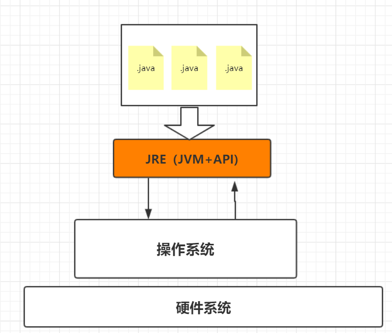

## 2、JVM的体系结构

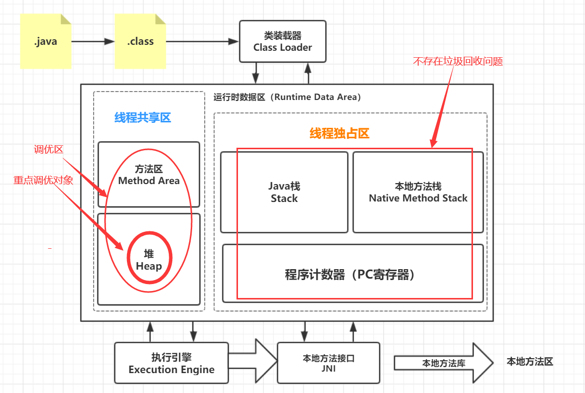

## 3、类加载器

- 作用：加载class文件

  > 1. 加载并初始化，class模板。
  > 2. 通过模板实例化对象。（对象的名字放入栈，而对应的引用数据放在堆中，使用时通过内存地址去堆中取值。）

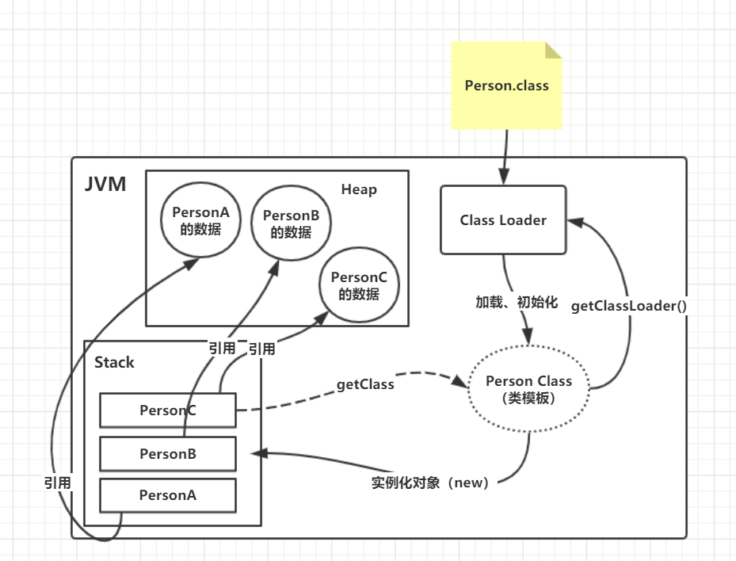

### 3.1、加载器分类	

- 引导类（根）加载器（C++编写）**（Bootstrap class loader）**
- 扩展类加载器**（extensions class loader）**
- 应用程序类加载器**（application class loader）**（默认类加载器）
- 自定义类加载器

## 4、双亲委派机制

> 例如：用户自定义一个java.lang.String类，能编译成功，但永远不会被加载，始终加载原始的String类，并且由根加载器完成加载

- 工作原理
  1. 类加载器收到类加载请求
  2. 类加载器将请求委托给父加载器，一直向上委托直至 Bootstrap Loader.
  3. 启动加载器检查（findClass()）能否加载，若可以直接使用当前加载器进行加载，反之抛出异常，通知子加载器进行加载。
  4. 然后循环步骤3向下...

## 5、沙箱安全机制

- Java安全模型的核心就是Java沙箱（sandbox）

  ### 5.1、什么是沙箱

  > 1. **沙箱**是以一个==限制程序运行的环境。==
  >
  > 2. **沙箱机制**就是==将Java代码限定在虚拟机（JVM）特定的允许范围中==，并且眼科现在代码对本系统资源的访问，通过这样额措施来保证对代码的有效隔离，防止对本地系统造成破坏。
  >
  > 3. 沙箱主要**限制系统资源的访问**
  > 4. **系统资源**：CPU、内存、文件系统、网络
  > 5. 不同级别的沙箱的资源访问限制也可以不一样。

  ---

  - 在Java中将执行程序分为==本地代码==和==远程代码==两种。
    - **本地代码**默认是可信任的，而**远程代码**不一定安全则视为不受信任的。
    - 对于**授信的本地代码，可以访问一切本地资源**
    - 对于不**授信的远程代码**在早期Java实现中，**安全依赖于沙箱机制。**
  - 后引入了很多安全策略，`代码签名`、`权限`、`域`等。

  

  ### 5.2、沙箱的基本组件

  - ==字节码校验器（bytecode verifier）==：确保Java类文件遵循Java语言规范。帮助Java程序实现内存包含，**但不是所有的类文件都会经过字节码校验，比如核心类。**
  - ==类装载器==：
    - 它防止恶意代码去干涉善意代码
    - 守护了被信任的类库边界
    - 它将代码归入保护域，确定了代码可以进行那些操作

## 6、Native

```java
private native void start0();
```

> native ：凡是带了native关键字的，说明Java的作用范围无法达到，只能调用底层C语言的库。会进入本地方法栈，调用本地方法接口（JNI）。
>
> ==JNI的作用：==扩展Java的使用，融合不同的编程语言为Java所用！
>
> 本地方法栈：登记 native方法 的一块标记区域，最终执行时，通过JNI去加载调用本地方法。


## 7、PC寄存器

- 程序计数器（Program Counter Register）

> 每个线程都有一个程序计数器，为线程私有，相当于一个指针，指向方法区中的方法字节码（就是将要执行的指令代码），即保存下一条将要执行的指令地址，由执行引擎读取下一条指令，是一个非常小的内存空间，几乎可以忽略不记

##  ==8、方法区==

- 方法区是被所用线程共享的，所有字段和方法字节码，以及一些特殊方法，如构造函数，接口代码也在此定义，简单说，所有定义的方法的信息都保存在该区域。

> ==方法区里面到底装了些什么东西？==

1. 静态变量(static)
2. 常量(final)
3. 类信息（构造方法，接口含义）
4. 运行时的常量池
5. 方法信息

- 但实例变量放置在堆内存中，与方法区无关


## 9、栈

- ==先进后出==

> 主管程序运行，生命周期和线程同步。
>
> 线程结束，栈内存释放，栈内存全部释放，程序结束。
>
> 对于栈来说，==不存在垃圾回收问题==

- ==栈里面会放什么东西？==
  - 八大基本类型
  - 堆中对象引用
  - 实例调用方法信息
- 栈运行原理：**（栈帧）**
  - 每执行一个方法都会产生一个栈帧，里面包括了方法信息和**子帧**和**父帧**
  - 栈溢出：StackOverflowError


## 10、三种JVM

- HotSpot（Sun公司）
- JRockit （原BEA）
- J9VM（IBM）

## 11、堆

- Heap，==一个JVM只有一个堆内存==（栈是线程级的），堆内存的大小是可以调节的。

- ==堆中放什么？==

  - 类，方法，常量，变量，保存我们所由引用类型的真实对象

- 堆内存又分为三个区域

  - 新生区（伊甸园区，幸存from/to区）

  - 老年区

  - 永久区

    > GC垃圾回收，主要是在伊甸园区和养老区。
    >
    > 若内存满了，==OOM==，堆内存溢出。（OutOfMemoryError）

- 在JDK8以后，永久区改名为==元空间==

## 12、新生区、老年区

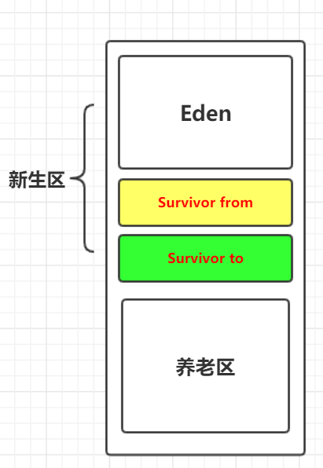

- 类和对象在新生区创建和“成长”，甚至死亡。
- 当伊甸园区满了后触发GC，当经过一轮GC后，存活的就会被放入幸存区（0/1）中。此时Eden区为空。
- 当幸存区也满了后，也会触发GC，再次经过多轮GC（15次）后，依然存活的进入老年区。
- 老年区满了以后，就会导致OOM

> 99%的对象都是临时对象。

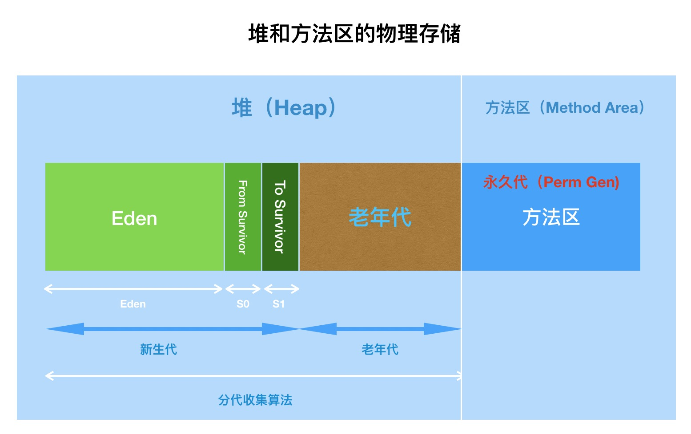

## 13、永久区

> 这个区域常驻内存，用于存放JDK自身携带的类信息，Interface元数据，以及Java运行时的一些环境。==不存在垃圾回收==

- JDK1.6前：`永久代`，方法区在永久代。
- JDK1.7 :永久代，退化为`去永久代`, 方法区在堆中。
- JDK 1.8后：改名为`元空间（MetaSpace）`(不在堆内存和JVM中，直接占用物理内存)，方法区在元空间。

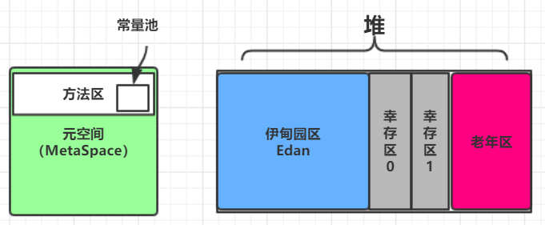


- OOM故障排除——内存快照分析工具（MAT,JProfiler）

  > 分析Dump内存文件、快速定位内存泄漏
  >
  > 获得堆中数据

  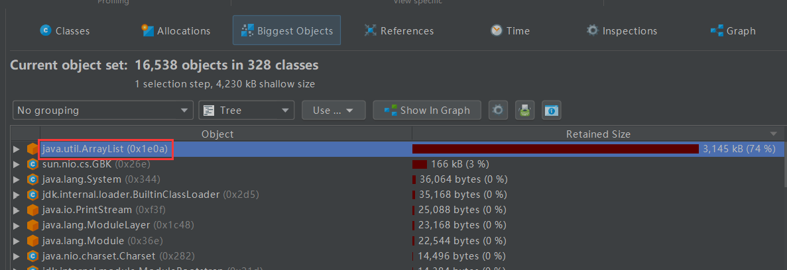

  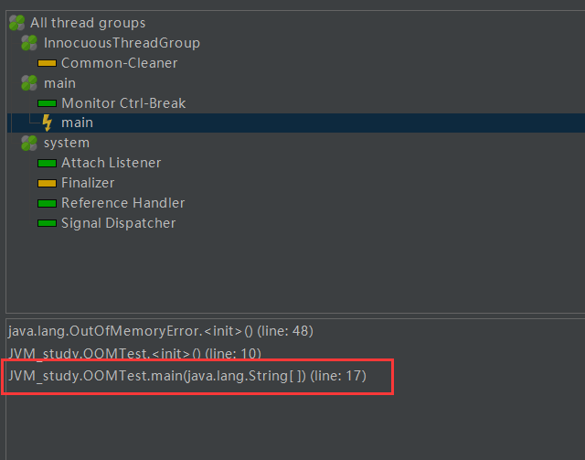

## 14、堆内存调优

`-Xms1m -Xmx8m -XX:+HeapDumpOnOutOfMemoryError`
`-Xms1m` 设置初始化内存分配大小
`-Xmx8m` 设置最大内存分配大小
`-XX:PrintGCDetails` 打印GC垃圾回收信息
`-XX:+HeapDumpOnOutOfMemoryError`  OOM dump文件`

## 15、GC(垃圾回收机制)

- 作用区：堆（重点）和方法区
- 大部分是回收新生代

- 两种分类

  1. 轻GC（普通GC）:只针对新生区
  2. 重GC（Full GC）：针对全局

- ==GC题目==：

  - **JVM的内存模型和分区，详细到每个区放什么**
  - **堆里面分区有哪些？Eden,from,to,老年区，说说它们的特点**
  - **GC算法有哪些？ 标记清除法，标记整理，复制算法，引用计数法，如何使用？**

  - **轻GC和Full GC分别在什么时候发生**？

### 15.1、GC常用算法

#### 15.1.1、引用计算算法

- **（统计对象被调用的次数，决定回收）**

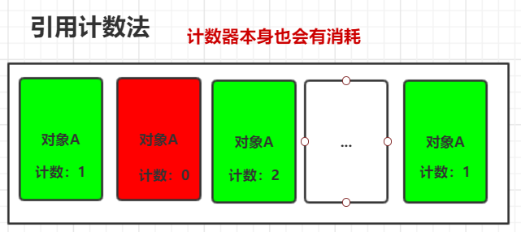


#### 15.1.2、复制算法

- **(适用于对象存活度较低，新生区)**

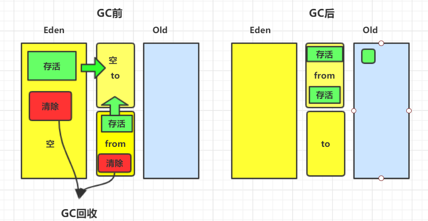

> 每次Eden区完成一次GC，存活的对象就会被放入幸存区，Eden成空，但为了每次放入对象到幸存区中时确保有足够空间，需要==将from区存活的对象复制一份到to区==并同时将存活的对象放入to区，此时==原来的from区清空变为to区==，==之前的to区变为from区==。下一次GC后，新from区存活的对象又被复制到to区，...然后往复循环，保持对数据的不断刷新。

- **总的来说就是保留一个幸存区为空，每次只对一个幸存区进行处理，处理完毕将存活的复制到另一个区，并将原区清空**

- ==优点==：没有内存碎片
- **缺点**：必须舍弃一半内存空间（to），若对象存活率很高，复制需要的时间成本很高。

> ==当一个对象经历了15次GC后依然存活，就进入老年区==
>
> 可以通过参数调优设置进入老年区的GC次数

- `-XX:MaxTenuringThreshold=15` 参数默认为15次


#### 15.1.3.1、标记清除法

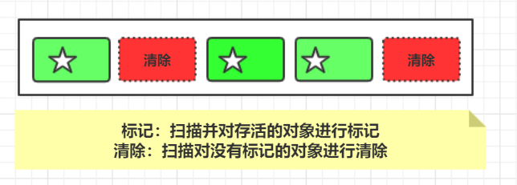

- ==优点==：不需要额外空间
- **缺点**：两次扫描，浪费时间，且产生内存碎片


##### 15.1.3.2、标记压缩

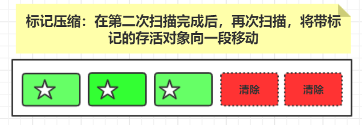

- ==优点==：解决了内存碎片问题
- **缺点**：扫描移动提高了时间成本


### 15.2、总结

- 按内存效率（时间复杂度）：

  ​		复制算法 > 标记清除算法 > 标记压缩算法

- 按内存整齐度：

  ​		复制算法 = 标记压缩算法 > 标记清除算法

- 按内存利用率：

  ​		标记压缩算法 = 标记清除算法 > 复制算法

  

==没有最好的GC算法可以解决一切问题，只有最合适的算法==

- **GC：分代式收集算法**

  > 新生代：存活率低。---->	复制算法
  >
  > 老年代：区域大，存活率低 。----->	标记清除(内存碎片少)+标记压缩

  

## 16、JMM(Java Memory Modle)

> 缓存一致性的协议，用于定义数据读写的规则

- 核心概念：happen before 规则

## 17、总结
![[Pasted image.png]]

