[TOC]


## 壹、初步了解

- 什么是JavaScript

>一门弱类型语言，其源码不需要编译，由浏览器解释运行。广泛用于页面交互。世界上最流行的脚本语言。
>
>1995，网景公司工程师Brendan Eich仅用10天就把JavaScript设计出来。
>
>**一个很扯的语言^ ^**

- 开发标准

>**ECMAScript 简称ES**
>
>ES3，ES4(未正式发布)
>
>ES5（全浏览器支持）
>
>ES6（当前主流版本，webpack打包成为ES5支持!）
>
>ES7，ES8，ES9

>**TypeScript 微软标准，**
>
>是微软开发的自由和开源的编程语言,是JavaScript的一个超集，
>
>本质上向这个语言添加了可选的静态类型和基于类的面向对象编程。

- ==一个合格的后端程序员要精通JavaScript==

- JavaScript框架
  - Angular（Google收购的前端框架,增加模块化开发）
  - React (提出虚拟DOM的新概念)
  - Vue 渐进式JS框架，综合了前两者有点

## 贰、快速入门

### 2.1、JavaScript引用

- 内部标签

```html
<script>
	//....
</script>
```

- 外部引入

```html
<script src="***.js"></script>
```

### 2.2、语法入门

#### 1、变量定义

- 只有一个变量类型`var`

```javascript
var num = 1
var string = "5akura"
```

- 条件控制

`if`，`while`，`for`等于java相似

- 浏览器正确打开方式

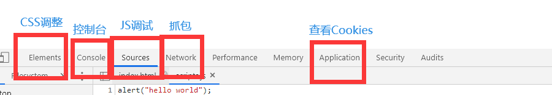

```javascript
// 浏览器控制台输出 相当于java sout
console.log(num);
```

#### 2、数据类型

> 数值、文本、图像、音频、视频......

==js不区分小数和整数，严格区分大小写==

`number`，

`字符串`，“abc”，'abc'

`布尔值`，true, false

`比较`

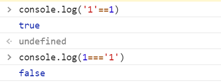

> = 赋值
>
> == 等于 （类型不一样 值一样 也判为true）
>
> === 绝对等于 （要求类型和值都相等）

- NaN与所有数值包括自己都不相等
- 只能通过isNaN()来判断是不是NaN
- 避免使用==来判断浮点数相等，会有精度的丢失。使用差值绝对值判断

`null`和`undefine`

- null：空
- undefine：未定义

`数组`

- 可以是不同类型的数据

```javascript
// 数组
var arr = [1,2,3,'官宇辰',true,null];
```

- 越界数组元素为`undefine`

`对象`

```javascript
// 对象创建
var person = {
    name:"官宇辰",
    age:20,
    sex:"男"
}
alert(person.name);
```

#### 3、严格检查模式

- ==use strict==(严格检查模式，预防JavaScript的随意性导致错误)
- 写在js文件的第一行，或者js代码的第一行
- ES6中 局部变量用`let`定义、var定义全局变量

### 2.3、数据类型

#### 1、字符串

- 正常字符串用单引号或者双引号

- 特殊字符串使用转义字符\

- 多行字符串编写

  ```javascript
  let str = `hello
  		world
  		你好
  		世界`;
  ```

- 模板字符串

  > 字符串中以 ${} 形式去引用其他数据 
  >

     ```javascript
     // 模板字符串
     let name = "官宇辰";
     let age = 20;

     console.log(`你好，我是${name},我今年${age}岁`);
     ```

- 字符串不可变与可变

  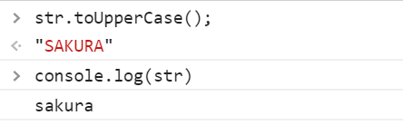

#### 2、数组

- Array可以包含任意的数据类型

- 长度可以随意变化，赋值变大，多出来的为undefine，赋值变小，溢出的被丢弃

- **slice()**：截取数组的一部分返回一个新的数组。类似于substring

  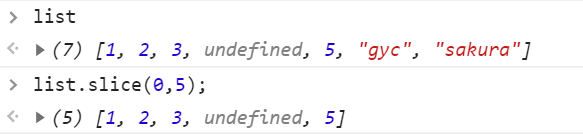

- 使用**push()**、**pop()** 往**尾部**压入和弹出

- 使用**unshift()**（返回增加后数组长度）、**shift()** （返回弹出的值）往**头部**添加移除

- 二维数组定义

  ```javascript
  arr = [[1,2],[3,4,5],[6]];
  ```

- 连接符：join()

  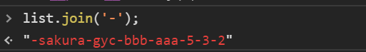

- 万能修改：splice()

  ```javascript
  var array = ["A","B","C","D","E","F"]
  array.splice(2,3,"hello","world");
  ```

  splice的参数(x,y,items..)

  意思是：从下标为X的位置开始删除 Y个元素(包括X),如果有items参数，就依次从X下标位置开始插入所有items，返回值是被截取的元素。

  代码示例，执行后结果就是 ：

  ```javascript
  array=["A","B","hello","world","F"]
  ```

  

#### 3、对象

> 相当于若干个键值对

```javascript
var person = {
    name:"官宇辰",
    age:19,
    sex:'男'
}
```

- 使用{} 包裹
- 键值对描述属性，并使用逗号隔开，最后一个不加逗号

- 可以通过delete 动态删除对象属性

- 也可以动态添加属性，直接给新属性赋值即可

  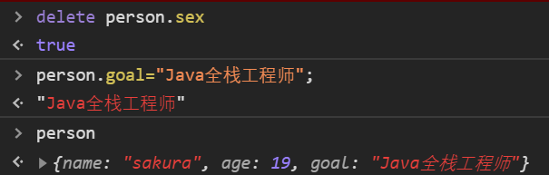

- 判断属性字段是否在这个对象中（in 关键字）

  ==JavaScript中所有的键都是字符串，值可以是任意对象==

  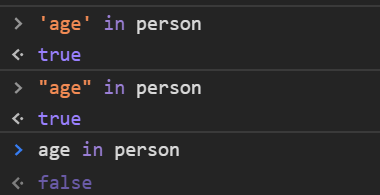

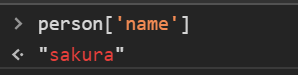

- 判断一个属性算法是这个对象自身拥有的***hasOwnProperty()***

  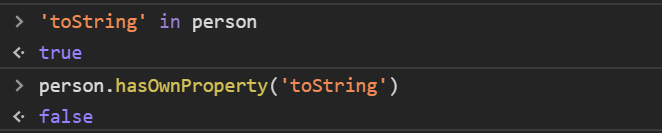

  > 每个对象本身也继承父类的方法与字段，通过此方法只筛选自身的方法与字段;

#### 4、流程控制

`if`，`while`，`for`，

`for-in`，`for-of`

```javascript
// for-in 遍历数组  遍历索引
for(var index in temp){
    console.log(temp[index]);
}

// for-of 遍历值 ES6新特性！
for(var value of temp){
    console.log(value);
}
```

`forEach`

```javascript
// 函数式
let arr = ["aaa", "bbb", 1, 2, 3, null];
arr.forEach(function(temp){
    console.log(temp);
});
```


#### 5、Map、Set

> ES6的新特性

- Map: 传统的键值对

```javascript
var students = new Map([
  ["tom", 98],
  ["Jerry", 94],
  ["Jack", 84],
  ['Bob',89]
]);
```

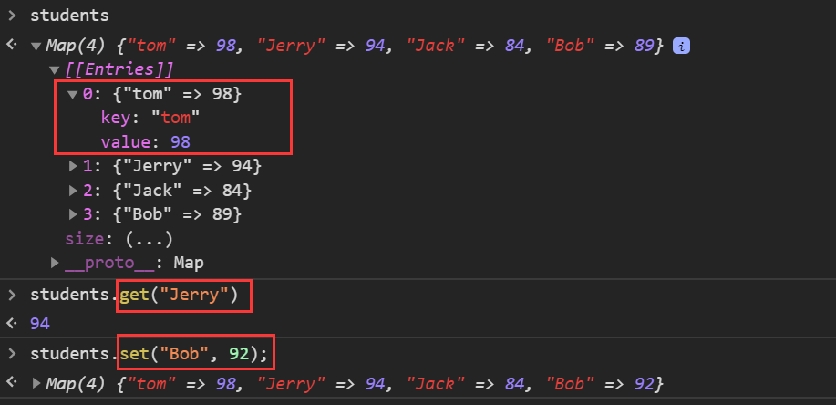

- 也可以通过直接通过set方法向其中添加元素

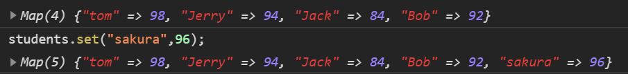

- delete 删除键值对

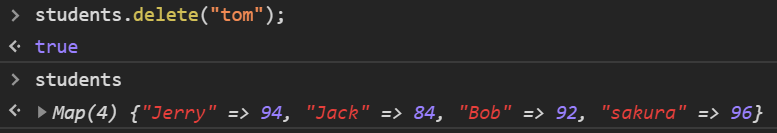

- 使用has方法 判断map中是否包含指定的Key

```javascript
> students.has('Jerry');
< true
```

- Set:无序不重复的集合
  
  ```javascript
  let set = new Set([1,2,2,3,3]);
  ```
  
  
  
  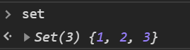
  
  - add()	添加元素
  - has()、delete()
  
- 两者都有 iterator 迭代器

  1. `for-of`遍历map

     ```javascript
     for(let x of students){
       console.log(x);
     }
     ```

     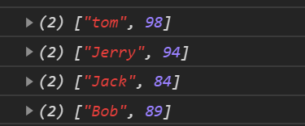

  2. 遍历Set

     ```javascript
     for(let x of set){
       console.log(x);
     }
     ```

     

## 叁、函数与面向对象

### 3.1、函数定义及变量作用域

#### 3.1.1、函数定义

```javascript
/** java
访问权限 返回值类型 方法名{
}
*/

绝对值函数
// 方式一
function abs(a){
    //...
}

// 方式二
var abs = function(X){
  if (x > 0) {
    return x;
  } else {
    return -x;
  }
}
```

#### 3.1.2、函数调用

> 参数可以是任意个

- 手动抛出异常

  ```javascript
  if (typeof x !== "number") {
          throw "Not a Number";
  }
  ```

  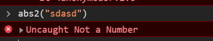

> 多个参数

- `arguments`：当传入的参数是多个参数时，可以通过`arguments.length`获取传入参数长度，并获取所有参数的值。

```javascript
abs(1,2,3,4,5,6,7);

function abs(x){
    x // 1
    arguments.length(); // 7
    arguments[3]; // 4
    ...
}
```

> 问题：**arguments包含所有的参数**，当需要使用其他参数做附加操作时，就必须排除已有的参数

---


- `rest`

> ES6新特性，**获取除了已经定义的参数以外的所有参数**，**多余的参数会被保存**

```javascript
var abs3 = function (x,...rest) {
    //...
    console.log(`rest:${rest}`);
    //...
};

abs3(1,2,34,56,7);
> rest:[2,34,56,7];
```

- ==注意: `rest`只能写在参数最后，并用`...`标识==

#### 3.1.3、变量作用域

> 1. **函数查找变量 由内向外**，若外部与内存存在变量重名，会屏蔽外部变量，**优先使用内部变量**。
>
> 2.  JS执行，**自动提升了变量的声明**，但是不会提前变量的赋值；即当变量在后面出现赋值，但是在最开始就会被自动声明，值为undefine。
>
> 3. 所有的**变量定义放在函数的头部**，便于维护；
>
> 4. 所有的**全局变量都会绑定在window对象下** ；包括alter()、...
>
> 5. 当不同js文件引用了相同全局变量，就会产生冲突，解决方案:
>
>    ```javascript
>    // 自定义用户空间
>    var sakura = {};
>    // 添加用户自己的变量
>    sakura.x = 817;
>    sakura.add = function (x, y){
>        return x + y;
>    }
>    ```
>
>    - 把自己的代码放入自己定义的命名空间内，减少命名冲突;(JQuery)
>
> 6. 局部作用域 `let`:+1:
>
>    ```js
>    function f(){
>        for(var i = 0; i < 100; i++){
>            console.log(i); //0,1,...,99
>        }
>        console.log(i);// 100!?  i出了作用域还可以使用
>    }
>    ```
>
>    - `let`关键字:解决局部作用域冲突问题;
>
>    ```javascript
>    function f(){
>        for(let i = 0; i < 100; i++){
>            console.log(i); //0,1,...,99
>        }
>        console.log(i);// i is not defined
>    }
>    ```
>
> 7. `const`定义常量;
>
>    ES6前：所有的常量规定用大写字母标记，但是可以被改变。
>
>    ES6:引入了常量关键字:+1:

### 3.2、方法

- 方法 = 函数放入对象中；

```javascript
// 对象
var person = {
    name : "SAKURA",
    birth : 2000,
    // 方法
    age : function(){
        return new Date().getFullYear() - this.birth;
    }
} 
//获取属性
person.name;
//调用方法
person.age();
```

- `apply方法：（所有函数都具有）`
  - 可以指定this的指向，即设定函数调用者
  - 语法：`func.apply(调用对象，func的实参)`；

### 3.3、闭包（重点）

### 3.4、箭头函数（新特性）


## 肆、常用对象

> 标准对象

```javascript
123 —— "number"
"abc" —— "string"
true/false —— "boolean"
NaN —— "number"
[]/{} —— "object"
Math.abs() —— "function"
undefine —— "undefine"
```

### 4.1、Date

- 基本使用

```javascript
var now = new Date();//Thu Mar 05 2020 17:15:32 GMT+0800 (中国标准时间)
now.getFullYear();//年:2020
now.getMonth();//月:2 (0~11);
now.getDate();//日:5
now.getDay();//星期:4
now.getHours();
now.getMilliseconds();
now.getSeconds();

now.toLocaleString();//转为本地时间

var now2 = now.getTime()//获取时间戳;
var time = new Date(now2);//时间戳转当前时间
alert(time);
```

- 转换

```javascript
.toLocaleString(); // "2020/3/5 下午5:27:33"
.toDateString(); // "Thu Mar 05 2020"
.toGMTString(); // "Thu, 05 Mar 2020 09:27:33 GMT"
...
```


### 4.2、JSON

> JSON是什么?
>
> 1. JavaScript Object Notation,JS对象简谱，是**一种轻量级的数据交换格式。**
> 2. **简洁和清晰的层次结构**使得JSON成为理想的数据交换语言。（早期所有数据传输习惯使用XML文件）
> 3. 易于开发者阅读和编写，同时也易于机器解析和生成，并有效地提升网络传输效率。

**JavaScript中一切皆为对象,任何JS支持的类型都可以用JSON来表示**

>  语法格式
>
> 1. 对象—> {..}
> 2. 数组—> [..]
> 3. 键值对—> key: value

- **JSON字符串与JavaScript对象的相互转化**

```js
var user = {
    name:"官宇辰",
    age:20,
    sex:"男"
}

// 对象转化为json字符串
var user_json = JSON.stringify(user);

//json字符串 解析为对象
var sakura = JSON.parse('{"name":"官宇辰","age":19,"sex":"男"}');
```

- JSON和JS对象的区别

> 1. 对象里面的键值对，属性名直接写，而json字符串中，属性名也要用双引号包裹
> 2. json本身就是一个字符串，也要用引号包裹。

### 4.3、Ajax

- 原生的js写法， xhr 异步请求
- jQuery 封装好的方法
- axios请求


## 伍、面向对象编程

> 什么是面向对象?
>
> - 在JavaScript中，早期使用修改\__proto__ 来实现原型的转换，以达到继承的目的；
> - ES6中引入了**class关键字**，也就有了现在的类继承。
> - 但其本质还是修改对象的原型即\__proto__

### 5.1、定义Person类、并创建一个实例对象

```javascript
class person{
    // 构造器
    constructor(name, age, sex){
        this.name = name;
        this.age = age;
        this.sex = sex;
    }
    // 方法
    sayHello(){
        alert(`hello I'm ${this.name}`);
    }
}

var xiaoming = new person("xiaoming",19,"男");
```

### 5.2、Class继承

```javascript
class student extends person{
    constructor(name,grade){
        super(name);
        this.grade = grade;
    }
    sayHello(){
        alert(`I'm a student My name is ${this.name}`);
    }
}

//查看原型，其本质还是修改__proto__,只是简化了写法。
```

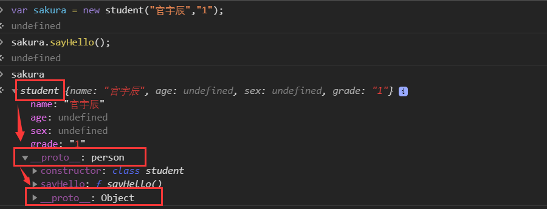

- 任何对象的最原始的原型都是Object，就不得不提==原型链==

### 5.3、原型链（难点）

- `prototype`:<a name = "a">每个函数都有的属性，其本质是一个对象</a>

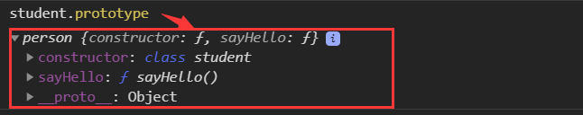

- `__proto__`:\__proto__ 指向了实例对象的原型，它也是一个对象。

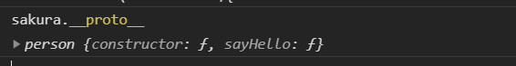

- 实例对象的 \__proto__ 与创建该实例对象的构造函数的 prototype 是相等的（**注意此处的构造函数是指student** 而**不是constructor**）

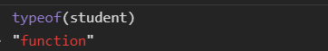

> 虽然student是用class定义，但是其本质类型还是函数！！！

- `constructor` 这个字段的内容是一个函数，函数名(**即图中的name**)和构造函数（**这里指student**）竟然一样。可以说，每个**原型对象都有一个 constructor 属性**，指向相关联的构造函数，所以**构造函数和构造函数的 prototype 是可以相互指向的。**

  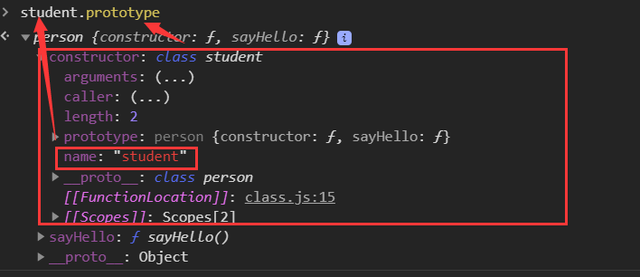

> 即**student与student.prototype 是相互指向的**，且**student创建的对象的proto也是指向student.prototype**的，我们称之为**实例原型**

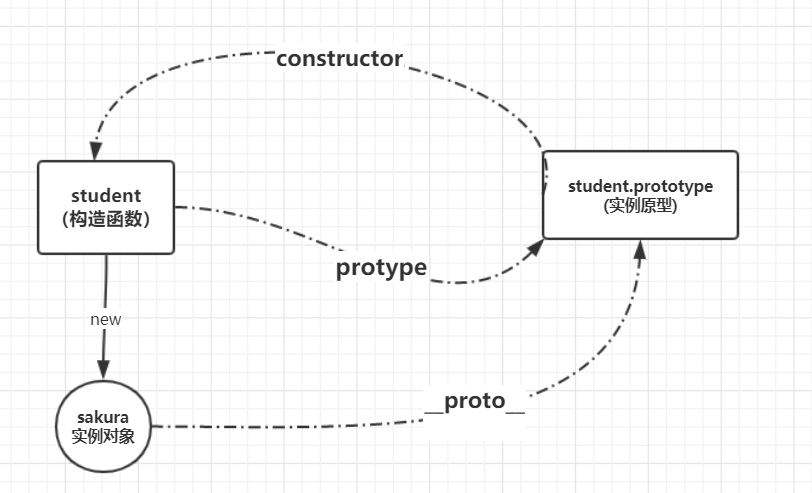

```javascript
class student extends person{
    constructor(name,grade){
        super(name);
        this.grade = grade;
    }
    sayHello(){
        alert(`I'm a student My name is ${this.name}`);
    }
}

student.prototype.bitrh = 2000; // 在student的原型上加上了一个birth属性
var sakura = new student("官宇辰",1);

//虽然在创建student实例的时候没有设置birth相关属性，但是任然可以通过实例访问到birth属性
console.log(sakura.bitrh) // 2000


```


> 在 JavaScript 中，如果想访问某个属性，首先会在实例对象（cat）的内部寻找，如果没找到，就会在该对象的原型（sakura.\_\_proto\_\_，即 student.prototype）上找，我们知道，<a href= "#a">对象的原型也是对象</a>，它也有原型，如果在对象的原型上也没有找到目标属性，则会在对象的原型的原型（student.prototype.\__proto__）上寻找，以此内推，**直到找到这个属性或者到达了最顶层**。在原型上一层一层寻找，这便就是原型链了。


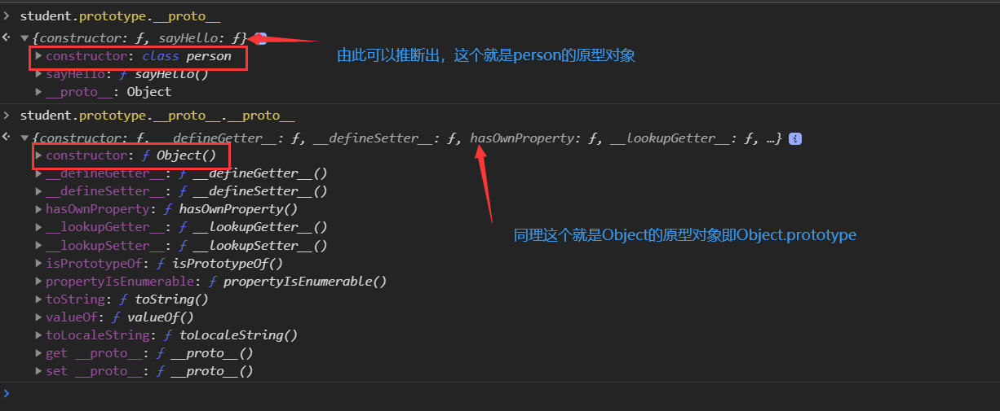

```javascript
console.log(Object.prototype.__proto__)   // null
//null就是没有对象，所以：Object.prototype 就是原型链的最顶端。
```

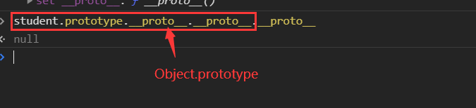

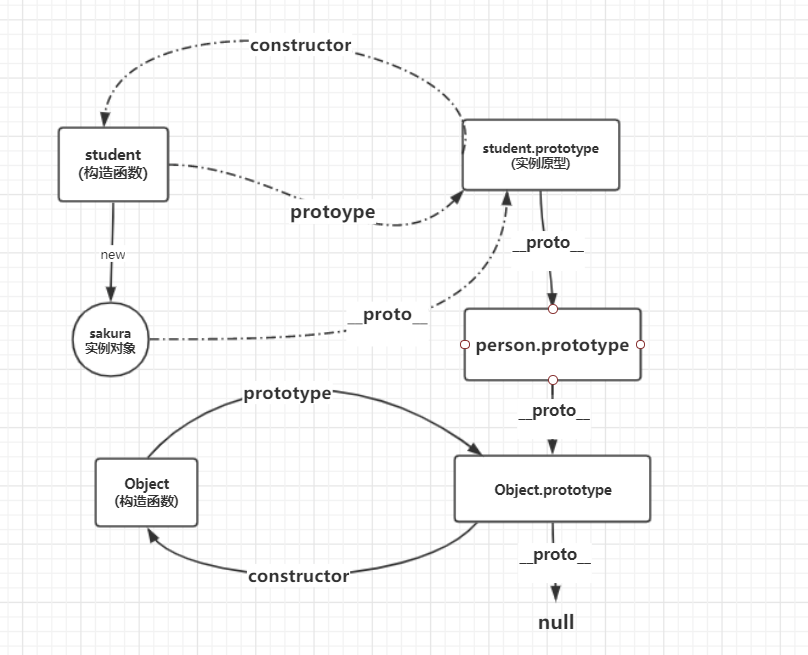

> **小结**：
>
> 1. **每个对象在创建时，都会关联一个对象，即对象的原型，存放在自己的\__proto__属性中，每一个对象都会从原型上继承属性，而原型也是一个对象，原型也有自己的原型对象。**（通俗一点，你生下来就指定了一个爹，同时你也从你爹身上继承了一些东西，而你爹也有他自己的爹:sweat_smile:）。
> 2. **原型链层层向上，直到Object.prototype**
> 3. **对象都会有一个 \__proto__  属性来访问自己的原型**
> 4. **每个对象的原型（\__proto__ 的值）与创建其的构造函数（再次强调此构造函数并不是constructor，简单理解就是new 后面那个）的prototype相同**


## 陆、操作BOM对象（重点）

> **BOM**(Browser Object Model)**浏览器对象模型**

- JavaScript 和 浏览器的关系?

  > JavaScript的诞生就是为了在浏览器中运行，使用户可以与浏览器交互

### 1、window

- 代表浏览器窗口、同时也是顶级父类

```javascript
window.innerHeight
> 444
window.innerWidth
> 960
window.outerHeight
> 997
window.outerWidth
> 975

// 获取窗口的内外大小
```


### 2、Navigator

- 封装了浏览器的信息

```javascript
navigator.appName
> "Netscape"
navigator.appVersion
> "5.0 (Windows NT 10.0; Win64; x64) AppleWebKit/537.36 (KHTML, like Gecko) Chrome/80.0.3987.87 Safari/537.36"
navigator.userAgent
> "Mozilla/5.0 (Windows NT 10.0; Win64; x64) AppleWebKit/537.36 (KHTML, like Gecko) Chrome/80.0.3987.87 Safari/537.36"
navigator.platform
> "Win32"
```

一般不使用`navigator`对象的属性来判断用户的浏览器类型，**因为可以人为修改**！


### 3、screen

- 获取屏幕信息

```javascript
screen.width
> 1739
screen.height
> 979
```


### 4、location

- 代表当前页面的URL信息

```javascript
host: "www.baidu.com" // 当前页面所在的主机地址
href: "https://www.baidu.com/" // 当前页面的URL
protocol: "https:" // 协议类型

location.reload(); // 刷新页面
location.assign(); // 跳转到指定页面

```

### 5、==Document==

- document代表当前页面，HTML DOM文档树

```javascript
document.getElementById();
		.getElementsByClassName();
		.getElementsByName();
		.getElementsByTagName();
...
```

- 可以获取具体的文档树节点

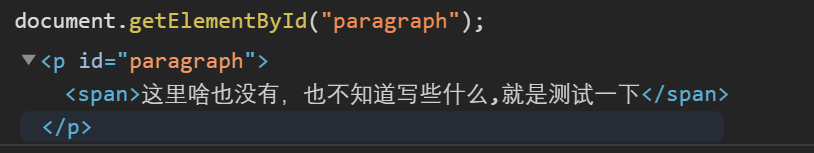

> - 动态修改网页的节点，删除添加;
> - 可以直接拿到网页的Cookie  `document.cookie`


### 6、history

```javascript
history.back()// 后退
history.forword() // 前进
```


## 柒、操作DOM对象（重点）

> DOM( Document Object Model) 文档对象模型、
>
> 浏览器网页就是一个Dom树形结构
>
> - 更新：更新Dom节点
> - 遍历：得到Dom节点
> - 删除：删除节点
> - 添加：添加节点
>
> 要操作dom节点 就必须先获得dom节点

- **巨坑！！**

  > 因为document.getElementById()的使用需要把函数放在id的后面。**所以，如果我们想避免这个问题，我们把js的引入放在body的最后面。**

### 1、获得DOM节点

```javascript
var pp = document.getElementById("p1");
var h1 = document.getElementsByTagName('h1');
var p2 = document.getElementsByClassName('paragraph');
var father = document.getElementById("father");
```


### 2、更新节点

```javascript
p1.innerText="..." // 修改p1内的本文
p1.innerHTML = `<strong>${p1.textContent}</strong>`; // 插入/修改html
p1.textContent // 获取文本内容


// 修改css代码
p1.style. ...='..';
```


### 3、删除节点

- First——获取父节点

  ```javascript
  parentNode: 
  parentElement:
  // 通过getElementById的节点才能获取到自己的父节点
  ```

  

- Second——通过父节点删除目标节点

  ```javascript
  父节点.removeChild(子节点);
  ```

  > Tip:在删除节点的时候，子节点的索引值是在动态变化的

### 4、插入节点

> 当获取了某个dom节点后，我们可以通过 innerHTML向其中添加元素，**但是会覆盖原有的内容**

- 追加 `append`

```javascript
father.append(pp);
father.appendChild(pp);
```

- 创建新节点 `creatElement`,设置属性`setAttribute`

```javascript
var newElement = document.createElement('h1'); // 创建一个h1标签

newElement.id = "newElement"; // 设置元素id

newElement.innerText = "我是新来的！！"; // 添加文本内容

father.appendChild(newElement); // 添加到页面中

newElement.setAttribute("id","newElem"); // 设置属性
```

- 插入到某个节点之前`insertBefore`

```javascript
div.insertBefore(newElem,reElem);
// 将newElem插入到div节点中的  子节点reElem 前;
```


## 捌、操作表单

- 表单（form）也是DOM树中的一个节点

### 1、获得表单 = 获取提交的信息

```javascript
// 获取文本框的值
var usrname = document.getElementById('username'); //获取表单文本框对象
usrname.value // 取值
usrname.value = '...' // 修改值


// 单选框
radio_man.checked // 通过判断checked的值 来确定是否被选中
> false
```


### 2、提交表单

```html
 <!-- 
    表单提交绑定事件（VerifyInfo函数） 
    但事件返回值为true或false时，需要将事件返回值再次return给onsubmit
    以此来判断后台是否接收表单提交
    -->
<form action="https://www.baidu.com/" method="post" onsubmit="return VerifyInfo()">
    <span>
        <input type="text" name="username" id="username" placeholder="请输入用户名">
    </span>
    <span>
        <input type="password" name="pwd" id="password">
    </span>

    <!-- 按钮 绑定事件(submitInfo()函数) -->
    <input type="submit" value="提交" onclick="submitInfo()">
</form>
```

```javascript
function VerifyInfo(){
    var uname = document.getElementById("username");
    var pwd = document.getElementById("password");
    if(name.value===""||pwd.value===""){
        alert("用户名和密码不能为空");
        return false;
    }
    return true;
}

function submitInfo(){
    alert("提交成功 ，等待验证");
}
```

- 通过自定义表单验证绑定的事件 可以方便验证表单

- 当提交的表单涉及用户私人信息时，需要进行加密或隐藏处理，防止被他人盗用。

  - 密码加密MD5

    ```javascript
    // 在原文密码上进行加密 提交时密码加密过程可见（密码边长）
    var pwd = document.getElementById("password");
    pwd.value = hex_md5(pwd.value); // 加密
    ```

    > 表单优化
    >
    > - 通过一个隐藏域来进行表单加密
    > - 去掉密码框元素的name属性 使提交信息中不包含原始密码
    > - 在检测函数中调用加密方法 传入原始密码 加密后 赋值给隐藏域（加密过程就不可见了，不会发生密码变成的效果）

    ```html
    <!-- 去除了密码框的name属性，就使提交时，原始密码不会被包含到表单中-->
    密码<input type="password" id="input-password"> 
    <!-- 设置隐藏域 来保存加密后的密码，使得提交时的加密过程不可见-->
    <input type="hidden" name="password" id="md5-password">
    
    ```

    ```javascript
    var pwd = document.getElementById("input-password");
    var md5pwd = document.getElementById("md5-password"); // 加密并赋值
    md5pwd.value = hex_md5(pwd.value);
    ```

    

  - 隐藏真实的表单信息(hidden)

  - ....


## 玖、JQuery

> 什么是JQuery？
>
> - JavaScript的一个工具库，（类似于java中的Commons.IO等工具类）
> - 里面包含了大量的Javascript函数以供开发者使用，提高效率

> 引入JQuery（两种方式）
>
> 1. 下载官方的js文件导入项目中，然后标签引入
> 2. 通过cdn（内容分发网络）在线引入,更加便捷。

- **JQuery 使用公式**

  `$(selector).action()`


> **选择器**（selector）

```javascript
$('a').click(function(){			// 标签选择器+操作内容
            alert("hello JQuery");
        });
$('#id').action(..)  // id选择器
$('.class').action(..)  //class 选择器
$('a[id=a1]').action(..)  //属性选择器
// css的选择器都能用
```


> **事件**（action）
>
> - 鼠标事件
>
>   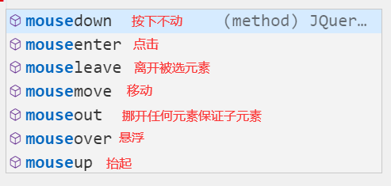

```html
<!DOCTYPE html>
<html lang="en">
<head>
    <meta charset="UTF-8">
    <meta name="viewport" content="width=device-width, initial-scale=1.0">
    <title>JQuery学习使用</title>
    <script src="./jquery-3.4.1.js"></script>
    <script src="./test.js"></script>
    <style>
        #area{
            width: 700px;
            height: 500px;
            border: 3px solid red;
        }
    </style>
</head>
<body>
    <h3 id="mouse">鼠标位置:<span></span></h3>
    <div id="area">在区域内移动</div>
    <script>
        // 当网页元素加载完毕后 响应事件
        // $(document).ready(function(){}); 完整写法
        $(function(){    // 简化写法
            $('#area').mousemove(function(e){
                $('span').text(`x:${e.pageX},y:${e.pageY}`); //向span标签内加入文本
            })
        });       
    </script>
</body>
</html>
```

