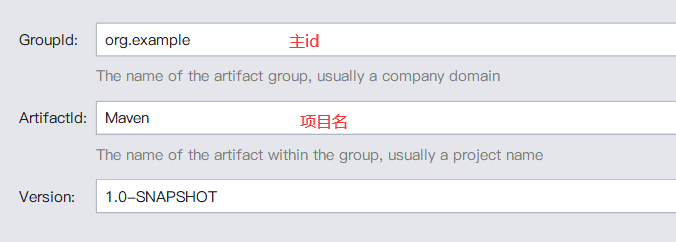
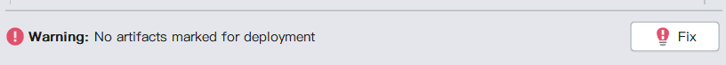
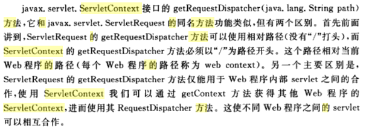

[TOC]

# JavaWeb

## 1、基本概念

- Web开发:

  - 静态Web

    > html、css 所有人看到的数据都是一样的没有变化

  - 动态Web

    > 每个人看的页面都不一样
    >
    > Servlet/JSP，ASP，PHP

- web应用程序

  > - 可以提供浏览器访问的程序
  >
  > - 多个Web资源整合起来就能向外界提供服务
  >
  > - 这些统一的web资源被放在同一个文件夹下
  > - 一个web应用由多个部分组成（静态web，动态web）
  >   - html，css，js
  >   - jsp，servlet
  >   - java程序
  >   - jar包
  >   - 配置文件（Properties）


### 静态web

> 服务器上一直存在的数据，我们可以直接进行读取


> 静态Web的缺点
>
> - **Web页面无法动态更新，所有的用户看到的都是相同的页面**
>   - 轮播图、点击特性（伪动态）
>   - JavaScript
>   - VBScript
> - **无法于数据库交互（数据无法持久化，用户无法交互）**


### 动态Web

> 每个人访问的页面都各不相同


> 动态Web缺点
>
> - 动态web资源发现了错误，我们需要重新编写后台程序，重新发布
>
> 优点：
>
> - 可以与数据库交互，数据可以持久化


## 2、Web服务器

> 技术栈介绍

- ASP(微软)
  - 在Html中嵌入了VB的脚本，ASP+DOM
  - Html代码中，杂含其他代码，难以维护
- PHP
  - 开发速度块，功能强大，跨平台，代码简单
  - 但是无法承载大访问量的情况
- JSP/Servlet
  - sun公司主推的B/S架构
  - 基于Java语言
  - 可以承载三高问题带来的影响


### 2.1、服务器

> 服务器是一种被动的操作，用来处理用户的一些请求，和用户的一些响应信息
>
> - IIS（windows自带）
> - Tomcat

- 配置Tomcat
  - 修改端口号（默认8080）
  - 修改主机名


> **网站是如何进行访问的？**

- 先检查本机的host目录中有没有对应的域名及其对应的ip
  - 若有，直接返回ip地址，进行访问
  - 否则，提交给DNS服务器（管理全球的域名）查找，将找到的地址返回。


### 2.2、发布Web网站

- 将自己写好的web资源打包放到tomcat目录下的webapp中，即可访问。
  - 默认访问ROOT文件夹中的内容
  - 默认首页为index.html
  - `WEB_INF`
    - classes：java程序段
    - lib：web应用所依赖的jar包
    - web.xml：网站的配置文件
  - static：存放静态资源文件
    - js、css、img....

## 3、Http

> 什么是http?
>
> - 超文本传输协议
>
> - 一个简单的请求-响应协议
> - 运行在TCP之上
> - 80端口  https：安全的（443端口）

- HTTP/1.0：每次连接后，只能获得一个web资源，断开连接
- HTTP/1.1：连接后，可以连续获得多个web资源

### 3.1、Http请求

> 客户端---请求--->服务器

```http
Request URL: https://www.baidu.com/   请求地址
Request Method: GET   请求方式 get/post
Status Code: 200 OK	  状态码:200
Remote Address: 36.152.44.95:443  远程地址
Referrer Policy: unsafe-url
```

> post与get
>
> - get 可以携带的信息数量有限，大小也有限，且会显示在url中，不安全，但是高效。
> - post 携带的信息数没有限制，大小也没有限制，也不会在url中显示，较为安全，但是效率不高。

```http
Accept: text/html,  用户期望的信息格式
Accept-Encoding: gzip, deflate, br  用户期望的编码形式
Accept-Language: zh,en-US;q=0.9,en;q=0.8,zh-CN;q=0.7,zh-TW;q=0.6
Cache-Control: max-age=0
Connection: keep-alive
```

> 状态码：
>
> - 常见的
>   - 200 - 请求成功
>   - 301 - 资源（网页等）被永久转移到其它URL
>   - 404 - 请求的资源（网页等）不存在
>   - 500 - 内部服务器错误

| 分类 |                    分类描述                    |
| :--: | :--------------------------------------------: |
| 1**  |  信息，服务器收到请求，需要请求者继续执行操作  |
| 2**  |           成功，操作被成功接收并处理           |
| 3**  |       重定向，需要进一步的操作以完成请求       |
| 4**  |   客户端错误，请求包含语法错误或无法完成请求   |
| 5**  | 服务器错误，服务器在处理请求的过程中发生了错误 |


### 3.2、Http响应

> 服务器---请求--->客户器

```http
Cache-Control: private
Connection: keep-alive 
Content-Encoding: gzip 服务器响应 返回的信息编码形式
Content-Type: text/html  响应 返回的信息格式
```


## 4、Maven

- 项目架构管理工具
- 自动导入和配置jar包
- 核心思想：约定大于配置


### 4.1、Maven配置和使用

> 1. 环境变量配置：
>
> 
>
> 
>
> 2. 配置文件中加入国内镜像(Mirrors内)
>
> ```xml
> <mirror>
>       <id>alimaven</id>
>       <mirrorOf>central</mirrorOf>
>       <name>aliyun maven</name>
>     <url>http://maven.aliyun.com/nexus/content/repositories/central/</url>
> </mirror>
> <mirror>
>       <id>nexus-aliyun</id>
>       <mirrorOf>*,!jeecg,!jeecg-snapsgots</mirrorOf>
>       <name>Nexus aliyun</name>
>       <url>http://maven.aliyun.com/nexus/content/groups/public</url>
> </mirror>
> ```
>
> 3. 建立本地仓库
>
> ```xml
> <localRepository>F:\Environment\apache-maven-3.6.3\maven-repo</localRepository>
> 
> Default: ${user.home}/.m2/repository 默认的本地仓库地址
> ```
>
> 4. IDEA设置Maven
>
> 
>
> 
>
> 
>
> 5. 不使用模板，创建空的maven项目
>
> 
>
> 
>
> 6. pom.xml 是Maven的核心配置文件
>
>    
>
>    每一个dependency都对应一个依赖项，所有的dependency标签都必须放在denpendencise标签下


### 4.2、IDEA中配置Tomcat

1. 警告修复

   > 代替Tomcat文件夹下的webapps，作为项目的默认web资源文件




2. 启动


### 4.3、常见问题

- Maven资源导出问题

> 问题描述：
>
> ​	当再java的package下创建的配置文件，再打包target时候，无法导出。
>
> 
>
> 
>
> 解决方案：
>
> 在pom文件中，build中配置resource，来防止资源导出错误。
>
> [参考博客]<https://www.cnblogs.com/yuqiliu/p/12059614.html>
>
> ```xml
> <build>
> <resources>
>   
>   <!--默认只导出resource文件夹下的--> 
>   <resource>
>       <directory>src/main/resources</directory>
>       <includes>
>           <include>**/*.properties</include>
>           <include>**/*.xml</include>
>       </includes>
>       <filtering>true</filtering>
>   </resource>
>   
>   <!--添加配置导出java文件夹下的--> 
>   <resource>
>       <directory>src/main/java</directory>
>       <includes>
>           <include>**/*.properties</include>
>           <include>**/*.xml</include>
>       </includes>
>       <filtering>true</filtering>
>   </resource>
> </resources>
> </build>
> ```
>
> - 设置完成后，所有资源会打包导出到同一个路径下：classes，俗称**classpath（main下的java和resource文件夹下的文件到会导出到这里）**

- Maven web项目WEB-INF/web.xml文件中版本问题

> 问题描述：maven创建的web项目中默认的web构建版本是2.3
>
> 
>
> 而Tomcat中ROOT/WEB-INF文件夹下的的web.xml 文件中使用的版本为4.0
>
> 


## 5、==Servlet==（重点）

### 1、简介

- SUN公司开发动态web的一门技术

- SUN公司提供了一个接口：Servlet

- 开发一个servlet的步骤

  - 编写一个类，实现servlet接口
  - 把开发好的java类部署到web服务器中

- **实现了Servlet接口的java程序叫做Servlet**

  > **Servlet的默认两个实现类**
  >
  > - `GenericServlet`(抽象类)
  >
  > 
  >
  > - `HttpServlet`(继承了GenericServlet)
  >
  >   

### 2、HelloServlet

- 构建一个普通maven项目

- 删除src文件夹，以便后续创建module

- 父项目下创建子module，使用maven的web模板

  > maven父子工程
  >
  > ```xml
  > // 父项目中pom.xml多出一个modules
  > <modules>
  >   <module>servlet01</module>
  > </modules>
  > 
  > // 工程下的子module 多出一个parent
  > <parent>
  >   <artifactId>Javaweb-02-HelloServlet</artifactId>
  >   <groupId>com.sakura</groupId>
  >   <version>1.0-SNAPSHOT</version>
  > </parent>
  > 
  > 父项目中的jar包 子项目都可以使用，反之则不行
  > ```
  >
  > 

- 修改web.xml配置文件

  ```xml
  <?xml version="1.0" encoding="UTF-8"?>
  <web-app xmlns="http://xmlns.jcp.org/xml/ns/javaee"
           xmlns:xsi="http://www.w3.org/2001/XMLSchema-instance"
           xsi:schemaLocation="http://xmlns.jcp.org/xml/ns/javaee
                        http://xmlns.jcp.org/xml/ns/javaee/web-app_4_0.xsd"
           version="4.0"
           metadata-complete="true">
  
  </web-app>
  ```

- 创建完成


> 核心在于重写doPost()和doGet()	业务实现的逻辑是相同的，两者是可以相互调用的，一方写好业务处理的代码，在另一方直接调用即可。

- 编写Servlet的映射

  > 1. 为什么要需要映射？
  >
  >    - 我们所编写的servlet是java程序，浏览器无法直接访问
  >    - 通过浏览器连接web访问，我们必须在web服务器上注册我们写的servlet，让浏览器知道存在这个可以访问的页面
  >    - 注册的同时，我们需要给出一个浏览器能访问的路径
  >
  > 
  >
  > 2. 如何编写映射？
  >
  > ```xml
  > <!--在web.xml中配置-->
  > <!--  
  > 	<servlet>与<servlet-mapping>一一对应
  > -->
  > 
  > <servlet>
  >     <!--servlet名字，用于上下两者一一对应-->
  >     <servlet-name>Hello</servlet-name>
  >     <!--要注册的java类的完整类名-->
  >     <servlet-class>com.sakura.servlet.HelloServlet</servlet-class>
  > </servlet>
  > 
  > <servlet-mapping>
  >     <!--servlet名字，用于上下两者一一对应-->
  >     <servlet-name>Hello</servlet-name>
  >     <!--浏览器访问的路径,添加在默认路径后即可-->
  >     <url-pattern>/hello</url-pattern>
  > </servlet-mapping>
  > 
  > ```
  >
  > 

- 配置Tomcat

  > 注意配置好项目发布的路径! 决定你用那个路径进入哪个项目
  >
  > 

- 启动Tomcat

  - 默认显示index.jsp页面
  - 通过此路径可以访问我们刚才注册的servlet

  

###  3 、==Servlet运行原理==

> Servlet由Web服务器调用。
>
> 

### 4、Mapping问题

1. 一个Servlet指定一个路径？:accept:

   ```xml
   <servlet-mapping>
       <servlet-name>Hello</servlet-name>
       <url-pattern>/hello</url-pattern>
   </servlet-mapping>
   ```

   

2. 一个Servlet指定多条路径？？:accept:

   ```xml
   <servlet-mapping>
       <servlet-name>Hello</servlet-name>
       <url-pattern>/hello1</url-pattern>  
   </servlet-mapping>
   <servlet-mapping>
       <servlet-name>Hello</servlet-name>
       <url-pattern>/hello2</url-pattern>
   </servlet-mapping>
   <servlet-mapping>
       ...
   </servlet-mapping>
   ```

   

3. 一个Servlet指定通用路径？:accept:

   ```xml
   <servlet-mapping>
       <servlet-name>Hello</servlet-name>
       <url-pattern>/hello1/*</url-pattern>
   </servlet-mapping>
   <!--改为/* 会导致主页面无法显示，不推荐-->
   ```

   

4. Servlet设置为默认路径？:accept: 但是不推荐

   ```xml
   <servlet-mapping>
       <servlet-name>Hello</servlet-name>
       <url-pattern>/*</url-pattern>
   </servlet-mapping>
   ```

   

5. 自定义后缀实现请求映射？:accept:

   ```xml
   <servlet-mapping>
       <servlet-name>Hello</servlet-name>
       <url-pattern>*.sakura</url-pattern>
   </servlet-mapping>
   <!--只要是以.sakura结尾的路径都可以访问-->
   ```

6. **优先级问题**

   > 指定了的映射路径优先级更高；
   >
   > 当同时指定了 路径为/*，和/hello的页面时，通过/hello路径时直接访问对应页面，而不匹配前者的通配符。

---


### 5、ServletContext应用

> ServletContext：
>
> - 服务器会为每一个工程创建一个对象，即ServletContext对象，这个对象在工程下全局唯一，工程下所有servlet都共享这个对象，所以叫**全局应用程序共享对象**
> - 是一个**域对象**（服务器在内存上创建的存储空间，用于在不同的动态资源(servlet)之间传递和共享数据）
> - 可以读取全局配置参数
> - 可以搜索当前工程目录下的资源文件
> - 获取当前工程的名字：getContextPath();

#### 1、数据共享

```java
// HelloServlet.java

ServletContext servletContext = this.getServletContext();//获取ServletContext
String msg = new String("Hello I'm Sakura");
servletContext.setAttribute("msg",msg);//以key:value向其中添加一条信息
									//	msg:Hello I'm Sakura
```

```java
// GetMsg.java

ServletContext context = this.getServletContext();//获取ServletContext
String msg = (String)context.getAttribute("msg");//拿到key为msg的信息的值

resp.setContentType("text/html"); //设置响应数据类型
resp.setCharacterEncoding("utf8");// 设置响应数据的编码
resp.getWriter().print("接收到的消息是："+ msg); //页面上显示信息
```

```xml
<!--注册servlet，添加映射-->
<servlet>
    <servlet-name>getmsg</servlet-name>
    <servlet-class>com.sakura.servlet.GetMsg</servlet-class>
</servlet>
<servlet-mapping>
    <servlet-name>getmsg</servlet-name>
    <url-pattern>/getmsg</url-pattern>
</servlet-mapping>
```


- 多个Servlet共用一个ServletContext, 在此处可以进行信息交换。
- 必须先访问localhost:8080/s2/hello，若直接取值，servletcontext中并没有对应的数据，则拿到的数据就为null
- 想要数据显示在页面上时，必须设置好响应的数据类型`setContentType()`，以及数据的编码格式`setCharacterEncoding()`

#### 2、获取初始化参数

- 在web.xml中的`<context-param>`中设置初始化参数

  ```xml
  <!--设置初始化参数-->
  <context-param>
      <param-name>JDBC_URL</param-name>
      <param-value>jdbc:mysql//localhost:3306/jdbcstudy?useUnicode=true&amp;charactetEncoding=utf8&amp;useSSL=true</param-value>
  </context-param>
  ```

- 编写Servlet获取初始化参数

  ```java
  ServletContext context = this.getServletContext();
  String url = context.getInitParameter("JDBC_URL");
  resp.getWriter().print(url);
  ```

- web.xml中配置映射


#### 3、请求转发

<a name="dispatcher">ServletContext中的getRequestDispatcher()</a>

- 使用ServletContext中`void getRequestDispatcher(String s)`方法为当前Servlet设置转发的路径s,

  ```java
  ServletContext context = this.getServletContext();
          RequestDispatcher dispatcher = context.getRequestDispatcher("/getParam"); // 设置转发路径
  ```

- 调用RequestDispatcher的`forword()`方法 传入请求与响应作为参数

  ```java
  dispatcher.forward(req,resp); // 调用forward请求转发
  ```

- web.xml中配置映射

- 启动

  

> 虽然输入的URL路径是/dispatcher，但实际显示的页面是/getParam
>
> 虽然页面发生了变化，URL路径但是没有变化（重定向：路径是会变化的）
>
> 状态码也是200 （3xx：页面跳转）

> **页面跳转的两种方式**
>
> - 请求转发
>
>   
>
> - <a name="redirect">重定向</a>
>
>   
>
>   

#### 4、读取资源文件

- 涉及`java.util.Properties`,该类主要用于读取Java的配置文件;

  > **Properties类：**
  >
  > - Properties类表示一组持久的属性。 Properties可以保存到流中或从流中加载。  属性列表中的每个键及其对应的值都是==一个字符串==。
  > - 使用`load()`和`store()`方法来加载和保存properties文件，分别需要**inputstream**和**outputstream**作为参数。
  > - 使用`setProperty(String key,String value)`方法。插入键值对。不推荐使用put() (插入的键值对不是字符串，不符合标准)
  > - 使用`getProperty(String key)`方法，获取指定的key所对应的值。
  > - 在读入和写出时，注意设置统一编码方式，默认是以GBK编码。
  > - 此类是线程安全的，在多线程读取时，不需要外部同步

    ```java
    ServletContext context = this.getServletContext();
    // 获得流 用于加载配置文件
    InputStream inputStream = context.getResourceAsStream("/WEB-INF/classes/test.properties");
  
    Properties prop = new Properties();
    prop.load(inputStream);
    String name = prop.getProperty("name");
    String age = prop.getProperty("age");
  
    resp.setContentType("text/html");
    resp.setCharacterEncoding("utf8");
    PrintWriter writer = resp.getWriter();
    writer.println(name);
    writer.print(age);
    ```

---

---


> Web服务器在接收到客户端发来的http请求时，会针对请求创建**HttpServletRequest**和**HttpServletResponse**对象，来分别代表用户请求，和服务端响应;
>
> - 如果需要获取用户端请求的参数：使用HttpServletRequest对象的方法
> - 如果要给客户端响应：使用HttpServletResponse对象的方法


### 6、HttpServletResponse

> 常用方法

- 用于写出数据

  ```java
  // ServletResponse
  ServletOutputStream getOutputStream();
  PrintWriter getWriter(); 
  ```

- 设置响应头的信息

  ```java
  void setCharacterEncoding(String var1);
  void setContentLength(int var1);
  void setContentLengthLong(long var1);
  void setContentType(String var1);
  void setBufferSize(int var1);
  ```

> 应用

1. 向浏览器输出信息（print...）

2. **文件下载**<13>

3. 浏览器每几秒刷新

   ```java
   resp.setHeader("refresh","3");
   ```

4. 网站存在缓存，不然浏览器缓存

   ```java
   // Expires在浏览器上缓冲存储的页面要多长时间过期。如果用户在页面过期之前“回退”到该页，则不再向服务器请求，而是显示缓存中的内容。
   resp.setDateHeader("expirse",-1);
   resp.setHeader("Cache-Control","no-cache");
   resp.setHeader("Pragma","no-cache");
   ```

   ##### 验证码模拟

   

   ```java
   // 设置浏览器每3秒刷新一次
   resp.setHeader("refresh","3");
   // 在内存中创建图片
   BufferedImage image = new  BufferedImage(80,20,BufferedImage.TYPE_INT_RGB);
   // 创建图片的画笔
   Graphics2D pen = (Graphics2D) image.getGraphics();
   // 设置图片背景颜色
   pen.setColor(Color.BLACK);
   pen.fillRect(0,0,80,20);
   // 在图片上写下数据
   pen.setColor(Color.white);
   pen.setFont(new Font("font-family=consolas",Font.ITALIC,20));
   pen.drawString(makeNum(),0,20);
   // 告诉浏览器，响应的数据类型为图片
   resp.setContentType("image/jpeg");
   // 让网站不缓存数据
   resp.setDateHeader("expires",-1);  // 资源有效期设为-1
   resp.setHeader("CacheControl","no-cache");
   resp.setHeader("Pragma","no-cache");
   // 将图片显示在浏览器中
   ImageIO.write(image,"jpeg", resp.getOutputStream());
   
   
   public static String makeNum(){
       int num = (int)(Math.random()*9999999);
       String code = new String(num + "");
       StringBuffer sb = new StringBuffer();
       for (int i = 0; i < 7 - code.length(); i++) {
           sb.append("0");
       }
       return code + sb;
   }
   ```

#### 6、==重定向（重要）==

<a href="#redirect">图示例[点我！]</a>

常见场景：

- 用户登录

核心方法

```java
void sendRedirect(String var1) throws IOExcption;
```


**代码实现：**

```java
// 设置重定向页面，需要加上项目路径
resp.sendRedirect("/Response/code");

//你没有看错只有一行

// 原理实现(效果相同)
resp.setHeader("Location","/Response/code"); // 页面定向到另一个页面
resp.setStatus(302); // 状态码设置为302
```


**面试题：**

> ==重定向与转发的区别：==
>
> - 相同点：
>
>   ​	两者都会产生页面跳转
>
> - 不同点:
>
>   ​	请求转发URL不发生变化，且状态码为200；
>
>   ​	重定向 URL会变为，状态码为302

- 衔接（模拟登录）

  ```jsp
  <html>
  <body>
  
      <%--
      从当前页面获取请求所在web应用路径 (标准写法：pageContext.request.contextPath)
      并提交此路径下对应的页面 (/login)
      --%>
      <form action="${pageContext.request.contextPath}/login" method="GET">
          <p>用户名：<input type="text" name="username"></p>
          <p>密码：<input type="password" name="password"></p>
          <p>
              <input type="submit" value="提交">
              <input type="reset" value="重置">
          </p>
      </form>
  </body>
  </html>
  
  ```

  ```java
  String username = req.getParameter("username");
  String password = req.getParameter("password");
  System.out.println("用户名："+username);
  System.out.println("密码：" + password);
  resp.sendRedirect(req.getContextPath()+"/success.jsp");
  ```

  

### 7、HttpServletRequest

#### 	1、获取前端传递的参数信息

```java
String getParameter(String s);
String[] getParameterValues(String s); // 获取多个值 （多选框的值）
```

#### 2、请求转发

```java
req.getRequestDispatcher();
```

> 需要注意的是**HttpServeletRequest**中的getRequestDispatcher()和<a href="#dispatcher">ServletContext中的</a>在使用上稍微有些不同。
>
> - 在使用绝对路径时（/index.jsp），两者没有区别。
> - 而使用相对路径时，只有前者能够生效，就是因为后者的请求转发是在从工厂路径开始全局搜索，而前者request中已经包含了当前请求的path。
>
> ```java
> // 例如要转发到与index.jsp
> // Request的写法
> req.getRequestDispatcher("index.jsp");
> 
> // Context的写法
> context.getRequestDispatcher("/index.jsp");
> 
> // 使用绝对路径两者写法一样。。在前者的写法中'/'就代表了当前web应用
> ```
>
> - 前者在跳转设置了映射的页面时也不需要加‘/’，直接输入路径名即可，因为请求中包含了当前的path.
> - 

---


## 6、Cookie 和 Session

### 6.1、简介

> 什么是Cookie，什么是Session?
>
> - 饼干、会话？
> - **会话**：用户打开浏览器，点击了一些链接，访问了一些web资源，然后关闭浏览器。这就是一次完整的会话。
>   - 有状态会话
>   - 无状态会话

### 6.2、保存会话的两种技术

> - **服务端如何证明某个客户端是否访问过自己？**
>
>   1. 客户端访问的时候服务端给客户端一个信物（‘饼干’），下次客户端访问时服务端检查信物即可，这里的信物就是Cookie
>    2. 服务端对所有访问的客户端作‘登记’，下次客户段访问查找对比 ’登记表‘ 即可。Session


### 6.3、Cookie

- 客户端技术（响应，请求中带上Cookies）
- 请求中Cookie以键值对的形式存在
- 服务端 从请求中获得Cookie
- 客户端 从响应中拿到Cookie

```java
// 1.获取请求中的cookies
Cookie[] cookies = req.getCookies();

// 服务端给客服端响应一个Cookie
    // 1.new 一个Cookie
    Cookie cookie = new Cookie("lastLoginTime",System.currentTimeMillis()+"");
    // 2.为cookie设置有效时长
    cookie.setMaxAge(3600);
    // 3.将cookie 加入到响应中传给客户端
    resp.addCookie(cookie);

// 对比key获取对应的cookie
cookie.getName().equals("lastLoginTime");
// 获取cookie的值
cookie.getValue(); 
```

- 一个Cookie只能存放一条信息
- 一个web站点可以给浏览器发生多个cookie,最多发送20个;
- cookie大小有限制

> 删除cookie
>
> - setMaxAge(0)，有效期设为0
> - 若已经设置了有效期，可以添加一个同名的cookie覆盖，并设置有效期为0；
>
> 乱码问题(补充)：
>
> - URLEncode.encode(String,CharSet);
> - URLDecode.decode(String,CharSet);

- 使用场景：
  （一）：判断用户是否登陆过网站，以便下次登录时能够直接登录。如果我们删除cookie，则每次登录必须从新填写登录的相关信息。

  （二）：另一个重要的应用是“购物车”中类的处理和设计。用户可能在一段时间内在同一家网站的不同页面选择不同的商品，可以将这些信息都写入cookie，在最后付款时从cookie中提取这些信息，当然这里面有了安全和性能问题需要我们考虑了。

### 6.4、==Session==

- 服务端技术 (可以保存用户会话信息，将信息与数据保存在Session中)

- 服务端会为每一个客户端（浏览器）创建一个Session对象

- 一个Session独占一个浏览器，在会话结束(浏览器关闭)前，这个Session一直存在;
- 整个web应用共用一个Session，可以保存用户信息。

> Session与Cookie的区别？？
>
> 1. cookie数据保存在客户端，session数据保存在服务器端。
> 2. 而SessionID这一数据则是保存到客户端，用Cookie保存的，用户提交页面时，会将这一 SessionID提交到服务器端，来存取Session数据。

```java
// 设置编码，解决乱码问题
req.setCharacterEncoding("UTF-8");
resp.setCharacterEncoding("UTF-8");
resp.setContentType("text/html;charset=utf-8");
PrintWriter out = resp.getWriter();

// 从请求中获取Session
HttpSession session = req.getSession();

// 判断Session是不是新创建的
out.write("当前Session" + (session.isNew()?"是":"不是") + "新创建的<br>");

// 获取Session创建时间
Instant instant = Instant.ofEpochMilli(session.getCreationTime());
LocalDateTime time = LocalDateTime.ofInstant(instant, ZoneId.systemDefault());
out.write("Session创建时间是:"+time.toString() + "<br>");

// 获取Session的ID号
out.write("当前Session的ID:" + session.getId());

// 向Session中添加属性值
session.setAttribute("name",new String("官宇辰"));
session.setAttribute("user",new Person("sakura",20,"男"));
```

> 几个要点：
>
> - Session在没有设置超时时间情况下，在关闭浏览器后就会注销Session，下次访问就会由服务器重新创建。
> - 不同的浏览器属于不同的客户端，所以各自拿到的Session也不一样。
> - Session中是可以存放对象的，这一点不同于Cookie，所以Session可以存放用户信息，可以实现跨请求数据共享。
> - 值得思考的是：**创建的Session在Cookie中的列表找到，而Session的表中没有，为什么？！** 
>
> 
>
> 
>
> 猜想：Session的创建分两步
>
> 1. 创建一个Cookie,并设置key为JSESSIONID，然后将生成的SessionID作为Value
> 2. 将Cookie添加到响应中传递给客户端。
>
> ```java
> Cookie cookie = new Cookie("JSESSIONID","SessionID");
> resp.addCookie(cookie);
> ```

- 补充**pojo**

> 项目中是一个包专门存放对象，用作数据的载体，即pojo。
>
> 说到pojo，首先我们要明白什么是pojo，翻译过来就是简单的Java对象，他的要求有以下6点：
>
> 1.  类名称必须有意义。
>
> 2.  类中不允许有输出语句。
>
> 3.  类中可以有多个构造函数，但必须保留一个无参构造函数（以便反射使用）。
>
> 4.  类中需定义一个可以获取对象完整信息的方法（可使用toString()）。
>
> 5.  类中没有复杂的逻辑结构。
>
> 6.  类的属性必须是私有的。

```java
// 跨请求共享数据
HttpSession session = req.getSession();
String name = (String) session.getAttribute("name");
out.write("name:"+ name);

Object user = session.getAttribute("user");
System.out.println(user.toString());

// 移除属性
session.removeAttribute("name");
// 注销Session
session.invalidate();
```

> invalidate会注销当前的Session，但是又会马上创建一个新的Session。
>
> web.xml中配置Session的超时时间
>
> ```xml
> <!--设置Session超时时间，eg:15分钟Session自动过期-->
> <session-config>
>  <session-timeout>15</session-timeout>
> </session-config>
> ```

## 7、前期知识小结、补充

- 一张图足以理清


> 补充知识：
>
> - **Servlet生命周期**：
>
>   - Servlet 通过调用 **init ()** 方法进行初始化。
>   - Servlet 调用 **service()** 方法来处理客户端的请求。
>   - Servlet 通过调用 **destroy()** 方法终止（结束）。
>   - 最后，Servlet 是由 JVM 的垃圾回收器进行垃圾回收的。
>
> - <a name="context">**四大作用域**</a>(作用范围由小到大)：
>
>   1. **Request**    保存的键值仅在下一个request对象中可以得到，转发也可以携带。
>   2. **Session**    它是一个会话范围，相当于一个局部变量，从Session第一次创建知道关闭，数据都一直 保存，每一个客户都有一个Session，所以它可以被客户一直访问，只要Session没有关闭和超时即浏览器关闭。
>   3. **ServletContext(applicationContext)**  它代表了servlet环境的上下文，相当于一个全局变量，即只要某个web应用在启动中，这个对象就一直都有效的存在，所以它的范围是最大的，存储的数据可以被所有用户使用，只要服务器不关闭，数据就会一直都存在。
>   4. 还有一个，留一个悬念，在JSP中会提到。
>
>   参考博客<https://www.cnblogs.com/javadu/archive/2011/11/25/2263799.html>

## 8、JSP

### 8.1、什么是JSP

- Java Server Pages  (Java服务端页面)
- 和Servlet一样用于动态Web技术
- 与HTML区别
  - HTML只给用户提供静态的数据
  - JSP页面中可以嵌套Java代码，为用户提供动态数据

### 8.2、JSP原理

> JSP是怎么运行的？

- 在Tomcat的work目录下的存在一个index_jsp.class文件以及java文件,同样IDEA的工作目录下的web应用的目录中，也存在这两个文件。
- <F:\Environment\apache-tomcat-9.0.30\work\Catalina\localhost\ROOT\org\apache\jsp>
- <C:\Users\Sakura\.IntelliJIdea2019.3\system\tomcat\Unnamed_Javaweb-03-SessionAndCookie\work\Catalina\localhost\SessionAndCookie\org\apache\jsp>


- **浏览器向服务器提交请求，不管访问什么资源，其实都是在访问Servlet**

> 由此可以猜想，JSP是不是在运行的时候被转换成了一个Java类
>
> 查看源码：
>
> - ```java
>   package org.apache.jsp; // 类所在包名
>   public final class index_jsp extends org.apache.jasper.runtime.HttpJspBase
>   
>          
>   // 前方高能   
>   public abstract class HttpJspBase extends HttpServlet
>   ```
>
> - JSP转换成的这个类，绕来绕去最后还是绕到了HttpServlet这个类。
>
> 结论：**JSP究其本质还是一个Servlet**


> - index_jsp.java
>
> 
>
> - index.jsp
>
> 
>
> 感受一下...前人的痛苦
>
> - index_jsp.java
>
> 
>
> - Servlet.java
>
> 
>
> 感受一下，是不是像极了那啥...
>
> 就连_jspService方法的参数都是一模一样
>
> 
>
> 感动落泪....

----


### 8.3、源码剖析

> index_jsp.java在编译运行过程中做了些什么事情？

1. 导包

   

2. 判断请求方式

   

3. <a name="obj">**内置一系列对象**</a>

   ```java
   final javax.servlet.jsp.PageContext pageContext; // 页面上下文
   javax.servlet.http.HttpSession session = null;	// Session
   final javax.servlet.ServletContext application;	// applicationContext
   final javax.servlet.ServletConfig config;	    // Sevrlet配置
   javax.servlet.jsp.JspWriter out = null;		   // out 输出
   final java.lang.Object page = this;			  // 当前页面
   // 还包含两个外部创建传入的
   final javax.servlet.http.HttpServletRequest request; // 请求
   final javax.servlet.http.HttpServletResponse response; // 响应
   ```

4. 页面的基本设置

   ```java
   response.setContentType("text/html");  // 设置响应页面类型
   pageContext = _jspxFactory.getPageContext(this, request, response,
            null, true, 8192, true);
   // 内置对象的初始化
   _jspx_page_context = pageContext;
   application = pageContext.getServletContext();
   config = pageContext.getServletConfig();
   session = pageContext.getSession();
   out = pageContext.getOut();
   _jspx_out = out;
   ```

5. 输出页面内容(每个jsp各不相同)

   ```java
   out.write("<html>\n");
   out.write("<body>\n");
   out.write("<h2>Hello World!</h2>\n");
   out.write("</body>\n");
   out.write("</html>\n");
   ```

> 分析总结：
>
> - 其实这个类中的前四步在所有的jsp中都是已经默认做好的，即每个jsp被转化为java类后，这四步是通用的，内容也是大同小异
> - 唯独不同的也就只是在页面内容输出部分，会有差异
>
> - 所以进一步确定，jsp就是一个特殊形态的Servlet。

---


### 8.4、流程梳理


### 8.5、基础语法

- 支持在JSP中嵌套Java代码，用`<%%>`包裹
- 另外还有一些扩充语法

#### 1、jsp表达式

> 语法：<%= 变量或者表达式%>

```jsp
<%= java.time.LocalDateTime.now()%>
```

#### 2、jsp脚本片段

> 语法：<%嵌套Java代码%>
>
> - **注意：**同个分析每一个jsp.java源码可以看出，所以的jsp中嵌套的java代码，在转换为.java文件时，Java代码会原封的不动的写在Java文件中，所以，**同一个jsp文件下的脚本片段的变量的作用域要注意判断**

```jsp
<%
    int num = 0;
    for (int i = 0; i < 100; i++) {
        num += i;
    }
    out.println("<h1>" + num + "</h>");
%>
<p>分割一下</p>
<%
	out.println(num);  // 因为被转换后所有的脚本片段会变成java代码，所以可以取到num的值
%>
```

> 由此可以衍生一些骚操作：
>
> ```jsp
> <%
>     for (int i = 0; i < 6; i++) {
> %>
> <h1>Hello World</h1>	<%--这行html语句将重复执行6次--%>
> <%
>     out.print(i);
>     }
> %>
> ```
>
> 这是转换后的java代码片段
>
> 


#### 3、JSP声明

> 语法：<%! java程序段%>
>
> - 定义全局变量或方法，前两种都是被放在service方法中，而这一种是放在了类种，而没有在service方法中。

```jsp
<%!
    static {
        System.out.println("启动中...");
    }
    private int globalVar = 0;
    private void test(){
        System.out.println("进入Test方法");
    }
%>
```


- 被放到了全局的位置下。


### 8.6、JSP指令

> <@page ....%> // 设置页面  建议写在jsp文件的顶部

```jsp
<%--用于导包--%>
<%@ page import="java.time.LocalDateTime" %> 
```

```jsp
<%--显式声明这是一个错误的页面--%>
<%@ page isErrorPage="true"%>
```

```jsp
<%--
设置错误页面跳转
当前页面如果出错则跳转到指定页面
--%>
<%@ page errorPage="error/500.jsp" %>
```

还有一种全局设置错误页面的方式：

- web.xml中配置<error-page>

  ```xml
  <error-page>
          <error-code>500</error-code>
          <location>/error/500.jsp</location>
  </error-page>
  <error-page>
          <error-code>404</error-code>
          <location>/error/404.jsp</location>
  </error-page>
  ```

  

> <@include ....%>  // 提取公共页面

```jsp
<%--将网页的头部和尾部提取出来，作为公共部分
    可以直接使用指令引用
--%>

<%@ include file="common/header.jsp"%>
<h1>我是页面内容</h1>
<%@ include file="common/footer.jsp"%>
```


还有一种引入方式：**（JSP标签）**

```jsp
<jsp:include page="common/header.jsp"></jsp:include>
<h1>我是页面内容</h1>
<jsp:include page="common/footer.jsp"></jsp:include>

<%--两者效果一样--%>
```

对比一下转换后的java代码

> - 声明引入法
>
>   
>
>   很明显是将页面的完整内容照搬过来，组合在一起
>
> - JSP标签引入法
>
> 
>
> 
>
> 与前者不同，是将页面通过方法引用，同时静态代码块中也将页面加入，对三个页面进行拼接

虽然两种方法都实现了相同的效果，但是具体实现是完全不一样的。


### 8.7、九大内置对象

> <a href="#obj">前面剖析源码时讲到jsp在转换为java文件时会产生一些内置对象</a>

1. **PageContext**

2. **Request**

3. Response

4. **Session**

5. ServletConfig

6. **ApplicationContext（ServletContext）**

7. out

8. page

9. Exception

   

> 以上四者，参照前面提到的<a href="#context">四大作用域</a>
>
> 多了一个PageContext：仅在一个页面中有效，作用域最低。
>
> 总结一下四个作用域的生命周期：
>
> - pageContext：从jsp页面被执行，生命周期开始，jsp页面执行完毕，生命周期结束。
> - Request：用户发生请求，生命周期开始，服务器响应结束，生命周期结束。若请求被转发，则生命周期延长，并且转发的请求携带之前的信息。根据重定向原理，页面重定向则与之不同。
> - Session：用户打开浏览器，访问页面，生命周期开始，用户关闭浏览器或者Session超时，生命周期结束。
> - applicationContext：web应用启动时创建，生命周期开始，服务器关闭，生命周期结束。
>
> 
>
> ```java
> pageContext.setAttribute(String,Object,int);  // 不推荐使用此种方法
> // 这个方法的int参数，就对应上述四个作用域
> ```
>
> **在取值时，总是（按作用域）从底层到高层取值**

简单列举一下他们的应用场景：

- request:用户请求得到数据后，使用完立马失效。例如：新闻
- session:用户请求得到数据后，后面还会使用或者回看的。例如：购物车 减少服务器对数据库存取操作
- application:用户请求得到的数据，使用完毕其他用户可以继续使用。例如：页面访问人数


### 8.8、JSP标签、JSTL标签、EL表达式

> 导包
>
> ```xml
> <!--JSTL表达式依赖-->
> <dependency>
>     <groupId>javax.servlet.jsp.jstl</groupId>
>     <artifactId>javax.servlet.jsp.jstl-api</artifactId>
>     <version>1.2.2</version>
> </dependency>
> <!--标签库-->
> <dependency>
>     <groupId>taglibs</groupId>
>     <artifactId>standard</artifactId>
>     <version>1.1.2</version>
> </dependency>
> ```

- EL表达式： **${}**
  - 获取数据 
  - 执行运算
  - 获取web开发常用的对象
  - ~~嵌入Java代码~~
  
- **JSP标签**

  - 页面拼接

    ```jsp
    <jsp:include page=""></jsp:include>
    ```

  - 请求转发(可以携带参数)

    ```jsp
    <jsp:forward page="jsp3.jsp">
            <jsp:param name="who" value="官宇辰"/>
            <jsp:param name="sex" value="男"/>
    </jsp:forward>
    ```

- **JSTL标签库**

  弥补HTML标签的不足

  > 引入JSTL标签库核心标签
  >
  > 需要将jstl和standard的jar包复制到Tomcat的lib目录下，否则会报jstl解析错误
  >
  > 

`c:if` `c:out`

```jsp
<%--
    test后跟条件，条件的结果存放在 var声明的变量中，变量的作用域由 scope决定
--%>
<c:if test="${param.get('username')=='admin'}" var="isadmin">
    <c:out value="欢迎登陆，管理员"></c:out>
    <%="欢迎登录，管理员"%>
    <%--c:out等同于 <%=..%> --%>
    <c:out value="${isadmin}"></c:out>
</c:if>
```

`c:set` `c:when` `c:otherwise` `c:choose`

```jsp
<%--
c:set可用于存储变量 var:变量名，value:变量值 scope:变量作用域
也可以用于修改对象属性 targe:修改属性的对象 property:修改的属性 value:修改后的值
 --%>
<c:set var="score" value="95" p></c:set>

<%--c:choose 没有标签属性，仅作为c:when的父标签--%>
<c:choose>
    <%--test:后是条件判断，层层判断直到满足条件--%>
    <c:when test="${score>=90}">
        <c:out value="你的成绩优秀"></c:out>
    </c:when>
    <c:when test="${score>=80}">
        <c:out value="你的成绩良好"></c:out>
    </c:when>
    <c:when test="${score>=70}">
        <c:out value="你的成绩一般"></c:out>
    </c:when>
    <c:when test="${score>=60}">
        <c:out value="你的成绩及格"></c:out>
    </c:when>

    <%--没有属性，与c:when搭配使用--%>
    <c:otherwise>
        <c:out value="你的成绩有点糟糕"></c:out>
    </c:otherwise>
</c:choose>
```

`c:forEach`

```jsp
<%--
var:用于遍历的变量
begin:起始位置；end:结束位置；step:步长；默认顺序遍历。
items:要遍历的对象
varStatus:循环状态
--%>
<c:forEach items='${staffs}' var="staff" begin="0" end="${staffs.size()}">
    <c:out value="${staff}"></c:out>
</c:forEach>
```

---


### 8.9、JavaBean

==实体类==

JavaBean的编写规则

- 必须有无参构造
- 字段全为私有
- 必须要有对应的get/set方法

一般用来和数据库的字段做映射 ORM;与数据库中表结构一一对应；

==ORM==:对象关系映射

- 表 ->类
- 字段->属性
- 行记录->对象

jsp标签：

`jsp:useBean`、`jsp:setProperty`、`jsp:getProperty`

```jsp
<%
        // java方式创建对象
        Person person = new Person();
        person.setName("sakura");
        person.setGender(1);
        person.setAge(20);
        person.setAddress("湖北宜昌");
%>
       
<%--jsp方式创建--%>
<jsp:useBean id="person1" class="com.sakura.pojo.Person">
    <jsp:setProperty name="person1" property="name" value="官宇辰"></jsp:setProperty>
    <jsp:setProperty name="person1" property="gender" value="1"></jsp:setProperty>
    <jsp:setProperty name="person1" property="age" value="20"></jsp:setProperty>
    <jsp:setProperty name="person1" property="address" value="湖北宜昌"></jsp:setProperty>
</jsp:useBean>
```


## 9、MVC三层架构

> 什么是MVC？
>
> - Model（模型） View（视图） Controller（控制器）


> 早期开发模型
>
> 
>
> 用户直接操作控制层就可以操作数据。控制层中包含了数据库的CURD。
>
> 这样使得控制层的的业务功能变得繁杂。

> **现阶段架构（MVC模式）**
>
> 
>
> **用户直接访问视图层，控制层不再去处理复杂业务，只接收请求和控制页面的跳转，将复杂的业务逻辑交给业务层去做，业务层接收数据后对数据进行分析和操作，然后返回结果给控制层，控制层调转视图层，视图层显示给客户端。**
>
> 总结分工：
>
> - Model：
>   - 业务处理层(Service)：控制业务操作;
>   - 数据持久层(Dao)：数据保存，数据的CURD; (创建（Create）、更新（Update）、读取（Retrieve）和删除（Delete）)
> - View：数据显示，为用户提供操作，与用户交互
> - Controller：接收请求，传递信息，控制视图跳转


## 10、Filter（过滤器）

> Filter：用于过滤网站的数据
>
> - 处理乱码
> - 登录验证
> - ....
>
> 


### 10.1、使用流程

> 1. 导入包 (javax.Servlet)
>
> 2. 实现Filter接口
>
> 3. 实现init()，doFilter(req, resp)，destory()方法
>
> 	```java
> 	public class CharactetEncodingFilter implements Filter {
> 	
> 	    // 服务器启动时加载..
> 	    public void init(FilterConfig filterConfig) throws ServletException {
> 	        System.out.println("Filter初始化！");
> 	    }
> 	
> 	    public void doFilter(ServletRequest servletRequest, ServletResponse servletResponse, FilterChain filterChain) throws IOException, ServletException {
> 	        servletResponse.setCharacterEncoding("UTF-8");
> 	        servletRequest.setCharacterEncoding("UTF-8");
> 	        servletResponse.setContentType("text/html");
> 	
> 	        // 交给下一个Filter去处理
> 	        filterChain.doFilter(servletRequest,servletResponse);
> 	    }
> 	
> 	    // 服务器关闭时销毁..
> 	    public void destroy() {
> 	        System.out.println("Filter已销毁！");
> 	    }
> 	}
> 	```
>
> 4. web.xml中注册Filter
>
>    ```xml
>    <!--注册Filter-->
>        <filter>
>            <filter-name>characterEncodingFilter</filter-name>
>            <filter-class>com.sakura.filter.CharactetEncodingFilter</filter-class>
>        </filter>
>    
>    <!--对指定的Servlet过滤-->
>    <filter-mapping>
>        <filter-name>characterEncodingFilter</filter-name>
>        <servlet-name>showmsg</servlet-name>
>    </filter-mapping>
>    
>    <!--通过匹配URL来筛选页面过滤-->
>    <filter-mapping>
>        <filter-name>characterEncodingFilter</filter-name>
>        <url-pattern>/filter/*</url-pattern>
>    </filter-mapping>
>    ```


### 10.2、原理了解

> 注意代码中的`FilterChain`:
>
> - 先来简单了解一下Filter的工作原理：
>  - Filter 程序是一个实现了特殊接口的 Java 类，与 Servlet 类似，也是**由 Servlet 容器进行调用和执行的**。
>   - 当在 web.xml 注册了一个 Filter 来对某个 Servlet 程序进行拦截处理时，它可以决定**是否将请求继续传递给 Servlet 程序，以及对请求和响应消息是否进行修改**。
>   - 当 Servlet 容器开始调用某个 Servlet 程序时，**如果发现已经注册了一个 Filter 程序来对该 Servlet 进行拦截**，那么容器不再直接调用 Servlet 的 service 方法，而是**调用 Filter 的 doFilter 方法**，**再由 doFilter 方法决定是否去激活 service 方法。**
>   - **但在 Filter.doFilter 方法中不能直接调用 Servlet 的 service 方法**，此时FilterChain中的doFilter就起到了决定性作用
>   - 而是==**调用 FilterChain.doFilter 方法来激活目标 Servlet 的 service 方法**==，FilterChain 对象的参数是通过 Filter.doFilter 方法的参数传递进来的。
>   - 如果在 Filter.doFilter 方法中**没有调用 FilterChain.doFilter 方法**，则**目标 Servlet 的 service 方法不会被执行**，这样通过 Filter 就可以**阻止某些非法的访问请求**。
> - 再来说一说Filter链
>   - 一个Web应用程序中可以注册多个Filter，每个Filter都可以对一个或一组Servlet程序进行拦截。
>   - 只要 Filter 链中**任意一个** Filter **没有调用** FilterChain.doFilter 方法，则目标 Servlet 的 **service 方法都不会被执行。**
>   - Filter 链中的各个 Filter 的**拦截顺序与它们在 web.xml 文件中的映射顺序一致**，上一个 Filter.doFilter 方法中**调用 FilterChain.doFilter 方法将激活下一个 Filter的doFilter 方法**，**最后一个** Filter.doFilter 方法中调用的 FilterChain.doFilter 方法将**激活目标 Servlet的service 方法**。
> - 总结：
>   - ==通过Filter.doFilter中是否调用FilterChain.doFile来决定是否“放行”。==


## 11、监听器

- 实现HttpSessionListener

- 实现sessionCreat()和sessionDestory()

  ```java
  public class OnlineCountListener implements HttpSessionListener {
      // 创建监听，Session一旦创建就会触发事件
      public void sessionCreated(HttpSessionEvent se) {
          ServletContext context = se.getSession().getServletContext();
          System.out.println(se.getSession().getId());
          Integer onlineCount = (Integer) context.getAttribute("OnlineCount");
          if (onlineCount == null) {
              onlineCount = Integer.valueOf(1);
          } else {
              int count = onlineCount.intValue();
              onlineCount = Integer.valueOf(++count);
          }
          context.setAttribute("OnlineCount",onlineCount);
      }
  
      // 销毁监听
      public void sessionDestroyed(HttpSessionEvent se) {
          ServletContext context = se.getSession().getServletContext();
          System.out.println(se.getSession().getId());
          Integer onlineCount = (Integer) context.getAttribute("OnlineCount");
          if (onlineCount == null) {
              onlineCount = Integer.valueOf(0);
          } else {
              int count = onlineCount.intValue();
              onlineCount = Integer.valueOf(--count);
          }
          context.setAttribute("OnlineCount",onlineCount);
      }
  }
  ```

- web.xml注册监听器

  ```xml
  <listener>
          <listener-class>com.sakura.listener.OnlineCountListener</listener-class>
  </listener>
  ```


## 12、JDBC复习

### 12.1、数据库连接

1. 导入驱动

2. 创建连接数据库需要的参数

   - URL

     > jdbd:mysql://localhost:3306/数据库?...参数

   - uername

   - password

3. 反射加载驱动

4. getConnection获取连接

5. creatStatement获取SQL语句执行对象

6. 编写SQL语句

7. Statement调用execute()等方法执行SQL语句

8. 遍历执行结果

9. 关闭资源（一定要关！先开后关）


### 12.2、事务

**ACID原则：**

- **原子性（Atomicity）**
- **一致性（Consistency）**
- **隔离性（Isolation）**
- **持久性（Durability）**


补充：==Junit依赖导入，通过@test注解 ，可以对代码进行单元测试。==


## 13、文件下载

> **八步走**
>
> 1. 获取文件打包所在路径
>
> 2. 从路径中截取文件名
>
> 3. 设置响应头部，让浏览器支持文件下载（中文文件名需要设置编码）
>
>    ```java
>    resp.setContentType("application/x-msdownload;charset=utf-8");
>    resp.setHeader("Content-Disposition", "attachment;filename="
>                   + URLEncoder.encode(fileName,"utf-8"));
>    ```
>
> 4. 为文件下载准备输入流
>
> 5. 设置缓冲区
>
> 6. 获取响应的输出流
>
> 7. 将文件数据通过缓冲区传输到客户端
>
> 8. 释放IO资源

```java
// 1.获取下载文件的路径
String Path = new String("F:\\IDEA_JAVA\\JavaWeb\\Javaweb-02-HelloServlet\\Response\\target\\Response\\WEB-INF\\classes\\Music.mp3");
// 2.获取文件名 (最后一个\后即为文件名)
String fileName = Path.substring(Path.lastIndexOf("\\") + 1);
System.out.println("下载"+fileName);
// 3.设置响应头，让浏览器支持文件文件下载 (中文文件名需要设置编码方式)
resp.reset();
resp.setContentType("application/x-msdownload;charset=utf-8");
resp.setHeader("Content-Disposition", "attachment;filename="
               + URLEncoder.encode(fileName,"utf-8"));

// 4.获得下载文件的输入流
FileInputStream in = new FileInputStream(Path);
// 5.设置缓冲区
int len = -1;
byte[] buff = new byte[1024];
// 6.获取输出流
ServletOutputStream out = resp.getOutputStream();
// 7.传输到客户端
while ((len=in.read(buff))>0){
    out.write(buff,0,len);
}
out.flush();
System.out.println("下载完成");
// 8.释放资源
out.close();
in.close();
```

## 14、文件上传

==文件上传注意事项：==

1. 为保证服务器安全，上传文件应放在外界无法直接访问的目录下，比如WEB-INF目录下。
2.  为防止文件覆盖的现象发生，上传的文件应产生唯一的文件名**（使用UUID，时间戳）**
3.  要限制上传文件的大小，以节省服务器空间
4. 对上传文件的类型可以加以限制，通过后缀名判断。

==文件上传用到的类==

1. ServletFileUpload

   > 负责处理上传文件的数据，将表单中每一个输入项（所有input标签）封装成一个FileItem对象。
   >
   > parseRequest(HttpServletRequest req)方法封装，所有表单数据被封装成一个个FileItem并以List列表形式返回。

2. FileItem

3. DiskFileItemFacory

   > 用于处理文件大小，设置文件暂存路径，可以通过构造器传参，也可以使用默认设置。
   >
   > 用于获取ServletFileUpload

4. fileItemFactory

> 注意点：
>
> 1. 通过表单上传文件只能使用**`post`**!!   Get方式有数据大小限制！
> 2. 表单中想要携带文件 要为form 添加**`enctype`**属性为 "multipart/form-data"
>
> ==步骤：==
>
> 1. ServletFileUpload.isMultipartContent(request)， 判断请求中是否包含文件
> 2. 设置上传文件的存放路径，建议放在WEB-INF 用户无法直接访问，较安全
> 3. [可选]（设置缓存）存放临时文件
> 4. 创建DiskFileItemFactory获取ServletFileUpload
> 5. 处理上传文件
>    - 解析请求，parseRequest(request);拿到List\<FileItem>: 
>    - 遍历List通过isFormField() 区分  普通表单项和文件表单项
>    - 获取文件名以及其后缀名，对合法的文件进行筛选
>    - 使用UUID.randomUUID() 生成唯一文件名（==通过网络传输的实体都要进行序列化==）**Serializable标记接口**。JVM在检测到以后，本地方法栈会对其做一些操作
>    - 结合UUID创建上传文件文件夹
>    - 传输文件


==代码==

```java
public class UploadServlet extends HttpServlet {

    protected void doPost(HttpServletRequest request, HttpServletResponse response) throws javax.servlet.ServletException, IOException {
        request.setCharacterEncoding("utf-8");
        response.setCharacterEncoding("utf-8");

        // 判断表单是普通表单还是带文件的表单
        if (!ServletFileUpload.isMultipartContent(request)) {
            return; // 普通表单直接终止
        }

        // 设置上传文件存放地址
        String fileDir = this.getServletContext().getRealPath("/WEB-INF/filedir");
        File filePath = new File(fileDir);
        if (!filePath.exists()) {
            // 使用mkdir只会创建一级目录 "(/temp/test/dir).mkdir" 必须temp/test/目录存在才创建dir
            // 而使用mkdirs() 就会直接创建 多级目录，不考虑是否存在
            filePath.mkdir();
        }
        // 缓存地址
        String tempFile = this.getServletContext().getRealPath("WEB-INF/tempfile");
        File temp = new File(tempFile);
        if (!temp.exists()) {
            temp.mkdir();
        }

        // 处理表单信息

        // 1.创建DiskFileItemFactory, 处理文件上传的路径对文件大小进行限制
        DiskFileItemFactory factory = new DiskFileItemFactory();
        // 设置：有默认值也可自定义，也可以通过构造函数传参
        factory.setSizeThreshold(1024 * 1024 * 10); // 设置文件大小限制[可选]
        factory.setRepository(temp); // 设置文件暂存位置[可选]

        // 2.获取ServletFileUpload
        ServletFileUpload upload = new ServletFileUpload(factory);


        // 3.解析前端请求

        try {
            List<FileItem> fileItems = upload.parseRequest(request);
            for (FileItem fileItem : fileItems) {
                if (fileItem.isFormField()) { // 判断是普通输入项，还是文件输入项
                    String name = fileItem.getFieldName();
                    String value = fileItem.getString("utf-8");
                    System.out.println(name + "：" + value);
                }else {
                    //==============处理文件================//

                    // 获取上传文件路径
                    String uploadfileName = fileItem.getName();
                    System.out.println(uploadfileName);
                    if (uploadfileName.trim().equals("") || uploadfileName.isEmpty()) {
                        continue;
                    }

                    // 获取文件名和后缀名
                    String fileName = uploadfileName.substring(uploadfileName.lastIndexOf("/") + 1);
                    String fileExt = uploadfileName.substring(uploadfileName.lastIndexOf(".") + 1);

                    System.out.println("fileName = " + fileName);
                    System.out.println("fileExt = " + fileExt);

                    //==============设置存放地址===========//

                    // 使用UUID
                    String uuid = UUID.randomUUID().toString();
                    // 设置保存路径
                    String savePath = fileDir + "/" + uuid;
                    File saveFile = new File(savePath);
                    if (!saveFile.exists()) {
                        saveFile.mkdir();
                    }

                    //==============文件传输=============//
                    InputStream inputStream = fileItem.getInputStream();
                    OutputStream outputStream = new BufferedOutputStream(new FileOutputStream(savePath + "/" + fileName));
                    byte[] buffer = new byte[1024*1024];
                    int len = -1;
                    while ((len = inputStream.read(buffer)) != -1) {
                        outputStream.write(buffer, 0, len);
                        outputStream.flush();
                    }
                    if (outputStream != null) {
                        outputStream.close();
                    }
                    if (inputStream != null) {
                        inputStream.close();
                    }

                }
            }
        } catch (FileUploadException e) {
            e.printStackTrace();
        }
    }
}
```


## 15、邮件发送

> POP3、IMAP：用于从邮件服务器下载邮件（**IMAP更稳定可靠**，采用客户端和webmail双向同步）
>
> SMTP：用于邮件的发送
>
> MIME：（多用途互联网邮件扩展类型）：支持：非[ASCII](https://baike.baidu.com/item/ASCII/309296)字符文本；非文本格式附件（二进制、声音、图像等）；由多部分（multiple parts）组成的消息体；包含非ASCII字符的头信息（Header information）。(**就是支持邮件附件)**

```java
public class EmailDemo {
    public static void main(String[] args) throws Exception {
        Properties properties = new Properties();
        properties.setProperty("mail.host", "smtp.qq.com"); // 设置qq邮件服务器
        properties.setProperty("mail.transport.protoco1", "stmp"); // 设置邮件发送协议
        properties.setProperty("mail.smtp.auth", "ture"); // 需要验证用户名和密码

        // QQ邮箱需要设置SSL加密
        MailSSLSocketFactory sslSocketFactory = new MailSSLSocketFactory();
        sslSocketFactory.setTrustAllHosts(true);
        properties.put("mail.smtp.ssl.enable", "true");
        properties.put("mail.smtp.ssl.socketFactory", sslSocketFactory);


        // 使用JavaMail发送文件
        // 1.创建定义整个应用程序所需的环境变量 Session对象（不是Servlet的Session）
        Session session = Session.getDefaultInstance(properties, new Authenticator(){
            // 发件人邮箱地址，和授权码zqlblfonitsfbehj
            @Override
            protected PasswordAuthentication getPasswordAuthentication() {
                return new PasswordAuthentication("843452233@qq.com", "xxxxxxxxx");
            }
        });
        // 开启Debug 查看详细信息过程
        session.setDebug(true);

        // 2.通过Session得到transport对象
        Transport transport = session.getTransport();

        // 3.使用邮箱的用户名和授权码
        transport.connect("xxxxxxx@qq.com", "xxxxxxxx");

        // 4.创建邮件（传递Session作为参数）
        MimeMessage message = new MimeMessage(session);
        // 设置邮件的发件人
        message.setFrom(new InternetAddress("xxxxxxxx@qq.com"));
        // 设置收件人
        message.setRecipient(Message.RecipientType.TO, new InternetAddress("xxxxxxxx@qq.com"));
        // 设置邮件标题
        message.setSubject("官宇辰用Javax.mail发来的邮件");
        // 设置邮件内容
        message.setContent("hello world", "text/html;characterEncoding=utf-8");

        // 5.发送邮件
        transport.sendMessage(message, message.getAllRecipients());
        // 6.关闭连接
        transport.close();

    }
}
```