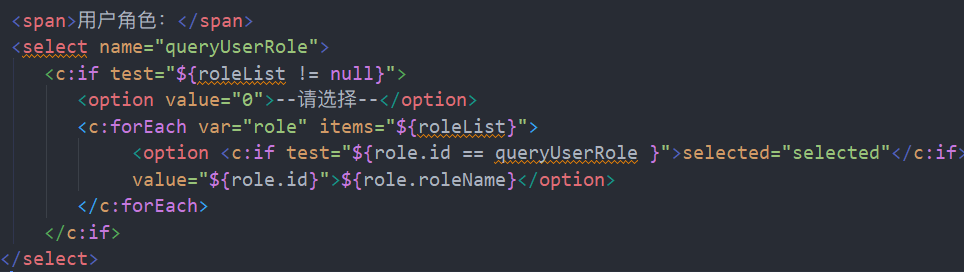

## SMBMS项目结构

### 业务功能结构


### 数据库结构


## 项目搭建

1. 搭建Maven项目

2. 配置Tomcat

3. 运行测试

4. 导入jar包

5. 创建包结构

   

6. 编写实体类

   ORM映射：类与表一一对应，字段与成员变量一一对应；

7. 编写基础公共类

   - 数据库配置文件

     ```java
     driver=com.mysql.cj.jdbc.Driver
     url=jdbc:mysql://localhost:3306/smbms?useUnicode=true&CharacterEncoding=utf-8
     username=root
     password=170312
     ```

   - 数据库公共类

   - 字符编码过滤器

8. 导入静态资源


## 功能实现

###  1. 登录与退出功能


1. 编写前端页面

2. 设置欢迎页。

   ```xml
   <welcome-file-list>
           <welcome-file>login.jsp</welcome-file>
   </welcome-file-list>
   ```

3. 编写用户登录接口

   ```java
   public interface UserDao
   ```

   1. 获取登录用户信息

      ```java
      public User getLoginUser(Connection connection, String userCode) throws SQLException;
      ```

      

4. 用户登录接口实现

   ```java
   public class UserDaoImp implements UserDao
   ```

   1.  获取登录用户信息

      ```java
      @Override
      public User getLoginUser(Connection connection, String userCode) throws SQLException {
          User user = null;
          if (connection != null) {
              PreparedStatement preparedStatement = null;
              ResultSet resultSet = null;
              String sql = "select * from smbms_user where userCode=?";
              Object[] params = {userCode};
              // 调用通用的查询方法
              resultSet = BaseDao.execute(connection, preparedStatement, resultSet, sql, params);
              // 遍历结果集
              if (resultSet.next()) {
                  user = new User();
                  user.setId(resultSet.getInt("id"));
                  user.setUserCode(resultSet.getString("userCode"));
                  user.setUserName(resultSet.getString("userName"));
                  user.setUserPassword(resultSet.getString("userPassword"));
                  user.setGender(resultSet.getInt("gender"));
                  user.setBirthday(resultSet.getDate("birthday"));
                  user.setPhone(resultSet.getString("phone"));
                  user.setAddress(resultSet.getString("address"));
                  user.setUserRole(resultSet.getInt("userRole"));
                  user.setCreatedBy(resultSet.getInt("createdBy"));
                  user.setCreationDate(resultSet.getDate("creationDate"));
                  user.setModifyBy(resultSet.getInt("modifyBy"));
                  user.setModifyDate(resultSet.getDate("modifyDate"));
              }
          }
          return user;
      }
      ```

5. 业务层接口

   ```java
   public interface userService
   ```

   1. 用户登录

      ```java
      public User login(String userCode, String userPassword);
      ```

6. 业务层接口实现

   ```java
   public class userServiceImp implements userService
   ```

   > 业务层调用dao层，引入dao层
   >
   > ```java
   > // 业务层要调用Dao层，需要引入
   > private UserDao userDao;
   > 
   > public userServiceImp() {
   >     userDao = new UserDaoImp();
   > }
   > ```

   1. 用户登录

      ```java
      @Override
      public User login(String userCode, String userPassword) {
          Connection connection = null;
          User loginuser = null;
      
          try {
              connection = BaseDao.getConnection(); // 获取数据库连接
              loginuser = userDao.getLoginUser(connection, userCode); // 调用Dao层方法获取登录用户
          } catch (SQLException e) {
              e.printStackTrace();
          } finally {
              BaseDao.closeResources(connection, null, null); // 释放资源，只处理连接，其他的由dao层具体控制
          }
          return loginuser;
      }
      ```

7. 编写Servlet

   > 控制层调用业务层，从前端获取数据

   - 登录

   ```java
   public class LoginServlet extends HttpServlet {
       @Override
       protected void doGet(HttpServletRequest req, HttpServletResponse resp) throws ServletException, IOException {
           // 从前端页面获取请求的用户名和密码
           String userCode = req.getParameter("userCode");
           String userPassword = req.getParameter("userPassword");
   
           // 调用业务层获取数据库中的用户
           UserService userService = new UserServiceImp();
           User user = userService.login(userCode, userPassword);
   
           if (user != null) { // 查有此人
               // 将用户信息放入Session
               req.getSession().setAttribute(USER_Session, user);
               // 然后跳转到主页
               resp.sendRedirect("jsp/frame.jsp");
           } else { // 查无此人
               // 转发回到登录页面，并携带错误信息
               req.setAttribute("error", "用户名或密码不正确");
               req.getRequestDispatcher("login.jsp").forward(req, resp);
           }
       }
   
       @Override
       protected void doPost(HttpServletRequest req, HttpServletResponse resp) throws ServletException, IOException {
           doGet(req, resp);
       }
   }
   ```

   - 退出

   ```java
   public class LogoutServlet extends HttpServlet {
       @Override
       protected void doGet(HttpServletRequest req, HttpServletResponse resp) throws ServletException, IOException {
           // 移除userSession
           req.getSession().removeAttribute(Constants.USER_SESSION);
           // 返回登录页面
           resp.sendRedirect(req.getContextPath() + "/login.jsp");
       }
   
       @Override
       protected void doPost(HttpServletRequest req, HttpServletResponse resp) throws ServletException, IOException {
           doGet(req, resp);
       }
   }
   
   ```

8. 注册Servlet

   ```xml
   <servlet>
       <servlet-name>loginServlet</servlet-name>
       <servlet-class>com.sakura.servlet.user.LoginServlet</servlet-class>
   </servlet>
   <servlet-mapping>
       <servlet-name>loginServlet</servlet-name>
       <url-pattern>/login.do</url-pattern>
   </servlet-mapping>
   
   <servlet>
       <servlet-name>logoutServlet</servlet-name>
       <servlet-class>com.sakura.servlet.user.LogoutServlet</servlet-class>
   </servlet>
   <servlet-mapping>
       <servlet-name>logoutServlet</servlet-name>
       <url-pattern>/user/logout.jsp</url-pattern>
   </servlet-mapping>
   ```

> 当不通过登录页面也能进入主页时，就需要编写拦截器（过滤）

### 2.登录拦截

```java
public class SysFilter implements Filter {
    @Override
 public void init(FilterConfig filterConfig) throws ServletException {

    }

    @Override
    public void destroy() {

    }

    @Override
    public void doFilter(ServletRequest servletRequest, ServletResponse servletResponse, FilterChain filterChain) throws IOException, ServletException {
        HttpServletRequest request = (HttpServletRequest) servletRequest;
        HttpServletResponse response = (HttpServletResponse) servletResponse;
        User user = (User) request.getSession().getAttribute(Constants.USER_SESSION);
        if (null == user) {
            response.sendRedirect(request.getContextPath() + "/login.jsp");
        } else {
            filterChain.doFilter(request, response);
        }
    }
}
```

注册Filter

```xml
<filter>
    <filter-name>SysFilter</filter-name>
    <filter-class>com.sakura.filter.SysFilter</filter-class>
</filter>
<filter-mapping>
    <filter-name>SysFilter</filter-name>
    <url-pattern>/jsp/*</url-pattern>
</filter-mapping>
```


### 3、修改用户密码

> 实现Servlet复用，<a href="F:\GitProject\GitLearn\MarkDown\Ajax和Json\Ajax和Json学习笔记.md">知识涉及Json和Ajax</a>

1. 分析项目前端代码

   

   - 查看对应jsp文件

     

   - 查看对应的js文件

     

     

后端代码

> 业务实现都从最底层写起，Dao->Service->Servlet

3. UserDao接口添加方法

   ```java
   public int updatePwd(Connection connection,int id, String newPassword) throws SQLException;
   ```

4. UserDaoImp 实现新增方法

   对数据库中指定id的密码进行更新

   ```java
   @Override
   public int updatePwd(Connection connection, int id, String newPassword) throws SQLException {
       int result = 0;
       if(connection!=null){
           PreparedStatement preparedStatement = null;
           String sql = "UPDATE smbms_user SET userPassword=? WHERE id = ?;";
           Object[] params = {newPassword, id};
           result = BaseDao.execute(connection, preparedStatement, sql, params);
           BaseDao.closeResources(null, preparedStatement, null);
       }
       return result;
   }
   ```

5. UserService接口增加方法

   ```java
   public boolean updatePwd(int id, String newPassword);
   ```

6. UserServiceImp 实现新增方法

   获取连接并调用Dao层方法

   ```java
   @Override
       public boolean updatePwd(int id, String newPassword) {
           Connection connection = null;
           int result = 0;
           boolean flag = false;
   
           try {
               connection = BaseDao.getConnection();
               result = userDao.updatePwd(connection, id, newPassword);
               if (result > 0) {
                   flag = true;
               }
           } catch (SQLException e) {
               e.printStackTrace();
           } finally {
               BaseDao.closeResources(connection, null, null);
           }
           return flag;
       }
   ```

7. 编写Servlet

   通过请求中“method" 参数的值来判断调用哪个方法 实现Servlet复用

   ```java
   @Override
   protected void doGet(HttpServletRequest req, HttpServletResponse resp) throws ServletException, IOException {
       String method = req.getParameter("method");
       if (method.equals("savepwd") && method != null) {
           updatePwd(req, resp);
       } else if (method.equals("pwdmodify") && method != null) {
           pwdmodify(req, resp);
       }
   }
   
   @Override
   protected void doPost(HttpServletRequest req, HttpServletResponse resp) throws ServletException, IOException {
       doGet(req, resp);
   }
   ```

   - UpdatePwd（）方法，用于处理修改密码的请求

   ```java
   private void updatePwd(HttpServletRequest req, HttpServletResponse resp){
       String newpassword = req.getParameter("newpassword");
       Object o = req.getSession().getAttribute(Constants.USER_SESSION);
       boolean flag = false;
       if (o != null && newpassword != null && newpassword.length() != 0) {
           UserService userService = new UserServiceImp();
   
           flag = userService.updatePwd(((User) o).getId(), newpassword);
   
           if (flag) {
               req.setAttribute("error", "密码修改成功,请重新登录");
               req.getSession().removeAttribute(Constants.USER_SESSION);
   
           } else {
               req.setAttribute(Constants.MESSAGE, "密码修改失败");
           }
       } else {
           req.setAttribute(Constants.MESSAGE, "新密码输入有误");
       }
       try {
           if (flag == false) {
               req.getRequestDispatcher("/jsp/pwdmodify.jsp").forward(req, resp);
           } else{
               req.getRequestDispatcher("/login.jsp").forward(req, resp);
           }
       } catch (ServletException e) {
           e.printStackTrace();
       } catch (IOException e) {
           e.printStackTrace();
       }
   }
   ```

   - pwdmodify()方法来处理，Ajax的异步请求

   将响应结果存放在Map中，使用fastJSON工具类将其转换为json字符串响应回客户端。

   ```java
   private void pwdmodify(HttpServletRequest req, HttpServletResponse resp){
           Object o = req.getSession().getAttribute(Constants.USER_SESSION);
           String oldpassword = req.getParameter("oldpassword");
           HashMap<String, String> result = new HashMap<>();
   
           if (o == null) {
               result.put("result", "sessionerror");
           } else if (oldpassword == null || oldpassword.length() == 0) {
               result.put("result", "error");
           } else {
               String userPassword = ((User) o).getUserPassword();
               if (userPassword.equals(oldpassword)) {
                   result.put("result", "true");
               } else {
                   result.put("result", "false");
               }
           }
   
           String data = JSONArray.toJSONString(result);
           try {
               resp.setContentType("application/json");
               PrintWriter writer = resp.getWriter();
               writer.print(data);
               writer.flush();
               writer.close();
           } catch (IOException e) {
               e.printStackTrace();
           }
       }
   ```

8. 注册Servlet

   ```xml
   <servlet>
       <servlet-name>UserServlet</servlet-name>
       <servlet-class>com.sakura.servlet.user.UserServlet</servlet-class>
   </servlet>
   <servlet-mapping>
       <servlet-name>UserServlet</servlet-name>
       <url-pattern>/jsp/user.do</url-pattern>
   </servlet-mapping>
   ```


### 4、用户管理


1. 分析前端页面

了解到前端需要我们准备好**用户列表**，**角色列表**，**以及查询结果数**

且查询请求时会向后端传递用户名、角色名、当前页等参数。


2. UserDao

   - 查询用户数

     ```java
     public int getUserCount(Connection connection,String userName, int roleId) throws SQLException;
     ```

   - 查询用户列表

     ```java
     public List<User> getUserList(Connection connection, String username, int roleid, int currentPageNo, int pageSize) throws SQLException;
     ```

3. UserDaoImp

   > 因为查询是动态查询，查询的方式有多种，所以需要使用SQL语句拼接

   - 查询用户数

     ```java
     @Override
     public int getUserCount(Connection connection, String userName, int roleId) throws SQLException {
         int count = 0;
         if (connection != null) {
             PreparedStatement preparedStatement = null;
             ResultSet resultSet = null;
             StringBuffer sqlbf = new StringBuffer("select count(1) as 'usercount'\n" +
                     "from smbms_user u,smbms_role r\n" +
                     "where u.userRole = r.id");
             List<Object> paramList = new ArrayList<>(); // 存放参数
     
             // 根据传递参数的情况来拼接sql和调整参数
             if (userName != null) {
                 sqlbf.append(" and u.userName like ?");
                 paramList.add("%"+ userName +"%"); // 使用模糊查询
             }
             if (roleId > 0) {
                 sqlbf.append(" and r.id=?");
                 paramList.add(roleId);
             }
             String sql = sqlbf.toString();
             Object[] params = paramList.toArray();
             resultSet = BaseDao.execute(connection, preparedStatement,resultSet, sql, params);
             if (resultSet.next()) {
                 count = resultSet.getInt("usercount");
             }
             BaseDao.closeResources(null, preparedStatement, resultSet);
         }
         return count;
     }
     ```

   - 查询用户列表，并使用分页

     > MySQL中查询结果分页可使用limit m，n（m代表要显示查询结果的起始号，n为页面大小）
     >
     > 举个栗子：若查询结果有14条，
     >
     > 第一页 limit 0，5就是显示从0号开始的接下来五条数据，
     >
     > 第二页 就是limit 5，5 ...    m = （当前页数-1）*pageSize 
     >
     > 方法中将limit的两个参数设置为外部传入，用于实现分页系统

     ```java
     @Override
     public List<User> getUserList(Connection connection, String userName, int roleId, int currentPageNo, int pageSize) throws SQLException {
         List<User> userList = new ArrayList<>();
         if (connection != null) {
             PreparedStatement preparedStatement = null;
             ResultSet resultSet = null;
             StringBuffer sqlbf = new StringBuffer("select *\n" +
                     "from smbms_user u,smbms_role r\n" +
                     "where u.userRole = r.id");
             List<Object> paramList = new ArrayList<>(); // 存放参数
     
             // 根据传递参数的情况来拼接sql和调整参数
             if (userName != null) {
                 sqlbf.append(" and u.userName like ?");
                 paramList.add("%"+userName+"%"); // 使用模糊查询
             }
             if (roleId > 0) {
                 sqlbf.append(" and r.id=?");
                 paramList.add(roleId);
             }
     
             // 使用limit分页
             // 0,5  显示 0，1，2，3，4
             // 5,5  显示 5，6，7，8，9
             // ...
             // 当前页面为n,页面大小为x 则传递参数为 (n-1)*x和x
             sqlbf.append("\norder by u.id\n");
             sqlbf.append("limit ?,?");
             paramList.add((currentPageNo - 1) * pageSize);
             paramList.add(pageSize);
     
             String sql = sqlbf.toString();
             System.out.println(sql);
             Object[] params = paramList.toArray();
             resultSet = BaseDao.execute(connection, preparedStatement, resultSet, sql, params);
             while (resultSet.next()) {
                 User user = new User();
                 user.setId(resultSet.getInt("id"));
                 user.setUserCode(resultSet.getString("userCode"));
                 user.setUserName(resultSet.getString("userName"));
                 user.setGender(resultSet.getInt("gender"));
                 user.setBirthday(resultSet.getDate("birthday"));
                 user.setPhone(resultSet.getString("phone"));
                 user.setUserRole(resultSet.getInt("userRole"));
                 user.setUserRoleName(resultSet.getString("roleName"));
                 userList.add(user);
             }
             BaseDao.closeResources(null, preparedStatement, resultSet);
         }
         return userList;
     }
     ```

   

   4. UserService

      - 查询用户数

      ```java
      public int getUserCount(String username, int roleid);
      ```

      - 查询用户列表

      ```java
      public List<User> getUserList(String username, int roleid, int currentPageNo, int pageSize);
      ```

   5. UserServiceImp

      - 查询用户数

      ```java
      @Override
      public int getUserCount(String username, int roleid) {
          Connection connection = null;
          int count = 0;
      
          try {
              connection = BaseDao.getConnection();
              count = userDao.getUserCount(connection, username, roleid);
          } catch (SQLException e) {
              e.printStackTrace();
          } finally {
              BaseDao.closeResources(connection, null, null);
          }
      
          return count;
      }
      ```

      - 查询用户列表

      ```java
      @Override
      public List<User> getUserList(String username, int roleid, int currentPageNo, int pageSize) {
          Connection connection = null;
          List<User> userListt = null;
      
          System.out.println("username = " + username);
          System.out.println("roleid = " + roleid);
          System.out.println("currentPageNo = " + currentPageNo);
          System.out.println("pageSize = " + pageSize);
      
          try {
              connection = BaseDao.getConnection();
              userListt = userDao.getUserList(connection, username, roleid,currentPageNo,pageSize);
          } catch (SQLException e) {
              e.printStackTrace();
          } finally {
              BaseDao.closeResources(connection, null, null);
          }
      
          return userListt;
      }
      ```

   ---

> 不同的实体类创建各自的包，方便管理和维护

2. RoleDao

   - 查询角色列表

     ```java
     public List<Role> getRoleList(Connection connection) throws SQLException;
     ```

3. RoleDaoImp

   - 查询角色列表

     ```java
     @Override
     public List<Role> getRoleList(Connection connection) throws SQLException {
         List<Role> roleList = new ArrayList<>();
         if (connection != null) {
             PreparedStatement preparedStatement = null;
             ResultSet resultSet = null;
             String sql = "select *\n" +
                     "from smbms_role;";
             Object[] params = {};
             resultSet = BaseDao.execute(connection, preparedStatement, resultSet, sql, params);
     
             while (resultSet.next()) {
                 Role _role = new Role();
                 _role.setId(resultSet.getInt("id"));
                 _role.setRoleCode(resultSet.getString("roleCode"));
                 _role.setRoleName(resultSet.getString("roleName"));
                 roleList.add(_role);
             }
             BaseDao.closeResources(null, preparedStatement, resultSet);
         }
         return roleList;
     }
     ```

4. RoleSevice

   ```java
   public List<Role> getRoleList();
   ```

5. RoleServiceImp(注意引入RoleDao)

   ```java
   @Override
   public List<Role> getRoleList() {
       Connection connection = null;
       List<Role> roleList = new ArrayList<>();
       try {
           connection = BaseDao.getConnection();
           roleList = roleDao.getRoleList(connection);
       } catch (SQLException e) {
           e.printStackTrace();
       } finally {
           BaseDao.closeResources(connection, null, null);
       }
       return roleList;
   }
   ```


> 现在我们的用户列表、用户数、角色列表都已经处理完成
>
> 我们将他们整合到一个Servlet中

6. 编写Servlet
   - 分析一下前端的代码


这里依旧和上次一样，隐藏域中传递了一个method参数所以我要在UserServlet中添加新方法

```java
private void queryUsers(HttpServletRequest req, HttpServletResponse resp) {
    String queryUserName = req.getParameter("queryUserName");
    String queryUserRole = req.getParameter("queryUserRole");
    String pageIndex = req.getParameter("pageIndex");
    int roleId = 0;
    int currentPageNo = 1;
    int pageSize = 4;
    int totalCount = 0;

    // 解析前端的参数
    if (queryUserName == null) {
        queryUserName = "";
    }
    if (queryUserRole != null) {
        roleId = Integer.parseInt(queryUserRole);
    }
    if (pageIndex != null) {
        currentPageNo = Integer.parseInt(pageIndex);
    }

    UserService userService = new UserServiceImp();
    RoleService roleService = new RoleServiceImp();
    // 获取用户总数
    totalCount = userService.getUserCount(queryUserName, roleId);

    PageSupport pageSupport = new PageSupport();
    pageSupport.setPageSize(pageSize);
    pageSupport.setTotalCount(totalCount);
    pageSupport.setCurrentPageNo(currentPageNo);
    int totalPageCount = pageSupport.getTotalPageCount();

    if (currentPageNo < 1) { // 小于第一页
        currentPageNo = 1;
    } else if (currentPageNo > totalPageCount) {  // 大于最后一页
        currentPageNo = totalPageCount;
    }

    List<User> userList = userService.getUserList(queryUserName, roleId, currentPageNo, pageSize);
    List<Role> roleList = roleService.getRoleList();

    req.setAttribute("userList", userList);
    req.setAttribute("roleList", roleList);
    req.setAttribute("queryUserName", queryUserName);
    req.setAttribute("queryUserRole", queryUserRole);
    req.setAttribute("totalCount", totalCount);
    req.setAttribute("currentPageNo", currentPageNo);
    req.setAttribute("totalPageCount", totalPageCount);

    try {
        req.getRequestDispatcher("/jsp/userlist.jsp").forward(req, resp);
    } catch (ServletException e) {
        e.printStackTrace();
    } catch (IOException e) {
        e.printStackTrace();
    }
}
```

- 简单分析前端做了那些事情

> 当我们点击用户管理时会自动进行一次查询且没有其他参数。
>
> 
>
> 然后执行一次Servlet跳转到userlist.jsp
>
> 将请求中携带的角色列表添加到页面的下拉框中
>
> 
>
> 并将用户列表动态添加到页面中，
>
> 
>
> 
>
> 后端传入的 页面总数，当前页面数，数据条数，作为参数传到rollpage.jsp
>
> rollpage.jsp
>
> 
>
> 可以看到，我们每次点击一次上一页 都会执行一次page_nav()函数
>
> 来看看这个函数
>
> 
>
> 而调用这个函数时的两个参数分别为：document.forms[0]，页数。而这个document是指当前页面，form[0]表示当前页面的第一个表单即
>
> 
>
> 函数体中提到的index：（默认为1的隐藏域，代表所在页面。）
>
> 
>
> 所以分页在这里的实现原理就是 ：
>
> 每点下“下一页/上一页” 就将表单的pageindex加一或者减一 然后将表单重新提交，然后在Dao层进行一次分页查询。


## 用户增删改

> 注意：所有的增删改都要处理事务，如果失败就回滚，否则会影响数据一致性。