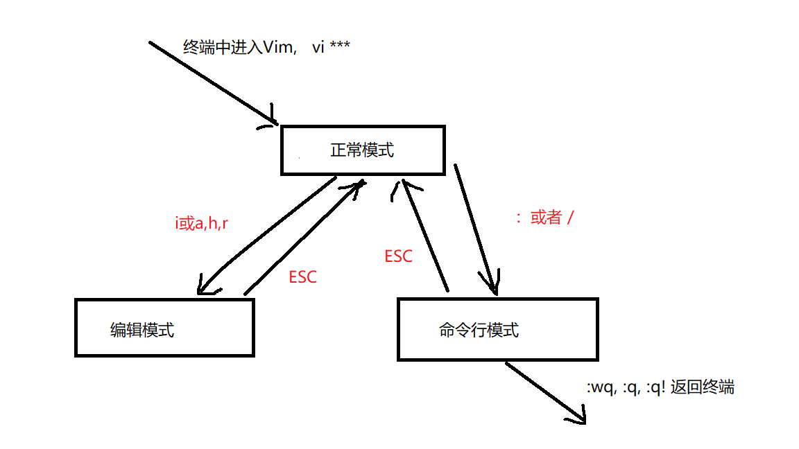
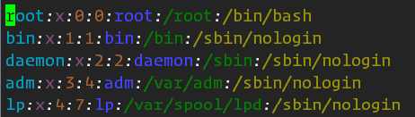
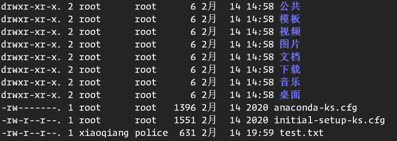
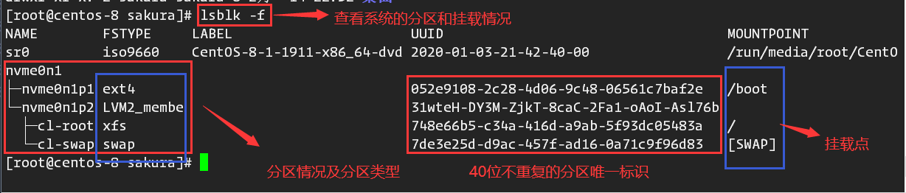
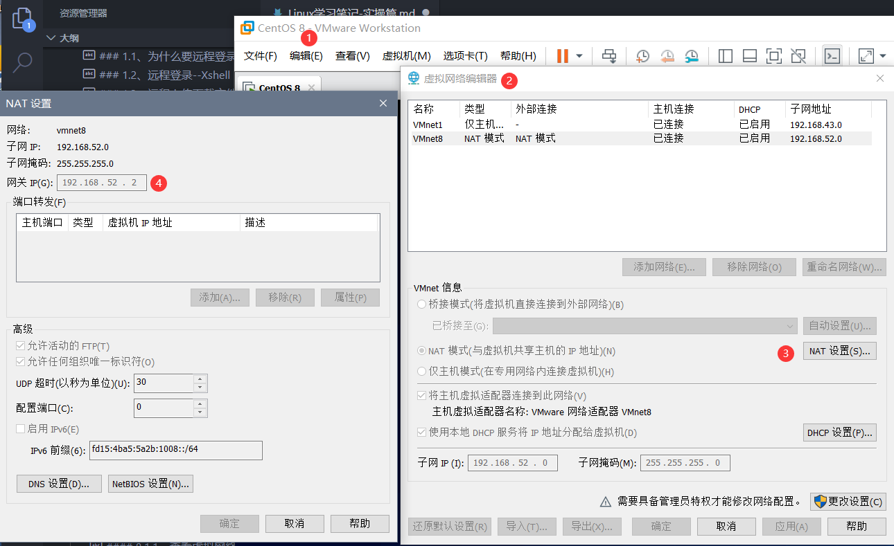
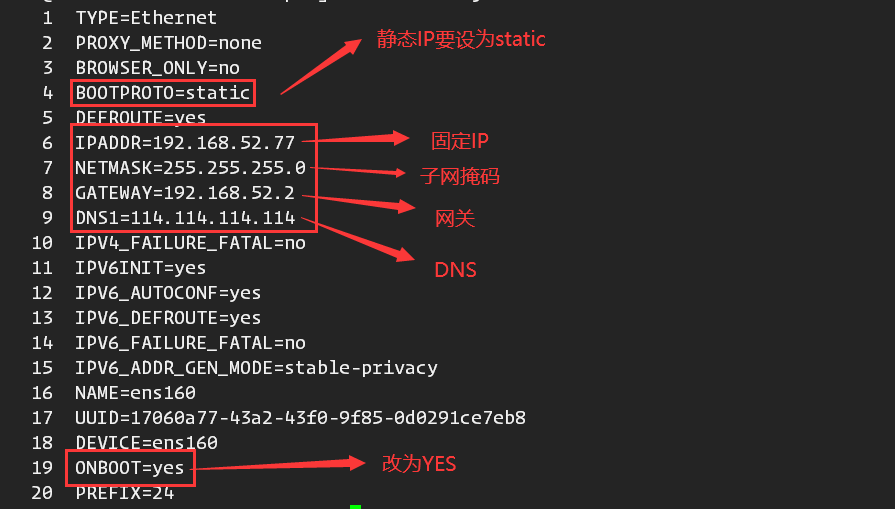
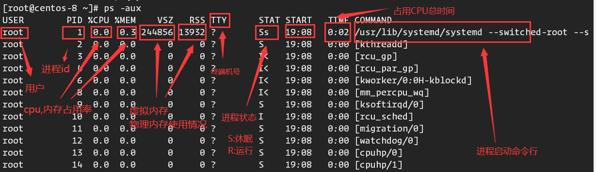
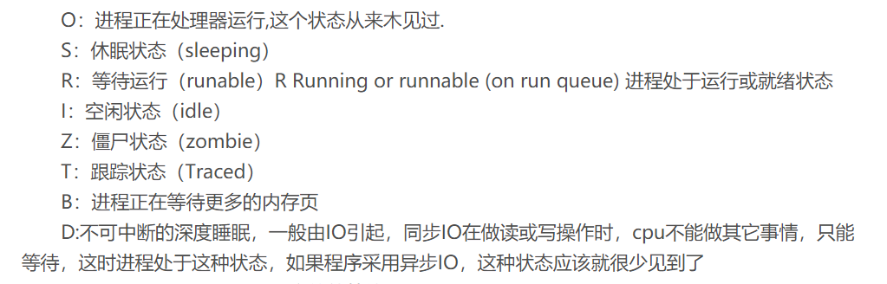
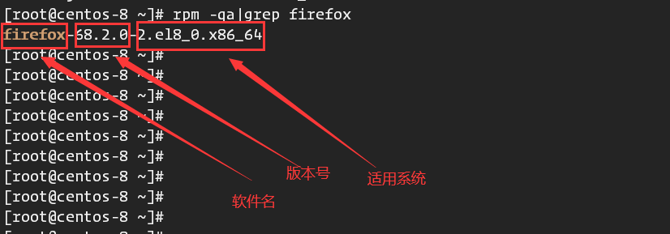
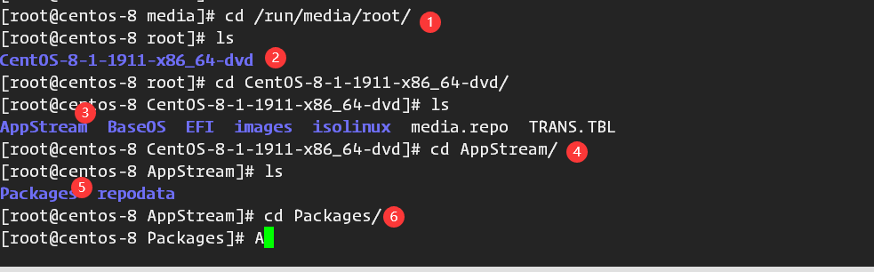

# Linux-实操篇

## 1、远程登陆Linux服务器

### 1.1、为什么要远程登录Linux

- 实际工作时，开发人员开发时所使用的服务器并不存在于开发机上，而是在另一台主机上，此时就需要远程连接，同时不再使用可视化界面。
- linux服务器是开发小组共享的，且正式上线的项目是运行在公网的。因此需要远程登录对项目进行管理或者开发。
- 远程登录需要用到一个软件**Xshell**，远程文件上传**XFtp**
- 注意：如果需要远程连接，Linux要启动**SSHD服务**，该服务会监听**22号接口**，等待远程连接。

### 1.2、远程登录--Xshell

1. Terminal中执行`ifconfig`，获取IP
2. Xshell新建会话，填好主机IP，接口检查是否为22，协议为SSH

### 1.3、远程上传下载文件--Xftp

1. 与Xshell建立连接相同，并选择SFTP服务。

## 2、Vi和Vim编辑器

### 2.1、Vi和Vim基本介绍

- Vi是文本编辑器，而Vim还具有程序编辑的能力（关键字高亮，代码补全，编译及错误跳转等功能），可视为Vi的增强版，在程序员中被广泛使用。

### 2.2、三中常用模式

- **正常模式**：

    > 正常模式下可以使用快捷键，复制粘贴文本，可以上下左右移动光标。
- **插入模式/编辑模式**：

    > 按下**I,O,A,R**中任何一个键（常用i）后会进入编辑模式，程序员可以输入内容
- **命令行模式**：

    > 可以提供相关指令，完成读取、存盘、替换、退出、显示行号等动作。

### 2.3、使用案例

- 使用Vim写一个Hello.java程序，并保存。
- vim *** 进入Vim编辑器
- 三种模式切换
  - :wq  写入并退出（保存）
  - :q 退出
  - :q! 强制退出不保存

### 2.4、快捷键（普通模式下）

- yy复制当前行 按p粘贴  或者 5yy 复制当前行起下面5行
- dd删除当前行 5dd删除当前行起下面5行
- 命令模式下  `:set nu` 显示行号
- G 到文档最末行 gg 到文档首行
- 撤销动作 u
- 剪切 x 粘贴 p

## 3、用户管理

### 3.1、用户，组，Home目录

- root用户为最高权限拥有者
- 普通用户可以按需求分为若干个用户组
- 每个用户的家目录相互独立，在登录时会自动切换为对应的家目录，用户创建成功后，会自动创建与用户同名的家目录

### 3.2、用户管理操作

- 添加用户： 命令:`useradd [可选项] 用户名`，不加组信息时，会默认创建一个与用户同名的组。
- 修改用户密码：命令：`passwd 用户名`
- 删除用户：命令`userdel 用户名` (但不会删除家目录)
  - `userdel -r 用户名`（同时删除家目录!）

### 3.3、查询用户信息

- 命令:`id 用户名`

### 3.4、切换用户

- 命令`su - 用户名`
- 当用户权限不够时，可以通过切换到高权限用户来完成操作
- 返回原用户：命令`exit`
- 查看当前用户：whoami

### 3.5、用户组详细介绍

> 用户组类似角色，系统可以对有共性的多个用户进行统一的管理

#### 3.5.1、增加/删除组

> 增加组命令：`groupadd 组名`, 
> 删除组命令：`groupdel 组名`
---
> 添加用户到指定组：`useradd -g 组名 用户名` 
> 修改用户的组：`usermod -g 新组名 用户名`

### 3.6、用户和组的相关文件

- 用户配置文件：/etc/passwd
  
  - 行含义：**用户名:加密的密码:用户uid:组id:组名:家目录:shell**
- 组配置文件：/etc/group
- 口令（密码）配置文件：/etc/shadow

---

## 4、实用指令

### 4.1、指定运行级别

> Linux共设有7个运行级别：

- 0： 关机
- 1：单用户（找回丢失密码）
- 2：多用户无网络服务
- **3：多用户有网络服务**（使用最多）
- 4：保留
- 5：图形界面
- 6：重启

> 系统的运行级别配置文件：/etc/inittab

- 切换到指定运行级别的指令: `init 0~6`

#### (面试题) 找回root密码(centos6)

1. 进入单用户模式

    - 开机引导时，按 `enter`
    - 进入引导界面，按`e`进入 第二个内核编辑选项
    - 在末尾加空格输入`1` 回车退出
    - 按`b`引导进入单用户模式
    - 进入单用户模式

2. 然后使用`passwd`指令修改root密码

### 4.2、帮助指令

> 当对某个指令不熟悉时，我们可以使用帮助指令来了解指令的使用方法

1. `man` 获得帮助信息

    - 语法: `man 指令`

2. `--help`帮助指令

### 4.3、文件目录类指令

1. **`pwd`** 显示当前工作目录的绝对路径
2. **`ls`** 显示当前工作目录下所有可见文件
    - **`-a`** 显示包括隐藏文件(以.开头的)
    - **`-l`** 详细显示工作目录下文件信息
3. **`cd`** 工作目录切换
4. **`mkdir`** 创建目录
    - **`-p`** 创建多级目录
5. **`rmdir`** 删除空目录
    - **`-p`** 层级递归删除目录，若目录删除后，其父目录也为空，一并删除
6. **`touch`** 创建空文件,可以同时创建多个文件
7. **`cp`** 复制
    - **`-f`**覆盖已经存在的目标文件而不给出提示。
    - **`-r`** 若给出的源文件是一个目录文件，此时将复制该目录下所有的子目录和文件。
8. **rm** 删除文件
    - **`-r`** 层级递归删除文件，包括目录。
    - **`-f`** 删除文件且不给出提示。
    - **`-rf`** 强制删除（目录下）所有文件，包括当前目录
9. **`mv`** 文件移动/重命名
    - 若两个参数在同一路径下，则重命名文件
    - 若不在同一目录，则移动文件
10. **`cat`** 查看文件而无法修改
    - **`-n`** 显示行号
11. **`more，less`** 查看文件 常用less查看大型文件
12. '**`>`**'指令 '**`>>`**'指令
    - **`>`** 为覆盖写，**`>>`**为追加写
    - **`cat file1 > file2`** 将文件1的内容覆盖到文件2中
    - **`echo "..">>文件`** 将内容追加到文件中
13. **`echo`** 输出内容到控制台
    - **`echo $PAHT`** 输出环境变量路径到控制台
    - **`echo "内容`"** 把内容输出到控制台
14. **`head`** 用于显示文件的开头内容，默认情况显示文件前10行
    - **`head -n`** 查看文件的前n行
15. **`tail`** 用于输出文件尾部内容，默认最后10行
    - **`tail -n`** 查看文件最后n行
    - **`tail -f`** 实时追踪文档的所有更新和工作（ctrl+c退出）
16. **`ln`** 软链接也叫符号链接，类似与Windows中的快捷方式,主要存放了其他文件的路径his
    - **`ln -s 原文件目录 软链接名`**
    - **`rm -rf 软链接名`**删除软链接
17. **`history指令`**:默认查看已经执行过的历史指令
    - **`history n`** 查看最近执行的n条命令
    - **`!n`** 执行历史编号为n的命令

### 4.4、时间日期类指令

1. **date**指令
   - **date**：显示当前时间
   - **date "+%Y"** 显示当前年份
   - **date "+%m"** 显示月份
   - **date "+%d"** 显示当前为几号
   - **date "+%Y-%m-%d %H:%M:%S"** 完整显示时间(间隔符号可自定)
   - **date -s 字符串时间** 设置系统时间

2. **cal指令** 查看当前日历
   - **cal 2020** 显示2020年日历

### 4.5、搜索查找类指令

1. **find指令** 从指定目录下递归地遍历其各个子目录，将满足条件的文件或者目录显示在终端
   - **find** [搜索范围] [选项]
        - **-name 文件名** 在范围内按名查找文件(支持通配符) 例如查找.txt文件:*.txt
        - **-user 用户名** 按用户名查找
        - **-size 条件**  例如 +20M:大于20M -10M:小于10M 5M:等于5M

2. **locate指令** 快速定位文件路径（数据库实现快速定位，查询速度快）
   - **locate 文件名** 实现定位
   - 由于locate是基于数据库实现查询，**第一次使用时必须使用updatedb创建locate数据库**。

3. **grep指令和管道符号‘|’**
- grep过滤查找，管道符“|”，表示将前一个命令的处理结果传递给后面的命令处理
    - 语法：grep [选项] 查找内容 源文件
        - -m 显示匹配行及行号
        - -i 忽略字母大小写

### 4.6、压缩和解压缩类指令

1. **`gzip/gunzip指令`** 分别用于压缩和解压文件
- `gzip 文件`：将文件压缩成.gz文件（原文件不保留）
    - `gunzip 文件.gz`：解压.gz文件（压缩文件不保留）
    
2. **`zip/unzip指令`**

    - `zip [选项]XXX.zip 要压缩的内容（压缩文件和目录）`
      - -r递归压缩 即压缩目录
    - `unzip [选项]XXX.zip 解压文件`
      - -d 目录 :指定解压后文件存放目录

3. **`tar指令`** 打包指令，最后的打包文件是.tar.gz文件

    - tar [选项] XXX.tar.gz 打包内容 （打包目录）
        - -c 产生tar打包文件
        - -v 显示详细信息
        - -f 指定压缩后的文件名
        - -z 打包同时压缩
        - -x 解包.tar文件
    - **`tar -zcvf XXX.tar.gz XX.xx XX.xx...`** 常用打包
    - **`tat -zxvf xxx.tar.gz [目录]`** 常用解包 默认解压到当前目录

## 5、组管理与权限管理（难重点）

### 5.1、Linux组的基本介绍

> Linux中的每个用户必须属于一个组，不能独立与组外，在**Linux中每个文件都有所有者，所在组，其他组的概念**
    - 所有者
    - 所在组
    - 其他组
    - 改变用户所在的组

#### 5.1.1、文件/目录所有者

- 查看所有者指令：ls -ahl
- 修改所有者指令: **`chown 用户名 文件名`**

#### 5.1.2、文件所在组

- 修改文件所在组：**`chgrp 组名 用户名`**

#### 5.1.3、其他组

- 除文件的所有者和所在组的用户外，系统封的其他用户都是文件的其他用户。

### 5.2、权限

#### 5.2.1、文件详细信息解读（重要）

> 最前面那串字符的含义为：

- (1)文件类型
  - -：普通文件
  - d: 目录
  - l: 软链接
  - c: 字符设备(键盘鼠标)
  - b: 块文件(硬盘)

- (2,3,4)所有者对文件的权限 依次为r,w,x,没有则为-
- (4,5,6)文件的所在组对文件的权限 也依次为 r,w,x
- (7,8,9)文件的其他组对文件的权限 同上
- (10)数字
  - 如果是文件，表示硬链接的个数
  - 如果是目录，表示子目录个数(包含.和..)

#### 5.2.2、rwx权限详解

- **用数字可以表示为r:4,w:2,x:1**

> rwx作用到文件

- r:代表可读，可以读取查看
- w:代表可写，但不一定就能删除文件，前提是对该文件的所在目录有写的权限。
- x:代表可执行(execute)

> rwx作用到目录

- r:代表可以读取查看目录内容
- w:代表可以修改，包括目录下的创建与删除，目录的重命名
- x:代表可以进入该目录

#### 5.3、权限管理

 > 修改文件权限：通过**chmod**指令，可以修改对文件或目录的权限

1. +、-、=变更权限（u：所有者、 g：所有组、o：其他人、a：所有人）
- chmod u=rwx,g=rx,o=x 文件/目录名
   - chmod o+w 文件/目录名
   - chmod a-x 文件/目录名
   
2. 通过数字更改权限（**`r:4,w:2,x:1`**）

    - chmod 755 文件/目录名

> **修改文件所有者**

- **chown newowner:newgroup 文件名** 修改文件所有者及所在组
- -R 如果是目录，则递归至目录下所有文件。

## 6、任务调度

> 将写好的用于完成任务的脚本/代码交给Linux,可以通过配置crontab定时调度

- **`crond`** 任务调度
  - contab进行定时任务的设置
  - 任务调度分类:
    1. 系统工作：有些重要的工作必须周而复始的执行。
    2. 个别用户工作：个别用户可能希望执行某些程序，比如 对数据库的备份。
  - 使用语法：**`crontab [选项]`**
    - **`-e`** 编辑crontab定时任务
    - **`-l`** 查询任务
    - **`-r`** 删除当前用户的所有crontab任务
    - **`serveice crond restart`** 重启任务调度

- 使用步骤：
    1. **`crontab -e`** 编辑定时任务
    2. 例如 */1**** ls /home >> /home/test.txt 每一分钟执行 ls /home >> /home/test.txt
    3. 退出并保存，任务生效
    > 参数细节说明:

    |参数|含义|范围|
    |--|--|--|
    |第一个 * |一小时的第几分钟|0~59|
    |第二个 * |一天的第几个小时|0~23|
    |第三个 * |一个月的第几天|1~31|
    |第四个 * |一年的第几月|1~12|
    |第五个 * |一周的星期几|0~7（0和7都表示星期日）|

    |特殊符号|含义及用法|
    |--|--|
    |*|代表任何时间，例如 ***** 代表任务设置后每一分钟都执行命令|
    |，|代表不连续的时间，比如 0 8,12,16 *** 表示每天的8点，12点，16点执行一次命令|
    |-|代表连续时间段，比如0 5 * * 1-6 表示星期一到星期六的每天凌晨五点执行一次命令|
    |*/n|代表每隔多久执行一次，*/10 **** 每隔10分钟执行一次命令|

- 使用实例

1. 在/home/sakura/ 目录下创建mytest.sh文件并添加可执行权限
2. mytest.sh文件内容: **date >> /home/sakura/mytest.txt**
3. crontab -e 添加任务  */1**** /home/sakura/mytest.sh
4. 退出保存，crontab -l查看是否创建任务成功

## 7、磁盘分区介绍

### 7.1、分区基础知识

- 分区方式

    > mbr分区
    1. 最多支持四个主分区
    2. 系统只能安装在主分区
    3. 扩展分区要占用一个主分区
    4. 最大只支持2TB,兼容性好

    > gtp分区
    1. 支持无限多个主分区（但操作系统可能限制）
    2. 最大支持18EB的容量（1EB=1024PB，1PB=1024TB）
    3. windows7 64位以后支持gtp

- 查看分区和挂载情况:`lsblk -f`
  

### 7.2、硬盘说明

> linux硬盘分为IDE硬盘和SCSI硬盘,目前多为SCSI硬盘

- IDE硬盘驱动标识为"hdx~",hd为分区所在硬盘类型即IDE,x为盘号（a:基本盘，b：基本从属盘，c：辅助主盘），~分区号，前四个分区用1~4标示，是主分区或扩展分区，5开始为逻辑分区。例如hda3:表示第一个IDE硬盘上的第三个主分区或扩展分区

- 对于SCSI硬盘标识则为"sdx~"，其他与IDE硬盘表示方法一样。

---

### 7.3、添加一块硬盘

1. 虚拟机添加硬盘（SCSI）
2. 分区fdisk /dev/sdb 开始分区后先输入n新增分区，然后选择p,类型为主分区。两次回车默认剩余全部空间，最后w写入分区并退出，若不报存输入q;
3. 格式化  mkfs -t ext4 /dev/sdb1
4. 挂载  mount /dev/sdb1 挂载目录 （临时挂载）
5. 设置自动挂载（重启依旧有效）**`vim /etc/fstab`** 添加一行 /dev/sdb1  目录名 然后保存退出，执行mount -a即可

- 卸载：umount 设备名 挂载目录

### 7.4、磁盘查询实用指令

1. `df -h` 查询系统整体磁盘使用情况
2. **`du -ach --max-depth=子目录深度 目录`** 查询指定目录磁盘占用情况
3. **`ls -l /home |grep "^-"|wc -l`** 统计/home目录下的文件个数
4. **`ls -lR /home |grep "^-"|wc -l`**统计/home目录下的文件个数（包括子文件夹中的）
5. **`tree 目录名`**树状目录显示目录结构 ：先安装tree指令 `yum install tree`

## 8、网络配置

### 8.1、查看网络IP和网关（ifconfig）

#### 8.1.1、查看虚拟网络编辑器

> `编辑`-->`虚拟网络编辑器`

#### 8.1.2、修改ip地址(修改虚拟网卡IP地址)

> 在虚拟网络编辑器中以管理员身份可以修改

#### 8.1.3、查看网关

### ping测试主机之间的网络联通

- `ping 目的主机`（测试当前服务器是否可以连接目的主机）

### 网络环境配置

1. 自动获取

    > 缺点:linux开启自动获取ip,每次启动获取的ip地址可能不一样。不适合用于做服务器，因此需要固定ip。

2. 指定固定IP

- 直接修改文件来指定IP
- vim /etc/sysconfig/network-scripts/ifcfg-网卡名
- NOBOOT参数改为YES,BOOTPROTO参数改为static,DNS与网关一致即可
- 
- 重启网络服务`nmcli c reload`

## 9、进程管理

### 9.1、进程介绍与查询

#### 9.1.1 基本介绍

> 在Linux中，每个执行的程序（代码）都称为一个进程，每个进程都分配一个ID号。
>
> 每一个进程，都对应一个父进程，而这个父进程可以复制多个子进程。
>
> 每个进程都可能以两种方式存在：前台与后台。
>
> 一般系统的服务都是以后台进程的方式存在，常驻在系统中，直到关机才会结束。

#### 9.1.2 显示系统执行的进程

- `ps`命令:用于查看当前系统中，有哪些正在执行，以及他们执行的状况。
  - `-a`：显示当前终端的所有进程信息
  - `-u`：以用户的格式显示进程信息
  - `-x`：显示后台进程运行的参数
  - `-ef`：显示其父进程号PPID

- `pstree`:查看进程树
  - `-p` 显示进程PID
  - `-u` 显示进程所属用户

|字段|说明|
|--|--|
|PID|进程识别号|
|TTY|终端机号|
|TIME|此进程所消耗cpu时长|
|CMD|正在执行的命令或进程名|

### 9.2、终止进程Kill和Killall

- 基本语法:
  - `kill` [选项] 进程号
  - `killall` 进程名称 （支持通配符）

- 常用选项
  - -9 强制终止进程

### 9.3、服务管理

#### 9.3.1、介绍

> 服务（service）本质就是进程,但是运行在后台，通常监听某个端口,等待其他程序的请求,比如mysql,sshd等,因此又称守护线程。

#### 9.3.2、systemctl管理指令(融合了chkconfig和service)

- systemctl [start|stop|restart|reload|status] 服务名
- CentOS7.0以后，不再使用service 而是`systemctl`

- 通过`telnet指令`检查linux的某个端口是否再监听，并且可以访问:`telnet IP地址 端口`

- 查看服务名:
  1. `systemctl list-unit-files`列出所有启动文件
  2. 查看防火墙 `systemctl status firewalld`
  3. 查看防火墙状态 `firewall-cmd --state`
  4. 打开端口:**`firewall-cmd --add-port=端口号/tcp --permanent(永久打开)`**

#### 9.3.3、服务的运行级别（runlevel）

- 查看或修改默认级别： vi /etc/inittab

> Linux系统共有`7`种运行级别（**常用级别为3和5**）

- 运行级别0：系统停机状态。
- 运行级别1：单用户工作状态，root权限，用于系统维护，禁止远程登录
- 运行级别2：多用户状态（没有NFS）,不支持网络
- 运行级别3：完全的多用户状态（有NFS）,登录后静茹控制台命令行模式
- 运行级别4：系统未使用，保留
- 运行级别5：Xll控制台，登录后 进入图像GUI模式
- 运行级别6：系统正常关闭重启。

> 系统默认郧西级别**不能为0或6**,会导致不能正常启动!!

- 开机流程:

  - **开机 -> BIOS -> /boot -> init进程 -> 运行级别 -> 运行对应服务**

### 9.4、动态监控进程

- top命令与ps命令相似，都是用来显示正在执行的进程。不同之处在于top在执行一段时间可以更新正在运行的结果。

- 使用语法:**`top [选项]`**
  - **`-d`** 秒数n：指定top命令间隔n秒更新，默认为3秒（命令执行交互过程中，可以用s更改）
  - **`-i`** :不显示任何闲置或者僵死的进程
  - **`-p`**：通过指定监控进程ID来查看某个进程的状态

- 交互操作选项
  - **P** 按CPU使用率排序
  - **M** 按内存使用率排序
  - **N** 以PID排序
  - **k** 指定PID终止进程
  - **q** 退出top

### 9.5、查看系统网络情况`netstat`

- 使用语法:**`netstat [选项]`**
  - -an 按一定顺序排列输出
  - -p 显示哪个进程在调用

- **`netstat -anp|more`** 查看所有的网络服务
- **`netstat -anp|grep 服务名`** 查看指定服务的网络状态

## 10、RPM 和 YUM

### 10.1、RPM包的管理

> RPM(RedHat Package Manager)RedHat软件包管理工具,一种用于互联网下载包的打包及安装工具，生成.rpm扩展名的文件。

#### 10.1.1、rpm包额简单查询指令

- rpm -qa|grep xxx :查询已安装的rpm列表,或者指定包名

- **`rpm -q 软件包名`**：查询软件是否安装
- **`rpm -qi 软件包名`**：查询软件包信息
- **`rpm -ql 软件包名`**：查询软件包中的文件
- **`rpm -qf 文件全路径名`**：查询文件所属的软件包

#### 10.1.2、卸载rpm包

- 使用语法 **`rpm -e rpm包名`**（当其他软件包依赖此软件包时，加--nodeps可强制删除，不支持强制删除）

#### 10.1.3、安装rpm包

- 使用语法:**`rpm -ivh rpm包名`**
  - i(install) 安装
  - v(verbose) 提示
  - h(hash) 进度条

- 实例：安装firefox

- 先挂载iso文件，/run/media/root找到镜像文件,进入镜像文件/AppStream/Packages/目录下
- ls -l 输出显示要安装的包 并将其拷贝到/opt/目录
- 到/opt/目录下用指令安装

### 10.2、YUM(使用更多)

> Yum是一个`Shell前端软件管理包`，基于RPM包管理，能够从指定的服务器自动下载RPM包并且安装,`可以自动处理依赖关系`，一次性安装所有依赖的软件包。

#### 10.2.1、yum的基本指令(联网)

- `yum list|grep xx软件列表`:查询yum服务器是否又需要安装的软件
- `yum install xxx`：下载安装软件

