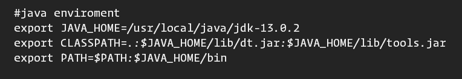
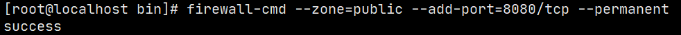
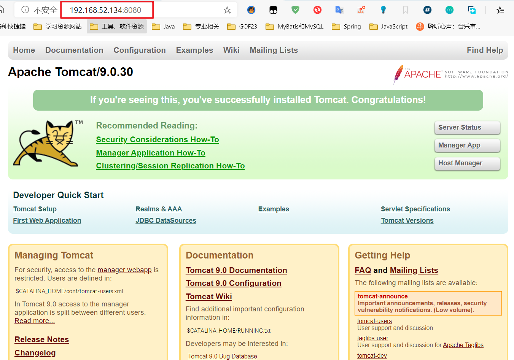

# Linux之拓展篇篇

## 1、搭建JavaEE开发环境

### 1.1、JDK安装与 环境变量配置

`rpm -qa|grep jdk`或者`java -version`查看是否已安装jdk

使用`rpm -e`进行一一删除。

然后进入jdkxx.rpm包所在目录

执行`rpm -ivh jdkxxx.rpm` 安装jdk

配置环境变量：

- 下载JDK,并解压到/usr/local/java/目录下
- 终端执行 vim /etc/profile 打开环境配置文件
- 在末尾加上jdk的参数变量

- 注销重启生效。

#### 1.1.1、测试jdk

- 编写一个hello.java
- javac hello.java 编译java文件，得到一个class文件
- java hello.class 运行

### 1.2、tomcat安装与配置

- 移动.tar.gz包到/opt/目录下并解压
- 进入tomcat/bin目录,执行startup.sh启动tomcat
- Linux本地浏览器可以访问，但windows下不能访问，需要开放端口
- 开放8080端口
- [开放端口操作参考](https://jingyan.baidu.com/article/5552ef4796f55e518efbc94f.html)

### 1.3、MySQL安装与配置

- [完整操作参考](https://blog.51cto.com/11261718/2465227)

## Tomcat安装

1. 解压 然后像windows上一样启动tomcat

2. 为了我们能 远程访问，需要开启8080端口

3. `systemctl status firewalld.service` 查看防火墙状态

4. `firewall-cmd --list-port`查看防火墙开发的端口信息，`firewall-cmd --list-port` 查看全部信息

5. 开启端口

   `firewall-cmd --zone=public --add-port=端口号/tcp --permanent`

    --zone：表示作用域

   --add-port：表示增加端口

   --permanent：表示永久有效

   

   重启防火墙

   `systemctl restart filewalld.service`

   然后我们就可以通过ip地址远程访问了。

   

   

   `firewall-cmd --zone=public --list-ports` 查看开放的端口

   

   
   
   

## 2、大数据之Shell编程

- 为什么学习Shell编程
    1. 在对服务器集群管理时,需要编写Shell程序来进行服务器管理。
    2. 对于JavaEE和Python程序员来说，工作需要。（例如定时备份数据库的脚本）
    3. 对于大数据程序员来说，需要编写Shell程序来管理集群

- 什么是Shell

> Shell是一个命令行解释器,它为瀛湖提供了一个向Linux内核发送请求以便运行程序的界面系统级程序，用户可以用Shell来启动，挂起，停止甚至是编写一些程序;

### 2.1、Shell脚本入门

> **`脚本格式要求`**

1. 脚本以**`#!/bin/bash开头`**
2. 脚本需要**`有可执行权限`**

> 脚本的常用执行方式

- `方式一`:（输入脚本的绝对/相对路径）
    1. 首先要赋予脚本可执行权限
    2. 执行脚本

- `方式二`:（sh+脚本）
  - 不用赋予脚本可执行权限，直接执行即可
