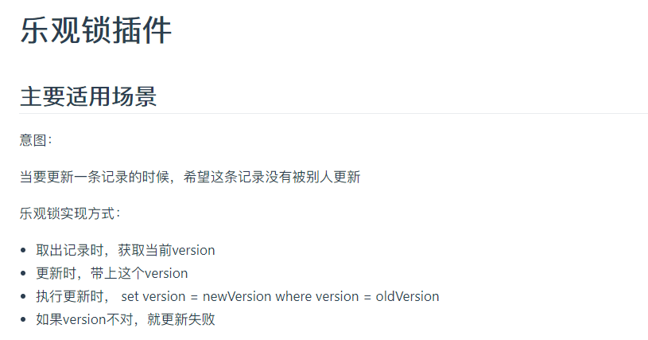
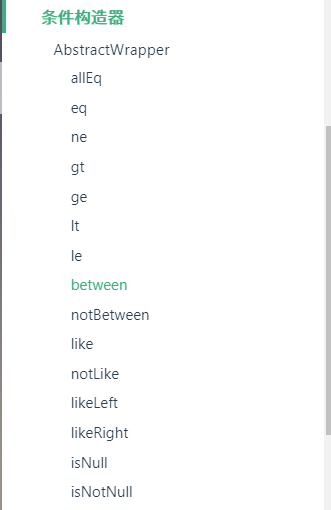
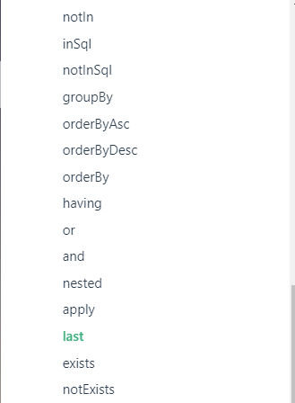

[toc]

# MyBatisPlus

## 了解

官网：https://mp.baomidou.com/


### 特性

- **无侵入**：只做增强不做改变，引入它不会对现有工程产生影响，如丝般顺滑
- **损耗小**：启动即会自动注入基本 CURD，性能基本无损耗，直接面向对象操作
- **强大的 CRUD 操作**：内置通用 Mapper、通用 Service，仅仅通过少量配置即可实现单表大部分 CRUD 操作，更有强大的条件构造器，满足各类使用需求
- **支持 Lambda 形式调用**：通过 Lambda 表达式，方便的编写各类查询条件，无需再担心字段写错
- **支持主键自动生成**：支持多达 4 种主键策略（内含分布式唯一 ID 生成器 - Sequence），可自由配置，完美解决主键问题
- **支持 ActiveRecord 模式**：支持 ActiveRecord 形式调用，实体类只需继承 Model 类即可进行强大的 CRUD 操作
- **支持自定义全局通用操作**：支持全局通用方法注入（ Write once, use anywhere ）
- **内置代码生成器**：采用代码或者 Maven 插件可快速生成 Mapper 、 Model 、 Service 、 Controller 层代码，支持模板引擎，更有超多自定义配置等您来使用
- **内置分页插件**：基于 MyBatis 物理分页，开发者无需关心具体操作，配置好插件之后，写分页等同于普通 List 查询
- **分页插件支持多种数据库**：支持 MySQL、MariaDB、Oracle、DB2、H2、HSQL、SQLite、Postgre、SQLServer 等多种数据库
- **内置性能分析插件**：可输出 Sql 语句以及其执行时间，建议开发测试时启用该功能，能快速揪出慢查询
- **内置全局拦截插件**：提供全表 delete 、 update 操作智能分析阻断，也可自定义拦截规则，预防误操作


### 为什么学习MyBatisPlus

在MyBaits中，一些简单的SQL仍然需要手动编写，而使用了MyBatisPlus就可以帮我们省去简单的CRUD代码的编写过程。


## 快速开始

1. 使用官方数据 建库，数据插入

   

2. spring-boot构建项目，MyBatisPlus等依赖导入

   ```xml
   <!--新版-->
   <dependency>
       <groupId>com.baomidou</groupId>
       <artifactId>mybatis-plus-boot-starter</artifactId>
       <version>3.3.1.tmp</version>
   </dependency>
   <!--旧版-->
   <dependency>
       <groupId>com.baomidou</groupId>
       <artifactId>mybatis-plus-boot-starter</artifactId>
       <version>3.0.5</version>
   </dependency>
   ```

3. 数据库连接的相关配置

   ```yaml
   spring:
     application:
       name: mybatis_plus
     datasource:
       driver-class-name: com.mysql.cj.jdbc.Driver
       username: root
       password: 170312
       url: jdbc:mysql://localhost:3306/mybatis_plus?useUnicode=true&characterEncoding=utf-8&serverTimezone=Asia/Shanghai
   ```

4. 编写User实体类

   ```java
   @Data
   @AllArgsConstructor
   @NoArgsConstructor
   public class User {
       private Long id;
       private String name;
       private Integer age;
       private String email;
   }
   ```

5. 编写UserMapper接口

   从这里开始，Mybatis与MyBatisPlus的区别开始显现出来

   我们传统使用MyBatis的步骤是

   1. 编写Mapper接，定义方法
   2. 编写xxMapper.xml，通过SQL语句的编写实现接口中的方法

   使用MyBatisPlus则就是简简单单一步

   1. Mapper接口继承`BaseMapper`并传入泛型，你甚至方法都不用定义，普通的CRUD代码就已经为你实现了。

6. 测试使用

   


> ==注意点：==
>
> - **在继承BaseMapper时需要传入 你所希望CRUD的对象类型 作为泛型参数。**例如上例中数据库中是User对象，所以我需要针对User创建一些简单的CRUD操作，只需要在UserMapper接口继承BaseMapper\<User>。
> - 不要忘了使用@Mapper，或者@MapperScan


==以上快速使用就结束了，有几个问题需要思考==

- 有哪些基本CRUD可以供我们使用？
- 使用BaseMapper中的方法时的Wrapper是什么？


> 通过简单浏览源码，和查看结构，简单的CRUD确实可以拿来即用，但是要想完全利用这个工具就需要了解`Wapper`这个类如何使用，基本上大部分的方法都需要这样一个参数，并且可看到泛型基本上每一个方法都使用到了，所以泛型参数一定的不能少的。


为了使我们能清楚看到MyBatisPlus自动生成的SQL我们可以进行日志配置，来输出生成的SQL语句

```yaml
mybatis-plus:
  configuration:
    log-impl: org.apache.ibatis.logging.stdout.StdOutImpl 
```


## INSERT

先从**插入**开始，BaseMapper中只有一个方法与数据插入有关。`insert(T t)`

```java
@Test
void insertUser() {

    User user = new User();
    user.setName("sakura");
    user.setAge(20);
    user.setEmail("843452233@qq.com");
    int result = userMapper.insert(user);
    System.out.println(result);
}
```

看的出来，我们并没有为主键Id 设置值，就直接进行了插入操作，结果如何呢？我们看看日志的输出


即时我们没有为主键设置内容，他也会为我们自动生成一个哦，并且==能够保证这个主键是全局唯一的==

这就涉及到一个相关的知识点——**主键生成策略**

与之紧密联系的就是**分布式全局唯一ID生成策略**，推荐阅读<https://www.jianshu.com/p/9d7ebe37215e>

文章中介绍主要用到的ID生成策略有以下几种

- 自增ID
- UUID
- 雪花算法（SnowFlake）——Twitter

- Redis生成

而这里使用的正是雪花算法，雪花算法是生成的是一个 64位的2进制整数，即8个字节的整数，也就对应我们使用的数据类型Long，而这64位数据也并非随意组合。


---

## 雪花算法（知识补充）

以下借助文章中的图文


**1位标识符**：==始终是0==，由于long基本类型在Java中是带符号的，最高位是符号位，正数是0，负数是1，所以id一般是正数，最高位是0。

**41位时间戳**：41位时间截不是存储当前时间的时间截，而是存储时间截的差值（当前时间截 - 开始时间截 )得到的值，这里的的开始时间截，一般是我们的id生成器开始使用的时间，由我们程序来指定的。

**10位机器标识码**：可以部署在1024个节点，如果机器分机房（IDC）部署，这10位可以由 **5位机房ID + 5位机器ID** 组成。

**12位序列**：毫秒内的计数，12位的计数顺序号支持每个节点每毫秒(同一机器，同一时间截)产生4096个ID序号

> 这样生成的id基本可以做到全球唯一。


了解完ID生成策略，我们回到主键生成策略，在主键id上使用`@TableId(type=xxx)`来更改使用其他主键生成策略。默认是使用`IdType.NONE`

`IdType`是一个枚举类，3.0.5版本提供了六种主键生成策略.


最新版本3.3.0 使用`ASSIGN_ID`代替了ID_WORKER和ID_WORKER_STR，`ASSIGN_UUID`代替了UUID


我们对这几种策略进行一一测试。

- AUTO:数据库ID自增

  > 这个策略在我们数据库没有勾选主键Id自增选项时，是无法使用的。

- INPUT：用户自定义填充

  > 这个就是你设置id是啥就是啥，但是需要程序员手动设置

  后面三个只有在插入对象时id为空才会自动填充，若已经手动设置，是无法生效的

- ID_WORKER（过时）==替换使用ASSIGN_ID==

  > 这个就是使用的雪花算法，生成全球唯一ID，生成的ID是Long类型

- UUID（过时）==替换使用ASSIGN_UUID==

  > 通过UUID生成全球唯一ID

- ID_WORKER_STR（过时）==替换使用ASSIGN_ID==

  > 与ID_WORKER是一样的，它所生成的ID是String类型。

- ASSIGN_ID（新版本更新）

  > 生成ID是number类型或String类型


## UPDATE

**更新**数据，BaseMapper提供了两个方法`update()`和`updateById()`


在使用update方法时，需要我们传入一个条件Wrapper，如果填了null，会直接修改数据库中的所有数据，不要乱用噢

updateById()，也要求你的数据库中必须有ID这个字段，当然你在传入的User对象中不设置ID，在数据库中是无法匹配数据的，也就不能完成更新。

```java
@Test
void updateUser() {

    User user = new User();
    user.setId(5L);
    user.setName("sakura");
    user.setAge(20);
    user.setEmail("3424307473@qq.com");
    int result = userMapper.updateById(user);
    System.out.println(result);
    
}
```


> **现在我们就可以看到MyBatisPlus强大的地方，它可以通过我们传入的实体类对象，来判断我们要修改什么，进而为我们生成动态SQL。**


## 字段自动填充

在数据库中必然有一些时间相关地字段，阿里巴巴开发手册中关于数据库就有要求：


**必备字段：id、create_time、update_time**，id前面我们提到了主键生成策略，而后面两个时间相关的字段也应该是由程序为我们自动生成，绝不是通过手动设置。这里就要用到**自动填充**


> 数据库修改(**工作是禁止修改数据库，不推荐**)

为createTime、updateTime两个字段设置默认值 CURREN_TIMESTAMP，并为updateTime字段勾选自动更新。

```mysql
`create_time` datetime(6) DEFAULT CURRENT_TIMESTAMP(6) COMMENT '创建时间',
`update_time` datetime(6) DEFAULT CURRENT_TIMESTAMP(6) ON UPDATE CURRENT_TIMESTAMP(6) COMMENT '修改时间',
```


当然这种情况是可用的，但是不推荐使用。


> **程序填充（重点）**

首先我们恢复数据库字段到初始状态

```mysql
`create_time` datetime(6) NOT NULL COMMENT '创建时间',
`update_time` datetime(6) NOT NULL COMMENT '修改时间',
```

然后我们要在实体类中做ORM映射 (**这里推荐使用JDK8的新版时间类LocalDateTime**)

```JAVA
private LocalDateTime createTime;
private LocalDateTime updateTime;
```

现在我们要对需要自动填充的字段使用`@TableField`注解(这个注解简直是宝藏！)

源码中我们发现这个注解有一个`fill`属性是用于设置字段自动填充策略


然后又能看到 有一个关于自动填充策略的枚举 `FieldFill`，默认的填充策略是DEFAULT，进入FieldFill来看看还有哪些填充策略


- Default 默认不处理
- INSERT 插入时自动填充
- UPDATE 更新时自动填充
- INSERT_UPDATE 插入和更新时自动填充

这四个策略刚好满足我们的需求，**createTime 只需要在插入时填充，updateTime在插入和更新时填充**

```java
@TableField(fill = FieldFill.INSERT)
private Date createTime;

@TableField(fill = FieldFill.INSERT_UPDATE)
private Date updateTime;
```

修改完字段，按官方文档使用介绍我们还需要手动编写一个处理器并实现MetaObjectHandler接口，并**重写insertFill、updateFill方法**

基本框架：

```java
@Slf4j
@Component // 一定要注册到容器
public class MyMetaObjectHandler implements MetaObjectHandler {

    @Override
    public void insertFill(MetaObject metaObject) {
        
    }

    @Override
    public void updateFill(MetaObject metaObject) {

    }
}

```


在3.0.5版本中使用`this.setFieldByName()`，来设置属性填充

```java
setFieldValByName(String fieldName, Object fieldVal, MetaObject metaObject)
```

但是在更新到3.3.0+版本，这个方法过时了，采用`this.strictInsertFill() `和` strictUpdateFill()`

```java
strictInsertFill(MetaObject metaObject, String fieldName, Class<T> fieldType, Supplier<T> fieldVal)
    
strictUpdateFill(MetaObject metaObject, String fieldName, Class<T> fieldType, Object fieldVal)
```

明显后者定位属性要更加准确，要求我们设置自动填充属性的 属性名和类型


```java
@Override
public void insertFill(MetaObject metaObject) {
    log.info("insertFill start==>");
    // 旧版本使用
    // this.setFieldValByName("createTime",LocalDateTime.now(),metaObject);
    // this.setFieldValByName("updateTime",LocalDateTime.now(),metaObject);
    
    // 新版本使用
    this.strictInsertFill(metaObject, "createTime", LocalDateTime.class, LocalDateTime.now());
    this.strictInsertFill(metaObject, "updateTime", LocalDateTime.class, LocalDateTime.now());
    log.info("insertFill end <==");
}

@Override
public void updateFill(MetaObject metaObject) {
    log.info("updateFill start ==>");
    this.strictUpdateFill(metaObject, "updateTime", LocalDateTime.class, LocalDateTime.now());
    log.info("updateFill end <==");
}
```

两者功能相同，但是更推荐使用新版本的方法。设置完毕后有一个很重要的步骤就是将这个**处理器注册到Spring容器中`@Component`**

测试结果：


通过日志打印可以看出，是通过动态SQL来实现的，当我们执行插入操作时，就会利用处理器来设置这两个值，但我们进行更新操作时，就会连带updateTime一同更新。


## 乐观锁

我们需要将他与悲观锁进行比较。首先我们用通俗的语言了解什么是乐观锁和悲观锁。

> 乐观锁，顾名思义它很乐观，无论什么操作都不会进行上锁，直到出现了问题才会处理。
>
> 悲观锁，则与之相反，无论是什么操作都要进行上锁，直到操作结束然后解锁。

乐观锁也并不是什么都不做，而是使用了 version字段来控制以达到保证安全，每一个修改操作都需要将获取的version与数据的version进行比较，如果version 相同就进行修改操作并对version进行迭代，若不同就拒绝进行修改。

应用场景：

> A、B两个线程分别要对同一条数据进行修改，不使用乐观锁的话，最后完成修改的总会覆盖之前的修改，而多线程的执行过程并不是我们可控的，所以我们需要用到锁。使用乐观锁，将初始version置为1。
>
> A、B同时进行，两者拿到的数据的version都应该是1，若在A提交修改之前，B抢先了提交修改，通过与数据库中数据的version验证通过，那么B的修改就会生效,数据的version也就变为2，然后A提交了修改，此时数据库中数据的version不再是1，验证无法通过，所以A的修改操作就会失败。

不适用乐观锁的话，AB的修改都会生效，且A的修改会覆盖B的修改。

**MyBatisPlus也为我们提供了乐观锁的配置。**



==我们需要修改数据库，增加version字段。并同时修改实体类。==

```mysql
alter table user
   add version int default 1 not null;
```


然后我们开始配置使用乐观锁插件，官方说的只需要**两步**

1. 为实体类的version属性使用`@Version`注解,标明这是乐观锁的version

   ```java
   @Version
   private Integer version;
   ```

2. 注册乐观锁组件到容器中，官方直接给出了代码。

   ```java
   @Configuration
   @MapperScan("com.sakura.mapper")
   public class MybatisPlusConfig {
       
       // 注册乐观锁组件
       @Bean
       public OptimisticLockerInterceptor optimisticLockerInterceptor() {
           return new OptimisticLockerInterceptor();
       }
       
   }
   ```

   ==**小知识**==

   在MybatisPlus配置类或者启动类上使用`@EnableTransactionManagement`会开启事务管理。

OK,我们乐观锁的插件就配置完成，我测试使用

```java
@Test
void testOptimisticLocker() {

    // 模拟线程 A
    User user = userMapper.selectById(5L);
    System.out.println("A线程==>"+user.getVersion());
    user.setName("AAAAA");

    // 模拟线程B
    User user2 = userMapper.selectById(5L);
    System.out.println("B线程==>"+user.getVersion());
    user2.setName("BBBBB");

    // B抢先提交
    userMapper.updateById(user2);
    userMapper.updateById(user);
    
}
```

按理论来说数据库中应该是B修改的结果


我们来读一读日志：）

- 取数据：


A和B拿到的都是相同的version

- 更新数据

  B抢先更新数据

  

通过日志来看，主要做了两件事情，首先使用获取到的version来比较数据库中的version，验证通过，然后进行数据修改并将数据的version加1。

​	A尝试更新数据

可以做的事情与B一模一样，然而就卡在了version的验证这一关，此时数据库中的version已经不再是1，所以A获取的version并不是最新的，所以拒绝了更新请求。


## SELECT

使用MybatisPlus，里面提供了多种查询方法


先介绍使用四种，然后一一分析

```java
@Test
void selectUser() {
    // 查询所有
    userMapper.selectList(null);
    // 通过id查询
    userMapper.selectById(1L);
    // 多个Id 批次查询
    userMapper.selectBatchIds(Arrays.asList(1L, 2L, 3L));
    
    // map自定义参数 查询
    HashMap<String, Object> map = new HashMap<>();
    map.put("name", "sakura");
    map.put("age", 20);
    userMapper.selectByMap(map);
}
```

前两个不必多说，从第三个开始

`selectBatchIds()`


日志中就能看出是使用得where-in

`selectByMap()`

允许你通过Map<String,Object>，来添加你的筛选条件


它会自动判断Map中的键值对，然后动态生成SQL。


**说到查询的话，就必定离不开==分页查询==**

而MyBatisPlus 就内置了分页插件，可以直接使用。

## 分页查询

官方直接给出了插件组件注册的代码

```java
@Bean
public PaginationInterceptor paginationInterceptor() {
    PaginationInterceptor paginationInterceptor = new PaginationInterceptor();
    // 设置请求的页面大于最大页后操作， true调回到首页，false 继续请求  默认false
    // paginationInterceptor.setOverflow(false);
    // 设置最大单页限制数量，默认 500 条，-1 不受限制
    // paginationInterceptor.setLimit(500);
    // 开启 count 的 join 优化,只针对部分 left join
    paginationInterceptor.setCountSqlParser(new JsqlParserCountOptimize(true));
    return paginationInterceptor;
}
```

如果只是简单想使用分页功能可以简化组件注册的代码

```java
@Bean
public PaginationInterceptor paginationInterceptor() {
    return new PaginationInterceptor();
}
```

然后我们需要用到一个`Page`类（实现了IPage接口），来进行分页查询。Page类需要一个泛型，就是进行分页查询的数据的类型。创建Page对象时，需要两个参数**（当前页数，页面大小）**


这是几个常见方法

`getCurrent`:获取当前页数

`getSize`:获取总页数

`hasNext`:是否有下一页

`hasPrevious`:是否有上一页

`getTotal`:获取总数据数

`getRecords`:获取分页查询结果page中的数据

下面是测试使用分页查询，要用到一个查询方法`selectPage()`,传入Page对象。

> 返回值是带泛型的Page对象，**使用getRecords(),可以获取Page中的数据。**

```java
@Test
void testPage() {
    // 设置当前页数 和页面大小
    Page<User> page = new Page<>(1, 5);
    userMapper.selectPage(page, null);
    System.out.println("有下一页吗？==>" + (page.hasNext() ? "有" : "没有"));
    // 如果有下一页
    if (page.hasNext()) {
        // 当前页 变为2
        page.setCurrent(2);
        userMapper.selectPage(page, null);
    }
}
```

看日志输出，是如何实现分页的。

其实还是使用的Limit，在最开始会进行数据量的统计


然后我设置了Current为2就相当于是翻到第二页，执行过程也还是一样。


## DELETE


与Select那几个用法上基本上完全相同，就不必多说，直接上代码。

```java
@Test
void testDeleteUser() {
    // 按 Wrapper条件删除 条件为null删除全部 (慎用)
    //userMapper.delete(null);

    // 按Id 删除
    userMapper.deleteById(1253883418127646722L);

    // 按 id批量删除
    userMapper.deleteBatchIds(Arrays.asList(1253700254214139906L, 1253886513947648002L));

    // 自定义条件删除
    Map<String, Object> map = new HashMap<>();
    map.put("name", "sakura");
    map.put("age", 20);
    userMapper.deleteByMap(map);
}
```

日志输出与之前讲Select没有区别。


## 逻辑删除

**除了物理删除，还有一种逻辑删除。**

> 物理删除：直接从数据库中移除这条数据。
>
> 逻辑删除：通过一个字段的值，0/1来认为这条数据是存在或者无效(被删除)，使用逻辑删除，能够避免误操作删除数据。

首先我们需要为数据库添加逻辑删除的字段：阿里巴巴Java开发手册中提到“==表达逻辑删除的字段名 is_deleted，数据类型为unsigned tinyint 1 表示删除，0 表示未删除。== ”

```mysql
alter table user
   add is_deleted tinyint default 0 not null comment '逻辑删除';
```

实体类也要进行修改。

下面我们学习如何配置使用逻辑删除：

首先**3.1.1版本前**需要注册一个组件，3.1.1+可以省略此步骤

```java
@Bean
public ISqlInjector sqlInjector() {
    return new LogicSqlInjector();
}
```

然后就是配置文件的编写

```yaml
mybatis-plus:
	global-config:
          db-config:
               logic-delete-field: isDeleted # 全局逻辑删除 表示逻辑删除的字段
               logic-delete-value: 1 # 1表示删除
               logic-not-delete-value: 0 # 0 表示未删除
```

然后在实体类上，表示逻辑删除的属性上添加`@TableLogic`注解，采用全局逻辑删除可以忽略此步骤

```java
@TableLogic
private int isDeleted;
```

> 从3.3.0+开始支持**全局逻辑删除**，当开发规范较好，程序中使用的逻辑删除字段属性名是一样的，就可以省略实体类字段上的@TableLogic注解，全局都以配置文件中logic-delete-field作为逻辑删除字段。但是
>
> 一旦使用了@TableLogic注解，全局的配置会忽略，即优先查找注解再查找全局，都没有则此表没有逻辑删除。

我们来测试使用逻辑删除：


**从日志的输出来看，即使我们运行的是删除操作，但执行的是update，将逻辑删除字段置为 1**

那么我们是否能够查询出逻辑删除的数据呢？


**可以看出在使用了逻辑删除后，查询等操作都会通过增加判断条件`is_deleted=0`来过滤掉被逻辑删除的数据。**

但是数据库中并没有删除数据


## 性能分析插件

在使用数据库过程中，我们难免会遇到一些慢SQL，MyBatisPlus就提供了性能分析插件帮助我们通过测试，计算SQL执行时间，来找出那些慢SQL。

> 性能分析插件：用于输出每条 SQL 语句及其执行时间

**但是3.2.0版本之后移除了这个插件**

3.2.0版本之前使用：

1. 注册插件

   ```java
   @Bean
   @Profile({"dev","test"})// 设置 dev test 环境开启
   public PerformanceInterceptor performanceInterceptor() {
       return new PerformanceInterceptor();
   }
   ```

   > 这里的注意点就是，推荐在开发和测试环境中使用插件，所有相应地要将配置文件改为dev/test;
   >
   > 同时这个插件是可以进行相关配置的:

   ```java
   PerformanceInterceptor performanceInterceptor = new PerformanceInterceptor();
   // 开启SQL格式化
   performanceInterceptor.setFormat(true);
   // 设置SQL最大允许执行时间
   performanceInterceptor.setMaxTime(100);
   return performanceInterceptor;
   ```

2. 测试使用：

   

----

**3.2.0版本后推荐使用使用第三方扩展 执行SQL分析打印 功能**

1. 导入p6spy 依赖

   ```xml
   <dependency>
     <groupId>p6spy</groupId>
     <artifactId>p6spy</artifactId>
     <version>3.8.2</version>
   </dependency>
   ```

2. 修改application.yml配置文件

   ```yaml
   driver-class-name: com.p6spy.engine.spy.P6SpyDriver # 使用 p6spy提供的驱动
   # url以jdbc:p6spy开头
   url: jdbc:p6spy:mysql://lcoalhost:3306/mybatis_plus?useUnicode=true&characterEncoding=utf-8&serverTimezone=Asia/Shanghai
   ```

3. 添加spy.properties

   ```properties
   #3.2.1以上使用
   modulelist=com.baomidou.mybatisplus.extension.p6spy.MybatisPlusLogFactory,com.p6spy.engine.outage.P6OutageFactory
   #3.2.1以下使用或者不配置
   #modulelist=com.p6spy.engine.logging.P6LogFactory,com.p6spy.engine.outage.P6OutageFactory
   # 自定义日志打印
   logMessageFormat=com.baomidou.mybatisplus.extension.p6spy.P6SpyLogger
   #日志输出到控制台
   appender=com.baomidou.mybatisplus.extension.p6spy.StdoutLogger
   # 使用日志系统记录 sql
   #appender=com.p6spy.engine.spy.appender.Slf4JLogger
   # 设置 p6spy driver 代理
   deregisterdrivers=true
   # 取消JDBC URL前缀
   useprefix=true
   # 配置记录 Log 例外,可去掉的结果集有error,info,batch,debug,statement,commit,rollback,result,resultset.
   excludecategories=info,debug,result,commit,resultset
   # 日期格式
   dateformat=yyyy-MM-dd HH:mm:ss
   # 实际驱动可多个
   driverlist=com.mysql.cj.jdbc.Driver
   # 是否开启慢SQL记录
   outagedetection=true
   # 慢SQL记录标准 2 秒
   outagedetectioninterval=2
   ```

   > p6spy实际上是类似一种**代理数据库驱动，**在我们访问数据库时会通过p6spy的驱动，然后p6spy再会去调用实际的数据库驱动，这样p6spy就能截获数据库操作了。

4. 自定义日志打印

   >  方式一：手动编写配置类(在MybatisPlus中又已经写好的类`com.baomidou.mybatisplus.extension.p6spy.P6SpyLogger`)`供我们使用。下面这个仅供参考)

   ```java
   public class P6SpyLogger implements MessageFormattingStrategy {
       /**
        *
        * @param connectionId 连接id
        * @param now 当前时间
        * @param elapsed 耗时
        * @param category 类型
        * @param prepared 声明的sql语句
        * @param sql 有效的sql语句
        * @param datasource 连接属性
        * @return
        */
       @Override
       public String formatMessage(int connectionId, String now, long elapsed, String category, String prepared, String sql,String datasource) {
           return !"".equals(sql.trim()) ? "[ " + LocalDateTime.now() + " ] --- | took "
                   + elapsed + "ms | " + category + " | connection " + connectionId +"\n " + "datasource " + datasource +"\n "
                   + sql + ";" : "";
       }
   }
   ```

   然后到spy.properties中修改配置：

   ```properties
   # 自定义日志打印（就是上面添加的P6SpyLogger.java）
   logMessageFormat=com.sakura.config.P6SpyLogger
   ```

   

   > 方式二：使用P6Spy提供的

   只需要改变配置即可

   ```properties
   logMessageFormat=com.p6spy.engine.spy.appender.SingleLineFormat
   ```

   还提供了CustomLineFormat可以定义。


测试运行：


插件为我们计算出执行的时间，并打印出了SQL代码。


**流程梳理**：推荐使用官方给出的配置文件！

1. 修改datasource-url和driver-class
2. 增加spy.properties，并稍作修改加入真实的driver-class
3. 然后就可以愉快地使用了


## 条件构造器Wrapper(重点！)

MybatisPlus中的AbstractWrapper抽象类，有几个是我们会常用的实现类，它们都**用于生成 sql 的 where 条件**


这些wrapper都提供了很多方法，来生成各种各样的where条件，例如：大于xx，大于xx，in... ，between ... and ...，like..，notlike..  我们就开始逐一测试使用。



由于QueryWrapper和UpdateWrapper的方法几乎一模一样，所以我们使用QueryWrapper进行测试练习

### allEq

```java
@Test
void testAlleq() {
    QueryWrapper<User> wrapper = new QueryWrapper<>();
    Map<String, Object> map = new HashMap<>();
    map.put("id", 2L);
    map.put("name", "sakura");
    wrapper.allEq(map);
    List<User> users = userMapper.selectList(wrapper);
    users.forEach(System.out::println);
}
```

生成的SQL where条件：

```mysql
WHERE is_deleted=0 AND (name = 'sakura' AND id = 2)
```

> 使用一个Map 将条件封装，必须所有条件满足 。


### eq/ne

```java
@Test
void testEq() {
    QueryWrapper<User> wrapper = new QueryWrapper<>();
    wrapper
        	.eq("name", "Tom")
        	.ne("age",30);
    User user = userMapper.selectOne(wrapper);
    System.out.println(user);
}
```

生成的SQL where条件

```mysql
WHERE is_deleted=0 AND (name = 'Tom' AND age <> 30)
```

> wrapper是支持链式编程，可以组合多个条件。
>
> SelectOne适用于查询对象是单个的情况。


### gt/ge/lt/lt

依次对应`>,>=,<,>=`

```java
@Test
void testCompare() {
    QueryWrapper<User> wrapper = new QueryWrapper<>();
    wrapper
            .ge("age", 10)
            .lt("age", 25);
    List<User> users = userMapper.selectList(wrapper);
    users.forEach(System.out::println);
    
}
```

生成的SQL where条件

```mysql
WHERE is_deleted=0 AND (age >= 10 AND age < 25)
```


### between/notBetween

两者用法一样，选其一测试

```java
@Test
void testBetween() {
    QueryWrapper<User> wrapper = new QueryWrapper<>();
    wrapper.between("age", 10, 30);
    List<User> users = userMapper.selectList(wrapper);
    users.forEach(System.out::println);
}
```

生成SQL where条件

```mysql
WHERE is_deleted=0 AND (age BETWEEN 10 AND 30)
```


### like/notLike/likeLeft/likeRight

用于模糊查询

先看like/notLike：

```java
@Test
void testLike() {
    QueryWrapper<User> wrapper = new QueryWrapper<>();
    wrapper
            .like("name", "c")
            .notLike("email", "@163.com");
    List<User> users = userMapper.selectList(wrapper);
    users.forEach(System.out::println);
}
```

生成where条件

```mysql
WHERE is_deleted=0 AND (name LIKE '%c%' AND email NOT LIKE '%@163.com%')
```

然后我们来测试likeLeft/likeRight

```java
@Test
void testRightLeftLike() {
    QueryWrapper<User> wrapper = new QueryWrapper<>();
    wrapper
            .likeRight("name", "J")
            .likeLeft("email", "@163.com");
    List<User> users = userMapper.selectList(wrapper);
    users.forEach(System.out::println);
}
```

生成where条件

```mysql
WHERE is_deleted=0 AND (name LIKE 'J%' AND email LIKE '%@163.com')
```

其实就是在like基础上去掉了一侧的通配符。


### isNull/isNotNull

> 这个应该不用多讲，就是判断字段为空，或字段不为空。


###  in/notIn

用于判断某个字段的值 在/不在 给定的值之间

```java
@Test
void testIn() {
    QueryWrapper<User> wrapper = new QueryWrapper<>();
    wrapper.in("age", Arrays.asList(18, 20, 37));
    List<User> users = userMapper.selectList(wrapper);
    users.forEach(System.out::println);
}
```

生成where条件

```mysql
WHERE is_deleted=0 AND (age IN (18,20,37))
```


###  inSql/notInSql

这个与in/notIn相同，只是前者是给定的值范围，而inSql/notInSql是从一条Sql的结果中获取值范围 

```java
@Test
void testInSql() {
    QueryWrapper<User> wrapper = new QueryWrapper<>();
    wrapper
        .inSql("name", "select name from user where id < 4");
    List<User> users = userMapper.selectList(wrapper);
    users.forEach(System.out::println);
}
```

生成的where条件

```mysql
WHERE is_deleted=0 AND (name IN (select name from user where id < 4))
```

> 相当于是一个嵌套查询。


### groupBy

与MySQL的GroupBy用法相同，通过字段，对数据进行分组。

```java
@Test
void testGroupBy() {
    QueryWrapper<User> wrapper = new QueryWrapper<>();
    wrapper
            .groupBy("id");
    List<User> users = userMapper.selectList(wrapper);
    users.forEach(System.out::println);
}
```

说到groupBy 就不得不提到Having，在gt/lt/ge/le中是无法使用 avg()、sum()这些聚合函数的，就需要使用having来完成：


### Having

```java
@Test
void testGroupBy() {
    QueryWrapper<User> wrapper = new QueryWrapper<>();
    wrapper
            .select("avg(age) as '平均年龄',sum(age) as '年龄总和'")
            .groupBy("version")
            .having("avg(age)>20 and sum(age)>50");
    List<User> users = userMapper.selectList(wrapper);
    users.forEach(System.out::println);
}
```

生成的sql

```mysql
SELECT avg(age) as '平均年龄',sum(age) as '年龄总和' 
FROM user 
WHERE is_deleted=0 
GROUP BY version 
HAVING avg(age)>20 and sum(age)>50
```


### orderByAsc/orderByDesc/orderBy

只介绍使用orderBy，可以替代其他两个

```java
@Test
void testOrderBy() {
    QueryWrapper<User> wrapper = new QueryWrapper<>();
    wrapper
            // 三个参数依次是 执行条件 是否升序 排序字段
            .orderBy(true, true, "age");
    List<User> users = userMapper.selectList(wrapper);
    users.forEach(System.out::println);
}
```

第一个参数condition是执行条件，可以直接填true。
第二个参数是 isASC 决定是否开启升序
第三个参数就是用于排序的字段

生成的SQL 

```mysql
WHERE is_deleted=0 ORDER BY age ASC
```


###  or/and

> 在wrapper中使用链式书写，默认生成的where条件使用and连接，而使用or() 表示下一个条件使用or连接。

```java
@Test
void testOr() {
    QueryWrapper<User> wrapper = new QueryWrapper<>();
    wrapper
            .eq("id", 2L)
            .or()
            .eq("name", "Tom");
    List<User> users = userMapper.selectList(wrapper);
    users.forEach(System.out::println);
}
```

生成的where条件

```mysql
WHERE is_deleted=0 AND (id = 2 OR name = 'Tom')
```

> 两者还支持嵌套写法

```java
@Test
void testOr() {
    QueryWrapper<User> wrapper = new QueryWrapper<>();
    wrapper
            .eq("id", 2L)
            .and(i -> i.gt("age", 17).notLike("email", "test"))
            .or(i -> i.like("name", "c"));
    List<User> users = userMapper.selectList(wrapper);
    users.forEach(System.out::println);
}
```

生成的SQL

```mysql
SELECT id,name,age,email,create_time,update_time,version,is_deleted 
FROM user 
WHERE is_deleted=0 
AND (id = 2 
     AND 
         ( ( age > 17 AND email NOT LIKE '%test%') )
         OR 
         ( (name LIKE '%c%') )
    )
```


### exists/notExists

```java
@Test
void testExists() {
    QueryWrapper<User> wrapper = new QueryWrapper<>();
    wrapper
            .select("name")
            .exists("select id from user where age > 40");
    List<User> users = userMapper.selectList(wrapper);
    users.forEach(System.out::println);
}
```

通过对子查询sql执行是否有结果的判断，来进行查询，多用于多表查询。

```mysql
SELECT name FROM user WHERE is_deleted=0 AND (EXISTS (select id from user where age > 40))
```


### select(QueryWrapper独有)

自定义查询结果的字段

```java
@Test
void testSelect() {
    QueryWrapper<User> wrapper = new QueryWrapper<>();
    wrapper
            .select("name as '名字'", "age as '年龄'","email as '邮箱'");
    List<User> users = userMapper.selectList(wrapper);
    users.forEach(System.out::println);
}
```

SQL语句

```mysql
SELECT name as '名字',age as '年龄',email as '邮箱' 
FROM user 
WHERE is_deleted=0
```


###  set(UpdateWrapper独有)

```java
@Test
void testSet() {
    UpdateWrapper<User> wrapper = new UpdateWrapper<>();
    wrapper
            .set("name", "sakura")
            .set("email", "843452233@qq.com")
            .eq("id", 5L);
    int update = userMapper.update(null, wrapper);
    System.out.println(update);
}
```

生成的SQL语句

```mysql
UPDATE user 
SET name='sakura',email='843452233@qq.com' 
WHERE is_deleted=0 AND (id = 5)
```


### setSql(UpdateWrapper独有)

直接通过SQL语句完成更新

```java
void testSetSql() {
    UpdateWrapper<User> wrapper = new UpdateWrapper<>();
    wrapper
            .setSql("name='官宇辰',email='Gyc5akura@Gmail.com',age=20")
            .eq("id", 5L);
    int update = userMapper.update(null, wrapper);
    System.out.println(update);
}
```

生成的SQL

```mysql
UPDATE user 
SET name='官宇辰',email='Gyc5akura@Gmail.com',age=20 
WHERE is_deleted=0 AND (id = 5)
```


> **以上所有的条件构造器，几乎已经可以满足大部分简单的CRUD操作，若不能满足，也是可以使用Mybatis的mapper.xml 或注解的方式 来自定义SQL的。**


## 代码生成器

使用代码生成器，能通过数据库为我们自动生成dao、pojo、mapper、service、controller

使用步骤：

1. 导入依赖

   ```xml
   <!--代码生成器依赖-->
   <dependency>
       <groupId>com.baomidou</groupId>
       <artifactId>mybatis-plus-generator</artifactId>
       <version>3.0.5</version>
   </dependency>
   <!--模板引擎Velocity（默认）-->
   <dependency>
       <groupId>org.apache.velocity</groupId>
       <artifactId>velocity-engine-core</artifactId>
       <version>2.2</version>
   </dependency>
   ```

2. 编写代码生成器配置

   ```java
   public class CodeGenerator {
   
       public static void main(String[] args) {
           // 创建一个代码生成器
           AutoGenerator mpg = new AutoGenerator();
   
           /*
            * 全局配置
            */
           GlobalConfig gc = new GlobalConfig();
           // 作者设置
           gc.setAuthor("sakura");
           // 开启缓存
           gc.setEnableCache(true);
           // 设置生成路径
           String projectPath = System.getProperty("user.dir");
           gc.setOutputDir(projectPath + "/src/main/java");
           // 是否覆盖
           gc.setFileOverride(true);
           // 生成完毕是否打开资源管理器
           gc.setOpen(false);
           // 主键Id生成策略
           gc.setIdType(IdType.ID_WORKER);
           // 设置时间格式 TIME_PACK:Java8的 java.time中的时间类
           gc.setDateType(DateType.TIME_PACK);
           // 设置开启 Swagger2注释
           gc.setSwagger2(true);
   
           // 自定义文件命名，注意 %s 会自动填充表实体属性！
           gc.setMapperName("%sDao");
           gc.setXmlName("%sMapper");
           gc.setServiceName("%sService");
           gc.setServiceImplName("%sServiceImpl");
           gc.setControllerName("%sController");
   
           mpg.setGlobalConfig(gc);
   
           /*
            * 数据源配置
            */
           DataSourceConfig dsc = new DataSourceConfig();
           // 数据库类型
           dsc.setDbType(DbType.MYSQL);
           dsc.setDriverName("com.mysql.cj.jdbc.Driver");
           dsc.setUsername("root");
           dsc.setPassword("170312");
           dsc.setUrl("jdbc:mysql://localhost:3306/mybatis_plus?useUnicode=true&characterEncoding=utf-8&serverTimezone=Asia/Shanghai");
   
           mpg.setDataSource(dsc);
   
           /*
            * 包配置
            */
           PackageConfig pc = new PackageConfig();
           pc.setParent("com.sakura");
           pc.setModuleName("code");
           pc.setEntity("pojo");
           pc.setMapper("mapper");
           pc.setService("service");
           pc.setController("controller");
   
           mpg.setPackageInfo(pc);
   
           /*
            * 策略配置
            */
           StrategyConfig strategy = new StrategyConfig();
           // strategy.setCapitalMode(true);// 全局大写命名 ORACLE 注意
           // strategy.setTablePrefix(new String[] { "tlog_", "tsys_" });// 此处可以修改为您的表前缀
           // 表名生成策略
           strategy.setNaming(NamingStrategy.underline_to_camel);
           // 需要生成的表(对应数据库表名)，代码生成只需要修改此处就可以了
           strategy.setInclude("user");
           // strategy.setExclude(new String[]{"test"}); // 排除生成的表
           // 实体类开启 Lombok注解
           strategy.setEntityLombokModel(true);
           // 设置 RestFul风格Controller
           strategy.setRestControllerStyle(true);
           // 设置逻辑删除字段
           strategy.setLogicDeleteFieldName("is_deleted");
           // 自动填充配置
           TableFill createTimeFill = new TableFill("create_time", FieldFill.INSERT);
           TableFill updateTimeFill = new TableFill("update_time", FieldFill.INSERT_UPDATE);
           List<TableFill> tableFillList = new ArrayList<>();
           tableFillList.add(createTimeFill);
           tableFillList.add(updateTimeFill);
           strategy.setTableFillList(tableFillList);
           // 设置乐观锁
           strategy.setVersionFieldName("version");
   
           mpg.setStrategy(strategy);
   
           /*
           启动执行
            */
           mpg.execute();
       }
   }
   ```

3. 然后直接运行，就会为我们生成代码

   


当需要对其他表进行代码自动生成，只需要修改这一行：

`strategy.setInclude("user");`将参数设置为数据库的表名，也可以同时传入多个表。

以上的配置文件可以按照需求进行自定义修改。