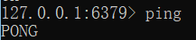
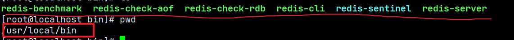
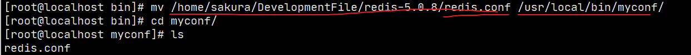
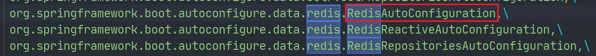
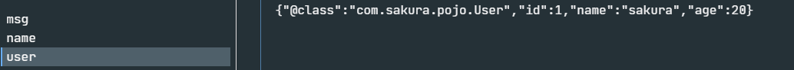

[toc]

# Redis

## 一、Nosql

### 为什么使用Nosql

大数据时代！！普通的数据库无法进行数据分析！Hadoop(2006)。

历史发展：

> 1. **单机MySQL时代**（90年代）,一个网站的访问量一般不会太大，单个数据库完全够用
>
>    
>
>    问题：
>
>    - 数据量增加到一定程度，单机数据库就放不下了
>    - 数据的索引（B+ Tree）,一个机器内存也存放不下
>    - 访问量变大后（读写混合），一台服务器承受不住。
>
> 2. **MySQL垂直拆分+MemCache**
>
>    
>
>    将当个数据库扩展成为多个“垂直”的数据库，同时满足读写分离和数据一致性。
>    但是当访问量过大时频繁去数据库查询速度和效率低下。这个优化过程经历了以下几个过程:
>
>    - 优化数据库的数据结构和索引(难度大)
>    - 文件缓存，通过IO流获取比每次都访问数据库效率略高，但是流量爆炸式增长时候，IO流也承受不了
>    - MemCache,当时最热门的技术，通过在数据库和数据库访问层之间加上一层缓存，第一次访问时查询数据库，将结果保存到缓存，后续的查询先检查缓存，若有直接拿去使用，效率显著提升。
>
> 3. **分库分表、主从复制=>集群**
>
>    
>
> 4. 如今信息量井喷式增长，各种各样的数据出现（用户定位数据，图片数据等），大数据的背景下关系型数据库（RDBMS）无法满足大量数据要求。Nosql数据库就能轻松解决这些问题。


### 什么是Nosql

**Not Only SQL、**不仅仅是数据库。泛指非关系型数据库。

关系型数据库：列+行，同一个表下数据的结构是一样的。

非关系型数据库：数据存储没有固定的格式，并且可以进行横向扩展。


### Nosql特点

1. 数据之间没有关系，方便扩展
2. 大数据量下，性能高。（一秒写入8W次 读取11W次）
3. 数据类型是多样性（不需要事先设计数据库，感受一下Mysql设计表和库的痛苦）
4. 存储方式
   - 键值对存储
   - 列存储
   - 文档存储
   - 图形数据库
   - ...
5. 没有固定的查询语言
6. CAP定理和 BASE
7. 高可用、高性能、高可扩


推荐阅读：阿里云的这群疯子<https://yq.aliyun.com/articles/653511>

```markdown
# 商品信息
- 一般存放在关系型数据库：Mysql,阿里巴巴使用的Mysql都是经过内部改动的。

# 商品描述、评论(文字居多)
- 文档型数据库：MongoDB

# 图片
- 分布式文件系统 FastDFS
- 淘宝：TFS
- Google: GFS
- Hadoop: HDFS
- 阿里云: oss

# 商品关键字 用于搜索
- 搜索引擎：solr,elasticsearch
- 阿里：Isearch 多隆

# 商品热门的波段信息
- 内存数据库：Redis，Memcache

# 商品交易，外部支付接口
- 第三方应用
```

所以企业中使用数据库，都是关系型数据库+Nosql一起使用。


### NoSQL的四大分类

#### KV键值对

- sina：Redis
- 美团：Redis+Tair
- alibaba、baidu：Redis+Memcache

#### 文档型数据库（bson格式）

- MongoDB(掌握)

  > 基于分布式文件存储的数据库。C++编写，用于处理大量文档。

  MongoDB是RDBMS和NoSQL的中间产品。NoSQL中最像关系型数据库的数据库

- ConchDB

#### 列存储数据库

- HBase(大数据必学)
- 分布式文件系统

#### 图关系数据库

用于广告推荐，社交网络

- Neo4j、InfoGrid


| **分类**                | **Examples举例**                                   | **典型应用场景**                                             |                  **数据模型**                   | **优点**                                                     | **缺点**                                                     |
| ----------------------- | -------------------------------------------------- | ------------------------------------------------------------ | :---------------------------------------------: | ------------------------------------------------------------ | ------------------------------------------------------------ |
| **键值对（key-value）** | Tokyo Cabinet/Tyrant, Redis, Voldemort, Oracle BDB | 内容缓存，主要用于处理大量数据的高访问负载，也用于一些日志系统等等。 | Key 指向 Value 的键值对，通常用hash table来实现 | 查找速度快                                                   | 数据无结构化，通常只被当作字符串或者二进制数据               |
| **列存储数据库**        | Cassandra, HBase, Riak                             | 分布式的文件系统                                             |       以列簇式存储，将同一列数据存在一起        | 查找速度快，可扩展性强，更容易进行分布式扩展                 | 功能相对局限                                                 |
| **文档型数据库**        | CouchDB, MongoDb                                   | Web应用（与Key-Value类似，Value是结构化的，不同的是数据库能够了解Value的内容） |    Key-Value对应的键值对，Value为结构化数据     | 数据结构要求不严格，表结构可变，不需要像关系型数据库一样需要预先定义表结构 | 查询性能不高，而且缺乏统一的查询语法。                       |
| **图形(Graph)数据库**   | Neo4J, InfoGrid, Infinite Graph                    | 社交网络，推荐系统等。专注于构建关系图谱                     |                     图结构                      | 利用图结构相关算法。比如最短路径寻址，N度关系查找等          | 很多时候需要对整个图做计算才能得出需要的信息，而且这种结构不太好做分布式的集群 |


## 二、Redis入门


### Redis是什么？

> Redis（Remote Dictionary Server )，即远程字典服务
>
> 一个开源的使用ANSI C语言编写、支持网络、可基于内存亦可持久化的日志型、**Key-Value数据库**，并提供多种语言的API。
>
> 与memcached一样，为了保证效率，**数据都是缓存在内存中**。区别的是redis会周期性的把更新的数据写入磁盘或者把修改操作写入追加的记录文件，并且在此基础上实现了master-slave(主从)同步。

### Redis能干什么？

1. 内存存储，需要持久化（RDB、AOF）
2. 高效率、用于高速缓冲
3. 发布订阅系统
4. 地图信息分析
5. 计时器、计数器(eg：浏览量)
6. ...


### 环境搭建

官网：https://redis.io/

推荐使用Linux服务器学习。

windows版本的Redis已经停更很久了..

#### window搭建

下载压缩包后解压：


此时运行redis-server.exe 会创建一个临时服务，当窗口关闭，服务也会随之关闭。


然后我们启动运行redis-cli  就可以连接到redis-server，==Redis的默认端口6379==

输入ping命令，就会得到PONG的消息，证明连接成功。



Redis可以设置密码的噢：（这里主要讲解使用命令行设置。还可以通过配置文件设置。）

1. `config get requirepass =>`
2. 默认是`“”`，`config set requirepass 123456`设置密码为123456，执行成功返回消息OK
3. 现在进行ping，就要求身份认证
4. auth + 密码就可以完成身份认证
5. 然后就可以进行使用拉，由于是键值对存储，使用简单的get/set就可以


我们之前说到是使用的临时服务，那么肯定也能像mysql一样**安装常驻服务。**

1. 进入Redis解压目录

   `redis-server.exe --service-install redis.windows.conf --service-name 服务名 --loglevel verbose`

   就可以安装Redis服务了，这里使用 Redis-server 作为服务名

   

2. 然后我们启动服务

   `redis-server.exe --service-start --service-name 服务名`

   

3. 现在我们直接启动redis-cli.exe 也能进行连接

4. 如果不需要这个服务了，可以停止服务：

   `redis-server.exe --service-stop --service-name 服务名`

5. 或者卸载服务(需要先停止服务)

   `redis-server.exe --service-uninstall --service-name 服务名`


#### Linux搭建

 解压：

`tar -zxvf redis_xxx.tar.gz`


`yum install gcc-c` 安装gcc环境，然后进入redis目录下执行`make`命令

然后执行`make install`确认执行完毕

redis默认安装路径`/usr/local/bin`



配置redis

将解压文件中的redis.conf 复制一份即可，在/usr/local/bin下创建一个myconf目录存放配置文件。



Redis 默认不是后台启动，修改配置文件：


将daemonize改为yes，就改为了后台启动。

回到/usr/local/bin目录 启动redis，并设置配置文件

`redis-server myconf/redis.conf`

然后启动客户端连接

`redis-cli -p 6379` (这里可以使用 -h 指定主机号， -p 指定端口号)

客户端中使用`shutdown`关闭server,`exit`退出客户端，此时客户端和server就完全退出了。


### 性能测试工具—redis-benchmark

Redis官方提供的性能测试工具，参数选项如下：


简单测试

```markdown
redis-benchmark -h localhost -p 6379 -c 100 -n 100000
> 表示向localhost 6379端口也就是我们的redis-server 以100的并发数发送10,0000个请求进行性能测试
```

结果截图，像是对每个命令进行了测试包括（SET、GET、INCR、LPUSH等）


那么这些测试结果代表什么呢？


### 基础知识

> **Redis默认有16个数据库**


16个数据库为：DB 0~DB 15 
默认使用DB 0 ，可以使用`select n`切换到DB n，`dbsize`可以查看当前数据库的大小，与key数量相关。。

```shell
127.0.0.1:6379> config get databases # 命令行查看数据库数量databases
1) "databases"
2) "16"

127.0.0.1:6379> select 8 # 切换数据库 DB 8
OK
127.0.0.1:6379[8]> dbsize # 查看数据库大小
(integer) 0

# 不同数据库之间 数据是不能互通的，并且dbsize 是根据库中key的个数。
127.0.0.1:6379> set name sakura 
OK
127.0.0.1:6379> SELECT 8
OK
127.0.0.1:6379[8]> get name # db8中并不能获取db0中的键值对。
(nil)
127.0.0.1:6379[8]> DBSIZE
(integer) 0
127.0.0.1:6379[8]> SELECT 0
OK
127.0.0.1:6379> keys *
1) "counter:__rand_int__"
2) "mylist"
3) "name"
4) "key:__rand_int__"
5) "myset:__rand_int__"
127.0.0.1:6379> DBSIZE # size和key个数相关
(integer) 5
```

`keys *` ：查看当前数据库中所有的key。

`flushdb `：清空当前数据库中的键值对。

`flushall`：清空所有数据库的键值对。


> **Redis是单线程的，Redis是基于内存操作的。**
> 所以Redis的性能瓶颈不是CPU,而是机器内存和网络带宽。
>
> 那么为什么Redis的速度如此快呢，性能这么高呢？QPS达到10W+

1. 首先Redis的底层是使用C语言编写，所以性能有优势
2. 我们需要打破两个认知误区
   - 多线程与高性能之间 不是对等的。（多线程不一定高性能）
   - 多线程不一定比单线程效率高。由于多线程之间切换会导致CPU的上下文进行切换，也是费时操作。
3. Redis将所有数据存放在内存中，且是单线程的，CPU不用频繁切换上下文。


## 三、五大数据类型

> Redis是一个开源（BSD许可），内存存储的数据结构服务器，可用作数据库，高速缓存和消息队列代理。它支持[字符串](https://www.redis.net.cn/tutorial/3508.html)、[哈希表](https://www.redis.net.cn/tutorial/3509.html)、[列表](https://www.redis.net.cn/tutorial/3510.html)、[集合](https://www.redis.net.cn/tutorial/3511.html)、[有序集合](https://www.redis.net.cn/tutorial/3512.html)，[位图](https://www.redis.net.cn/tutorial/3508.html)，[hyperloglogs](https://www.redis.net.cn/tutorial/3513.html)等数据类型。内置复制、[Lua脚本](https://www.redis.net.cn/tutorial/3516.html)、LRU收回、[事务](https://www.redis.net.cn/tutorial/3515.html)以及不同级别磁盘持久化功能，同时通过Redis Sentinel提供高可用，通过Redis Cluster提供自动[分区](https://www.redis.net.cn/tutorial/3524.html)。

### Redis-key

> 在redis中无论什么数据类型，在数据库中都是也key-value形式保存，通过进行对Redis-key的操作，来完成对数据库中数据的操作。

下面学习的命令：

- `exists key`
- `del key`
- `move key db`
- `expire key second`
- `type key`

```bash
127.0.0.1:6379> keys * # 查看当前数据库所有key
(empty list or set)
127.0.0.1:6379> set name sakura # set key
OK
127.0.0.1:6379> set age 20
OK
127.0.0.1:6379> keys *
1) "age"
2) "name"
127.0.0.1:6379> move age 1 # 将键值对移动到指定数据库
(integer) 1
127.0.0.1:6379> EXISTS age # 判断键是否存在
(integer) 0 # 不存在
127.0.0.1:6379> EXISTS name
(integer) 1 # 存在
127.0.0.1:6379> SELECT 1
OK
127.0.0.1:6379[1]> keys *
1) "age"
127.0.0.1:6379[1]> del age # 删除键值对
(integer) 1 # 删除个数


127.0.0.1:6379> set age 20
OK
127.0.0.1:6379> EXPIRE age 15 # 设置键值对的过期时间

(integer) 1 # 设置成功 开始计数
127.0.0.1:6379> ttl age # 查看key的过期剩余时间
(integer) 13
127.0.0.1:6379> ttl age
(integer) 11
127.0.0.1:6379> ttl age
(integer) 9
127.0.0.1:6379> ttl age
(integer) -2 # -2 表示key过期，-1表示key未设置过期时间

127.0.0.1:6379> get age # 过期的key 会被自动delete
(nil)
127.0.0.1:6379> keys *
1) "name"

127.0.0.1:6379> type name # 查看value的数据类型
string
```

关于`TTL`命令

 Redis的key，通过TTL命令返回key的过期时间，一般来说有3种：

1. 当前key==没有设置过期时间，所以会返回-1==.
2. 当前key有设置过期时间，而且==key已经过期，所以会返回-2==.
3. 当前key有==设置过期时间，且key还没有过期，故会返回key的正常剩余时间==.

关于重命名`RENAME`和`RENAMENX`

- `RENAME key newkey`修改 key 的名称
- `RENAMENX key newkey`仅当 newkey 不存在时，将 key 改名为 newkey 。

更多：查阅官网教程：https://www.redis.net.cn/tutorial/3507.html

---


### String(字符串)

普通的set、get直接略过。

|                 命令                 | 描述                                                         | 示例                                                         |
| :----------------------------------: | :----------------------------------------------------------- | :----------------------------------------------------------- |
|          `APPEND key value`          | 向指定的key的value后追加字符串                               | 127.0.0.1:6379> set msg hello<br/>OK<br/>127.0.0.1:6379> append msg " world"<br/>(integer) 11<br/>127.0.0.1:6379> get msg<br/>"hello world" |
|           `DECR/INCR key`            | 将指定key的value数值进行+1/-1(仅对于数字)                    | 127.0.0.1:6379> set age 20<br/>OK<br/>127.0.0.1:6379> incr age<br/>(integer) 21<br/>127.0.0.1:6379> decr age<br/>(integer) 20 |
|        `INCRBY/DECRBY key n`         | 按指定的步长对数值进行加减                                   | 127.0.0.1:6379> INCRBY age 5<br/>(integer) 25<br/>127.0.0.1:6379> DECRBY age 10<br/>(integer) 15 |
|         `INCRBYFLOAT key n`          | 为数值加上浮点型数值                                         | 127.0.0.1:6379> INCRBYFLOAT age 5.2<br/>"20.2"               |
|             `STRLEN key`             | 获取key保存值的字符串长度                                    | 127.0.0.1:6379> get msg<br/>"hello world"<br/>127.0.0.1:6379> STRLEN msg<br/>(integer) 11 |
|       `GETRANGE key start end`       | 按起止位置获取字符串（闭区间，==起止位置都取==）             | 127.0.0.1:6379> get msg<br/>"hello world"<br/>127.0.0.1:6379> GETRANGE msg 3 9<br/>"lo worl" |
|     `SETRANGE key offset value`      | 用指定的value 替换key中 offset开始的值                       | 127.0.0.1:6379> SETRANGE msg 2 hello<br/>(integer) 7<br/>127.0.0.1:6379> get msg<br/>"tehello" |
|          `GETSET key value`          | 将给定 key 的值设为 value ，并返回 key 的旧值(old value)。   | 127.0.0.1:6379> GETSET msg test<br/>"hello world"            |
|          `SETNX key value`           | 仅当==key不存在时进行set==                                   | 127.0.0.1:6379> SETNX msg test<br/>(integer) 0<br/>127.0.0.1:6379> SETNX name sakura<br/>(integer) 1 |
|      `SETEX key seconds value`       | set 键值对并设置过期时间                                     | 127.0.0.1:6379> setex name 10 root<br/>OK<br/>127.0.0.1:6379> get name<br/>(nil) |
|  `MSET key1 value1 [key2 value2..]`  | 批量set键值对                                                | 127.0.0.1:6379> MSET k1 v1 k2 v2 k3 v3<br/>OK                |
| `MSETNX key1 value1 [key2 value2..]` | 批量设置键值对，仅当参数中==所有的==key都不存在时执行        | 127.0.0.1:6379> MSETNX k1 v1 k4 v4<br/>(integer) 0           |
|         `MGET key1 [key2..]`         | 批量获取多个key保存的值                                      | 127.0.0.1:6379> MGET k1 k2 k3<br/>1) "v1"<br/>2) "v2"<br/>3) "v3" |
|   `PSETEX key milliseconds value`    | 和 SETEX 命令相似，但它==以毫秒为单位==设置 key 的生存时间， |                                                              |

---


### List(列表)

> Redis列表是简单的字符串列表，按照插入顺序排序。你可以添加一个元素导列表的头部（左边）或者尾部（右边）
>
> 一个列表最多可以包含 2^32^ - 1 个元素 (4294967295, 每个列表超过40亿个元素)。

首先我们列表，可以经过规则定义将其变为队列、栈、双端队列等


正如图==Redis中List是可以进行双端操作的，所以命令也就分为了LXXX和RLLL两类==，有时候L也表示List例如LLEN


| 命令                                    | 描述                                                         |
| --------------------------------------- | ------------------------------------------------------------ |
| `LPUSH/RPUSH key value1[value2..]`      | 从左边/右边向列表中PUSH值(一个或者多个)。                    |
| `LRANGE key start end`                  | 获取list 起止元素==（索引从左往右 递增）==                   |
| `LPUSHX/RPUSHX key value`               | 向已存在的列名中push值（一个或者多个）                       |
| `LINSERT key BEFORE|AFTER pivot value`  | 在指定列表元素的前/后 插入value                              |
| `LLEN key`                              | 查看列表长度                                                 |
| `LINDEX  key index`                     | 通过索引获取列表元素                                         |
| `LSET key index value`                  | 通过索引为元素设值                                           |
| `LPOP/RPOP key `                        | 从最左边/最右边移除值 并返回                                 |
| `RPOPLPUSH source destination`          | 将列表的尾部(右)最后一个值弹出，并返回，然后加到另一个列表的头部 |
| `LTRIM key start end`                   | 截取指定范围内的列表                                         |
| `LREM key count value`                  | ==List中是允许value重复的==<br />`count > 0`：从头部开始搜索 然后删除指定的value 至多删除count个<br />`count < 0`：从尾部开始搜索...<br />`count = 0`：删除列表中所有的指定value。 |
| `BLPOP/BRPOP key1[key2] timout`         | 移出并获取列表的第一个/最后一个元素， 如果列表没有元素会==阻塞列表直到等待超时或发现可弹出元素为止==。 |
| `BRPOPLPUSH source destination timeout` | 和`RPOPLPUSH`功能相同，如果列表没有元素会阻塞列表直到等待超时或发现可弹出元素为止。 |


```shell
---------------------------LPUSH---RPUSH---LRANGE--------------------------------

127.0.0.1:6379> LPUSH mylist k1 # LPUSH mylist=>{1}
(integer) 1
127.0.0.1:6379> LPUSH mylist k2 # LPUSH mylist=>{2,1}
(integer) 2
127.0.0.1:6379> RPUSH mylist k3 # RPUSH mylist=>{2,1,3}
(integer) 3
127.0.0.1:6379> get mylist # 普通的get是无法获取list值的
(error) WRONGTYPE Operation against a key holding the wrong kind of value
127.0.0.1:6379> LRANGE mylist 0 4 # LRANGE 获取起止位置范围内的元素
1) "k2"
2) "k1"
3) "k3"
127.0.0.1:6379> LRANGE mylist 0 2
1) "k2"
2) "k1"
3) "k3"
127.0.0.1:6379> LRANGE mylist 0 1
1) "k2"
2) "k1"
127.0.0.1:6379> LRANGE mylist 0 -1 # 获取全部元素
1) "k2"
2) "k1"
3) "k3"

---------------------------LPUSHX---RPUSHX-----------------------------------

127.0.0.1:6379> LPUSHX list v1 # list不存在 LPUSHX失败
(integer) 0
127.0.0.1:6379> LPUSHX list v1 v2  
(integer) 0
127.0.0.1:6379> LPUSHX mylist k4 k5 # 向mylist中 左边 PUSH k4 k5
(integer) 5
127.0.0.1:6379> LRANGE mylist 0 -1
1) "k5"
2) "k4"
3) "k2"
4) "k1"
5) "k3"

---------------------------LINSERT--LLEN--LINDEX--LSET----------------------------

127.0.0.1:6379> LINSERT mylist after k2 ins_key1 # 在k2元素后 插入ins_key1
(integer) 6
127.0.0.1:6379> LRANGE mylist 0 -1
1) "k5"
2) "k4"
3) "k2"
4) "ins_key1"
5) "k1"
6) "k3"
127.0.0.1:6379> LLEN mylist # 查看mylist的长度
(integer) 6
127.0.0.1:6379> LINDEX mylist 3 # 获取下标为3的元素
"ins_key1"
127.0.0.1:6379> LINDEX mylist 0
"k5"
127.0.0.1:6379> LSET mylist 3 k6 # 将下标3的元素 set值为k6
OK
127.0.0.1:6379> LRANGE mylist 0 -1
1) "k5"
2) "k4"
3) "k2"
4) "k6"
5) "k1"
6) "k3"

---------------------------LPOP--RPOP--------------------------

127.0.0.1:6379> LPOP mylist # 左侧(头部)弹出
"k5"
127.0.0.1:6379> RPOP mylist # 右侧(尾部)弹出
"k3"

---------------------------RPOPLPUSH--------------------------

127.0.0.1:6379> LRANGE mylist 0 -1
1) "k4"
2) "k2"
3) "k6"
4) "k1"
127.0.0.1:6379> RPOPLPUSH mylist newlist # 将mylist的最后一个值(k1)弹出，加入到newlist的头部
"k1"
127.0.0.1:6379> LRANGE newlist 0 -1
1) "k1"
127.0.0.1:6379> LRANGE mylist 0 -1
1) "k4"
2) "k2"
3) "k6"

---------------------------LTRIM--------------------------

127.0.0.1:6379> LTRIM mylist 0 1 # 截取mylist中的 0~1部分
OK
127.0.0.1:6379> LRANGE mylist 0 -1
1) "k4"
2) "k2"

# 初始 mylist: k2,k2,k2,k2,k2,k2,k4,k2,k2,k2,k2
---------------------------LREM--------------------------

127.0.0.1:6379> LREM mylist 3 k2 # 从头部开始搜索 至多删除3个 k2
(integer) 3
# 删除后：mylist: k2,k2,k2,k4,k2,k2,k2,k2

127.0.0.1:6379> LREM mylist -2 k2 #从尾部开始搜索 至多删除2个 k2
(integer) 2
# 删除后：mylist: k2,k2,k2,k4,k2,k2


---------------------------BLPOP--BRPOP--------------------------

mylist: k2,k2,k2,k4,k2,k2
newlist: k1

127.0.0.1:6379> BLPOP newlist mylist 30 # 从newlist中弹出第一个值，mylist作为候选
1) "newlist" # 弹出
2) "k1"
127.0.0.1:6379> BLPOP newlist mylist 30
1) "mylist" # 由于newlist空了 从mylist中弹出
2) "k2"
127.0.0.1:6379> BLPOP newlist 30
(30.10s) # 超时了

127.0.0.1:6379> BLPOP newlist 30 # 我们连接另一个客户端向newlist中push了test, 阻塞被解决。
1) "newlist"
2) "test"
(12.54s)
```

---


### Set(集合)

> Redis的Set是string类型的==无序集合==。==集合成员是唯一的，这就意味着集合中不能出现重复的数据==。
>
> Redis 中 集合是==通过哈希表实现==的，所以添加，删除，查找的复杂度都是O(1)。
>
> 集合中最大的成员数为 2^32^ - 1 (4294967295, 每个集合可存储40多亿个成员)。

| 命令                                      | 描述                                                         |
| ----------------------------------------- | ------------------------------------------------------------ |
| `SADD key member1[member2..]`             | 向集合中无序增加一个/多个成员                                |
| `SCARD key`                               | 获取集合的成员数                                             |
| `SMEMBERS key`                            | 返回集合中所有的成员                                         |
| `SISMEMBER key member`                    | 查询member元素是否是集合的成员,结果是无序的                  |
| `SRANDMEMBER key [count]`                 | 随机返回集合中count个成员，count缺省值为1                    |
| `SPOP key [count]`                        | 随机移除并返回集合中count个成员，count缺省值为1              |
| `SMOVE source destination member`         | 将source集合的成员member移动到destination集合                |
| `SREM key member1[member2..]`             | 移除集合中一个/多个成员                                      |
| `SDIFF key1[key2..]`                      | 返回所有集合的差集 key1- key2 - ...                          |
| `SDIFFSTORE destination key1[key2..]`     | 在SDIFF的基础上，将结果保存到集合中==(覆盖)==。不能保存到其他类型key噢！ |
| `SINTER key1 [key2..]`                    | 返回所有集合的交集                                           |
| `SINTERSTORE destination key1[key2..]`    | 在SINTER的基础上，存储结果到集合中。覆盖                     |
| `SUNION key1 [key2..]`                    | 返回所有集合的并集                                           |
| `SUNIONSTORE destination key1 [key2..]`   | 在SUNION的基础上，存储结果到及和张。覆盖                     |
| `SSCAN KEY [MATCH pattern] [COUNT count]` | 在大量数据环境下，使用此命令变量集合中元素，每次遍历部分     |


```shell
---------------SADD--SCARD--SMEMBERS--SISMEMBER--------------------

127.0.0.1:6379> SADD myset m1 m2 m3 m4 # 向myset中增加成员 m1~m4
(integer) 4
127.0.0.1:6379> SCARD myset # 获取集合的成员数目
(integer) 4
127.0.0.1:6379> smembers myset # 获取集合中所有成员
1) "m4"
2) "m3"
3) "m2"
4) "m1"
127.0.0.1:6379> SISMEMBER myset m5 # 查询m5是否是myset的成员
(integer) 0 # 不是，返回0
127.0.0.1:6379> SISMEMBER myset m2
(integer) 1 # 是，返回1
127.0.0.1:6379> SISMEMBER myset m3
(integer) 1

---------------------SRANDMEMBER--SPOP----------------------------------

127.0.0.1:6379> SRANDMEMBER myset 3 # 随机返回3个成员
1) "m2"
2) "m3"
3) "m4"
127.0.0.1:6379> SRANDMEMBER myset # 随机返回1个成员
"m3"
127.0.0.1:6379> SPOP myset 2 # 随机移除并返回2个成员
1) "m1"
2) "m4"
# 将set还原到{m1,m2,m3,m4}

---------------------SMOVE--SREM----------------------------------------

127.0.0.1:6379> SMOVE myset newset m3 # 将myset中m3成员移动到newset集合
(integer) 1
127.0.0.1:6379> SMEMBERS myset
1) "m4"
2) "m2"
3) "m1"
127.0.0.1:6379> SMEMBERS newset
1) "m3"
127.0.0.1:6379> SREM newset m3 # 从newset中移除m3元素
(integer) 1
127.0.0.1:6379> SMEMBERS newset
(empty list or set)

# 下面开始是多集合操作,多集合操作中若只有一个参数默认和自身进行运算
# setx=>{m1,m2,m4,m6}, sety=>{m2,m5,m6}, setz=>{m1,m3,m6}

-----------------------------SDIFF------------------------------------

127.0.0.1:6379> SDIFF setx sety setz # 等价于setx-sety-setz
1) "m4"
127.0.0.1:6379> SDIFF setx sety # setx - sety
1) "m4"
2) "m1"
127.0.0.1:6379> SDIFF sety setx # sety - setx
1) "m5"


-------------------------SINTER---------------------------------------
# 共同关注（交集）

127.0.0.1:6379> SINTER setx sety setz # 求 setx、sety、setx的交集
1) "m6"
127.0.0.1:6379> SINTER setx sety # 求setx sety的交集
1) "m2"
2) "m6"

-------------------------SUNION---------------------------------------

127.0.0.1:6379> SUNION setx sety setz # setx sety setz的并集
1) "m4"
2) "m6"
3) "m3"
4) "m2"
5) "m1"
6) "m5"
127.0.0.1:6379> SUNION setx sety # setx sety 并集
1) "m4"
2) "m6"
3) "m2"
4) "m1"
5) "m5"

```

---


### Hash

> Redis hash 是一个string类型的field和value的映射表，hash特别==适合用于存储对象。==
>
> Set就是一种简化的Hash,只变动key,而value使用默认值填充。可以将一个Hash表作为一个对象进行存储，表中存放对象的信息。

| 命令                                             | 描述                                                         |
| ------------------------------------------------ | ------------------------------------------------------------ |
| `HSET key field value`                           | 将哈希表 key 中的字段 field 的值设为 value 。==重复设置同一个field会覆盖,返回0== |
| `HMSET key field1 value1 [field2 value2..]`      | 同时将多个 field-value (域-值)对设置到哈希表 key 中。        |
| `HSETNX key field value`                         | 只有在字段 field 不存在时，设置哈希表字段的值。              |
| `HEXISTS key field value`                        | 查看哈希表 key 中，指定的字段是否存在。                      |
| `HGET key field value`                           | 获取存储在哈希表中指定字段的值                               |
| `HMGET key field1 [field2..]`                    | 获取所有给定字段的值                                         |
| `HGETALL key`                                    | 获取在哈希表key 的所有字段和值                               |
| `HKEYS key`                                      | 获取哈希表key中所有的字段                                    |
| `HLEN key`                                       | 获取哈希表中字段的数量                                       |
| `HVALS key`                                      | 获取哈希表中所有值                                           |
| `HDEL key field1 [field2..]`                     | 删除哈希表key中一个/多个field字段                            |
| `HINCRBY key field n`                            | 为哈希表 key 中的指定字段的整数值加上增量n，并返回增量后结果 ==一样只适用于整数型字段== |
| `HINCRBYFLOAT key field n`                       | 为哈希表 key 中的指定字段的浮点数值加上增量 n。              |
| `HSCAN key cursor [MATCH pattern] [COUNT count]` | 迭代哈希表中的键值对。                                       |


```shell
------------------------HSET--HMSET--HSETNX----------------
127.0.0.1:6379> HSET studentx name sakura # 将studentx哈希表作为一个对象，设置name为sakura
(integer) 1
127.0.0.1:6379> HSET studentx name gyc # 重复设置field进行覆盖，并返回0
(integer) 0
127.0.0.1:6379> HSET studentx age 20 # 设置studentx的age为20
(integer) 1
127.0.0.1:6379> HMSET studentx sex 1 tel 15623667886 # 设置sex为1，tel为15623667886
OK
127.0.0.1:6379> HSETNX studentx name gyc # HSETNX 设置已存在的field
(integer) 0 # 失败
127.0.0.1:6379> HSETNX studentx email 12345@qq.com
(integer) 1 # 成功

----------------------HEXISTS--------------------------------
127.0.0.1:6379> HEXISTS studentx name # name字段在studentx中是否存在
(integer) 1 # 存在
127.0.0.1:6379> HEXISTS studentx addr
(integer) 0 # 不存在

-------------------HGET--HMGET--HGETALL-----------
127.0.0.1:6379> HGET studentx name # 获取studentx中name字段的value
"gyc"
127.0.0.1:6379> HMGET studentx name age tel # 获取studentx中name、age、tel字段的value
1) "gyc"
2) "20"
3) "15623667886"
127.0.0.1:6379> HGETALL studentx # 获取studentx中所有的field及其value
 1) "name"
 2) "gyc"
 3) "age"
 4) "20"
 5) "sex"
 6) "1"
 7) "tel"
 8) "15623667886"
 9) "email"
10) "12345@qq.com"


--------------------HKEYS--HLEN--HVALS--------------
127.0.0.1:6379> HKEYS studentx # 查看studentx中所有的field
1) "name"
2) "age"
3) "sex"
4) "tel"
5) "email"
127.0.0.1:6379> HLEN studentx # 查看studentx中的字段数量
(integer) 5
127.0.0.1:6379> HVALS studentx # 查看studentx中所有的value
1) "gyc"
2) "20"
3) "1"
4) "15623667886"
5) "12345@qq.com"

-------------------------HDEL--------------------------
127.0.0.1:6379> HDEL studentx sex tel # 删除studentx 中的sex、tel字段
(integer) 2
127.0.0.1:6379> HKEYS studentx
1) "name"
2) "age"
3) "email"

-------------HINCRBY--HINCRBYFLOAT------------------------
127.0.0.1:6379> HINCRBY studentx age 1 # studentx的age字段数值+1
(integer) 21
127.0.0.1:6379> HINCRBY studentx name 1 # 非整数字型字段不可用
(error) ERR hash value is not an integer
127.0.0.1:6379> HINCRBYFLOAT studentx weight 0.6 # weight字段增加0.6
"90.8"


```

----


### Zset(有序集合)

> 不同的是每个元素都会关联一个double类型的分数。redis正是==通过分数来为集合中的成员进行从小到大的排序==。
>
> ==score相同：按字典顺序排序==
>
> 有序集合的成员是唯一的,但分数(score)却可以重复。

| 命令                                              | 描述                                                         |
| ------------------------------------------------- | ------------------------------------------------------------ |
| `ZADD key score member1 [score2 member2]`         | 向有序集合添加一个或多个成员，或者更新已存在成员的分数       |
| `ZCARD key`                                       | 获取有序集合的成员数                                         |
| `ZCOUNT key min max`                              | 计算在有序集合中指定区间score的成员数                        |
| `ZINCRBY key n member`                            | 有序集合中对指定成员的分数加上增量 n                         |
| `ZSCORE key member`                               | 返回有序集中，成员的分数值                                   |
| `ZRANK key member`                                | 返回有序集合中指定成员的索引                                 |
| `ZRANGE key start end`                            | 通过索引区间返回有序集合成指定区间内的成员                   |
| `ZRANGEBYLEX key min max`                         | 通过字典区间返回有序集合的成员                               |
| `ZRANGEBYSCORE key min max`                       | 通过分数返回有序集合指定区间内的成员==-inf 和 +inf分别表示最小最大值，只支持开区间()== |
| `ZLEXCOUNT key min max`                           | 在有序集合中计算指定字典区间内成员数量                       |
| `ZREM key member1 [member2..]`                    | 移除有序集合中一个/多个成员                                  |
| `ZREMRANGEBYLEX key min max`                      | 移除有序集合中给定的字典区间的所有成员                       |
| `ZREMRANGEBYRANK key start stop`                  | 移除有序集合中给定的排名区间的所有成员                       |
| `ZREMRANGEBYSCORE key min max`                    | 移除有序集合中给定的分数区间的所有成员                       |
| `ZREVRANGE key start end`                         | 返回有序集中指定区间内的成员，通过索引，==分数从高到底==     |
| `ZREVRANGEBYSCORRE key max min`                   | 返回有序集中指定分数区间内的成员，==分数从高到低排序==       |
| `ZREVRANGEBYLEX key max min`                      | 返回有序集中指定字典区间内的成员，按字典顺序倒序             |
| `ZREVRANK key member`                             | 返回有序集合中指定成员的排名，有序集成员按分数值递减(从大到小)排序 |
| `ZINTERSTORE destination numkeys key1 [key2 ..]`  | 计算给定的一个或多个有序集的交集并将结果集存储在新的有序集合 key 中，==numkeys：表示参与运算的集合数，将score相加作为结果的score== |
| `ZUNIONSTORE destination numkeys key1 [key2..] `  | 计算给定的一个或多个有序集的交集并将结果集存储在新的有序集合 key 中 |
| `ZSCAN key cursor [MATCH pattern\] [COUNT count]` | 迭代有序集合中的元素（包括元素成员和元素分值）               |


**关于`ZRANGEBYLEX key min max [LIMIT offset count]`命令**

> **注意点：**
>
> - 确保要搜索的==成员score相同==，否者影响结果。
> - 成员字符串作为二进制数组的字节数进行比较，按照ASCII字符集进行排序。
> - 默认情况下, “max” 和 “min” 参数前必须加 “`[`或`(`” 符号作为开头==(表示开闭和)==。后跟集合中成员，返回字典区间内的成员。
> - min,max也分别可以使用 `-` `+` 表示最小最大值
> - ==LIMIT是可选参数，可以用于对结果分页。==

**所有获取成员的命令都可以在末尾加上withscores来附带显示score**


**关于ZINTERSTORE和ZUNIONSTORE的参数WEIGHTS和AGGREGATE`[WEIGHTS weight][AGGREGATE SUM|MIN|MAX]`**

> **注意点：**
>
> - WEIGHTS参数后接n个float参数作为n个集合的**权重** 默认都是1
> - AGGREGATE 有三个可选参数：SUM|MIN|MAX 缺省值是SUM
>
> 这两个参数就是决定结果的score如何得出，每个结合的score权重占多少。
>
> 例如：ZINTERSTORE setC 2 zsetA zsetB \[WEIGHTS 1,2][AGGREGATE MIN]
>
> 例中命令表示：zsetA中score权重为1 zsetB权重为2 加权后，取最小值作为结果的成员score


```shell
-------------------ZADD--ZCARD--ZCOUNT--------------
127.0.0.1:6379> ZADD myzset 1 m1 2 m2 3 m3 # 向有序集合myzset中添加成员m1 score=1 以及成员m2 score=2..
(integer) 2
127.0.0.1:6379> ZCARD myzset # 获取有序集合的成员数
(integer) 2
127.0.0.1:6379> ZCOUNT myzset 0 1 # 获取score在 [0,1]区间的成员数量
(integer) 1
127.0.0.1:6379> ZCOUNT myzset 0 2
(integer) 2

----------------ZINCRBY--ZSCORE--------------------------
127.0.0.1:6379> ZINCRBY myzset 5 m2 # 将成员m2的score +5
"7"
127.0.0.1:6379> ZSCORE myzset m1 # 获取成员m1的score
"1"
127.0.0.1:6379> ZSCORE myzset m2
"7"

--------------ZRANK--ZRANGE-----------------------------------
127.0.0.1:6379> ZRANK myzset m1 # 获取成员m1的索引，索引按照score排序，score相同索引值按字典顺序顺序增加
(integer) 0
127.0.0.1:6379> ZRANK myzset m2
(integer) 2
127.0.0.1:6379> ZRANGE myzset 0 1 # 获取索引在 0~1的成员
1) "m1"
2) "m3"
127.0.0.1:6379> ZRANGE myzset 0 -1 # 获取全部成员
1) "m1"
2) "m3"
3) "m2"

#testset=>{abc,add,amaze,apple,back,java,redis} score均为0
------------------ZRANGEBYLEX---------------------------------
127.0.0.1:6379> ZRANGEBYLEX testset - + # 返回所有成员
1) "abc"
2) "add"
3) "amaze"
4) "apple"
5) "back"
6) "java"
7) "redis"
127.0.0.1:6379> ZRANGEBYLEX testset - + LIMIT 0 3 # 分页 按索引显示查询结果的 0,1,2条记录
1) "abc"
2) "add"
3) "amaze"
127.0.0.1:6379> ZRANGEBYLEX testset - + LIMIT 3 3 # 显示 3,4,5条记录
1) "apple"
2) "back"
3) "java"
127.0.0.1:6379> ZRANGEBYLEX testset (- [apple # 显示 (-,apple] 区间内的成员
1) "abc"
2) "add"
3) "amaze"
4) "apple"
127.0.0.1:6379> ZRANGEBYLEX testset [apple [java # 显示 [apple,java]字典区间的成员
1) "apple"
2) "back"
3) "java"

-----------------------ZRANGEBYSCORE---------------------
127.0.0.1:6379> ZRANGEBYSCORE myzset 1 10 # 返回score在 [1,10]之间的的成员
1) "m1"
2) "m3"
3) "m2"
127.0.0.1:6379> ZRANGEBYSCORE myzset 1 5
1) "m1"
2) "m3"

--------------------ZLEXCOUNT-----------------------------
127.0.0.1:6379> ZLEXCOUNT testset - +
(integer) 7
127.0.0.1:6379> ZLEXCOUNT testset [apple [java
(integer) 3

------------------ZREM--ZREMRANGEBYLEX--ZREMRANGBYRANK--ZREMRANGEBYSCORE--------------------------------
127.0.0.1:6379> ZREM testset abc # 移除成员abc
(integer) 1
127.0.0.1:6379> ZREMRANGEBYLEX testset [apple [java # 移除字典区间[apple,java]中的所有成员
(integer) 3
127.0.0.1:6379> ZREMRANGEBYRANK testset 0 1 # 移除排名0~1的所有成员
(integer) 2
127.0.0.1:6379> ZREMRANGEBYSCORE myzset 0 3 # 移除score在 [0,3]的成员
(integer) 2


# testset=> {abc,add,apple,amaze,back,java,redis} score均为0
# myzset=> {(m1,1),(m2,2),(m3,3),(m4,4),(m7,7),(m9,9)}
----------------ZREVRANGE--ZREVRANGEBYSCORE--ZREVRANGEBYLEX-----------
127.0.0.1:6379> ZREVRANGE myzset 0 3 # 按score递减排序，然后按索引，返回结果的 0~3
1) "m9"
2) "m7"
3) "m4"
4) "m3"
127.0.0.1:6379> ZREVRANGE myzset 2 4 # 返回排序结果的 索引的2~4
1) "m4"
2) "m3"
3) "m2"
127.0.0.1:6379> ZREVRANGEBYSCORE myzset 6 2 # 按score递减顺序 返回集合中分数在[2,6]之间的成员
1) "m4"
2) "m3"
3) "m2"
127.0.0.1:6379> ZREVRANGEBYLEX testset [java (add # 按字典倒序 返回集合中(add,java]字典区间的成员
1) "java"
2) "back"
3) "apple"
4) "amaze"

-------------------------ZREVRANK------------------------------
127.0.0.1:6379> ZREVRANK myzset m7 # 按score递减顺序，返回成员m7索引
(integer) 1
127.0.0.1:6379> ZREVRANK myzset m2
(integer) 4


# mathscore=>{(xm,90),(xh,95),(xg,87)} 小明、小红、小刚的数学成绩
# enscore=>{(xm,70),(xh,93),(xg,90)} 小明、小红、小刚的英语成绩
-------------------ZINTERSTORE--ZUNIONSTORE-----------------------------------
127.0.0.1:6379> ZINTERSTORE sumscore 2 mathscore enscore # 将mathscore enscore进行合并 结果存放到sumscore
(integer) 3
127.0.0.1:6379> ZRANGE sumscore 0 -1 withscores # 合并后的score是之前集合中所有score的和
1) "xm"
2) "160"
3) "xg"
4) "177"
5) "xh"
6) "188"

127.0.0.1:6379> ZUNIONSTORE lowestscore 2 mathscore enscore AGGREGATE MIN # 取两个集合的成员score最小值作为结果的
(integer) 3
127.0.0.1:6379> ZRANGE lowestscore 0 -1 withscores
1) "xm"
2) "70"
3) "xg"
4) "87"
5) "xh"
6) "93"
```


## 四、三种特殊数据类型

### Geospatial(地理位置)

> 使用经纬度定位地理坐标并用一个**有序集合zset保存**，所以==zset命令也可以使用==

| 命令                                                         | 描述                                                         |
| ------------------------------------------------------------ | ------------------------------------------------------------ |
| `geoadd key longitud(经度) latitude(纬度) member [..]`       | 将具体经纬度的坐标存入一个有序集合                           |
| `geopos key member [member..]`                               | 获取集合中的一个/多个成员坐标                                |
| `geodist key member1 member2 [unit]`                         | 返回两个给定位置之间的距离。默认以米作为单位。               |
| `georadius key longitude latitude radius m|km|mi|ft [WITHCOORD][WITHDIST] [WITHHASH] [COUNT count]` | 以给定的经纬度为中心， 返回集合包含的位置元素当中， 与中心的距离不超过给定最大距离的所有位置元素。 |
| `GEORADIUSBYMEMBER key member radius... `                    | 功能与GEORADIUS相同，只是中心位置不是具体的经纬度，而是使用结合中已有的成员作为中心点。 |
| `geohash key member1 [member2..]`                            | 返回一个或多个位置元素的Geohash表示。使用Geohash位置52点整数编码。 |


**有效经纬度**

> - 有效的经度从-180度到180度。
> - 有效的纬度从-85.05112878度到85.05112878度。

指定单位的参数 **unit** 必须是以下单位的其中一个：

- **m** 表示单位为米。
- **km** 表示单位为千米。
- **mi** 表示单位为英里。
- **ft** 表示单位为英尺。

```shell
-----------------geoadd--------------------
127.0.0.1:6379> geoadd china:city 111.4 30.5 yichang # 将经纬度(111.4,30.5)的地理坐标加入china:city 并命名yichang
(integer) 1
127.0.0.1:6379> geoadd china:city 121.4 31.4 shanghai # ...
(integer) 1
127.0.0.1:6379> geoadd china:city 120.2 30.2 hangzhou
(integer) 1
127.0.0.1:6379> geoadd china:city 104.1 30.6 chengdu
(integer) 1

-----------------geopos--------------------
127.0.0.1:6379> geopos china:city shanghai
1) 1) "121.40000134706497" # 经度
   2) "31.400000253193539" # 纬度
   
-----------------geodist--------------------
127.0.0.1:6379> GEODIST china:city yichang shanghai # 获取yichang和shanghai两个地理坐标的距离(单位:m)
"958793.6834"
127.0.0.1:6379> GEODIST china:city shanghai yichang km # 单位：km
"958.7937"
```

看来距离计算还是比较靠谱，还不是那么精确。


**关于GEORADIUS的参数**

>  通过`georadius`就可以完成 **附近的人**功能
>
> withcoord:带上坐标
>
> withdist:带上距离，单位与半径单位相同
>
> COUNT n : 只显示前n个(按距离递增排序)

```shell
----------------georadius---------------------
127.0.0.1:6379> GEORADIUS china:city 120 30 500 km withcoord withdist # 查询经纬度(120,30)坐标500km半径内的成员
1) 1) "hangzhou"
   2) "29.4151"
   3) 1) "120.20000249147415"
      2) "30.199999888333501"
2) 1) "shanghai"
   2) "205.3611"
   3) 1) "121.40000134706497"
      2) "31.400000253193539"
     
------------geohash---------------------------
127.0.0.1:6379> geohash china:city yichang shanghai # 获取成员经纬坐标的geohash表示
1) "wmrjwbr5250"
2) "wtw6ds0y300"
```


### Hyperloglog(基数统计)

> Redis HyperLogLog 是用来做基数统计的算法，HyperLogLog 的优点是，在输入元素的数量或者体积非常非常大时，计算基数所需的空间总是固定的、并且是很小的。
>
> 花费 12 KB 内存，就可以计算接近 2^64 个不同元素的基数。
>
> 因为 HyperLogLog 只会根据输入元素来计算基数，而==不会储存输入元素本身==，所以 HyperLogLog 不能像集合那样，返回输入的各个元素。
>
> 其底层使用string数据类型

**什么是基数？**

> 数据集中不重复的元素的个数。

**应用场景**

网页的访问量（UV）：一个用户多次访问，也只能算作一个人。

> 传统实现，存储用户的id,然后每次进行比较。当用户变多之后这种方式及其浪费空间，而我们的目的只是**计数**，Hyperloglog就能帮助我们利用最小的空间完成。


| 命令                                      | 描述                                      |
| ----------------------------------------- | ----------------------------------------- |
| `PFADD key element1 [elememt2..]`         | 添加指定元素到 HyperLogLog 中             |
| `PFCOUNT key [key]`                       | 返回给定 HyperLogLog 的基数估算值。       |
| `PFMERGE destkey sourcekey [sourcekey..]` | 将多个 HyperLogLog 合并为一个 HyperLogLog |


```shell
----------PFADD--PFCOUNT---------------------
127.0.0.1:6379> PFADD myelemx a b c d e f g h i j k # 添加元素
(integer) 1
127.0.0.1:6379> type myelemx # hyperloglog底层使用String
string
127.0.0.1:6379> PFCOUNT myelemx # 估算myelemx的基数
(integer) 11
127.0.0.1:6379> PFADD myelemy i j k z m c b v p q s
(integer) 1
127.0.0.1:6379> PFCOUNT myelemy
(integer) 11

----------------PFMERGE-----------------------
127.0.0.1:6379> PFMERGE myelemz myelemx myelemy # 合并myelemx和myelemy 成为myelemz
OK
127.0.0.1:6379> PFCOUNT myelemz # 估算基数
(integer) 17

```

虽然其底层使用String，但是get出来的值...


### BitMaps(位图)

> ==使用位存储==，信息状态只有 0 和 1
>
> Bitmap是一串连续的2进制数字（0或1），每一位所在的位置为偏移(offset)，在bitmap上可执行AND,OR,XOR,NOT以及其它位操作。

**应用场景**

签到统计、状态统计

| 命令                                  | 描述                                                         |
| ------------------------------------- | ------------------------------------------------------------ |
| `setbit key offset value`             | 为指定key的offset位设置值                                    |
| `getbit key offset`                   | 获取offset位的值                                             |
| `bitcount key [start end]`            | 统计字符串被设置为1的bit数，也可以指定统计范围==按字节==     |
| `bitop operration destkey key[key..]` | 对一个或多个保存二进制位的字符串 key 进行位元操作，并将结果保存到 destkey 上。 |
| `BITPOS key bit [start] [end]`        | 返回字符串里面第一个被设置为1或者0的bit位。==start和end只能按字节,不能按位== |


```shell
------------setbit--getbit--------------
127.0.0.1:6379> setbit sign 0 1 # 设置sign的第0位为 1 
(integer) 0
127.0.0.1:6379> setbit sign 2 1 # 设置sign的第2位为 1  不设置默认 是0
(integer) 0
127.0.0.1:6379> setbit sign 3 1
(integer) 0
127.0.0.1:6379> setbit sign 5 1
(integer) 0
127.0.0.1:6379> type sign # bitmap的底层实现仍然是string
string

127.0.0.1:6379> getbit sign 2 # 获取第2位的数值
(integer) 1
127.0.0.1:6379> getbit sign 3
(integer) 1
127.0.0.1:6379> getbit sign 4 # 未设置默认是0
(integer) 0

-----------bitcount----------------------------
127.0.0.1:6379> BITCOUNT sign # 统计sign中为1的位数
(integer) 4

```


**bitmaps的底层**


这样设置以后你能get到的值是：**\xA2\x80**，所以bitmaps是一串==从左到右的二进制串==


## 五、事务

==Redis的单条命令是保证原子性的，但是redis事务不能保证原子性==

> Redis事务：一组命令的集合。
>
> 事务中每条命令都会被序列化，执行过程中按顺序执行，不允许其他命令进行干扰。
>
> - 一次性
> - 顺序性
> - 排他性

所以事务中的命令在加入时都没有被执行，直到提交时才会开始执行(Exec)一次性完成。


操作过程：开启事务(`multi`) >> 命令入队 >> 执行事务(`exec`)

```shell
127.0.0.1:6379> multi # 开启事务
OK
127.0.0.1:6379> set k1 v1 # 命令入队
QUEUED
127.0.0.1:6379> set k2 v2 # ..
QUEUED
127.0.0.1:6379> get k1
QUEUED
127.0.0.1:6379> set k3 v3
QUEUED
127.0.0.1:6379> keys *
QUEUED
127.0.0.1:6379> exec # 事务执行
1) OK
2) OK
3) "v1"
4) OK
5) 1) "k3"
   2) "k2"
   3) "k1"
```


取消事务(`discurd`)

```shell
127.0.0.1:6379> multi
OK
127.0.0.1:6379> set k1 v1
QUEUED
127.0.0.1:6379> set k2 v2
QUEUED
127.0.0.1:6379> DISCARD # 放弃事务
OK
127.0.0.1:6379> EXEC 
(error) ERR EXEC without MULTI # 当前未开启事务
127.0.0.1:6379> get k1 # 被放弃事务中命令并未执行
(nil)
```


### 事务错误

> 代码语法错误（编译时异常）所有的命令都不执行

```shell
127.0.0.1:6379> multi
OK
127.0.0.1:6379> set k1 v1
QUEUED
127.0.0.1:6379> set k2 v2
QUEUED
127.0.0.1:6379> error k1 # 这是一条语法错误命令
(error) ERR unknown command `error`, with args beginning with: `k1`, # 会报错但是不影响后续命令入队 
127.0.0.1:6379> get k2
QUEUED
127.0.0.1:6379> EXEC
(error) EXECABORT Transaction discarded because of previous errors. # 执行报错
127.0.0.1:6379> get k1 
(nil) # 其他命令并没有被执行

```


> 代码逻辑错误 (运行时异常) **其他命令可以正常执行 **>> 不保证事务原子性

```shell
127.0.0.1:6379> multi
OK
127.0.0.1:6379> set k1 v1
QUEUED
127.0.0.1:6379> set k2 v2
QUEUED
127.0.0.1:6379> INCR k1 # 这条命令逻辑错误（对字符串进行增量）
QUEUED
127.0.0.1:6379> get k2
QUEUED
127.0.0.1:6379> exec
1) OK
2) OK
3) (error) ERR value is not an integer or out of range # 运行时报错
4) "v2" # 其他命令正常执行
```


### 监控

使用`watch key`监控指定数据，相当于乐观锁加锁。

> 正常执行

```shell
127.0.0.1:6379> set money 100 # 设置余额:100
OK
127.0.0.1:6379> set use 0 # 支出使用:0
OK
127.0.0.1:6379> watch money # 监视money (上锁)
OK
127.0.0.1:6379> multi
OK
127.0.0.1:6379> DECRBY money 20
QUEUED
127.0.0.1:6379> INCRBY use 20
QUEUED
127.0.0.1:6379> exec # 监视值没有被中途修改，事务正常执行
1) (integer) 80
2) (integer) 20
```


> 线程插队，修改监视值。

我们启动另外一个客户端模拟插队线程。

线程1：

```shell
127.0.0.1:6379> watch money # money上锁
OK
127.0.0.1:6379> multi
OK
127.0.0.1:6379> DECRBY money 20
QUEUED
127.0.0.1:6379> INCRBY use 20
QUEUED
127.0.0.1:6379> 	# 此时事务并没有执行
```

模拟线程插队，线程2:

```shell
127.0.0.1:6379> INCRBY money 500 # 修改了线程一中监视的money
(integer) 600
```

回到线程1，执行事务：

```shell
127.0.0.1:6379> EXEC 
(nil) # 没有结果，说明事务执行失败

127.0.0.1:6379> get money # 线程2 修改生效
"600"
127.0.0.1:6379> get use # 线程1事务执行失败，数值没有被修改
"0"

```


> 解锁获取最新值，然后再加锁进行事务。
>
> `unwatch`进行解锁。

```shell
127.0.0.1:6379> UNWATCH # 解锁
OK
127.0.0.1:6379> WATCH money
OK
127.0.0.1:6379> multi # 重新进行事务
OK
127.0.0.1:6379> DECRBY money 200
QUEUED
127.0.0.1:6379> INCRBY use 200
QUEUED
127.0.0.1:6379> exec
1) (integer) 400
2) (integer) 200
```

==注意：每次提交执行exec后都会自动释放锁，不管是否成功==


## 六、Jedis

使用Java来操作Redis，Jedis是Redis官方推荐使用的Java连接redis的客户端。

1. 依赖导入:jedis、fastjson

```xml
<dependency>
    <groupId>redis.clients</groupId>
    <artifactId>jedis</artifactId>
    <version>3.2.0</version>
</dependency>
```
2. 连接数据库

   > 连接远程：
   >
   > 开放端口6379
   >
   > ```shell
   > firewall-cmd --zone=public --add-port=6379/tcp --permanent
   > ```
   >
   > 需要修改配置文件：
   >
   > 1. 修改bind IP，默认是127.0.0.1 也就是localhost,只有本机可用。
   >
   >    修改为0.0.0.0 或者 本机的ip地址。
   >
   > 
   >
   > 2. 关闭保护模式
   >
   >    默认是yes,修改为no
   >
   >    
   >
   > 然后以此配置文件启动redis-server
   
   
   
   TestPing.java
   
   ```java
   public class TestPing {
       public static void main(String[] args) {
           Jedis jedis = new Jedis("192.168.52.134", 6379);
           String response = jedis.ping();
           System.out.println(response); // PONG
       }
   }
   ```
   
   **==Java中操作Redis就需要 一个Jedis对象==**，创建Jedis对象，需要主机号和端口号作为参数。
   
   其中的API与使用Redis原生的命令是一样的。


事务：

```java
public class TestTransaction {
    public static void main(String[] args) {
        Jedis jedis = new Jedis("localhost", 6379);
        JSONObject jsonObject = new JSONObject();
        jsonObject.put("name", "sakura");
        jsonObject.put("msg", "hello world");
        String info = jsonObject.toJSONString();
        // 开启事务
        Transaction transaction = jedis.multi();
        try {
            transaction.set("user1", info);
            transaction.set("user2", info);
            // 执行事务
            transaction.exec();
        } catch (Exception e) {
            e.printStackTrace();
            // 如果出错则放弃事务
            transaction.discard();
        } finally {
            System.out.println(jedis.get("user1"));
            System.out.println(jedis.get("user2"));
            // 关闭连接
            jedis.close();
        }
    }
}

```


## 七、SpringBoot整合Redis

需要的依赖项,在创建项目时选择，或者手动加入。

```xml
<dependency>
    <groupId>org.springframework.boot</groupId>
    <artifactId>spring-boot-starter-data-redis</artifactId>
</dependency>
```

==springboot 2.x后 ，原来使用的 Jedis 被 lettuce 替换。==

> Jedis：采用直连，多线程操作不安全。
>
> Lettuce：底层采用Netty


我们在学习SpringBoot自动配置的原理时，整合一个组件并进行配置一定会有一个自动配置类xxxAutoConfiguration,并且在spring.factories中也一定能找到这个类的完全限定名。Redis也不例外。



那么就一定还存在一个RedisProperties类


之前我们说SpringBoot2.x后默认使用Lettuce来替换Jedis，现在我们就能来验证了。

先看Jedis:


@ConditionalOnClass注解中有两个类是默认不存在的，所以Jedis是无法生效的

然后再看Lettuce：


完美生效。


现在我们回到RedisAutoConfiguration


只有两个简单的Bean

- RedisTemplate
- StringRedisTemplate

当看到xxTemplate时可以对比RestTemplat、SqlSessionTemplate,通过使用这些Template来间接操作组件。那么这俩也不会例外。分别用于操作Redis和Redis中的String数据类型。

==在RedisTemplate上也有一个条件注解，说明我们是可以对其进行定制化的==


说完这些，我们需要知道如何编写配置文件然后连接Redis，就需要阅读RedisProperties


这是一些基本的配置属性。


还有一些连接池相关的配置。注意使用时一定==使用Lettuce的连接池==。


配置文件:(基本不用写)

```properties
spring.redis.host=127.0.0.1
spring.redis.port=6379
# 以上俩个属性都有默认值 可以省略

# 默认使用 db0
spring.redis.database=0
```


测试使用：

1. 我们说过现在操作Redis需要用到RedisTemplate，所以需要自动注入。

   ```java
   @Autowired
   RedisTemplate redisTemplate;
   ```

2. 使用RedisTemplate

   

   在操作Redis中数据时，需要先通过opsForxxx()方法来获取对应的Operations,然后才可以操作数据。

3. 以ValueOperations（操作String）为例

   


```java
@Autowired
RedisTemplate redisTemplate;

@Test
void contextLoads() {
   // 获取Redis连接对象
   RedisConnection connection = redisTemplate.getConnectionFactory().getConnection();
   // 清空数据库
   connection.flushDb();
   System.out.println(redisTemplate.keys("*"));

   ValueOperations operations = redisTemplate.opsForValue();
   // set
   operations.set("name", "sakura");
   // get
   System.out.println(operations.get("name"));
   // 事务支持开启
   redisTemplate.setEnableTransactionSupport(true);
   redisTemplate.multi();
   try {
      operations.set("msg", "hello world");
      System.out.println(operations.get("name"));
      // 事务执行
      redisTemplate.exec();
   } catch (Exception e) {
      e.printStackTrace();
      // 放弃事务
      redisTemplate.discard();
   } finally {
      // 关闭连接
      connection.close();
   }
}
```


此时我们回到Redis查看数据时候，惊奇发现全是乱码，可是程序中可以正常输出：


这时候就关系到存储==对象的序列化问题==，在网络中传输的对象也是一样需要序列化，否者就全是乱码。

我们转到看那个默认的RedisTemplate内部什么样子：


在最开始就能看到几个关于序列化的参数。

默认的序列化器是采用JDK序列化器


而默认的RedisTemplate中的所有序列化器都是使用这个序列化器：


后续我们定制RedisTemplate就可以对其进行修改。

**`RedisSerializer`**提供了很多种序列化方案：

- 我们可以直接调用RedisSerializer的方法来返回序列化器，然后set


- 也可以自己new 相应的实现类，然后set


**定制RedisTemplate的模板：**

我们创建一个Bean加入容器，就会触发RedisTemplate上的条件注解使默认的RedisTemplate失效。

```java
@Configuration
public class RedisConfig {

   @Bean
    public RedisTemplate<String, Object> redisTemplate(RedisConnectionFactory redisConnectionFactory) throws UnknownHostException {
        // 将template 泛型设置为 <String, Object>
        RedisTemplate<String, Object> template = new RedisTemplate();
        // 连接工厂，不必修改
        template.setConnectionFactory(redisConnectionFactory);
        /*
         * 序列化设置
         */
        // key、hash的key 采用 String序列化方式
        template.setKeySerializer(RedisSerializer.string());
        template.setHashKeySerializer(RedisSerializer.string());
        // value、hash的value 采用 Jackson 序列化方式
        template.setValueSerializer(RedisSerializer.json());
        template.setHashValueSerializer(RedisSerializer.json());
        template.afterPropertiesSet();
        
        return template;
    }
}
```

这样一来，只要实体类进行了序列化，我们存什么都不会有乱码的担忧了。




## 八、自定义Redis工具类

使用RedisTemplate需要频繁调用`.opForxxx`然后才能进行对应的操作，这样使用起来代码效率低下，工作中一般不会这样使用，而是==将这些常用的公共API抽取出来封装成为一个工具类==，然后直接使用工具类来间接操作Redis,不但效率高并且易用。

工具类参考博客：

https://www.cnblogs.com/zeng1994/p/03303c805731afc9aa9c60dbbd32a323.html、

https://www.cnblogs.com/zhzhlong/p/11434284.html


## 九、Redis.conf

1. 容量单位不区分大小写，G和GB有区别

   

2. 可以使用 include 组合多个配置问题

   

3. 网络配置

   

4. 日志输出级别

   

5. 日志输出文件

   

6. 持久化规则

   > 由于Redis是基于内存的数据库，需要将数据由内存持久化到文件中
   >
   > 持久化方式：
   >
   > - RDB
   > - AOF

   

7. RDB文件相关

   

   

8. 关于主从复制，稍后再提

   

9. Security模块中进行密码设置

   

10. 客户端连接相关

    ```txt
    maxclients 10000  最大客户端数量
    maxmemory <bytes> 最大内存限制
    maxmemory-policy noeviction # 内存达到限制值的处理策略
    ```

    redis 中的**默认**的过期策略是 **volatile-lru** 。

    **设置方式**  

    ```
    config set maxmemory-policy volatile-lru 
    ```

    #### **maxmemory-policy 六种方式**

    **1、volatile-lru：**只对设置了过期时间的key进行LRU（默认值） 

    **2、allkeys-lru ：** 删除lru算法的key  

    **3、volatile-random：**随机删除即将过期key  

    **4、allkeys-random：**随机删除  

    **5、volatile-ttl ：** 删除即将过期的  

    **6、noeviction ：** 永不过期，返回错误

    

11. AOF相关部分

    

    


## 十、持久化——RDB

**RDB：Redis Databases**

### 什么是RDB

==在指定时间间隔后，将内存中的数据集快照写入数据库 ；在恢复时候，直接读取快照文件，进行数据的恢复 ；==


默认情况下， Redis 将数据库快照保存在名字为 ==dump.rdb的二进制文件==中。文件名可以在配置文件中进行自定义。


### 工作原理

在进行 **`RDB`** 的时候，**`redis`** 的主线程是不会做 **`io`** 操作的，主线程会 **`fork`** 一个子线程来完成该操作；

1. Redis 调用forks。同时拥有父进程和子进程。
2. 子进程将数据集写入到一个临时 RDB 文件中。
3. 当子进程完成对新 RDB 文件的写入时，Redis 用新 RDB 文件替换原来的 RDB 文件，并删除旧的 RDB 文件。

==这种工作方式使得 Redis 可以从写时复制（copy-on-write）机制中获益==(因为是使用子进程进行写操作，而父进程依然可以接收来自客户端的请求。)


### 触发机制

#### save

使用 `save` 命令，会立刻对当前内存中的数据进行持久化 ,但是会阻塞，也就是不接受其他操作了；

> 由于 `save` 命令是同步命令，会占用Redis的主进程。若Redis数据非常多时，`save`命令执行速度会非常慢，阻塞所有客户端的请求。


#### flushall命令

`flushall` 命令也会触发持久化 ；

#### 触发持久化规则

满足配置条件中的触发条件 ；

> 你可以通过配置文件对 Redis 进行设置， 让它在“ N 秒内数据集至少有 M 个改动”这一条件被满足时， 自动进行数据集保存操作。
>
> 


#### bgsave

`bgsave` 是异步进行，进行持久化的时候，`redis` 还可以将继续响应客户端请求 ；


1. 重新启动 `redis` ，也会触发，记进行加载持久化文件 ；

可以通过 `lastsave` 获取上一次 `save` 的时间 ；


**bgsave和save对比**

| 命令   | save               | bgsave                             |
| ------ | ------------------ | ---------------------------------- |
| IO类型 | 同步               | 异步                               |
| 阻塞？ | 是                 | 是（阻塞发生在fock()，通常非常快） |
| 复杂度 | O(n)               | O(n)                               |
| 优点   | 不会消耗额外的内存 | 不阻塞客户端命令                   |
| 缺点   | 阻塞客户端命令     | 需要fock子进程，消耗内存           |

### 缺点

- 从子线程的工作方式，我们也可以看出，==最后一次持久化操作以后的数据面临着丢失的风险；==(如果子进程最后一次持久化操作失败，例如断电宕机，则导致整个持久化操作失败，临时文件不会覆盖原文件。)
- 耗时、耗性能。RDB 需要经常fork子进程来保存数据集到硬盘上，当数据集比较大的时候，fork的过程是非常耗时的，可能会导致Redis在一些毫秒级内不能响应客户端的请求。如果数据集巨大并且CPU性能不是很好的情况下，这种情况会持续1秒，AOF也需要fork，但是你可以调节重写日志文件的频率来提高数据集的耐久度。
- 不可控、丢失数据。如果你希望在redis意外停止工作（例如电源中断）的情况下丢失的数据最少的话，那么RDB不适合你。虽然你可以配置不同的save时间点(例如每隔5分钟并且对数据集有100个写的操作)，是Redis要完整的保存整个数据集是一个比较繁重的工作，你通常会每隔5分钟或者更久做一次完整的保存，万一在Redis意外宕机，你可能会丢失几分钟的数据。

### 优点

- RDB是一个非常紧凑的文件，它保存了某个时间点得数据集，非常适用于数据集的备份，比如你可以在每个小时报保存一下过去24小时内的数据，同时每天保存过去30天的数据，这样即使出了问题你也可以根据需求恢复到不同版本的数据集。
- RDB是一个紧凑的单一文件，很方便传送到另一个远端数据中心或者亚马逊的S3（可能加密），非常适用于灾难恢复。
- RDB在保存RDB文件时父进程唯一需要做的就是fork出一个子进程，接下来的工作全部由子进程来做，父进程不需要再做其他IO操作，所以RDB持久化方式可以最大化redis的性能。
- 与AOF相比，在恢复大的数据集的时候，RDB方式会更快一些。


## 十一、持久化——AOF

### 什么是AOF

快照功能（RDB）并不是非常耐久（durable）： 如果 Redis 因为某些原因而造成故障停机， 那么服务器将丢失最近写入、以及未保存到快照中的那些数据。 从 1.1 版本开始， Redis 增加了一种完全耐久的持久化方式： AOF 持久化。

如果要使用AOF，需要修改配置文件：


`appendonly no yes`则表示启用AOF


### 工作原理

每当 Redis 执行一个改变数据集的命令时（比如 SET）， 这个命令就会被追加到 AOF 文件的末尾。这样的话， 当 Redis 重新启时， 程序就可以==通过重新执行 AOF 文件中的命令来达到重建数据集的目的==。

 **创建**


**恢复**


### AOF持久化的三种策略


#### always

每次有新命令追加到 AOF 文件时就执行一次同步，安全但是速度慢


#### everysec(default)

这种 fsync 策略可以兼顾速度和安全性，可能丢失一秒的数据。


#### no

将数据交给操作系统来处理，由操作系统来决定什么时候同步数据。更快，但是不安全。


**三者对比**

| 命令     | 优点                             | 缺点                              |
| -------- | -------------------------------- | --------------------------------- |
| always   | 不丢失数据                       | IO开销大，一般SATA磁盘只有几百TPS |
| everysec | 每秒进行与fsync，最多丢失1秒数据 | 可能丢失1秒数据                   |
| no       | 不用管                           | 不可控                            |

### aof文件修复

当aof被人为破坏，redis就无法完成启动，可以==通过官方提供的 redis-check-aof工具对aof文件进行修复==,当然数据可能发生部分丢失。

```she
redis-check-aof --fix appendonly.aof
```


### AOF重写

因为 AOF 的运作方式是不断地将命令追加到文件的末尾， 所以==随着写入命令的不断增加， AOF 文件的体积也会变得越来越大==。

举个例子， 如果你对一个计数器调用了 100 次 INCR ， 那么仅仅是为了保存这个计数器的当前值， AOF 文件就需要使用 100 条记录（entry）。然而在实际上， 只使用一条 SET 命令已经足以保存计数器的当前值了， 其余 99 条记录实际上都是多余的。

为了处理这种情况， Redis 支持一种有趣的特性： ==可以在不打断服务客户端的情况下， 对 AOF 文件进行重建（rebuild）。执行 bgrewriteaof 命令， Redis 将生成一个新的 AOF 文件， 这个文件包含重建当前数据集所需的最少命令。==

Redis 2.2 需要自己手动执行 bgrewriteaof 命令； Redis 2.4+ 则可以**通过配置自动触发 AOF 重写。**

####  AOF重写的作用

- 减少磁盘占用量
- 加速数据恢复

####  AOF重写的实现方式

- `bgrewriteaof` 命令

  用于异步执行一个 AOF（AppendOnly File）文件重写操作。重写会创建一个当前AOF文件的体积优化版本。
  即使 bgrewriteaof 执行失败，也不会有任何数据丢失，因为==旧的AOF文件在 bgrewriteaof 成功之前不会被修改==。

  AOF 重写由 Redis 自行触发，==bgrewriteaof 仅仅用于手动触发重写操作==。

  

#### AOF重写的配置

| 配置名                      | 含义                          |
| --------------------------- | ----------------------------- |
| auto-aof-rewrite-min-size   | 触发AOF文件执行重写的最小尺寸 |
| auto-aof-rewrite-percentage | 触发AOF文件执行重写的增长率   |

| 统计名           | 含义                                  |
| ---------------- | ------------------------------------- |
| aof_current_size | AOF文件当前尺寸（字节）               |
| aof_base_size    | AOF文件上次启动和重写时的尺寸（字节） |

触发自动重写有两个条件：

- 当前AOF文件大小超过触发重写的最小大小。

  即*aof_current_size > auto-aof-rewrite-min-size*

- 当前文件大小增长率超过触发重写的增长率

  即**${(aof\_current\_size-aof\_base\_size) \over aof\_base\_size}>auto-aof-rewrite-percentage$**

---

例如：

假设 Redis 的配置项为：

```
auto-aof-rewrite-min-size 64mb
auto-aof-rewrite-percentage 100
```

当

1. AOF文件的体积大于64Mb
2. **并且**AOF文件的体积比上一次重写之久的体积大了至少一倍（100%）时

Redis将执行 bgrewriteaof 命令进行重写。

---


#### 相关配置

```shell
# 开启AOF持久化方式
appendonly yes

# AOF持久化文件名
appendfilename "appendonly.aof"

# 每秒把缓冲区的数据同步到磁盘
appendfsync everysec

# 数据持久化文件存储目录
dir /var/lib/redis

# 是否在执行重写时不同步数据到AOF文件 默认为no
# 这里的 yes，就是执行重写时不同步数据到AOF文件
no-appendfsync-on-rewrite yes

# 触发AOF文件执行重写的最小尺寸
auto-aof-rewrite-min-size 64mb

# 触发AOF文件执行重写的增长率
auto-aof-rewrite-percentage 100
```


#### 重写过程


1. 执行bgrewriteaof命令
2. 父进程fork出子进程
3. 将命令写入缓存，然后由缓存写入旧aof文件
4. 子进程创建新的aof临时文件
5. 1. 子进程通知父进程开始重写aof文件
   2. 将命令从缓存写入新aof文件
   3. 重写完成使用新aof文件替换旧的aof文件。


### AOF的缺点

1. 对于相同的数据集来说，==AOF 文件的体积通常要大于 RDB 文件的体积。==
2. 根据所使用的 fsync 策略，==AOF 的速度可能会慢于 RDB 。== 在一般情况下， 每秒 fsync 的性能依然非常高， 而关闭 fsync 可以让 AOF 的速度和 RDB 一样快， 即使在高负荷之下也是如此。 
3. ==数据量较大时，恢复较慢==


### AOF优点

1. 使用AOF 会让你的Redis更加耐久: 你可以使用不同的fsync策略：无fsync，每秒fsync，每次写的时候fsync。使用默认的每秒fsync策略，Redis的性能依然很好(fsync是由后台线程进行处理的，主线程会尽力处理客户端请求)，==一旦出现故障，你最多丢失1秒的数据==。
2. ==AOF文件是一个只进行追加的日志文件==，所以不需要写入seek，即使由于某些原因(磁盘空间已满，写的过程中宕机等等)未执行完整的写入命令，你也也可使用redis-check-aof工具修复这些问题。
3. Redis 可以在 AOF 文件体积变得过大时，==自动地在后台对 AOF 进行重写==： 重写后的新 AOF 文件包含了恢复当前数据集所需的最小命令集合。 整个重写操作是绝对安全的，因为 Redis 在创建新 AOF 文件的过程中，会继续将命令追加到现有的 AOF 文件里面，即使重写过程中发生停机，现有的 AOF 文件也不会丢失。 而一旦新 AOF 文件创建完毕，Redis 就会从旧 AOF 文件切换到新 AOF 文件，并开始对新 AOF 文件进行追加操作。
4. AOF 文件有序地保存了对数据库执行的所有写入操作， 这些写入操作以 Redis 协议的格式保存， 因此==AOF 文件的内容非常容易被人读懂， 对文件进行分析（parse）也很轻松。== 导出（export） AOF 文件也非常简单： 举个例子， 如果你不小心执行了 FLUSHALL 命令， 但只要 AOF 文件未被重写， 那么只要停止服务器， 移除 AOF 文件末尾的 FLUSHALL 命令， 并重启 Redis ， 就可以将数据集恢复到 FLUSHALL 执行之前的状态。


## 十二、RDB 和 AOF 选择

### RDB 和 AOF 对比

|            | RDB    | AOF          |
| ---------- | ------ | ------------ |
| 启动优先级 | 低     | 高           |
| 体积       | 小     | 大           |
| 恢复速度   | 快     | 慢           |
| 数据安全性 | 丢数据 | 根据策略决定 |

### 如何选择使用哪种持久化方式？

一般来说， 如果想达到足以媲美 PostgreSQL 的数据安全性， 你应该同时使用两种持久化功能。

如果你非常关心你的数据， 但仍然可以承受数分钟以内的数据丢失， 那么你可以只使用 RDB 持久化。

有很多用户都只使用 AOF 持久化， 但并不推荐这种方式： 因为定时生成 RDB 快照（snapshot）非常便于进行数据库备份， 并且 RDB 恢复数据集的速度也要比 AOF 恢复的速度要快。


## 十三、Redis发布与订阅

Redis 发布订阅(pub/sub)是一种消息通信模式：发送者(pub)发送消息，订阅者(sub)接收消息。


下图展示了频道 channel1 ， 以及订阅这个频道的三个客户端 —— client2 、 client5 和 client1 之间的关系：


当有新消息通过 PUBLISH 命令发送给频道 channel1 时， 这个消息就会被发送给订阅它的三个客户端：


### 命令

| 命令                                     | 描述                               |
| ---------------------------------------- | ---------------------------------- |
| `PSUBSCRIBE pattern [pattern..]`         | 订阅一个或多个符合给定模式的频道。 |
| `PUNSUBSCRIBE pattern [pattern..]`       | 退订一个或多个符合给定模式的频道。 |
| `PUBSUB subcommand [argument[argument]]` | 查看订阅与发布系统状态。           |
| `PUBLISH channel message`                | 向指定频道发布消息                 |
| `SUBSCRIBE channel [channel..]`          | 订阅给定的一个或多个频道。         |
| `SUBSCRIBE channel [channel..]`          | 退订一个或多个频道                 |

### 示例

```shell
------------订阅端----------------------
127.0.0.1:6379> SUBSCRIBE sakura # 订阅sakura频道
Reading messages... (press Ctrl-C to quit) # 等待接收消息
1) "subscribe" # 订阅成功的消息
2) "sakura"
3) (integer) 1
1) "message" # 接收到来自sakura频道的消息 "hello world"
2) "sakura"
3) "hello world"
1) "message" # 接收到来自sakura频道的消息 "hello i am sakura"
2) "sakura"
3) "hello i am sakura"

--------------消息发布端-------------------
127.0.0.1:6379> PUBLISH sakura "hello world" # 发布消息到sakura频道
(integer) 1
127.0.0.1:6379> PUBLISH sakura "hello i am sakura" # 发布消息
(integer) 1

-----------------查看活跃的频道------------
127.0.0.1:6379> PUBSUB channels
1) "sakura"
```


### 原理

每个 Redis 服务器进程都维持着一个表示服务器状态的 redis.h/redisServer 结构， 结构的 pubsub_channels 属性是一个字典， 这个==字典就用于保存订阅频道的信息==，其中，==字典的键为正在被订阅的频道， 而字典的值则是一个链表==， ==链表中保存了所有订阅这个频道的客户端。==


客户端订阅，就被链接到对应频道的链表的尾部，退订则就是将客户端节点从链表中移除。


### 缺点

1，如果一个客户端订阅了频道，但自己读取消息的速度却不够快的话，那么不断积压的消息会使redis输出缓冲区的体积变得越来越大，这可能使得redis本身的速度变慢，甚至直接崩溃。
2，这和数据传输可靠性有关，如果在订阅方断线，那么他将会丢失所有在短线期间发布者发布的消息。

### 应用

1. 消息订阅：公众号订阅，微博关注等等（起始更多是使用消息队列来进行实现）
2. 多人在线聊天室。


## 十四、主从复制

### 概念

主从复制，是指将一台Redis服务器的数据，复制到其他的Redis服务器。前者称为主节点（Master/Leader）,后者称为从节点（Slave/Follower），==数据的复制是单向的！只能由主节点复制到从节点==（主节点以写为主、从节点以读为主）。

默认情况下，每台Redis服务器都是主节点，一个主节点可以有0个或者多个从节点，但每个从节点只能由一个主节点。


### 作用

1. ==数据冗余==：主从复制实现了数据的热备份，是持久化之外的一种数据冗余的方式。
2. ==故障恢复==：当主节点故障时，从节点可以暂时替代主节点提供服务，是一种服务冗余的方式
3. ==负载均衡==：在主从复制的基础上，配合读写分离，由主节点进行写操作，从节点进行读操作，分担服务器的负载；尤其是在多读少写的场景下，通过多个从节点分担负载，提高并发量。
4. ==高可用基石==：主从复制还是哨兵和集群能够实施的基础。


### 为什么使用集群

1. 单台服务器难以负载大量的请求
2. 单台服务器故障率高，系统崩坏概率大
3. 单台服务器内存容量有限。


### 环境配置

我们在讲解配置文件的时候，注意到有一个`replication`模块 (见Redis.conf中第8条)

查看当前库的信息：`info replication`

```shell
127.0.0.1:6379> info replication
# Replication
role:master # 角色
connected_slaves:0 # 从机数量
master_replid:3b54deef5b7b7b7f7dd8acefa23be48879b4fcff
master_replid2:0000000000000000000000000000000000000000
master_repl_offset:0
second_repl_offset:-1
repl_backlog_active:0
repl_backlog_size:1048576
repl_backlog_first_byte_offset:0
repl_backlog_histlen:0
```

既然需要启动多个服务，就需要多个配置文件。每个配置文件对应修改以下信息：

- 端口号
- pid文件名
- 日志文件名
- rdb文件名

启动单机多服务集群：


### 一主二从配置

此时每个redis都是主节点，此时我们只需配置我们想要的从机即可。


使用`SLAVEOF host port`就可以为从机配置主机了。


然后主机上也能看到从机的状态：


我们这里是使用命令搭建，是暂时的，==真实开发中应该在从机的配置文件中进行配置。==


### 使用规则

1. 从机只能读，不能写，主机可读可写但是多用于写。

   ```shell
   127.0.0.1:6381> set name sakura # 从机6381写入失败
   (error) READONLY You can't write against a read only replica.
   
   127.0.0.1:6380> set name sakura # 从机6380写入失败
   (error) READONLY You can't write against a read only replica.
   
   127.0.0.1:6379> set name sakura
   OK
   127.0.0.1:6379> get name
   "sakura"
   ```

2. 当主机断电宕机后，默认情况下从机的角色不会发生变化 ，集群中只是失去了写操作，当主机恢复以后，又会连接上从机恢复原状。

3. 当从机断电宕机后，若不是使用配置文件配置的从机，再次启动后作为主机是无法获取之前主机的数据的，若此时重新配置称为从机，又可以获取到主机的所有数据。这里就要提到一个同步原理。

4. 第二条中提到，默认情况下，主机故障后，不会出现新的主机，有两种方式可以产生新的主机：

   - 从机手动执行命令`slaveof no one`,这样执行以后从机会独立出来成为一个主机
   - 使用哨兵模式（自动选举）

### 同步复制原理

#### 全量同步

==Redis全量复制一般发生在Slave初始化阶段，这时Slave需要将Master上的所有数据都复制一份。==

具体步骤如下： 

- 从服务器连接主服务器，发送SYNC命令； 
- 主服务器接收到SYNC命名后，开始执行BGSAVE命令生成RDB文件并使用缓冲区记录此后执行的所有写命令； 
- 主服务器BGSAVE执行完后，向所有从服务器发送快照文件，并在发送期间继续记录被执行的写命令； 
- 从服务器收到快照文件后丢弃所有旧数据，载入收到的快照； 
- 主服务器快照发送完毕后开始向从服务器发送缓冲区中的写命令； 
-  从服务器完成对快照的载入，开始接收命令请求，并执行来自主服务器缓冲区的写命令；


#### 增量同步

==Redis增量复制是指Slave初始化后开始正常工作时，主服务器发生的写操作同步到从服务器的过程。== 

增量复制的过程主要：

- 主服务器每执行一个写命令就会向从服务器发送相同的写命令，从服务器接收并执行收到的写命令。


## 十五、哨兵模式

更多信息参考博客：https://www.jianshu.com/p/06ab9daf921d

**主从切换技术的方法是：当主服务器宕机后，需要手动把一台从服务器切换为主服务器，这就需要人工干预，费事费力，还会造成一段时间内服务不可用。**这不是一种推荐的方式，更多时候，我们优先考虑**哨兵模式**。

单机单个哨兵


哨兵的作用：

- 通过发送命令，让Redis服务器返回监控其运行状态，包括主服务器和从服务器。

- 当哨兵监测到master宕机，会自动将slave切换成master，然后通过**发布订阅模式**通知其他的从服务器，修改配置文件，让它们切换主机。

多哨兵模式


哨兵的核心配置

`sentinel monitor mymaster 127.0.0.1 6379 1`

- 数字1表示 ：当一个哨兵主观认为主机断开，就可以客观认为主机故障，然后开始选举新的主机。


完整的哨兵模式配置文件 sentinel.conf

```shell
# Example sentinel.conf
 
# 哨兵sentinel实例运行的端口 默认26379
port 26379
 
# 哨兵sentinel的工作目录
dir /tmp
 
# 哨兵sentinel监控的redis主节点的 ip port 
# master-name  可以自己命名的主节点名字 只能由字母A-z、数字0-9 、这三个字符".-_"组成。
# quorum 当这些quorum个数sentinel哨兵认为master主节点失联 那么这时 客观上认为主节点失联了
# sentinel monitor <master-name> <ip> <redis-port> <quorum>
sentinel monitor mymaster 127.0.0.1 6379 1
 
# 当在Redis实例中开启了requirepass foobared 授权密码 这样所有连接Redis实例的客户端都要提供密码
# 设置哨兵sentinel 连接主从的密码 注意必须为主从设置一样的验证密码
# sentinel auth-pass <master-name> <password>
sentinel auth-pass mymaster MySUPER--secret-0123passw0rd
 
 
# 指定多少毫秒之后 主节点没有应答哨兵sentinel 此时 哨兵主观上认为主节点下线 默认30秒
# sentinel down-after-milliseconds <master-name> <milliseconds>
sentinel down-after-milliseconds mymaster 30000
 
# 这个配置项指定了在发生failover主备切换时最多可以有多少个slave同时对新的master进行 同步，
这个数字越小，完成failover所需的时间就越长，
但是如果这个数字越大，就意味着越 多的slave因为replication而不可用。
可以通过将这个值设为 1 来保证每次只有一个slave 处于不能处理命令请求的状态。
# sentinel parallel-syncs <master-name> <numslaves>
sentinel parallel-syncs mymaster 1
 
 
 
# 故障转移的超时时间 failover-timeout 可以用在以下这些方面： 
#1. 同一个sentinel对同一个master两次failover之间的间隔时间。
#2. 当一个slave从一个错误的master那里同步数据开始计算时间。直到slave被纠正为向正确的master那里同步数据时。
#3.当想要取消一个正在进行的failover所需要的时间。  
#4.当进行failover时，配置所有slaves指向新的master所需的最大时间。不过，即使过了这个超时，slaves依然会被正确配置为指向master，但是就不按parallel-syncs所配置的规则来了
# 默认三分钟
# sentinel failover-timeout <master-name> <milliseconds>
sentinel failover-timeout mymaster 180000
 
# SCRIPTS EXECUTION
 
#配置当某一事件发生时所需要执行的脚本，可以通过脚本来通知管理员，例如当系统运行不正常时发邮件通知相关人员。
#对于脚本的运行结果有以下规则：
#若脚本执行后返回1，那么该脚本稍后将会被再次执行，重复次数目前默认为10
#若脚本执行后返回2，或者比2更高的一个返回值，脚本将不会重复执行。
#如果脚本在执行过程中由于收到系统中断信号被终止了，则同返回值为1时的行为相同。
#一个脚本的最大执行时间为60s，如果超过这个时间，脚本将会被一个SIGKILL信号终止，之后重新执行。
 
#通知型脚本:当sentinel有任何警告级别的事件发生时（比如说redis实例的主观失效和客观失效等等），将会去调用这个脚本，
#这时这个脚本应该通过邮件，SMS等方式去通知系统管理员关于系统不正常运行的信息。调用该脚本时，将传给脚本两个参数，
#一个是事件的类型，
#一个是事件的描述。
#如果sentinel.conf配置文件中配置了这个脚本路径，那么必须保证这个脚本存在于这个路径，并且是可执行的，否则sentinel无法正常启动成功。
#通知脚本
# sentinel notification-script <master-name> <script-path>
  sentinel notification-script mymaster /var/redis/notify.sh
 
# 客户端重新配置主节点参数脚本
# 当一个master由于failover而发生改变时，这个脚本将会被调用，通知相关的客户端关于master地址已经发生改变的信息。
# 以下参数将会在调用脚本时传给脚本:
# <master-name> <role> <state> <from-ip> <from-port> <to-ip> <to-port>
# 目前<state>总是“failover”,
# <role>是“leader”或者“observer”中的一个。 
# 参数 from-ip, from-port, to-ip, to-port是用来和旧的master和新的master(即旧的slave)通信的
# 这个脚本应该是通用的，能被多次调用，不是针对性的。
# sentinel client-reconfig-script <master-name> <script-path>
sentinel client-reconfig-script mymaster /var/redis/reconfig.sh
```


`redis-sentinel xxx/sentinel.conf`

成功启动哨兵模式


此时哨兵监视着我们的主机6379，当我们断开主机后：


## 十六、缓存穿透与雪崩

### 缓存穿透

#### 概念

在默认情况下，用户请求数据时，会先在缓存(Redis)中查找，若没找到即缓存未命中，再在数据库中进行查找，数量少可能问题不大，可是一旦大量的请求数据（例如秒杀场景）缓存都没有命中的话，就会全部转移到数据库上，造成数据库极大的压力，就有可能导致数据库崩溃。网络安全中也有人恶意使用这种手段进行攻击被称为洪水攻击。

#### 解决方案

1. 布隆过滤器

   对所有可能查询的参数以Hash的形式存储，以便快速确定是否存在这个值，在控制层先进行拦截校验，校验不通过直接打回，减轻了存储系统的压力。

   

2. 缓存空对象

   一次请求若在缓存和数据库中都没找到，就在缓存中方一个空对象用于处理后续这个请求。

   

   这样做有一个缺陷：存储空对象也需要空间，大量的空对象会耗费一定的空间，存储效率并不高。解决这个缺陷的方式就是==为空对象设置较短过期时间==
   
   即使对空值设置了过期时间，还是会存在缓存层和存储层的数据会有一段时间窗口的不一致，这对于需要保持一致性的业务会有影响。


### 缓存击穿

#### 概念

相较于缓存穿透，缓存击穿的目的性更强，一个存在的key，在缓存过期的一刻，同时有大量的请求，这些请求都会击穿到DB，造成瞬时DB请求量大、压力骤增。这就是缓存被击穿，只是针对其中某个key的缓存不可用而导致击穿，但是其他的key依然可以使用缓存响应。

比如热搜排行上，一个热点新闻被同时大量访问就可能导致缓存击穿。

#### 解决方案

1. 设置热点数据永不过期

   这样就不会出现热点数据过期的情况，但是当Redis内存空间满的时候也会清理部分数据，而且此种方案会占用空间，一旦热点数据多了起来，就会占用部分空间。

2. 加互斥锁(分布式锁)

   在访问key之前，采用SETNX（set if not exists）来设置另一个短期key来锁住当前key的访问，访问结束再删除该短期key。保证同时刻只有一个线程访问。这样对锁的要求就十分高。


### 缓存雪崩

#### 概念

大量的key设置了相同的过期时间，导致在缓存在同一时刻全部失效，造成瞬时DB请求量大、压力骤增，引起雪崩。


#### 解决方案

- redis高可用

  这个思想的含义是，既然redis有可能挂掉，那我多增设几台redis，这样一台挂掉之后其他的还可以继续工作，其实就是==搭建的集群==

- 限流降级

  这个解决方案的思想是，在缓存失效后，通过加锁或者队列来控制读数据库写缓存的线程数量。比如对某个key只允许一个线程查询数据和写缓存，其他线程等待。

- 数据预热

  数据加热的含义就是在正式部署之前，我先把可能的==数据先预先访问一遍，这样部分可能大量访问的数据就会加载到缓存中==。在即将发生大并发访问前手动触发加载缓存不同的key，==设置不同的过期时间，让缓存失效的时间点尽量均匀。==

