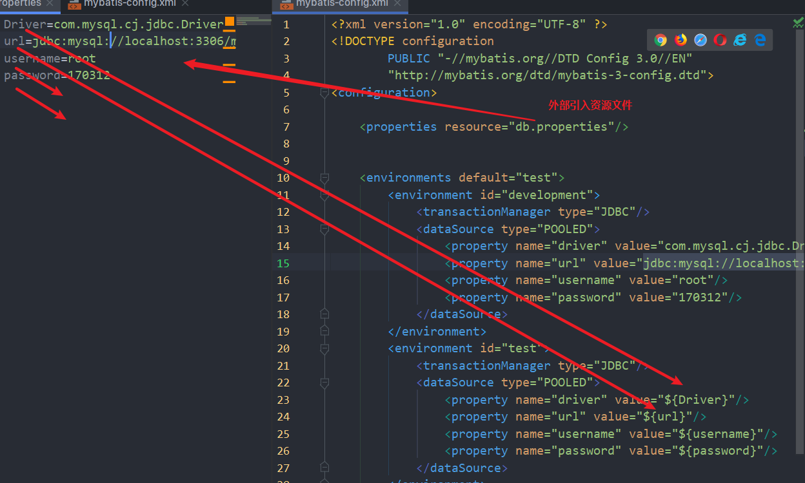
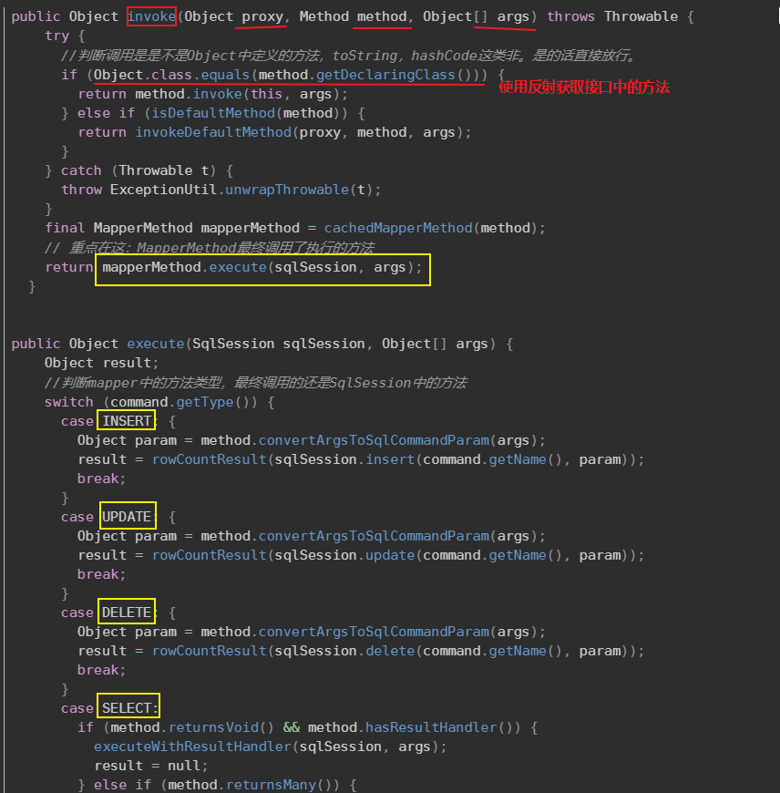
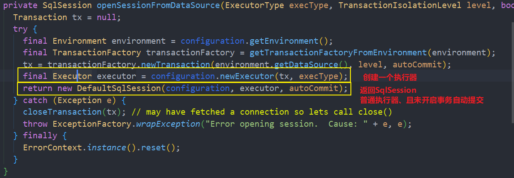
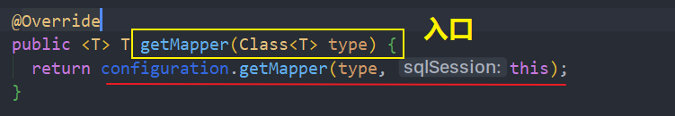
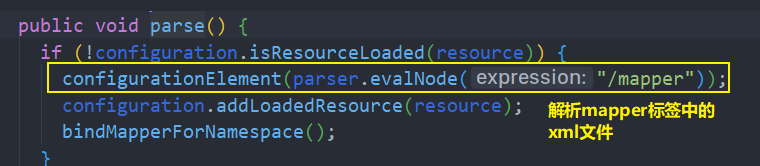
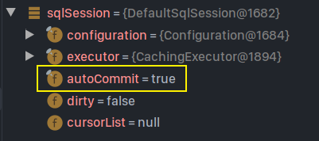
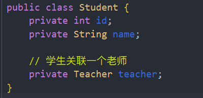
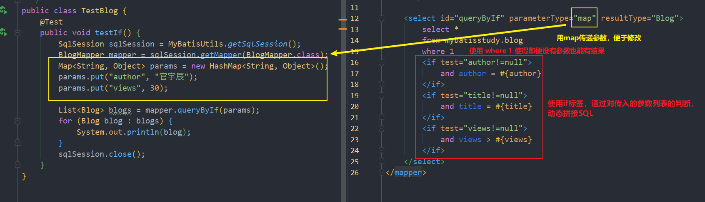

[toc]

# MyBatis

## 一、简介

### 1、什么是MyBatis


- 一款优秀的持久层框架
- 支持定制化SQL、存储过程以及高级映射
- MyBatis 免除了几乎所有的 JDBC 代码以及设置参数和获取结果集的工作。
- MyBatis 可以**通过简单的 XML 或注解**来配置和映射原始类型、接口和 Java POJO（Plain Old Java Objects，普通老式 Java 对象）为数据库中的记录。
- 原身是Apache的一个开源项目iBatis。
- 2010迁移到Google code 并改名为MyBatis，2013年11月迁移到GitHub

### 2、获取MyBatis

GitHub:<https://github.com/mybatis/mybatis-3/releases>

Maven:

```xml
<!-- https://mvnrepository.com/artifact/org.mybatis/mybatis -->
<dependency>
    <groupId>org.mybatis</groupId>
    <artifactId>mybatis</artifactId>
    <version>3.5.4</version>
</dependency>
```


### 3、持久层

**数据持久化**

> 将程序的数据在持久状态和瞬时状态转化的过程。

**为什么需要持久化？**

> 内存的断电即失的特点，无法一直将数据放在内存中，需要将数据持久化到数据库


### 4、为什么使用MyBatis

- 方便数据存入数据库
- 简化传统JDBC代码，SQL与代码分离，提高可维护性。
- 目前流行的框架，利于自动化。


## 二、第一个MyBatis

### 1、环境搭建

- 创建数据库
- 导入maven依赖（MyBatis、MySQL连接驱动、Junit）

### 2、创建一个Module

- 编写MyBatis核心配置文件

  > 用于连接数据库

  ```java
  <?xml version="1.0" encoding="UTF-8" ?>
  <!DOCTYPE configuration
          PUBLIC "-//mybatis.org//DTD Config 3.0//EN"
          "http://mybatis.org/dtd/mybatis-3-config.dtd">
  <configuration>
      <environments default="development">
          <environment id="development">
              <transactionManager type="JDBC"/>
              <dataSource type="POOLED">
                  <property name="driver" value="com.mysql.cj.jdbc.Driver"/>
                  <property name="url" value="jdbc:mysql://localhost:3306/mybatisstudy?userSSL=true&amp;CharacterEncoding=utf8&amp;useUnicode=true&amp;serverTimezone=UTC"/>
                  <property name="username" value="root"/>
                  <property name="password" value="170312"/>
              </dataSource>
          </environment>
      </environments>
  </configuration>
  ```

- 编写MyBatis工具类

  ```java
  public class MyBatisUtils {
      private static SqlSessionFactory sqlSessionFactory;
  
      // 从 XML 中构建 SqlSessionFactory
      static {
          try {
              String resource = "mybatis-config.xml";
              InputStream inputStream = Resources.getResourceAsStream(resource);
              sqlSessionFactory = new SqlSessionFactoryBuilder().build(inputStream);
          } catch (IOException e) {
              e.printStackTrace();
          }
      }
  
      // SqlSession 提供了在数据库执行 SQL 命令所需的所有方法
      public static SqlSession getSqlSession(){
          return sqlSessionFactory.openSession();
      }
  
  }
  ```
  
  > 每个基于 MyBatis 的应用都是以一个 **SqlSessionFactory** 的实例为核心的。SqlSessionFactory 的实例可以通过 **SqlSessionFactoryBuilder** 获得。而 SqlSessionFactoryBuilder 则可以从 **XML 配置文件**或一个预先配置的 Configuration 实例来构建出 SqlSessionFactory 实例。
  >
  > **XML配置文件 -->SqlSessionFactoryBuilder --> SqlSessionFactory**
  >
  > ---
  >
  > 既然有了 SqlSessionFactory，顾名思义，我们可以从中**获得 SqlSession 的实例**。**SqlSession 提供了在数据库执行 SQL 命令所需的所有方法**。你可以通过 SqlSession 实例来直接执行已映射的 SQL 语句。
  >
  > ----
  >
  > ==所以这个工具类只是用于获取SqlSession，SqlSession就是用于执行SQL语句的。==

### 3、代码编写

- 编写实体类POJO

- 编写Dao接口

- 创建mapper绑定到Dao层的接口

  ```xml
  <mapper namespace="">
      <select id="">
          
      </select>
  </mapper>
  ```

  > - **namespace**(命名空间)：
  >
  >   命名空间的作用有两个，一**个是利用更长的全限定名来将不同的语句隔离开来**，**同时也实现了上面见到的接口绑定。**
  >
  > - **mapper**里面可以定制SQL语句
  >
  >   
  >
  >   以**select标签**为例子，**id**填入当前mapper绑定接口下的某个方法名，相当于接口实现类的方法实现，当然需要在标签内写上SQL语句，标签内可以加上**resultType**即结果集，还有一个resultMap可以返回多个结果集。**ParameterType**填写传入参数类型
  >
  >   
  >
  > **举例**
  >
  > ```xml
  > <mapper namespace="com.sakura.dao.UserDao">
  >     <select id="getUsers" resultType="com.sakura.pojo.User">
  >         select * from mybatisstudy.user
  >     </select>
  > </mapper>
  > ```
  >
  > - 这个mapper 就是绑定com.sakura.dao.UserDao这个接口，（也可以使用短命名，前提是这个短命名是全局唯一，否则就要使用全限定名）,后面会讲到**类型别名**。
  > - select标签则表示是对这个接口下的getUsers这个方法的实现。
  > - 返回结果集的类型resultType为实体类的User,一般返回结果集类型注明为返回集容器的泛型(即结果集中内容的类型)
  >
  > ==完成这些步骤，就结束了对一条SQL语句的映射，就代替了传统的接口实现类==
  >
  > 它们映射的语句不仅可以 **XML 来配置**，还可以使用 **Java 注解**来配置。
  >
  > **遗留问题**：Mapper的底层原理？是否和动态代理有关系？

### 4、Junit测试

- ==报错==

  <span style="color:red">org.apache.ibatis.binding.BindingException: Type interface com.sakura.dao.UserDao is not known to the MapperRegistry.</span>

  > com.sakura.dao.UserDao在映射注册表中是未知的，即我们的Mapper没有注册

  - 去MyBatis-config.xml中注册Mapper

  ```xml
  <!--每个xxxMapper.xml都需要在MyBatis的配置文件中注册-->
  <mappers>
    <mapper resource="com/sakura/dao/UserMapper.xml"></mapper>
  </mappers>
  ```

- ==再次报错==

  <span style="color:red">Could not find resource com/sakura/dao/UserMapper.xml</span>

  > 无法找找到xxxMapper.xml文件，这就是之前在Maven中提到过的**资源导出问题**

>Maven项目在打包时，约定将资源配置文件放在resource文件夹下
>
>（**需要在pom.xml中增加配置项，使得其他包中的配置或资源文件能够导出**）
>
>```xml
><build>
><resources>
>    <!--默认只导出resource文件夹下的-->
>    <resource>
>        <directory>src/main/resources</directory>
>        <includes>
>            <include>**/*.properties</include>
>            <include>**/*.xml</include>
>        </includes>
>        <filtering>true</filtering>
>    </resource>
>
>    <!--添加配置导出java文件夹下的-->
>    <resource>
>        <directory>src/main/java</directory>
>        <includes>
>            <include>**/*.properties</include>
>            <include>**/*.xml</include>
>        </includes>
>        <filtering>true</filtering>
>    </resource>
></resources>
></build>
>```

测试代码：

```java
@Test
public void Test(){
// 1.获取SqlSession对象
SqlSession sqlSession = MybatisUtils.getSqlSession();

// 2.执行SQL

//============方式A==============//
UserDao mapper = sqlSession.getMapper(UserDao.class);
List<User> users = mapper.getUsers();
for (User user : users) {
System.out.println(user.toString());
}

//===========方式B============//
List<User> list = sqlSession.selectList("com.sakura.dao.UserDao.getUsers");
for (User user : list) {
System.out.println(user);
}

sqlSession.close();
}
```


## 三、CURD

### 增

```xml
<insert id="addUser" parameterType="com.sakura.pojo.User">
    insert into mybatisstudy.user (id, name, password) VALUES (#{id},#{name},#{password})
</insert>
```

```java
// 增删改需要提交事务
@Test
public void insertUser(){
    try (SqlSession sqlSession = MyBatisUtils.getSqlSession()) {
        UserMapper mapper = sqlSession.getMapper(UserMapper.class);
        int i = mapper.addUser(new User(4, "张三", "1234567"));
        System.out.println(i);
        // 提交事务
        sqlSession.commit();
    }
}
```

> 注意点：
>
> 1. 在传入参数时，使用`#{}`直接获取传入对象的数据，填什么取决于你传递的参数
> 2. ==所有的增删改操作都需要提交事务== SqlSession.commit();

### 改

```xml
<update id="updateUser" parameterType="com.sakura.pojo.User">
    update mybatisstudy.user
    set password = #{password}
    where id = #{id};
</update>
```

```java
@Test
public void updateUser(){
    try (SqlSession sqlSession = MyBatisUtils.getSqlSession()) {
        UserMapper mapper = sqlSession.getMapper(UserMapper.class);
        mapper.updateUser(new User(4, "张三", "123456"));
        // 提交事务
        sqlSession.commit();
    }
}
```

> 注意点：
>
> 改操作时，需要传入修改过后的对象，传入的对象保证SQL语句用于判断和修改的字段保证正确即可
>
> 例如：我通过id去查找用户并修改密码时，保证传入参数的用户对象的id和密码没有问题即可，其他属性无影响。

### 查

```xml
<select id="getUserById" parameterType="int" resultType="com.sakura.pojo.User">
    select * from mybatisstudy.user where id=#{id}
</select>
```

```java
@Test
public void getUserById(){

    try (SqlSession sqlSession = MyBatisUtils.getSqlSession()) {
        UserMapper mapper = sqlSession.getMapper(UserMapper.class);
        User user = mapper.getUserById(2);
        System.out.println(user);
    }
}
```

### 删

```xml
<delete id="deleteUser" parameterType="int">
    delete mybatisstudy.user
    from mybatisstudy.user
    where id = #{id};
</delete>
```

```java
public void deleteUser(){
    try (SqlSession sqlSession = MyBatisUtils.getSqlSession()) {
        UserMapper mapper = sqlSession.getMapper(UserMapper.class);
        mapper.deleteUser(4);
        // 提交事务
        sqlSession.commit();
    }
}
```


>  **当实体的字段很多时，我们可以使用Map来封装我们需要的的参数，其他无关参数就可以不用设置，减少代码量**

### 模糊查询

> 第一种方式：（安全）
>
> 带调用的时候**传入带通配符的字符串**
>
> 第二种：（存在漏洞）
>
> 在SQL语句中进行字符串拼接

### SqlSession聊一聊

> SqlSession是MyBatis中用于和数据库交互的`顶层类`，通常将它与ThreadLocal绑定，一个会话使用一个SqlSession，并且在使用完毕后需要close。
>
> SqlSession在构建时有两个重要参数  **configuration与初始化时的相同，Executor为执行器**
>
> **Executor**(执行器)：一个接口，有三个实现类
>
> - BatchExecutor（重用语句并执行批量更新）
> - ReuseExecutor（重用预处理语句prepared statements）
> - SimpleExecutor（普通的执行器，默认）
>
> 当我们调用openSqlSession()时，默认返回一个SimpleExecutor，且事务自动提交为NULL
>
> 可以通过openSqlSession的重载方法获取不同类型的执行器和选择是否开启事务自动提交。
>
> ---
>
> 当执行SQL语句时 需要了解一个**MappedStatement** 
>
> 作用：==MappedStatement与Mapper配置文件中的一个select/update/insert/delete节点相对应。mapper中配置的标签都被封装到了此对象中，主要用途是描述一条SQL语句。==
>
> xxxMapper.xml任何一个 select/update/insert/delete 在初始化时，都会被封装成一个MappedStatement并将其作为Value,将完全限定类名+方法名作为Key 放入Configuration对象中的MappedStatements中
>
> 


## 四、配置解析

> MyBatis 的配置文件包含了会深深影响 MyBatis 行为的设置和属性信息。

### 核心配置文件结构

MyBatis-config.xml

> configuration（配置）
>
> - [properties（属性）](https://mybatis.org/mybatis-3/zh/configuration.html#properties)
> - [settings（设置）](https://mybatis.org/mybatis-3/zh/configuration.html#settings)
> - [typeAliases（类型别名）](https://mybatis.org/mybatis-3/zh/configuration.html#typeAliases)
> - [typeHandlers（类型处理器）](https://mybatis.org/mybatis-3/zh/configuration.html#typeHandlers)
> - [objectFactory（对象工厂）](https://mybatis.org/mybatis-3/zh/configuration.html#objectFactory)
> - [plugins（插件）](https://mybatis.org/mybatis-3/zh/configuration.html#plugins)
> - environments（环境配置）
>   - environment（环境变量）
>     - transactionManager（事务管理器）
>     - dataSource（数据源）
> - [databaseIdProvider（数据库厂商标识）](https://mybatis.org/mybatis-3/zh/configuration.html#databaseIdProvider)
> - [mappers（映射器）](https://mybatis.org/mybatis-3/zh/configuration.html#mappers)
>
> **所有xml配置文件地标签必须按照这个顺序排列**

### 1、环境配置（environments）

> MyBatis 可以配置成适应多种环境，这种机制有助于将 SQL 映射应用于多种数据库之中，**不过要记住：尽管可以配置多个环境，但每个 SqlSessionFactory 实例只能选择一种环境。**所以，如果你想连接两个数据库，就需要创建两个 SqlSessionFactory 实例，每个数据库对应一个。


例如此，虽然我们写了多个enviroment 但是必须指定使用那一个环境。这样方便了我们在多个数据库之间来回切换。

- ==transactionManager(事务管理系统)==

  两种：**JDBC(默认)**和MANAGED

- ==dataSource(数据源)==

  三种：UNPOOLED、**POOLED(默认)**、JNDI


### 2、属性(properties)

> property标签中的属性值，可以被动态地读取和使用或者修改，提高了灵活性。
>
> 例如数据库连接地参数可以写在properties标签中，连接使用同一模板，只需要修改参数即可。



**注意**：当我们同时在xml内部添加properties和外部导入发生字段冲突时，**优先使用外部导入的资源文件**

### 3、类型别名(typeAliases)

> **为java的类型设置短的名字，减少完全限定名的冗余。**
>
> 两种方式：针对具体的类、针对实体类的包
>
> 在核心配置文件中配置

代码示例：

```xml
<!--为实体类取别名-->
<typeAliases>
    <typeAlias type="com.sakura.pojo.User" alias="User"/>
    <package name="com.sakura.pojo"/>
</typeAliases>
```

#### 1. 针对具体的类

- 使用`typeAlias`标签，type为要设置别名的类的全限定名，alias为所取的别名

拿上面这个栗子：所有使用com.sakura.pojo.User的地方，都可以使用User替换。


#### 2. 针对实体类包

- 使用`package`标签 会自动扫描包下的JavaBean，**在没有@Alias注解的情况下**，会自动使用**首字母小写的类名作为其别名。**，name为扫描的包。

还是上面这个栗子：com.sakura.pojo下的JavaBean  例如User  默认使用user作为别名  Student的别名为student

**也可以使用@Alias注解为包下的类设置别名**


#### java内建对象的默认别名


### 4、设置(Setting)


### 5、Plugins(插件)

- mybatis-generator-core
- mybatis-plus
- 通用mapper


### 6、映射器(Mapper)

> 我们所写的Mapper,都要到核心配置文件的映射表中注册

**MapperRegistry**:映射表


#### 1、使用resource

```xml
<mappers>
    <mapper resource="com/sakura/dao/UserMapper.xml"/>
</mappers>
```

#### 2、使用class

```xml
<mappers>
    <mapper class="com.sakura.dao.UserMapper"/>
</mappers>
```

**注意点：**使用class绑定，必须保证

- 接口和其Mapper配置文件在**同一个包下**
- 接口必须与它的Mapper配置文件**同名**

#### 3、使用package

```xml
<mappers>
    <package name="com.sakura.dao"/>
</mappers>
```

要求和使用class相同，同名同包


## 五、作用域和生命周期


#### SqlSessionFactoryBuilder 

这个类可以被实例化、使用和丢弃，**一旦创建了 SqlSessionFactory，就不再需要它了**。 因此 SqlSessionFactoryBuilder 实例的最佳作用域是方法作用域（也就是**局部方法变量**）。

#### SqlSessionFactory

SqlSessionFactory **一旦被创建就应该在应用的运行期间一直存在**，没有任何理由丢弃它或重新创建另一个实例。 因此 SqlSessionFactory 的**最佳作用域是应用作用域。** 有很多方法可以做到，最简单的就是**使用单例模式**或者静态单例模式。（最好不要创建多个）

#### SqlSession

**每个线程都应该有它自己的 SqlSession 实例**。SqlSession 的实例**不是线程安全的**，因此是不能被共享的，所以它的最佳的作用域是**请求或方法作用域**。==每次收到 HTTP 请求，就可以打开一个 SqlSession，返回一个响应后，就关闭它。==建议使用try-with-resource 表面上省去finally关闭资源的逻辑

#### 映射器实例（Mapper）

**方法作用域才是映射器实例的最合适的作用域。** 也就是说，**映射器实例应该在调用它们的方法中被获取，使用完毕之后即可丢弃。**不需要被显式地关闭，保持mapper和调用getMapper获取它的SqlSession保持相同作用域。


## 六、解决字段名与属性名不一致问题

> **问题描述：**
>
> 当数据库中表的字段名，与Java对应实体类中的属性名不一致时，会导致查询结果错误。
>
> 例如 数据库中现有表User(id,username,password) 当映射到Java实体类中时变成了User类（id,username,pwd）时，在执行查询后得到的结果中pwd总为'null'
>
> **原因：**
>
> 完整的SQL查询语句是：
>
> select id,username,password
>
> from User
>
> 所以返回的结果集的列名也分别是 id、username、password，而当我们为resultType传递的User类中没有password属性，且pwd这个属性，在查询结果中也没有这个字段，所以就默认填上了null。

### 解决方案：

1. 为查询结果集列名取别名，select id,username,pwd **as password **...

2. 使用**resultMap(结果集映射)**

   - 在xxxMaper.xml中的mapper标签中配置。

   - ```xml
     <!--将结果集列名 与实体类的属性名一一对应起来即可-->
     <resultMap id="UserMap" type="User">
         <result column="id" property="id"/>
         <result column="password" property="pwd"/>
         <result column="name" property="name"/>
     </resultMap>
     
     <select id="getUsers" resultMap="UserMap">
         select * from mybatisstudy.user
     </select>
     ```
3. 将User类中与表中字段不一致的属性映射到一张resultMap上即可，然后语句使用resultMap。相同的属性可以不必填写。

后面会讲解更为复杂的问题及解决方案


## 七、日志

### 1、日志工厂

> 当我们的sql语句发生了错误是，最好的排错的帮手就是日志;
>
> 过去我们使用**控制台打印或者debug排错**，现在要学习使用**日志工厂**


可选值：

- SLF4J

-  **LOG4J**（掌握）

- LOG4J2 

- JDK_LOGGING
- COMMONS_LOGGING
- **STDOUT_LOGGING** (标准日志输出，掌握)

> 需要在MyBatis的核心配置文件中的settings标签中配置日志工厂，默认是无；
>
> ```xml
> <settings>
>  <setting name="logImpl" value="STDOUT_LOGGING"/>
> </settings>
> ```
>
> 所有的设置都在核心配置文件中的settings标签下配置，**name和value属性要与官方一模一样**


### STDOUT_LOGGING 日志分析


### LOG4J日志

> Apache的一个开源项目，**可以将日志输出到控制台或者文件....**
>
> 我们可以控制每一条日志的输出格式，**日志可以分等级输出。**
>
> 可以**通过配置文件来灵活配置**，而不需要额外修改代码

- Maven导包

```xml
<!-- https://mvnrepository.com/artifact/log4j/log4j -->
<dependency>
<groupId>log4j</groupId>
<artifactId>log4j</artifactId>
<version>1.2.17</version>
</dependency>
```

- log4j配置文件

  ```properties
  log4j.rootLogger = debug ,stdout,file
  
  ### 输出到控制台 ###
  log4j.appender.stdout = org.apache.log4j.ConsoleAppender
  log4j.appender.stdout.Target = System.out
  log4j.appender.stdout.layout = org.apache.log4j.PatternLayout
  log4j.appender.stdout.layout.ConversionPattern = %-d{yyyy-MM-dd HH:mm:ss}  [ %t:%r ] - [ %p ]  %m%n
  
  ### 输出到日志文件 ###
  log4j.appender.file = org.apache.log4j.FileAppender
  log4j.appender.file.File = ./log/sakura.log
  log4j.appender.file.Append = true
  ## 输出DEBUG级别以上的日志
  log4j.appender.file.Threshold = DEBUG
  
  log4j.appender.file.layout = org.apache.log4j.PatternLayout
  log4j.appender.file.layout.ConversionPattern = %-d{yyyy-MM-dd HH:mm:ss}  [ %t:%r ] - [ %p ]  %m%n
  
  file.layout.ConversionPattern = %-d{yyyy-MM-dd HH:mm:ss}  [ %t:%r ] - [ %p ]  %m%n
  # 日志文件输出级别
  log4j.logger.org.mybatis=DEBUG
  logj4j.logger.java.sql=DEBUG
  logj4j.logger.java.sql.Statement=DEBUG
  logj4j.logger.java.sql.ResultSet=DEBUG
  logj4j.logger.java.sql.PreparedStatement=DEBUG
  ```

- 设置log4j为日志的实现类

  ```xml
  <settings>
      <setting name="logImpl" value="LOG4J"/>
  </settings>
  ```

​	

- ==使用== 

  

1. 导入Log4j.Logger包

2. 创建日志对象，传入参数为当前类的class对象

   ```java
   // 创建日志对象
   public static Logger logger = Logger.getLogger(UserMapperTest.class);
   ```

3. 日志级别

   - info
   - error
   - debug
   - ....


## 八、分页

> **问题： 为什么学习分页？**
>
> - 减少数据的处理量

两种分页方式：limit、RowBounds

### limit

> 使用SQL语句实现分页
>
> **limit a,b;**
>
> a为起始数据的编号，不写默认为0；
>
> b为页面显示数据条数。

MyBatis实现

```xml
<select id="getUserByLimit" parameterType="map" resultType="user">
    select * from mybatisstudy.user order by id limit #{startIndex},#{pageSize}
</select>
```

测试：

```java
@Test
public void getUserByLimit() {
    try(SqlSession sqlSession = MyBatisUtils.getSqlSession()){
        UserMapper mapper = sqlSession.getMapper(UserMapper.class);
        HashMap<String, Integer> map = new HashMap<>();
        map.put("startIndex", 1);
        map.put("pageSize", 2);
        List<User> userByLimit = mapper.getUserByLimit(map);
        for (User user : userByLimit) {
            System.out.println(user);
        }
    }
}
```

### RowBounds

> 使用Java代码实现分页

```xml
<select id="getUsers" resultType="user">
    select * from mybatisstudy.user
</select>
```

```java
@Test
public void getUserByRowBounds() {
    try(SqlSession sqlSession = MyBatisUtils.getSqlSession()){
        RowBounds rowBounds = new RowBounds(1, 2);
        List<Object> userByRowBounds = sqlSession.selectList("com.sakura.dao.UserMapper.getUsers", null, rowBounds);
        for (Object user : userByRowBounds) {
            System.out.println((User)user);
        }
    }
}
```

### 分页插件

**MybatisPageHelper**


## 九、使用注解开发

> **为什么面向接口编程：**
>
> 根本原因：
>
> ==解耦，可拓展，提高复用，分层开发中，上层不用管理具体实现，只需定义好规则，大家共同遵守，提高开发的规范性==
>
> **对于面向接口编程的理解：**
>
> 定义（规范与约束）和实现（具体业务）的分离。
>
> 接口就相当于一个系统的==骨架==，有了主干再往上面添加内容。
>
> 接口有两类：
>
> - 对个体的抽象，抽象体
> - 对个体的某个方面的抽象，抽象面

简单的SQL语句可以使用注解，稍微复杂的建议使用XML配置文件

```java
@Select("select * from user")
List<User> getUsers();
```

```xml
<!--绑定接口-->
<mappers>
    <mapper class="com.sakura.dao.UserMapper"/>
</mappers>
```

测试

```java
@Test
public void getUser(){
    try (SqlSession sqlSession = MyBatisUtils.getSqlSession()) {
        UserMapper mapper = sqlSession.getMapper(UserMapper.class);
        List<User> users = mapper.getUsers();
        for (User user : users) {
            System.out.println(user);
        }
    }
}
```

通过debug不难发现其==底层大量使用了反射与动态代理。==顺便解决上面的遗留问题：

> **遗留问题**：Mapper接口我们都没有实现的方法却可以使用，是为什么呢？Mapper的底层原理？是否和动态代理有关系？
>
> 参考博客：https://blog.csdn.net/weixin_43184769/article/details/91126687

MapperRegistry是Configuration中的一个属性，它内部维护一个HashMap（即knownMappers）用于存放mapper接口的`工厂类`，每个接口对应一个工厂类。


- 当解析mappers标签时，它会判断解析到的是mapper配置文件时，会再将对应配置文件中的增删改查标签一 一封装成MappedStatement对象，存入mappedStatements中。（前面讲SqlSession提到）

  

- 当判断解析到接口时，会创建此接口对应的MapperProxyFactory对象，存入HashMap中，key = 接口的字节码对象，value = 此接口对应的MapperProxyFactory对象。
  

然后`getMapper()`时通过这个MapperProxyFactory 创建代理的示例对象，并拿到我们传递的接口的Class对象使用动态代理


此时以及创建出来了代理对象，即可访问所代理类内的一切方法，即MapperProxy的invoke方法中，以及为我们写好了增删改查的具体实现：




## ==十、全流程分析==

### 第一步、解析配置文件并封装

创建出SqlSessionFactory


我们来看看是如何解析xml文件的，又做了些什么


我们重点看两个：Enviroment、Mapper


解析我们绑定的Mapper

### 第二步、创建SqlSession


SqlSessionFactory的实现类有两个**DefaultSqlSessionFactory（默认）**和**SqlSessionManager**

> 简单了解一下，
>
> DefaultSqlSessionFactory 默认的SqlSession实现通常使用的就是这个，非线程安全
>
> SqlSessionManager，实现了SqlSession，SqlSessionFactory，这个可以开启线程安全的Sqlsession,通过使用：startManagedSession开启线程安全的SqlSession。

我们以DefaultSqlSessionFactory作为默认实现类继续分析


继续往深处查看getDefaultExcutorType()


可见执行器的类型不止一种，继续查看ExcutorType


由此可以得出，执行器类型有三种，默认是SIMPLE

> **Executor**(执行器)：一个接口，又三个实现类
>
> - BatchExecutor（重用语句并执行批量更新）
> - ReuseExecutor（重用预处理语句prepared statements）
> - SimpleExecutor（普通的执行器，默认）

 然后我们回到openSessionFromDataSource(...)方法



至此SqlSession就创建完毕了

### 第三步、使用SqlSession获取mapper

SqlSession接口也有两个实现类

- **SqlSessionManager**
- **DefaultSession**

我们还是以DefaultSession作为默认实现类



**可见这个Configuration是贯穿从始至终的，**我们深入看看


继续深入**MapperRegistry**


这里疑点诸多，knowMappers 是用于做什么的？何时创建的？MapperProxyFactory又是做什么用的？逐个击破！


- 果不其然，knowMappers是一个hashMap,有几个细节注意
- 这个HashMap的  Key是Class对象   Value 是 MapperProxyFactory。


似乎在解析配置文件时候 就会向这个knowMappers中添加键值对，而且这个MapperProxyFactory越来越可疑？！


果然在使用XMLConfigBuilder解析配置文件时，就会创建Configuration对象 并为MapperRegistry属性初始化，并使用MapperRegistry的方法将注册的mapper 封装放入konwMappers这张HashMap中。

再来看MapperProxyFactory


神秘的面纱被缓缓揭开，回到我们的getMapper，**此时我们通过getMapper方法拿到了接口的代理对象也即我们代码中的mapper。**

> 有点混乱总结一下：
>
> 每次解析到一个mapper接口时，就向knowMappers添加一个键值对，Key是接口的Class名，Value则是一个封装好的MapperProxyFactory，即这个接口的代理对象工厂，每当我们getMapper时，通过我们传入的Key（即接口的Class对象），就可以检索出knowMappers中对应的代理对象工厂，然后创建出一个MapperProxy对象(即这个接口的代理对象)作为返回值供我们使用，所以我们可以调用这个接口中的任意方法。

除此外我们还需要知道一个类**MappedStatement**， MappedStatements是Configuration类的一个属性,也是一张HashMap; 我们需要结合第一步使用XMLConfigBuilder解析XML文件,在解析Mapper的时候，我们深入看一下究竟。




总之最后Mapper里面的SQL标签都会被包装成一个个**MappedStatement**对象，然后放在config中的MappedStatements属性中作为Value, 而Key则是全限定名+方法名。

### 第四步、执行SQL语句

查看MapperProxy类


实现了InvocationHandler接口，这是每个动态代理对象管理者都需要实现的接口，

我们再来看其invoke方法


看下execute()


正对不同的方法，执行不同语句。

----

> 一张图总结
>
> 


----

## 使用注解开发进行CURD（续）

> 修改工具类，通过openSession的重载方法，设置自动事务提交（**不推荐开启自动提交。。**）
>
> ```java
> SqlSession openSession(boolean autoCommit);
> ```
>
> 

### 增

```java
@Insert("insert into user(id,name,password) value (#{id},#{name},#{password})")
void addUser(User user);
```

### 删

```java
@Delete("delete from user where id = #{id}")
void deleteUser(@Param("id")int id);
```

### 改

```java
@Update("update user set name = #{name} where id = #{id}")
void updateUser(User user);
```

与使用配置文件相同，调用时，创建对象无关参数可以不填或为空

### 查

```java
@Select("select * from user where id = #{id}")
User getUserById(@Param("id") int id, @Param("name") String name);
```

> 注意：
>
> - 基本类型参数传递需要用@Param注解标明包括String等
> - Select语句中使用#{} 获取参数，**参数名要与 参数注解中的一致**

### 关于@Param

- 基本类型的参数或String类型，需要加上注解标明
- 引用类型不需要
- 如果只有一个基本类型作为参数时候，可以忽略
- SQL语句中的参数引用的是@Param设定的属性名

### #{}与${}区别

- **#{} 能很大程度防止sql注入**
- **使用${}** 会直接 显示再生成的sql中，即sql语句拼接**,无法防止SQL注入**
- ${} 一般用于传入数据库对象，例如数据库表名，，
- **能用#{}就尽量不用${}**


## 十一、Lombok（懒人必备！但是不推荐使用！）


- 安装Lombok插件

- Maven依赖

```xml
<dependency>
    <groupId>org.projectlombok</groupId>
    <artifactId>lombok</artifactId>
    <version>1.18.12</version>
</dependency>
```

### 使用

```java
@Getter and @Setter   // 自动生成get/set方法 可以放在字段上或者类上
@ToString  // 自动生成重写ToString方法
@EqualsAndHashCode  // 自动生成重写equals方法和HashCode编码
@AllArgsConstructor // 自动生成全参构造器
@NoArgsConstructor  // 自动生成无参构造器
@Data // 以上除了全参构造外，其他全部自动生成。使用最多
```

- 这是传统的JavaBean


- 使用Lombok后

  

  没有看错，就是两行注解为我们 省去了不少代码量（虽然之前的也不用手敲 ^  ^）


## 十二（1）、多对一处理

> 什么是多对一？
>
> 例如：多个学生对应一个老师是[**多对一**]，
>
> 多个学生**关联**一个老师。

### 问题描述


- 结果集是多张表上的字段组合（待解决的问题）




实体类中组合了老师，可是数据库的表中仅存放老师的id。

使用普通查询的结果：


如何使用代码将查询结果转换为我们想要的？

### 解决思路

> 查询除学生的信息，再通过结果的tid，去查询老师的信息。
>
> （类似于SQL的嵌套查询）
>
> 需要用到association（联合）标签

#### 按照查询嵌套


等价的sql语句

```sql
select id,name,teacher
from student
where tid = (select id
            from teacher);
```

#### 按照结果嵌套


## 十二（2）、一对多处理

> 老师对应多个学生就是[**一对多**]，
>
> 这个老师对应一个学生**集合**
>
> 当查询结果中存在属性是集合时，需要使用关键字**collection** 

### 按照结果嵌套


### 按照查询嵌套


==补充：==collection 标签中还需要添加  javaType=“ArrayList” 表面是一个List容器。 


### 小结

关联【多对一】：`association`

集合【一对多】：`collection`

javaType与ofType:

- javaType：是用于指明属性所对应的实体类型
- ofType：是用于指明集合中存放的实体类型，类似于泛型。


### 面试高频

- MySQL引擎（innoDB和Myisam）
- innoDB底层实现原理
- 索引
- 索引优化


## 十三、动态SQL

> 拼接SQL语句的痛苦(不是漏空格，就是漏逗号)，只有经历过的人才知道。^  ^
>
> 使用动态SQL就能"药到病除"
>
> MyBatis 通过使用 if、when、等标签来处理动态生成sql语句。

### 小知识

- **@SuppressWarnings("all")**抑制警告，去除烦人的波浪线。（不推荐）

- 使用UUID创建随机id序列

  ```java
  return UUID.randomUUID().toString().replaceAll("-", "");
  ```

- 由于数据库中对象的名字都会被转化为大写，所以经常**使用下划线 ’_‘ 来分割单词**，提高可读性，这就很容易**造成java实体类中会与数据中字段名不一致**(格式不一致)，例如create_Time  在实体中可能写成createTime，此时通过Mybatis配置文件中<settings>标签中添加一项设置即可完美解决！！

  **开启驼峰命名转换**

  

```xml
<setting name="mapUnderscoreToCamelCase" value="true"/>
```

 

### If

在参数符合某些条件时，增加sql。

**test**：判断条件（jstl相同）



```xml
<select id="queryByIf" parameterType="map" resultType="Blog">
    select *
    from mybatisstudy.blog
    where 1
    <if test="author!=null">
        and author = #{author}
    </if>
    <if test="title!=null">
        and title = #{title}
    </if>
    <if test="views!=null">
        and views > #{views}
    </if>
</select>
```

```java
public void testIf() {
    SqlSession sqlSession = MyBatisUtils.getSqlSession();
    BlogMapper mapper = sqlSession.getMapper(BlogMapper.class);
    Map<String, Object> params = new HashMap<String, Object>();
    params.put("author", "官宇辰");
    params.put("views", 30);

    List<Blog> blogs = mapper.queryByIf(params);
    for (Blog blog : blogs) {
        System.out.println(blog);
    }
    sqlSession.close();
}
```

> where 1是不和规范的写法！！
>
> 需要使用到where标签！

### trim(Where、set)

修改后代码：

```xml
<select id="queryByIf" parameterType="map" resultType="Blog">
    select *
    from mybatisstudy.blog
    <where>
        <if test="author!=null">
            and author = #{author}
        </if>
        <if test="title!=null">
            and title = #{title}
        </if>
        <if test="views!=null">
            and views > #{views}
        </if>
    </where>
</select>
```

> 当使用where标签时，若标签中有**至少一个子句符合条件，则会自动在sql中增加where和if中的sql语句**，同时若满足条件的第一条子句是以 OR/AND开头则会自动去掉 OR/AND ， 若没有子句满足条件则Where标签失效，不会影响的原本的SQL语句。

```xml
<update id="updateBySet" parameterType="map">
    update mybatisstudy.blog
    <set>
        <if test="title!=null">
            title = #{title},
        </if>
        <if test="author!=null">
            author = #{author},
        </if>
        <if test="createTime!=null">
            create_Time = #{createTime}
        </if>
    </set>
    where id = #{id}
</update>

```

> 
>
> 使用set标签 为我们将set前置并自动删除update语句的 set中无关的逗号，与where使用方法相似, 但是要至少保证set的一个子句满足条件，否则会报错。

#### where与set的庐山面目

```xml
<trim prefix="WHERE" prefixOverrides="AND |OR ">
  ... 
</trim>
```

```xml
<trim prefix="SET" suffixOverrides=",">
  ...
</trim>
```


### choose、when、otherwise

> 用法与jstl相同，可以复习复习jstl(JSP)
>
> **choose 会当某一个when标签的条件满足时，就立即拼接sql执行，而不会继续判断。**

```xml
<select id="queryByChoose" parameterType="map" resultType="Blog">
    select * from mybatisstudy.blog
    <where>
        <choose>
            <when test="title!=null">
                and title=#{title}
            </when>
            <when test="author!=null">
                and author=#{author}
            </when>
            <when test="views!=null">
                and views > #{views}
            </when>
            <otherwise>
                views > 20
            </otherwise>
        </choose>
    </where>
</select>
```


### SQL片段

> 将公用的或者可复用的sql语句抽取出来单独作为SQL片段。
>
> 使用<sql id=""></sql>标签包裹抽取出来的SQL片段，
>
> 使用<include refid=""></include> 引用SQL片段。


```xml
<sql id="select-if">
    <if test="author!=null">
        and author = #{author}
    </if>
    <if test="title!=null">
        and title = #{title}
    </if>
    <if test="views!=null">
        and views > #{views}
    </if>
</sql>

<select id="queryByIf" parameterType="map" resultType="Blog">
    select *
    from mybatisstudy.blog
    <where>
        <include refid="select-if"/>
    </where>
</select>
```

**注意事项：**

- 基于单表来抽取SQL片段，代码逻辑简单，提高代码复用率
- SQL片段中不要包含where标签

### foreach

> 查询指定范围，或者指定的几条数据，需要对传入的参数进行遍历。
>
> sql语句写法：
>
> ```sql
> select *
> from blog
> where id='1' or id ='2' or id = '4';
> ```


拼接后的sql语句：


```xml
<select id="queryByforEach" parameterType="map" resultType="blog">
    select *
    from mybatisstudy.blog
    <where>
        <foreach collection="ids" item="id"
                 open="(" separator="or" close=")">
            id = #{id}
        </foreach>
    </where>
</select>
```


### 总结

**动态SQL实质上，还是通过需求的逻辑判断，来拼接SQL语句，只不过在传统手动拼接SQL的基础上，实现了某些细节地方的智能化**，例如where、set标签，自动去掉无用的and/or 或者逗号，降低了拼接SQL的难度。


## 缓存

### 什么是缓存

> 我们对数据操作的时候，需要与数据库交互，而频繁地使用数据库则非常耗时耗资源。为了解决这一问题，我们可以将我们**操作地结果或数据暂存在某个我们方便获取地地方**，即内存中，我们数据就称为缓存（Cache）。
>
> 缓存Cache
>
> - 存放在内存中临时数据
> - 从缓存中获取数据要远比去磁盘上获取信息快，可以大大提高查询效率，解决高并发地性能问题
>
> 为什么使用缓存？
>
> - **减少与数据库交互的次数，减少系统开销，提高效率**
>
> 什么样的数据可以使用缓存？
>
> - **经常查询**并且**不经常改变的数据**

### 小知识：

- 主从复制、读写分离
- 集群、哨兵模式
- nosql

参考博客：<https://www.cnblogs.com/7-30-onlyone/p/11271921.html>


### MyBatis缓存

- MyBatis包含一个非常强大的查询缓存特性。
- MyBatis系统中默认定义了两级缓存：**一级缓存**和**二级缓存**
  - **默认情况下、只开启一级缓存。**（SqlSession级别的缓存，也称为本地缓存）
  - 二级缓存需要手动开启和配置，是基于namespace级别（mapper级别）的缓存。
  - 为了提高扩展性，MyBatis定义了Cache缓存接口，我们可以通过Cache接口来自定义二级缓存。


## 一级缓存


> - **一级缓存的作用域是SQlSession Mabits默认开启一级缓存。**
> - 在**同一个SqlSession中**，执行相同的SQL查询时；**第一次会去查询数据库，并写在缓存中，第二次会直接从缓存中取。** 
> - 当执行SQL时候两次查询**中间发生了增删改的操作，则SQLSession的缓存会被清空。** 每次查询会先去缓存中找，如果找不到，再去数据库查询，然后把结果写到缓存中。
> - **Mybatis的内部缓存使用一个HashMap**，Key为hashcode+statementId+sql语句。Value为查询出来的结果集映射成的java对象。
> -  SqlSession执行insert、update、delete等操作**commit后会清空该SQLSession缓存**。

### 一级缓存的生命周期

- a、MyBatis在开启一个数据库会话时，会创建一个新的SqlSession对象，SqlSession对象中会有一个新的Executor对象。**Executor对象中持有一个新的PerpetualCache对象**；当会话结束时，SqlSession对象及其内部的Executor对象还有PerpetualCache对象也一并释放掉。

- b、如果SqlSession调用了**close()方法**，会释放掉一级缓存PerpetualCache对象，**一级缓存将不可用**。

- c、如果SqlSession调用了**clearCache()**，会**清空PerpetualCache对象中的数据，但是该对象仍可使用**。

- d、SqlSession中**执行了任何一个update操作(update()、delete()、insert()) ，**都会**清空PerpetualCache对象的数据**，但是**该对象可以继续使用**

[摘自]<http://www.mybatis.cn/archives/77.html>


## 二级缓存


**==实现二级缓存的时候，MyBatis要求返回的POJO必须是可序列化的。也就是要求实现Serializable接口==**

> - 二级缓存是**基于mapper的**
> - 第一次调用mapper下的SQL去查询用户的信息，**查询到的信息会存放代该mapper对应的二级缓存区域**。 第二次调用namespace下的mapper映射文件中**相同的sql去查询用户信息，会去对应的二级缓存内取结果**。

如果我们配置了二级缓存就意味着：

1. 映射语句文件(mapper.xml)中的**所有select语句将会被缓存**。

2. 映射语句文件中的**所有insert、update和delete语句会刷新缓存**。

3. 缓存会使用**默认的Least Recently Used（==LRU，最近最少使用的==）算法来收回。**

   **回收清除算法：**

   - `LRU`（默认） – 最近最少使用：移除最长时间不被使用的对象。
   - `FIFO` – 先进先出：按对象进入缓存的顺序来移除它们。
   - `SOFT` – 软引用：基于垃圾回收器状态和软引用规则移除对象。
   - `WEAK` – 弱引用：更积极地基于垃圾收集器状态和弱引用规则移除对象。

   

4. 根据时间表，比如No Flush Interval,（CNFI没有刷新间隔），缓存不会以任何时间顺序来刷新。

5. 缓存会存储列表集合或对象(无论查询方法返回什么)的**1024个引用**

6. 缓存会被视为是read/write(可读/可写)的缓存，意味着对象检索不是共享的，而且可以安全的被调用者修改，不干扰其他调用者或线程所做的潜在修改。

[摘自]<http://www.mybatis.cn/archives/77.html>

### 开启配置二级缓存

1. 开启全局缓存

   ```xml
   <!--显式开启全局缓存-->
   <setting name="cacheEnable" value="true"/>
   ```

2. 在 mapper.xml中 配置全局缓存

```xml
<cache
  eviction="FIFO" 
  flushInterval="60000"
  size="512"
  readOnly="true"/>

eviction:清除策略
flushInterval:刷新间隔(ms)
size:引用数目(默认1024)
readOnly:是否缓存开启只读(默认值是 false)
```


## 第三方自定义缓存

### Ehcache

- 一种广泛使用的开源Java分布式缓存，主要面向通用缓存。

### Redis

- Redis（Remote Dictionary Server )，即远程字典服务，是一个开源的使用ANSI [C语言](https://baike.baidu.com/item/C语言)编写、支持网络、可基于内存亦可持久化的日志型、Key-Value[数据库](https://baike.baidu.com/item/数据库/103728)，并提供多种语言的API。