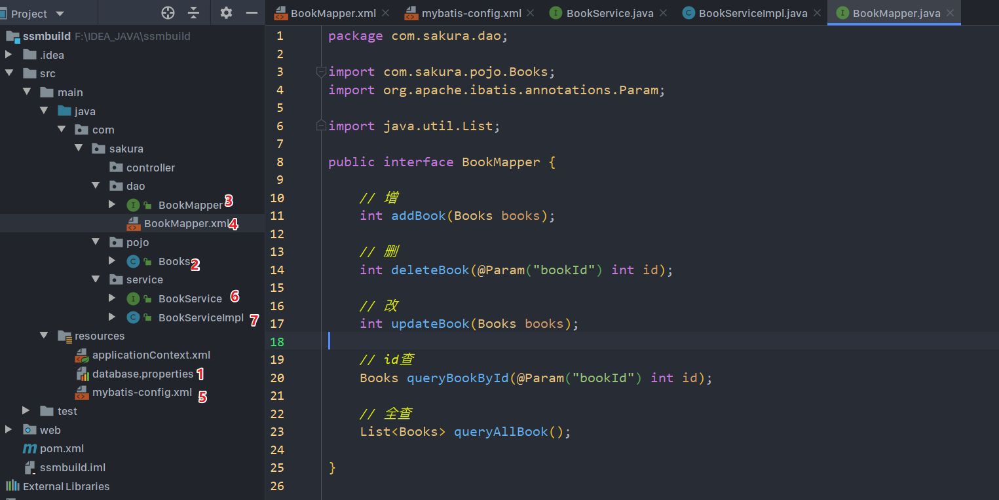

[TOC]

# SSM整合

## 依赖和静态资源导出配置

```xml
<!--基本的依赖：数据库驱动、连接池、junit、jsp、servlet、mybatis、mybatis-spring、spring相关-->
<dependencies>

    <!--junit-->
    <dependency>
        <groupId>junit</groupId>
        <artifactId>junit</artifactId>
        <version>4.12</version>
        <scope>test</scope>
    </dependency>

    <!--数据库连接驱动-->
    <dependency>
        <groupId>mysql</groupId>
        <artifactId>mysql-connector-java</artifactId>
        <version>8.0.17</version>
    </dependency>

    <!--数据库连接池-->
    <dependency>
        <groupId>com.mchange</groupId>
        <artifactId>c3p0</artifactId>
        <version>0.9.5.2</version>
    </dependency>

    <!--Servlet、jsp相关-->
    <dependency>
        <groupId>javax.servlet</groupId>
        <artifactId>servlet-api</artifactId>
        <version>2.5</version>
    </dependency>
    <dependency>
        <groupId>javax.servlet.jsp</groupId>
        <artifactId>javax.servlet.jsp-api</artifactId>
        <version>2.3.1</version>
    </dependency>
    <dependency>
        <groupId>javax.servlet.jsp.jstl</groupId>
        <artifactId>javax.servlet.jsp.jstl-api</artifactId>
        <version>1.2.2</version>
    </dependency>


    <!--mybatis相关-->
    <dependency>
        <groupId>org.mybatis</groupId>
        <artifactId>mybatis</artifactId>
        <version>3.5.4</version>
    </dependency>
    <dependency>
        <groupId>org.mybatis</groupId>
        <artifactId>mybatis-spring</artifactId>
        <version>2.0.4</version>
    </dependency>
    
    <!--spring相关-->
    <dependency>
        <groupId>org.springframework</groupId>
        <artifactId>spring-webmvc</artifactId>
        <version>5.2.4.RELEASE</version>
    </dependency>
    <dependency>
        <groupId>org.springframework</groupId>
        <artifactId>spring-jdbc</artifactId>
        <version>5.2.4.RELEASE</version>
    </dependency>

    <!--其他 ：lombok-->
    <dependency>
        <groupId>org.projectlombok</groupId>
        <artifactId>lombok</artifactId>
        <version>1.18.12</version>
    </dependency>

</dependencies>


<!--静态资源导出问题-->
<build>
    <resources>
        <resource>
            <directory>src/main/java</directory>
            <includes>
                <include>**/*.properties</include>
                <include>**/*.xml</include>
            </includes>
            <filtering>true</filtering>
        </resource>
    </resources>
</build>
```

## Mybatis层



1. 编写数据库连接所需的配置文件
2. ORM(关系对象映射)，创建实体类
3. 写对应实体的DAO层接口
4. 编写对应的xxxMapper.xml 实现接口中的方法，完成对数据库的操作
5. mybatis-config.xml中注册mapper
6. 编写Service层，定义接口
7. 写对应的Service接口，组合DAO层接口，调用DAO层完成业务逻辑。


## Spring层

### spring-dao.xml

1. 关联数据库连接配置文件

   ```xml
   <context:property-placeholder location="classpath:database.properties"/>
   ```

2. 设置连接池，数据源（c3p0，或Spring自带的）

   ==注意==：使用Spring自带的数据源要导包：Spring-jdbc，DriverManagerDataSource类

   ```xml
   <bean id="dateSource" class="com.mchange.v2.c3p0.ComboPooledDataSource">
       <property name="driverClass" value="${jdbc.Driver}"/>
       <property name="jdbcUrl" value="${jdbc.url}"/>
       <property name="user" value="${jdbc.username}"/>
       <property name="password" value="${jdbc.password}"/>
   
   <!--c3p0私有属性设置-->
       <property name="maxPoolSize" value="30"/>
       <property name="minPoolSize" value="10"/>
       <!--关闭连接时不自动commit-->
       <property name="autoCommitOnClose" value="false"/>
       <!--设置连接超时-->
       <property name="checkoutTimeout" value="10000"/>
       <!--尝试获取连接次数-->
       <property name="acquireRetryAttempts" value="2"/>
   </bean>
   ```

3. 注入SqlSessionFactory

   ```xml
   <bean id="sqlSessionFactory" class="org.mybatis.spring.SqlSessionFactoryBean">
       <property name="dataSource" ref="dateSource"/>
       <!--关联Mybatis配置文件-->
       <property name="configLocation" value="classpath:mybatis-config.xml"/>
   </bean>
   ```

4. SqlSessionTemplate

   > 我们在Spring整合MyBatis时，所用的方式有两种：
   >
   > - ==Spring注入私有属性实现==
   >   1. 容器中引用SqlSessionFactoryBean构造注入 配置SqlSessionTemplate对象的Bean
   >   2. 编写Mapper接口的实现类，并添加私有属性SqlSessionTemplate以及Setter
   >   3. 将实现类注入到Spring容器中，并为其注入私有属性SqlSessionTemplate
   > - ==继承SqlSessionDaoSupport类==
   >   1. 实现类继承SqlSessionDaoSupport，使用getSqlSession()方法直接获取SqlSession
   >   2. 在Spring容器中配置实现类的Bean
   >   3. 为实现类Bean 注入SqlSessionFactoryBean

   今天学习第三种：自动扫描Dao层接口，注册到Spring容器中

   ```xml
   <!--4.配置Dao接口扫描包，动态实现Dao接口，注入Spring容器-->
   <bean class="org.mybatis.spring.mapper.MapperScannerConfigurer">
       <!--注入一个SqlSessionFactoryBean-->
       <property name="sqlSessionFactoryBeanName" value="sqlSessionFactory"/>
       <property name="basePackage" value="com.sakura.dao"/>
   </bean>
   ```


### spring-service.xml

1. Service接口实现类注册

   > 由于spring-dao.xml中设置了Dao接口的自动扫描，我们可以直接将Dao层接口直接注入到Service接口实现类中

   ```xml
   <bean id="bookServiceImpl" class="com.sakura.service.BookServiceImpl">
       <property name="bookMapper" ref="bookMapper"/>
   </bean>
   ```

   > 同样方式不止一种，
   >
   > - 采用注解方式
   >
   >   1. 配置文件中开启注解扫描
   >
   >      ```xml
   >      <context:component-scan base-package="com.sakura.service"/>
   >      ```
   >
   >   2. Service接口实现类上使用`@Service`注解
   >
   >   3. 由于要调用Dao层，组合了Dao层，在私有属性上使用`@Autowired`实现自动装配

2. 开启声明式事务

   ```xml
   <bean id="transactionManager" class="org.springframework.jdbc.datasource.DataSourceTransactionManager">
       <property name="dataSource" ref="dateSource"/>
   </bean>
   ```

   > 后续还要AOP相关操作，需要导入织入包，以及一些相关的aop:config等


## SpringMVC

### web.xml

1. 配置`DispatcherServlet`

   ```xml
   <servlet>
       <servlet-name>dispatcher</servlet-name>
       <servlet-class>org.springframework.web.servlet.DispatcherServlet</servlet-class>
       <init-param>
           <param-name>contextConfigLocation</param-name>
           <param-value>classpath:applicationContext.xml</param-value>
       </init-param>
       <load-on-startup>1</load-on-startup>
   </servlet>
   <servlet-mapping>
       <servlet-name>dispatcher</servlet-name>
       <url-pattern>/</url-pattern>
   </servlet-mapping>
   ```

   > 注意关联配置文件一定是==applicationContext.xml==，这是个巨坑！
   >
   > - 如果不设置设置`contextConfigLocation`属性默认在  WEB-INF目录下寻找一个使用servlet-name开头的配置文件，例如这里Servlet-name是dispatcher，那么就会在WEB-INF目录下找dispatcher-servlet.xml，若没有就直接报错。
   > - 如果没有设置为总配置文件，而其他的配置文件有没有被整合到当前所填的配置文件的话，哪些散列在外面的配置文件也就不会被加载和初始化，默认只加载所设置的配置文件。

2. 配置乱码`Filter`

   ```xml
   <filter>
       <filter-name>encoding</filter-name>
       <filter-class>org.springframework.web.filter.CharacterEncodingFilter</filter-class>
       <init-param>
           <param-name >encoding</param-name>
           <param-value>utf-8</param-value>
       </init-param>
   </filter>
   <filter-mapping>
       <filter-name>encoding</filter-name>
       <url-pattern>/*</url-pattern>
   </filter-mapping>
   ```

### spring-mvc.xml

1. 开启自动扫描包

   ```xml
   <context:component-scan base-package="com.sakura.controller"/>
   ```

2. 开启静态资源管理

   ```xml
   <mvc:default-servlet-handler/>
   ```

3. 开启注解驱动

   ```xml
   <mvc:annotation-driven/>
   ```

4. 视图解析器

   ```xml
   <bean class="org.springframework.web.servlet.view.InternalResourceViewResolver">
       <property name="prefix" value="/WEB-INF/jsp/"/>
       <property name="suffix" value=".jsp"/>
   </bean>
   ```

   