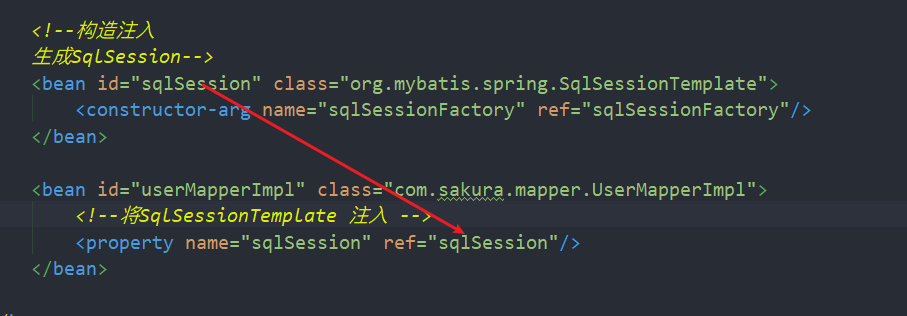

[toc]

# Spring5


## 一、了解历史

> Java？Spring？春天？他们之间到底有怎样的联系？

- spring的缔造者**Rod Johnson**
- 一本名为**Expert one-on-one J2EE Development without EJB**的书
- 关于EJB（**Enterprise Java Beans**）又被称为 "企业Java Beans"

> 关于Spring的发展起源要回溯到**2002年**，当时正是**Java EE和EJB大行其道**的时候，很多知名公司都是采用此技术方案进行项目开发。这时候有一个小伙子认为 EJB 太过臃肿，并不是所有的项目都需要使用 EJB 这种大型框架，应该会有一种更好的方案来解决这个问题。
>
> **他提出了一个基于普通 Java 类（POJO）和依赖注入的更简单的解决方案。**
>
> 他展示了如何在不使用 EJB 的情况下构建高质量、可扩展的在线座位预留系统。为了构建应用程序，他编写了超过 30,000 行的基础结构代码，项目中的根包命名为 `com.interface21`，所以人们最初称这套开源框架为 interface21，这就是 **Spring 的前身。**

**“轮子理论”，也即“不要重复发明轮子”，这是西方国家的一句谚语，原话是：Don't Reinvent the Wheel。**Spring就是在“不重复发明轮子”的理念及指导原则上做起来。

### 1.1发展

**2003 年** Rod Johnson 和同伴在此框架的基础上开发了一个全新的框架命名为 Spring，据 Rod Johnson 介绍 Spring 是传统 J2EE 新的开始，随后 Spring 发展进入快车道。

- 2004 年 03 月，1.0 版发布。
- 2006 年 10 月，2.0 版发布。
- 2007 年 11 月，更名为 SpringSource，同时发布了 Spring 2.5。
- 2009 年 12 月，Spring 3.0 发布。
- **2012年   Rod Johnson宣布离开Spring**
- 2013 年 12 月，Pivotal 宣布发布 Spring 框架 4.0。
- 2017 年 09 月，Spring 5.0 发布。


### 1.2What is Spring?

==通常， Spring 是指一个用于构造 JAVA 应用程序的轻量级框架==

1. 你可以采用 Spring 来构造任何程序
2. Spring 是轻量级的，意味着你只需对你的程序代码做很少改动。**（最少的侵入）**
3.  Spring 核心本身——很多附加的 Spring 组件，比如数据访问，需要与 Spring 框架有相对紧密得多的耦合关系。


### 1.3什么是最少侵入？

#### 侵入式：

> 侵入式的做法是要求业务代码”知道”框架的代码，表现为**业务代码==需要继承框架提供的类==，才能很好的和框架结合，使用框架带来的便利。**

**侵入式让业务代码产生对框架的依赖**，这些代码不能在框架外使用，**不利于代码的复用。**

但是，可以使用户和框架更好的结合，**更容易更充分的利用框架提供的功能**。

#### 非侵入式

> 非侵入式则不需要业务代码引入框架代码的信息，即无需继承框架提供的类，从编写者的角度来看，**察觉不到框架的存在。**

**可以很方便的迁移到其他地方使用，代码的复用性较好。**

但是框架和业务代码**互动的方式可能就比较复杂**。

#### 非侵入式的技术体现

允许在应用系统中**自由选择和组装Spring框架的各个功能模块**，并且**不强制要求**应用系统的类必须继承或实现Spring框架的类和接口来达到使用框架的目的。

#### 如何实现非侵入式

1. 引用==**反射机制**==，通过动态调用的方式来提供各方面的功能，建立核心组件BeanFactory
2. 配合使用Spring框架中的==**BeanWrapper和BeanFactory组件类**==最终达到**对象的实例创建**和**属性注入**


### 1.4、SSH和SSM

SSH：Structs + Spring + Hibernate

SSM：SpringMVC + Spring + MyBatis


### 1.5、Spring的优点

1. Spring是一个开源的免费的框架（容器）
2. Spring是一个轻量级的、非入侵式的框架
3. 控制反转（IOC）、面向切面编程（AOP）
4. 支持事务的处理，对框架整合的支持


### 1.6、Spring的组成和扩展

- 七大模块：


- SpringBoot
  - 一个快速开发的脚手架
  - 基于SpringBoot可以快速地开发单个微服务
- SpringCloud
  - 基于SpringBoot实现


## 二、IOC理论

 IOC：（Inversion of Control）控制反转

> 传统开发，我们需要对于客户的不同需求修改代码创建不同的对象，**对象的创建由开发者控制**，而新模式的开发，应该是**由调用者去决定对象的创建**，且不影响源代码。
>
> 使用了set注入后，**程序的所有对象由Spring为我们注入**，开发人员只需搭建好框架，写好配置文件即可。
>
> 系统的耦合性降低，（松耦合） **更加专注于业务的开发。**
>
> **控制反转**：==**主动权由程序员转换到用户**==

由于是"**获得依赖对象的过程被反转了**"

**依赖注入（Dependency Injection，DI）**则是控制反转的一种实现，所谓依赖注入，就是由IOC容器在运行期间，**动态地将某种依赖关系注入到对象之中。**

> 其实IOC也好DI也好都是**通过引入IOC容器，利用依赖关系注入的方式，实现对象之间的解耦**。


**举例：**

对象A依赖于对象B,当对象 A需要用到对象B的时候，IOC容器就会立即创建一个对象B送给对象A。IOC容器就是一个对象制造工厂，你需要什么，它会给你送去，你直接使用就行了，而再也**不用去关心你所用的东西是如何制成的，也不用关心最后是怎么被销毁的，这一切全部由IOC容器包办。**

在**传统的实现**中，由程序内部代码来控制组件之间的关系。我们经常**使用new关键字来实现两个组件之间关系的组合，这种实现方式会造成组件之间耦合。**


[参考博客]<https://blog.csdn.net/love_everybody/article/details/79836136?depth_1-utm_source=distribute.pc_relevant.none-task>

**控制反转是一种通过描述（XML或注解）并通过第三方去生产或获取特定对象的方式。在Spring中实现控制反转的是IoC容器，其实现方法是依赖注入。**


## 三、HelloSpring

1. 导入官方xml配置（直接创建Spring）

   ```xml
   <?xml version="1.0" encoding="UTF-8"?>
   <beans xmlns="http://www.springframework.org/schema/beans"
       xmlns:xsi="http://www.w3.org/2001/XMLSchema-instance"
       xsi:schemaLocation="http://www.springframework.org/schema/beans
           https://www.springframework.org/schema/beans/spring-beans.xsd">
   
       <bean id="..." class="...">  
           <!-- collaborators and configuration for this bean go here -->
       </bean>
   
       <bean id="..." class="...">
           <!-- collaborators and configuration for this bean go here -->
       </bean>
   
       <!-- more bean definitions go here -->
   
   </beans>
   ```

   | The `id` attribute is a string that identifies the individual bean definition. |
   | ------------------------------------------------------------ |
   | **The `class` attribute defines the type of the bean and uses the fully qualified classname.** |

2. 容器中创建对象

   > xml配置文件中  **使用<bean>标签创建对象**，标签中**使用<property>标签设置属性值**，前提是对应的**实体类中有相应的 SET 方法。**

   ```xml
   <bean id="hello" class="com.sakura.pojo.Hello">
       <property name="msg" value="Spring"/>
   </bean>
   ```

   | name：对应于当前==对象的属性名==                             |
   | ------------------------------------------------------------ |
   | **value：设置对应的==属性值==**                              |
   | **ref：当属性并不是普通类型时，而是引用类型时， 通过ref 指定==引用对象==的 bean的id** |

   - **ref 和 id 之间的这种联系表达了协作对象之间的依赖关系**

3. 从容器中获取对象

   ```java
   @Test
   public void helloTest() {
       // 获取Spring的上下文对象
       ApplicationContext context = new ClassPathXmlApplicationContext("beans.xml");
       // 我们的对象存放在Spring的容器中，使用时取出即可
       Hello bean = (Hello) context.getBean("hello");
       System.out.println(bean);
       }
   }
   ```

   > Spring的Resource，它提供了一种从 URI 语法中定义的位置读取 InputStream 的便捷机制。
   >
   > 
   >
   > **ClassPathXmlApplicationContext**只是**ApplicationContext接口**众多实现类的一种，因为此处我们使用xml配置文件，所以使用CPX,而当我们使用注解配置时，又需要用到另一个实现类**AnnotationConfigApplicationContext**


到这我们再去修改传统开发的代码：

**第一版**

```java
public class UserServiceImp implements UserService {

	//  SqlDao sqlDao = new MysqlImp();
	SqlDao sqlDao = new OracleImp();
    /*
    * 以上传统的方式需要我们通过用户的需求，频繁修改代码。
    */
    
    @Override
    public void getSqlResource() {
        sqlDao.getSql();
    }
}
```

> 当我们想要使用同一个接口的不同实现类的方法时，**就需要频繁改变组合的对象（使用哪个new哪个）**。。为了避免这种情况，我们可以只**组合好相应的接口，增加Set方法，由调用者来决定使用哪个实现类**

**第二版**

private SqlDao sqlDao;

```java
public class UserServiceImp implements UserService {

    /*
    * 以下使用Set方法实现控制反转
    */
    // 组合接口
    private SqlDao sqlDao;
	
    // set方法控制 具体实现类
    public void setSqlDao(SqlDao sqlDao) {
        this.sqlDao = sqlDao;
    }

    @Override
    public void getSqlResource() {
        sqlDao.getSql();
    }
}
```
> 修改后，业务代码无需变更，调用者通过Set方法来指定具体的实现类 即可，**依赖的获取过程从开发人员创建对象，转换为 用户自定义选择**，IoC的本质就是如此，进一步修改，使用SpringIoC容器

**第三版**

```xml
<bean id="mysql" class="com.sakura.dao.MysqlImp"/>
<bean id="oracle" class="com.sakura.dao.OracleImp"/>
<bean id="sqlserver" class="com.sakura.dao.SqlServerImp"/>


<bean id="sqlService" class="com.sakura.service.UserServiceImp">
    <property name="sqlDao" ref="sqlserver"/>
</bean>
```

> 对象的创建与管理交由容器去处理，**调用者无需显式的调用set方法**，而是通过容器进行依赖注入，当需要修改时，仅需修改配置文件即可。
>
> 例如上述情况：修改ref的值为（mysql / oracle / sqlserver）即可，然后由Spring完成装配。


## 四、IoC创建对象的方式

### 1、使用对象的无参构造创建对象（默认）（**没有无参构造会报错**）

> 容器使用类的无参构造创建对象，再使用set方法设置属性值，所以，无参构造和各个属性的set方法是必要的。

```xml
<bean id="hello" class="com.sakura.pojo.Hello">
    <property name="msg" value="Spring"/>
</bean>
```

### 2、使用有参构造

- 使用**下标** 传递参数 index

  ```xml
  <!--通过下标传递参数-->
  <bean id="hello2" class="com.sakura.pojo.Hello">
      <constructor-arg index="0" value="Sakura"/>
  </bean>
  ```

- 通过**类型判断** 传递参数 type  （不推荐）

  当多个参数是相同类型时，就会出错

  ```xml
  <!--通过类型判断传递参数-->
  <bean id="hello3" class="com.sakura.pojo.Hello">
      <constructor-arg type="java.lang.String" value="官宇辰"/>
  </bean>
  ```

- 通过**属性名** 传递参数 name

  ```xml
  <!--通过属性名设置参数-->
  <bean id="hello4" class="com.sakura.pojo.Hello">
      <constructor-arg name="msg" value="Gyc"/>
  </bean>
  ```


> Spring在加载配置文件时，容器中所有的对象就已经被创建了，不管是否使用。
>
> 


## 五、Spring配置

### 1、Alias

为Bean取别名，使用别名和原名都可以取到这个对象

```xml
<alias name="hello" alias="helloAlias"/>
```

### 2、Bean

| id        | bean的唯一标识符，类似于对象名            |
| --------- | ----------------------------------------- |
| **Class** | **bean对象对应的类的全限定名**            |
| **name**  | **name 也是bean的别名（可以取多个别名）** |

```xml
<bean id="hello" class="com.sakura.pojo.Hello" name="h1">
    <property name="msg" value="Spring"/>
</bean>
```


### 3、import

用于团队开发使用，将所有人的spring配置文件，导入合并为一个，可以访问使用所有人的配置文件。

**若导入的多个配置文件中存在bean重名**，那么将**按照导入顺序选用最后一次出现的bean**,即后导入的会覆盖之前的


## 六、依赖注入

### 为什么要使用依赖注入

  - 传统的代码，每个对象负责管理与自己需要依赖的对象，导致如果需要切换依赖对象的实现类时，需要修改多处地方。同时，过度耦合也使得对象难以进行单元测试。
  - 依赖注入把对象的创造交给外部去管理,很好的解决了代码**紧耦合**（tight couple）的问题，是一种让代码实现**松耦合**（loose couple）的机制。
  - 松耦合让代码更具灵活性，能更好地**应对需求变动**，以及**方便单元测试**。

### 6.1、构造器注入

上面的容器使用构造器创建对象。**要避免出现循环依赖.**

### 6.2、Set方式注入（重点）

- 依赖注入

  - 依赖：bean对象的创建依赖容器
  - 注入：bean对象的属性，由容器注入

- 官方说明：

  > > *.**Setter-based DI** is accomplished by the container calling setter methods on your beans **after invoking a no-argument constructor** or a no-argument static factory method to instantiate your bean.*
  >
  > 由于您**可以混合使用** constructor-based 和 setter-based DI，因此**将构造函数用于强制依赖项**、 setter 方法或使用 configuration 方法用于可选依赖项
  >
  >  setter 方法上使用**@Required** annotation 可用于使 property 成为必需的依赖项。
  >
  > Spring 团队通常**提倡构造函数注入**，因为它允许您将 application 组件实现为不可变对象并**确保所需的依赖项不是null。**
  >
  > 相反如果**没找到有在xml里面指定要注入的对象**，那么**set注入不会失败**，所依赖的对象没有被注入任何对象，因此**默认为null。**可以使用`@Required`来标记必须注入的属性/对象。可以在容器初始化时就报错，而避免运行时空指针异常。
  >
  > Setter 注入应主要仅用于可在 class 中指定了合理默认值的可选依赖项。

#### 普通属性

```xml
<!--普通属性-->
<property name="name" value="官宇辰"/>
<property name="age" value="1"/>
<property name="sex" value="男"/>
```

#### 数组

```xml
<!--数组-->
<property name="books">
    <array>
        <value>西游记</value>
        <value>红楼梦</value>
        <value>水浒传</value>
        <value>三国演义</value>
    </array>
</property>
```

#### List

```xml
<!--List-->
<property name="roommates">
    <list value-type="java.lang.String">
        <value>陈阳</value>
        <value>李晨</value>
        <value>范康</value>
    </list>
</property>
```

#### Set

```xml
<!--Set-->
<property name="hobbies">
    <set value-type="java.lang.String">
        <value>网球</value>
        <value>Java</value>
        <value>OverWatch</value>
    </set>
</property>
```

#### Map

```xml
<!--Map-->
<property name="score">
    <map key-type="java.lang.String" value-type="java.lang.Integer">
        <entry key="高数" value="63"/>
        <entry key="数据结构" value="70"/>
        <entry key="Java程序设计" value="82"/>
    </map>
</property>
```

#### Properties

```xml
<!--Properties-->
<property name="stuInfo">
    <props value-type="java.lang.String">
        <prop key="姓名">官宇辰</prop>
        <prop key="年龄">20</prop>
        <prop key="性别">男</prop>
        <prop key="寝室号">栎苑5T-1</prop>
    </props>
</property>
```

#### 引用类型

```xml
<!--内部 bean 定义不需要定义的 ID 或 name。-->
<property name="dorm">
    <bean class="com.sakura.pojo.Address">
        <property name="buildingNo" value="L5"/>
        <property name="roomNo" value="1"/>
    </bean>
</property>
```

#### Null

```xml
<!--空值-->
<property name="girlfriend">
    <null/>
</property>
```

### 6.3、扩展方式注入

[XML Shortcut with the p-namespace](https://docs.spring.io/spring/docs/5.2.5.RELEASE/spring-framework-reference/core.html#beans-p-namespace)

p（property）命名空间依赖注入，适用于Set注入

```xml
<!--P命名空间注入-->
<bean id="Wang" class="com.sakura.pojo.Persom" p:age="22" p:name="老王"/>
```


[XML Shortcut with the c-namespace](https://docs.spring.io/spring/docs/5.2.5.RELEASE/spring-framework-reference/core.html#beans-c-namespace)

c（constructor）命名空间依赖注入，适用于构造器注入

提供了索引注入和属性名注入两种方式

```xml
<!--C命名空间注入-->
<bean id="Li" class="com.sakura.pojo.Persom" c:_0="老李" c:_1="23"/>
<bean id="Liu" class="com.sakura.pojo.Persom" c:name="老刘" c:age="21"/>
```


### 6.4、Bean的作用域(Scope)

<bean id="..." class="..." ==scope="..."==></bean>

| 范围                                                         | 描述                                                         |
| :----------------------------------------------------------- | :----------------------------------------------------------- |
| [singleton](https://www.docs4dev.com/docs/zh/spring-framework/5.1.3.RELEASE/reference/core.html#beans-factory-scopes-custom) | (**默认**)为每个 Spring IoC 容器的单个 object 实例定义单个 bean 定义。 |
| [prototype](https://www.docs4dev.com/docs/zh/spring-framework/5.1.3.RELEASE/reference/core.html#beans-factory-scopes-singleton) | 为任意数量的 object 实例定义单个 bean 定义。                 |
| [request](https://www.docs4dev.com/docs/zh/spring-framework/5.1.3.RELEASE/reference/core.html#beans-factory-scopes-prototype) | 将单个 bean 定义范围限定为单个 HTTP 请求的生命周期。也就是说，每个 HTTP 请求都有自己的 bean 实例，该实例是在单个 bean 定义的后面创建的。 |
| [session](https://www.docs4dev.com/docs/zh/spring-framework/5.1.3.RELEASE/reference/core.html#beans-factory-scopes-request) | 将单个 bean 定义范围限定为 HTTP `Session`的生命周期。        |
| [application](https://www.docs4dev.com/docs/zh/spring-framework/5.1.3.RELEASE/reference/core.html#beans-factory-scopes-session) | 将单个 bean 定义范围限定为`ServletContext`的生命周期。       |
| [webSocket](https://www.docs4dev.com/docs/zh/spring-framework/5.1.3.RELEASE/reference/web.html#beans-factory-scopes-application) | 将单个 bean 定义范围限定为`WebSocket`的生命周期。            |

[Request/Session/Application/WebSocket]  仅在 web-aware Spring ApplicationContext的 context 中有效。

#### 1. 单例（Singleton）


```java
Hello bean = (Hello) context.getBean("hello");
Hello bean2 = (Hello) context.getBean("hello");
System.out.println(bean == bean2); // true
```


#### 2. 原型（prototype）

****

**每次获取对象，都会新建一个对象**

```java
Hello bean = (Hello) context.getBean("hello");
Hello bean2 = (Hello) context.getBean("hello");
System.out.println(bean == bean2); // false
```


## 七、自动装配（Autowire）

官方原话： **==The Spring container can autowire relationships between collaborating beans.==** 

**（Spring容器可以自动装配协作beans之间的依赖关系）**

- 自动装配是Spring满足bean依赖的一种方式。
- Spring会在上下文中寻找，自动为bean装配属性。

Spring中的三种装配方式：

1. xml中显式地配置
2. Java中显式地配置
3. ==**隐式地自动装配**==

使用元素的`autowire`属性为 bean 定义指定 autowire 模式。

| 模式          | 说明                                                         |
| :------------ | :----------------------------------------------------------- |
| `no`          | (默认)无自动装配。 Bean references 必须由`ref`元素定义。     |
| `byName`      | property name 自动装配。 Spring 查找 bean，其 name 与需要自动装配的 property 相同。 |
| `byType`      | 如果容器中只存在于 property 类型相同的一个 bean，则允许 property 自动装配。如果存在多个，则抛出 exception，这表示您不能对该 bean 使用`byType`自动装配。如果没有匹配的 beans，则不会发生任何事情(property 未设置)。 |
| `constructor` | 类似于`byType`但适用于构造函数 arguments。如果容器中没有构造函数参数类型的一个 bean，则会引发致命错误。 |

### 7.1、byName自动装配

```xml
<bean id="cat" class="com.sakura.pojo.Cat" p:name="凯蒂"/>
<bean id="dog" class="com.sakura.pojo.Dog" p:name="旺财"/>

<bean id="people" class="com.sakura.pojo.People" autowire="byName" p:name="官宇辰"/>
```

> 注意点：
>
> - Spring会在容器中搜索与**Set方法中set后名字（而非属性的名字）**相同的 bean id或者name 然后装配。
>
>   例如：属性值为 author  而 set方法名为 `setAuthorA`  那么容器就会查找 id或者别名 为`AuthorA`或`authorA`的bean 进行自动装配。
>
> - **所以规范起见，保证属性和set方法名中一致，方便设置自动装配的对象（使bean id与属性名同名即可）**


### 7.2、byType自动装配

```xml
<bean id="cat23" class="com.sakura.pojo.Cat" p:name="凯蒂"/>
<bean id="dog223" class="com.sakura.pojo.Dog" p:name="旺财"/>

<bean id="people" class="com.sakura.pojo.People" autowire="byType" p:name="官宇辰"/>
```

> 注意点：
>
> byType自动装配虽然不要求id/name 与属性同名，但是同样存在缺陷：
>
> - **当需要自动装配的属性的类型  对应在容器中存在多个同类型的bean 则无法使用byType装配**。
> - 必须保证装配的属性类型在容器下只有一个bean


### 7.3、使用注解自动装配

与XML配置相比注解配置要更容易更简洁，但是也各有各的优点和弊端。

**XML擅长在不接触源代码或不重新编译它们的情况下连接组件。**一些开发人员喜欢将连接放在接近源的地方，而另一些人则认为带注释的类不再是pojo，而且配置变得分散，更难控制。

使用注解前准备工作：

1. 导入context约束

2. 配置开启注解

   ```xml
   <context:annotation-config/>
   ```
   
3. 设置需要扫描注解的包

   ```xml
   <context:component-scan base-package="包名"/>
   ```

4. 在需要自动装配的属性上使用@Autowire注解或者@Resource


**@Autowired**

既可用于属性，也可以用于set方法。

当IOC容器中如果存在符合自动装配的bean，那么对应的属性的Set方法也可以去掉。

使用@Autowire注解自动装配，**本质先byType 然后byName。** 

#### 小知识

**@Nullable** 若字段标记了这个注解，表示这个字段可以为null

```java
@Autowired(required=false) // 表示这个对象可以为Null
// 默认required为true
```

**@Qualifier** 通过**指定bean-id**来完成自动装配，**适用于同一类型存在多个bean的情况。**

**@Resource** Java注解的方式自动装配，**优先byName然后byType**，若此时要精确匹配bean名称查找则为：@Resource(name="bean名称")。

**@Value** 可以注入普通类型的属性。**若容器中对象设置了则以容器中为优先**，例如：

```java
@Value(value=”张三”)
private String name;
```


## 八、使用注解开发

> 1. 保证aop的包已导入
> 2. 设置开启注解
> 3. 设置扫描注解的包

### 8.1、bean

**@Component**：组件，用在类上。

```java
@Component(value="gyc")
public class User {

    @Value(value = "官宇辰")
    private String name;

    @Override
    public String toString() {
        return "User{" +
                "name='" + name + '\'' +
                '}';
    }
}
```

> 注意：
>
> - 在使用@Component时，**表明这个对象已经交由Spring托管**
> - 在@Component不设置value属性时，默认使用**类名首字母小写**作为bean-id，若**设置了value属性则以设置为准，默认的即失效**。且bean 默认还是单例模式，可使用Scope注解修改


### 8.2、属性注入

**@Value** 普通属性注入

其他复杂类型使用自动装配的注解。

### 8.3、衍生注解

MVC分层以后：出现@Component的衍生注解

- dao 【@Repository】
- service 【@Service】
- controller 【@Controller】

四个注解的功能都是将**类注册到Spring中，装配Bean**

### 8.4、自动装配注解

**@Autowired**

**@Qualifier** 

**@Nullable** 

### 8.5、作用域

**@Scope(value="...")**


## 九、完全使用Java配置（JavaConfig）

不再使用xml配置文件、全权交给Java去做

JavaConfig

使用**@Configuration注解来标明一个配置类。**

**获取ApplicationContext时，使用new AnnotationConfigApplicationContext(xxx.class)**；

### 9.1、使用JavaConfig创建bean

- **采用@Component**

每个类使用@Component标记（属性值可以使用自动装配完成设置），在config类中需要设置扫描包。这样扫描的包下所有标记了@Component的对象都会由Spring托管。

> 
>
> basePackageClasses是类型安全的，它的值是一个class数组，表明Spring将会扫描这些class所在的包。

```java
@Configuration

@ComponentScan(value = "com.sakura.pojo") // 设置扫描pojo包

public class JavaConfig {
    
}
```


这样，即便是配置类中什么都没有写，也能完成bean的创建。


- **配置类中采用@Bean标记**

```java
@Configuration
public class JavaConfig {

    @Bean
    public User userA(){
        User user = new User();
        user.setName("官宇辰");
        return user;
    }
    /*
    * 与之等价的xml文件配置
    *
    <bean id="userA" class="com.sakura.pojo.User">
        <property name="name" value="官宇辰">
    </bean>
    * */

    @Bean
    public Person personA(){
        Person person = new Person();
        person.setId(170312);
        return person;
    }

    /*
    * 与之等价的xml文件配置
    *
    <bean id="personA" class="com.sakura.pojo.Person">
        <property name="id" value="170312>
    </bean>
    * */

}
```

> 所有使用@Bean标记的都对应容器中的一个bean，**方法名相当于bean-id；返回值为class；属性可以通过在方法中使用对应类的属性的set方法设置**，相当于把之前容器创建对象的过程变为我们手动操作。


##  九、【新增】xml、注解和Java Config到底选哪个

**XML这种类型不安全的配置**，当在编辑配置文件写错类名或包名时，很难排查出错误，且不容易发现，而直到项目运行启动了才能发现出问题。

**使用注解和Java Config**，这样在我拼写错的时候，由于找不到这类，**编译都不会通过**。

**然鹅注解也不是万能的！！**当我们需要注入的依赖，或者需要自动装配的**依赖来自于第三方jar包时，我们无法接触到别人写好的类，也就无法添加相应的注解。**


## 十、AOP

> 在代理模式的学习基础上，学习AOP(Aspect-Oriented Programming)是**面向切面编程的简称**

###  定义：什么是AOP

计算机科学中,AOP是一种编程范式，通过分离横切关注点点来增加模块性。**它可以在已有的代码上增加额外的行为，却不需要修改已有的代码，而是通过指定代码的切点来实现。**


### 问题：为什么要使用AOP

大部分时候我们要遵循“**单一职责**”原则，即每个类只做一件事，做好自己的事情，这样很多**类都是只做自己的事**，**类之间不相互知悉**，但实际上它们之间有**一些共同的事情要做**。比如日志，事务，认证操作。虽然通过OOP的设计模式也可以实现复用效果，但AOP更加直观容易操作，**OOP本身还是在代码中比AOP耦合的更多**，**AOP基本不需要侵入修改原本的代码。**


### AOP术语


- **JoinPoint(连接点，加入点)**，如类的初始化前，类的初始化后，类的某个方法调用前，类的某个方法调用后，方法抛出异常后等位置。 ==**Spring仅支持方法的JoinPoint**==
- **PointCut(切点)**，每个程序都有多个JoinPoint, 其中我们感兴趣的那个JoinPoint，要下手操作的那个点叫做Pointcut。
- **Aspect(切面)**: 将**横切关注点（即我们要横切进去的功能）**模块化成为一个**类**，里面可以**定义切入点和增强**
- **Advice(增强，官方：通知)**，我们找到感兴趣的点(PointCut)之后做什么呢，不管做什么，都是比之前做的事情多了那么一点点，所以可以理解为增强。


- **IntroductIon(引介)**，引介是一种特殊的增强，它为类添加了一些属性和方法。这样，即使一个业务类原本没有实现某个接口，通过AOP的引介功能，也可以动态地为该业务添加接口的实现逻辑，让业务类变成这个接口的实现；

- **Target(目标对象)**，要下手的目标类

- **Weaving (织入)**，将Advice添加到Target的具体JoinPoint的过程。


### AOP常用场景

- 系统的性能检测
- 访问控制
- 事务管理
- 日志记录


### ==**五种类型的Advice**==

|   通知类型   |      连接点       |                      实现接口                       |
| :----------: | :---------------: | :-------------------------------------------------: |
|   前置通知   |      方法前       |   org.springframework.aop.**MethodBeforeAdvice**    |
|   后置通知   |      方法后       |  org.springframework.aop.**AfterReturningAdvice**   |
|   环绕通知   |     方法前后      |   org.aopalliance.intercept.**MethodInterceptor**   |
| 异常抛出通知 |   方法抛出异常    |      org.springframework.aop.**ThrowsAdvice**       |
|   引介通知   | 类中新增方法/属性 | org.springframework.aop.**IntroductionInterceptor** |


## 十一、spring实现AOP

【导包】！需要导入织入包

```xml
<!-- https://mvnrepository.com/artifact/org.aspectj/aspectjweaver -->
<dependency>
    <groupId>org.aspectj</groupId>
    <artifactId>aspectjweaver</artifactId>
    <version>1.9.5</version>
</dependency>
```

### 方式一：使用Spring的API接口

1. 编写正常业务接口以及实现类

   

2. 编写扩展/公共业务（增强业务）

   > 根据实际需求（在方法前还是方法后，还是前后都有等），选中对应的增强实现接口并实现，在重写的方法中编写增强业务。

   - **前置增强 实现MethodBeforeAdvice接口**

   ```java
   public class BeforeLog implements MethodBeforeAdvice {
   
       // 前置增强的内容
       /*
       method:被增强的方法
       object:方法参数
       o:目标对象，动态代理中的target
        */
   public void before(Method method, Object[] objects, Object o) throws Throwable {
           System.out.println("开始执行" + o + "的" + method.getName() + "方法被执行了");
       }
   }
   ```

   - **后置增强，实现AfterReturningAdvice接口**

   ```java
   public class AfterLog implements AfterReturningAdvice {
   
       // 后置增强内容 参数内容与前置增强类似
       // 第一个参数是被增强方法执行完毕的 返回值
       public void afterReturning(Object o, Method method, Object[] objects, Object o1) throws Throwable {
           System.out.println(o + "的" + method.getName() + "执行完毕，返回值为" + o);
       }
   }
   ```

3. 编写配置文件

   > 1. 注册业务类
   > 2. **引入aop约束【别漏了】**
   > 3. 配置aop
   >    - 设置切入点
   >    - 设置增强

   ```xml
   <!--1 创建bean 注册业务类-->
   <bean id="service" class="com.sakura.service.UserServiceImpl"/>
   <bean id="beforLog" class="com.sakura.log.BeforeLog"/>
   <bean id="afterLog" class="com.sakura.log.AfterLog"/>
   
   
   <!--3 配置aop-->
   <aop:config>
       <!--设置切入点 pointcut
       id:切入点id
       expression:表达式：execution()匹配切入点
                           *(权限符) *(类名.方法名) *(方法参数)
       -->
       <aop:pointcut id="servicePoint" expression="execution(* com.sakura.service.UserServiceImpl.* (..))"/>
       <!--设置增强-->
       <aop:advisor advice-ref="afterLog" pointcut-ref="servicePoint"/>
       <aop:advisor advice-ref="beforLog" pointcut-ref="servicePoint"/>
   </aop:config>
   ```

   > execution表达式:
   >
   > 第一个 * ：表示返回类型，*表示所有返回类型
   >
   > 第二个*：表示类名
   >
   > 第三个*：表示方法名 （..）中表示方法参数，'..' 表示任意参数

4. 测试

   ```java
   @Test
   public void testAop() {
       ApplicationContext context = new ClassPathXmlApplicationContext("applicationContext.xml");
       UserService userService = context.getBean("service", UserService.class);
       userService.select();
   }
   ```

   > 注意：
   >
   > 在getBean时，我们应该获取的是正常业务类的接口，而不是具体的某个实现类，因为**动态代理中，代理对象实现的是对接口的代理，即代理一系列类。**

   输出：

   


### 方式二：自定义类【切面定义】

1. 编写普通业务接口及其实现类。

2. 编写自定义切面，和增强业务。

   ```java
   public class MyAspect {
   
       // 自定义增强业务
   
       public void before() {
           System.out.println("[DEBUG] 方法开始执行");
       }
   
       public void after() {
           System.out.println("[DEBUG] 方法执行完毕");
       }
   }
   ```

   > 省去了方式一中通过实现各种Advice接口来编写增强业务代码，但是同时也降低了可操作性。方式一中可以操作相关方法以及对象，而这种方式则不行，但是容易编写。

3. 编写配置文件

   > 1. 注册业务实现类，和自定义业务类
   > 2. 配置aop【不要忘了引入约束】
   >    - 引用自定义切面
   >    - 设置切入点
   >    - 设置增强

   ```xml
   <bean id="userService" class="com.sakura.service.UserServiceImpl"/>
   <bean id="diyAspect" class="com.sakura.aspect.MyAspect"/>
   
   <aop:config>
       <!--引用自定义切面-->
       <aop:aspect id="myAspect" ref="diyAspect">
           <aop:pointcut id="servicePointcut" expression="execution(* com.sakura.service.UserServiceImpl.*(..))"/>
           <aop:before method="before" pointcut-ref="servicePointcut"/>
           <aop:after method="after" pointcut-ref="servicePointcut"/>
       </aop:aspect>
   </aop:config>
   ```

   > 这里设置增强更为直观，将每一个增强业务与自定义类中的方法一一对应。

4. 测试

   与方式一相同，略

   输出：

   


### 方式三：使用注解实现

1. 编写普通业务接口及其实现类

2. 编写自定义切面类，并使用注解标记

   ```java
   @Aspect  // 使用注解声明这是一个切面类
   public class AnnoAspect {
   
       @Before("execution(* com.sakura.service.UserServiceImpl.*(..))")
       public void before() {
           System.out.println("[DEBUG]====方法将要开始执行====");
       }
   
       @After("execution(* com.sakura.service.UserServiceImpl.*(..))")
       public void after() {
           System.out.println("[DEBUG]====方法已经执行结束====");
       }
   
       @Around("execution(* com.sakura.service.UserServiceImpl.*(..))")
       public void around(ProceedingJoinPoint joinPoint) throws Throwable {
           // joinPoint即连接点
           Signature signature = joinPoint.getSignature(); // 获取方法的签名
   
           System.out.println("前部环绕");
           System.out.println("方法签名："+signature);
   
           // 方法执行
           joinPoint.proceed();
   
           System.out.println("后部环绕");
   
       }
   }
   ```

   > Advise注解中传入切入点表达式作为参数！

3. 编写配置文件

   > 注册业务实现类，和切面类
   >
   > 开启注解支持，使用自动代理

   ```xml
   <bean id="annoAspect" class="com.sakura.aspect.AnnoAspect"/>
   <bean id="userService2" class="com.sakura.service.UserServiceImpl"/>
   
   
   <!--开启注解，自动代理
   proxy-target-class：为false时采用JDK动态代理方式(默认)，为true采用cglib动态代理方式
   -->
   <aop:aspectj-autoproxy proxy-target-class="false"/>
   ```

4. 测试

   略

   输出：

   


## 十二、整合Mybatis

### 12.1、回忆Mybatis

1. **导包**
   - junit
   - mybatis
   - mysql-connect
   - jdbc
   - Spring相关
   - aop织入
   - lombok
   - mybatis-spring【新】
2. **回顾Mybatis全过程**
   - 编写实体类
   - 编写mapper接口，以及mapper.xml
   - 编写mybatis-config.xml  以及 db.properties 
     - 设置别名
     - mapper注册
   - 测试
     - 获取配置文件
     - 创建SqlSessionFactoryBuilder读取配置文件，使用build方法从配置文件中创建SqlSessionFactory
     - SqlSessionFactory使用openSessen() 获取SqlSession
     - SqlSession使用getMapper() 获取对应接口的代理的对象
     - 执行对应的方法，并输出结果


### 12.2、整合Mybatis

#### 方式一

【导入 mybatis-spring 包】

**第一步**

**改换使用Spring的数据源(DataSource**

整合前，Mybatis：


整合后：写在spring的配置文件中


**第二步**

**创建SqlSessionFactory**

整合前


整合后：

Spring配置文件中使用 `SqlSessionFactoryBean`来创建 `SqlSessionFactory`，其**需要一个DataSource**


> 通常Mybatis配置文件中，只放相关设置，和别名。

**第三步**

**获取SqlSession**

> `SqlSessionTemplate`（Template是模板的意思，在Spring总大量应用） 是 MyBatis-Spring 的核心。作为 SqlSession 的一个实现，这意味着可以使用它无缝代替你代码中已经在使用的 SqlSession。`SqlSessionTemplate` 是线程安全的，可以被多个 DAO 或映射器所共享使用。
>
> **由于SqlSessionTemplate没有Set方法**，而创建SqlSessionTemplate需要SqlSessionFactory，所以必须使用构造注入的方式创建。
>
> 

整合前：


整合后：


> 到此准备工作完毕，获取的SqlSessionTemplate由Spring托管


**第四步**

**获取SqlSession,执行SQL语句**

> 由于Mybatis需要手动创建SqlSession，我们可以**编写Mapper接口的实现类注入Spring容器，然后由Spring将SqlSessionTemplate自动注入到我们的实现类**，然后通过getMapper，然后实现具体的功能调用。在外部我们直接调用类的方法即可。


**第五步**

**测试调用**

> 此时我们直接调用实现类的方法即可，而由于实现类中需要一个SqlSessionTemplate,  我们需要先去配置文件中注册bean



> 现在，我们直接从容器中获取 userMapperImpl 这个bean即可调用它所实现的方法


>  **对比来看，只是多了一个接口的实现类，我们直接调用实现类的方法即可，调用时完全免去的与Mybatis的交互，全权由Spring接管。**
>
> 其中的所以关于Mybatis的Spring配置文件可以完全独立出来作为Dao层的Spring配置文件，然后与其他层的配置文件汇总到一个总的配置文件中，分工更加明确。


#### 方式二


> 接口实现类直接 继承SqlSessionDaoSupport，**无需注入SqlSessionTemplate**，直接**使用getSqlSession 就可以获取一个SqlSession** ,**注入到Spring中时，只需设置sqlSessionFactory.**


## 十三、声明式事务

### 回顾事务：

- 把一组业务当作一个业务，要么都成功，要么都失败
- 事务在项目开发中，十分的重要，涉及到**数据的一致性问题**
- 确保**完整性和一致性**

### ACID原则：

- **原子性（atomicity）**
- **一致性（Consistency）**
- **隔离性（Isolated）**
- **持久性（Durability）**


### Spring管理事务的方式

- 声明式事务： AOP方式实现，事务以横切的方式进入
- 编程式事务：在代码中去管理事务，使用try-catch 然后回滚或者提交


### 使用Spring管理事务

> 当我们不开启事务时，可能会导致数据提交的不一致性，当多个关联的业务放在一起执行，**我们希望同时成功然后提交，或者一个出错全部回滚，就不会因为部分业务的错误而影响到数据**。这时我们便需要用到事务！若不开启事务则成功的业务会被提交，而失败的业务无法执行，严重破坏了数据的一致性和完整性。


**第一步**

**开启事务管理**

在 Spring 的配置文件中创建一个 DataSourceTransactionManager 对象：需要一个DataSource作为属性参数注入


#### 结合AOP实现事务的织入

**第二步**

**为方法设置Advise**(需要导入tx约束)


> 其中的propagation参数默认值就是**REQUIRED：支持当前事务，若当前没有事务，则新建一个事务。**
>
> 我们需要为所有方法（select/insert/delete/update）都配置事务，才能保证多个方法放在一起是一个完整的事务。所以可以简写成：
>
> ```xml
> <tx:attributes>
>     <tx:method name="*"/>
> </tx:attributes>
> ```


**第三步**

**配置AOP**

> - 设置切入点
> - 设置Advisor


> 图中例子：表示service包下的UserService类的所有方法都作为切入点，且都设置了事务。
>
> 即当方法执行过程中发生异常，则会自动回滚，避免对数据造成破坏。


>  此时虽然UserServiceImpl实现类的这个方法中，**包含了三个业务，可是却是一个事务**，任何一项业务的异常就会判定为整个事务的失败，然后回滚，就不会对数据库中的数据产生影响


事务成功的结果：

