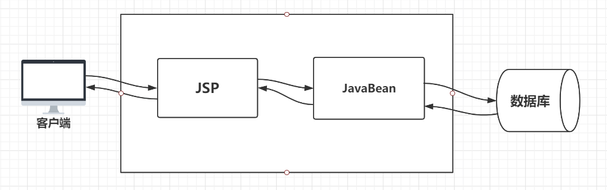
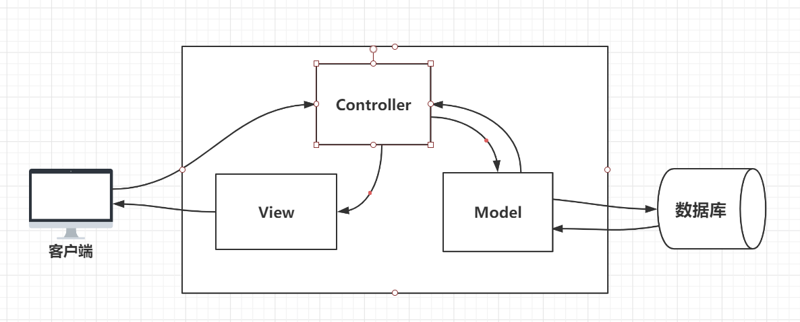
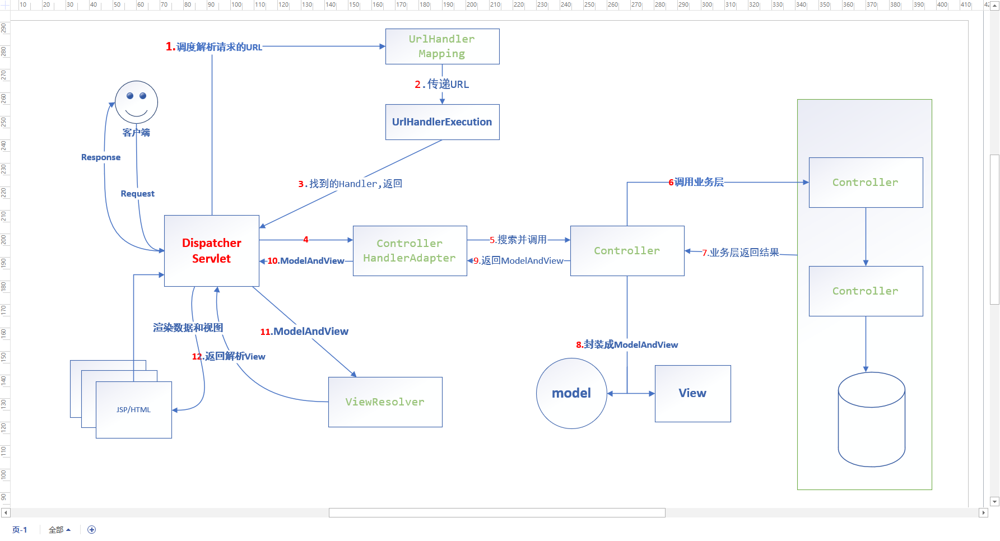
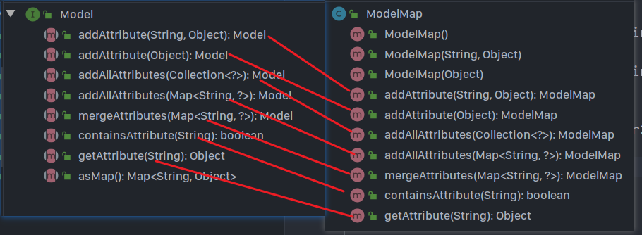

[toc]

# SpringMVC

## 一、回顾JavaWeb MVC

> **MVC的进化历程**
>
> Model1  Model2(MVC)

### Model1

> Model1 模式中，完全使用 JSP 来处理**页面显示(View)**、**业务处理(Service)**和**持久层操作(Dao)**
>
> 

这样的模式结构简单，适合于小型的项目使用，可是当业务变得复杂时，JSP所担任的角色就会变得混杂，不便于维护。所以我们将控制层和业务层从当中剥离出来。就形成了Model2即MVC

### Model2

> Model2中，三层架构分工明确，**View只用于显示，Controller用于管控请求和返回响应，调控视图层，Model则用于数据的处理。**
>
>  
>
> 往往Model层中又会细分出Service层（服务层），数据实体模型（POJO）和  Dao层 （持久层）
>
> 也就是我们现在所使用的**MVC**


### 为什么学习SpringMVC？

> 1. 轻量级、简单易学
> 2. 高效、基于请求响应的MVC框架
> 3. 与Spring兼容好，无缝结合
> 4. 约定优于配置
> 5. 功能强大：RESTful风格、数据验证、格式化、本地化、主题等
> 6. 简介灵活

Spring的Web框架围绕`DispatcherServlet`（调度Servlet）设计。

他的作用就是**对用户的请求进行分析，然后将请求分发给不同的处理器**，类似我们之前使用的通用Servlet


判断参数，然后决定执行那个方法。

**DispatcherServlet其本质也是一个Servlet**


## 二、HelloSpringMVC

### 第一步、创建DispatcherServlet

在web.xml中配置DispatcherServlet

```xml
<!--1. 注册DispatcherServlet
是Spring已经写好的，拿来即用-->
<servlet>
    <servlet-name>dispatcher</servlet-name>
    <servlet-class>org.springframework.web.servlet.DispatcherServlet</servlet-class>
    <!--2. 设置初始化参数
    关联一个Spring配置文件-->
    <init-param>
        <param-name>contextConfigLocation</param-name>
        <param-value>classpath:springmvc-servlet.xml</param-value>
    </init-param>
    <!--启动级别:数字越小启动越早-->
    <load-on-startup>1</load-on-startup>
</servlet>

<!--3. 映射dispatcher,
匹配并拦截所有访问当前web应用的请求-->
<servlet-mapping>
    <servlet-name>dispatcher</servlet-name>
    <url-pattern>/</url-pattern>
</servlet-mapping>
```

> 1. 和Javaweb学习中一样，需要一个`servlet`和`servlet-mapping`，唯一不同的时，DispatchServlet是Spring已经写好的类，我们用即可
> 2. DispatcherServlet 需要一个配置文件作为初始化参数（第二步）
> 3. servlet- mapping 的内容很好理解，`/`就是将**所有当前web应用的请求**，都交由DispatcherServlet处理


### 第二步、编写Dispatcher需要的配置文件

编写与DispatcherServlet相关联的配置文件：**springmvc-servlet.xml**

```xml
<?xml version="1.0" encoding="UTF-8"?>
<beans xmlns="http://www.springframework.org/schema/beans"
       xmlns:xsi="http://www.w3.org/2001/XMLSchema-instance"
       xsi:schemaLocation="http://www.springframework.org/schema/beans http://www.springframework.org/schema/beans/spring-beans.xsd">


    <!--1. 添加URL处理映射器-->
    <bean class="org.springframework.web.servlet.handler.BeanNameUrlHandlerMapping"/>
    <!--2. 添加Controller处理适配器-->
    <bean class="org.springframework.web.servlet.mvc.SimpleControllerHandlerAdapter"/>
<!--以上二者配合dispatcher使用-->


    <!--3. 还需要一个视图解析器
    对controller层传来的 ModelAndView(视图及模型) 进行解析处理-->
    <bean class="org.springframework.web.servlet.view.InternalResourceViewResolver">

        <!--前缀-->
        <property name="prefix" value="/WEB-INF/jsp/"/>
        <!--后缀-->
        <property name="suffix" value=".jsp"/>

        <!--这两个属性，会对视图及模型中的，视图参数进行 URL拼接-->
    </bean>


    <!--handler
    将Controller层的控制器注册的SpringIOC容器托管
    用于被dipatherServlet调度-->
    <bean id="/hello" class="com.sakura.controller.HelloSpringMVC"/>


</beans>
```

> 这是一个标准的Spring配置文件，看一下做了哪些准备：
>
> 1. 添加**URL管理映射器(BeanNameUrlHandlerMapping)**（这个是用来管理容器中所有controller 对应的URL）
> 2. 添加**Controller管理适配器(SimpleControllerHandlerAdapter)**（这个是用于管理和查找容器中controller）
> 3. 还需要一个**视图解析器(InternalResourceViewResolver)**（用于解析controller层处理完毕返回的`ModelAndView`）
> 4. 我们需要将我们写好的Controller类注入到SpringIoC容器中管理，id：为对应的请求路径

### 第三步、编写Controller类

业务处理由Controller层完成

```java
public class HelloSpringMVC implements Controller {
    public ModelAndView handleRequest(HttpServletRequest httpServletRequest, HttpServletResponse httpServletResponse) throws Exception {
        // 1.创建 ModelAndView对象 模型和视图。处理结果的数据和视图都会放在这里返回
        ModelAndView mav = new ModelAndView();

        // 2.封装数据，作为Model添加到ModelAndView
        mav.addObject("msg", "Hello SpringMVC");

        // 3.封装要跳转的视图作为View 放入ModelAndView.
        mav.setViewName("hello");
        // 这里 结合配置文件中视图解析器的前后缀
        // 三个部分 [/WEB-INF/jsp/][hello][.jsp] 就拼接出一个完整的URL: /WEB-INF/jsp/hello.jsp

        return mav;
    }
}
```

> 所有的Controller类 **都需要实现Controller接口**，并重写handleRequest方法
>
> 有些类似于Servlet类继承HttpServlet类，然后重写doGet和doPost
>
> 1. 创建`ModelAndView`对象，是用于**封装**处理完毕的**数据模型和视图**
> 2. 业务逻辑代码....略....
> 3. return ModelAndView对象

### 第四步、配置Tomcat启动

==可能出现404==

检查ProjectStructure中，Artifacts中WEB-INF中是否将依赖打包，若没有需要手动创建lib目录 并加入依赖


## 三、流程分析



1. DispatcherServlet拦截用户请求，并调用URLHandlerMapping，来解析用户的请求url，根据url查找对应的Handler

2. UrlHandlerExecution,根据url寻找到对应的controller

3. 将寻找结果返回给DispatcherServlet

4. DispatcherServlet再调用Controller适配器，去适配Controller

5. 适配到Controller之后，调用处理业务

6. controller调用Service层完成相关业务逻辑

7. Service层返回执行结果

8. Controller将数据封装成Model，设置跳转的视图封装成View  两者组合成ModelAndView

9. 将ModelAndView对象返回给适配器

10. 适配器再将器返回给DispatcherServlet

11. DispatcherServlet再调用视图解析器(ViewResolve)，并将ModelAndView给它

12. 视图解析器将解析出来的View返回给DispatcherServlet，DispatcherServlet将模型渲染到页面上，呈现给用户。


==分析完流程，我再说一个让你流泪的事实，实际开发中并不会这样写，这样的写法过于繁琐，下面学习使用注解开发吧！==


## 四、使用注解开发

### 第一步、web.xml中注册DispatcherServlet

### 第二步、spring配置文件

```xml
<?xml version="1.0" encoding="UTF-8"?>
<beans xmlns="http://www.springframework.org/schema/beans"
       xmlns:xsi="http://www.w3.org/2001/XMLSchema-instance"
       xmlns:context="http://www.springframework.org/schema/context"
       xmlns:mvc="http://www.springframework.org/schema/mvc"
       xsi:schemaLocation="http://www.springframework.org/schema/beans http://www.springframework.org/schema/beans/spring-beans.xsd http://www.springframework.org/schema/context https://www.springframework.org/schema/context/spring-context.xsd http://www.springframework.org/schema/mvc https://www.springframework.org/schema/mvc/spring-mvc.xsd">


    <!--开启注解扫描-->
    <context:component-scan base-package="com.sakura.controller"/>

    <!--通过转发到Servlet容器的默认Servlet，配置用于处理静态资源的处理程序。-->
    <mvc:default-servlet-handler/>

    <!--开启mvc注解支持-->
    <mvc:annotation-driven/>

    <!--视图解析器-->
    <bean class="org.springframework.web.servlet.view.InternalResourceViewResolver" id="viewResolver">
        <property name="prefix" value="/WEB-INF/jsp/"/>
        <property name="suffix" value=".jsp"/>
    </bean>

</beans>
```

> `mvc:annotation-driven` ：
>
> 在spring中一般采用@RequestMapping注解来处理请求地址映射，可用于类或方法上。**用于类上，表示类中的所有响应请求的方法都是以该地址作为父路径。**
>
> 可是要想@RequestMapping生效，必须在上下文中注册DefaultAnnotationHandlerMapping和AnnotationMethodHandlerAdapter实例，分别处理类级别和方法级别的@RequestMapping注解。
>
> 但是啊各位，现在`annotation-driven` 会为我们自动完成这两个对象的注入。 

### 第三步、编写Controller层类

```java
@Controller
@RequestMapping("father")
public class HelloController {

    @RequestMapping("/hello")
    public String hello(Model model) {
        String message = "Hello SpringMVC";

        // 使用Model 封装数据
        model.addAttribute("msg", message);

        // 返回字符串，由视图解析器处理
        return "hello";
    }
}
```

> 使用@Controller注解，就不用再实现Controller接口了，这个注解是@Component的衍生注解，相当于将标记类自动注入到Spring容器中。
>
> 类中方法返回的字符串，给视图解析器处理，数据使用Model封装，`addAttribute()`方法添加数据。
>
> ==注意==：当类和方法中同时使用了@RequestMapping注解时，相当于类中所有的方法都要通过父类的地址访问。例如：上面的hello方法要通过 /.. /father/hello 才能访问到


### ==SpringMVC的三大件==

- 处理器映射器（HandlerMapping）
- 处理器适配器（HandlerAdapter）
- 视图解析器（ViewResolver）

> 我们只需手动配置视图解析器，前两者我们开启注解驱动，就会帮我们自动配置。


### 关于Controller和@RequestMapping

#### Controller(控制器)

- 控制器负责提供访问应用程序的行为，通常有注解和接口两种实现方式
  1. **使用@Controller注解**
  2. **实现Controller接口**（缺陷：一个控制器只有一个方法）
- 控制器解析用户的请求并返回一个数据模型即`Model`
- SpringMVC中一个控制器类，可以包含多个方法
- 同样SpringMVC中配置Controller的方式也有很多种。
  1. xml中配bean
  2. 使用@RequestMapping


> 控制器中不同的方法是可以指向同一个视图的，说明在能解析数据的情况下，视图是可以被复用的，视图与控制器之间是弱耦合。


#### @RequestMapping

- @RequestMapping注解用于 映射URL到控制器类或一个特定的处理程序的方法。
- 可以用在类、方法上，当类使用了该注解，说明类中的所有的响应请求都要以该地址作为父路径。


## 五、RestFul风格

RestFul 就是一个资源定位及资源操作的风格。不是标准也不是协议，更不是一种技术，只是一种风格，基于这种风格设计的软件可以**更简洁、高效、安全，更有层次，更易于实现缓存等机制。**


### 功能

- 互联网上所有的事务都可以被抽象为资源(URL)
- 资源的操作：使用**POST、DELETE、PUT、GET**，不同的方式对资源进行操作
- 四种方式分别对应：**增、删、改、查**


### 对比

传统风格的URL:localhost:8080/add?id=1&name=xx&...

RestFul风格URL: localhost:8080/add/1/xx/...


由于传统的请求方式只有POST和GET，我们只能够通过不同的参数或者不同的路径来实现对资源的不同操作。

- 增：localhost:8080/user/add  (POST)
- 删：localhost:8080/user/delete?id=1 (GET或POST)
- 改：localhost:8080/user/update  (POST)
- 查：localhost:8080/user/query?id=1  (GET)

而使用RestFul风格后，我们的请求方式多了DELETE和PUT，我们就可以方便地通过不同的请求方式来区分对资源地操作。效果呈现就是**我们访问的是同一个路径，但是所做的事情却不同。**

- 增：localhost:8080/user  (POST)
- 删：localhost:8080/user  (DELETE)
- 改：localhost:8080/user  (PUT)
- 查：localhost:8080/user (GET)


### 使用

#### 1、@PathVariable

```java
@RequestMapping("/add/{x}/{y}")
public void test(@PathVariable int x, @PathVariable String y, Model model){
    String result = x + y;
    model.addAttribute("result", result);
    return hello;
}
```

> 使用@PathVariable，将方法参数绑定到URI模板变量上，可以从请求url中获取参数，并用于程序中，很好地限制了用户请求的参数类型。

#### 2、@- Post/Get/Delete/Put -Mapping

我们可以使用在@RequestMapping中设置method属性来控制请求的方式

```java
@RequestMapping(value = "/calculate/{a}/{b}",method = RequestMethod.POST)
public String add(@PathVariable int a, @PathVariable int b, Model model) {
    int result = a + b;
    model.addAttribute("result", result);
    return "calculate";
}
```

@RequestMapping注解的源码中method需要一个RequestMethod类型的数据

```java
public enum RequestMethod {
   GET, HEAD, POST, PUT, PATCH, DELETE, OPTIONS, TRACE
}
```

为了简化注解，出现新的方式

```java
@GetMapping("/calculate/{a}/{b}")
public String joint(@PathVariable String a, @PathVariable String b, Model model) {
    String result = a + b;
    model.addAttribute("result", result);
    return "calculate";
}
```

同样也有@PostMapping、@PutMapping、@DeleteMapping等，

其底层原理还是使用@RequestMapping.

```java
@RequestMapping(method = RequestMethod.GET)
public @interface GetMapping {
    // ...
}
```


## 六、转发和重定向

### ServletAPI 实现

转发：

```java
@RequestMapping("/hello")
public String test(HttpServletRequest request, HttpServletResponse response) throws ServletException, IOException {
    request.getRequestDispatcher("/calculate/a/b").forward(request,response);
    return null;
}
```

重定向：

```java
@RequestMapping("/redirect")
public String redirect(HttpServletRequest request, HttpServletResponse response) throws ServletException, IOException {
    response.sendRedirect("/calculate/hello/springMVC");
    return null;
}
```

> 由于我们的所有的请求都会被DispatcherServlet拦截，DispatcherServlet 在`doService`中设置request的相关属性，然后调用`doDispatch`，因此我们仍然可以使用传统ServletAPI,只需要在参数中，加上对应参数即可。
>
> 进行转发或重定向，则**不会通过视图解析器**，直接由request或response处理。


### SpringMVC实现

#### 当没有配置视图解析器时

转发：

```java
@RequestMapping("/SpringMVC/dispatcher")
public String dispatcher(Model model) {
    model.addAttribute("result", "hello world");
    return "forward:/WEB-INF/jsp/calculate.jsp";
}
```

> 返回字符串，加上`forward`前缀，后接完整的视图名。

重定向：

```java
@RequestMapping("/SpringMVC/redirect")
public String redirect(){
    // 重定向
    return "redirect:/index.jsp";
}
```

> 与重定向相似，需要加上`redirect`前缀，由于没有视图解析器，要写完整的资源路径


#### 当有视图解析器时

转发：

```java
@RequestMapping("/SpringMVC/dispatcher2")
public String dispatcher2(Model model) {
    model.addAttribute("result", "hello world");
    // 转发
    return "calculate";
}
```

> 由于使用了视图解析器，可以直接返回转发的路径，然后交由视图解析器处理

重定向：

```java
@RequestMapping("/SpringMVC/redirect2")
public String redirect2(){
    // 重定向
    return "redirect:/calculate/hello/world";
}
```

> 使用了视图解析器，也需要加上`redirect`前缀，可以转发到其他请求。


## 七、数据接收与数据回显

### 数据接收

> 当前端传递的参数与方法的参数相同，直接使用

```java
/*
* localhost:8080/getmsg?name=sakura
*/
@GetMapping("/getmsg")
public String getMsg(String name) {
    System.out.println(name); // 后台输出 sakura
    return "userinfo";
}
```

> 当前后端参数不一致时，如：后端方法参数为username时，后台打印则为null，前端不会显示出错。
>
> 可以在参数前使用`@RequestParam`注解，并设置value进行参数名的转换。使用此注解后，要求前端请求必须设置name参数，否则则会报错。

```java
@GetMapping("/getmsg2")
public String getMsg2(@RequestParam("name") String username) {
    System.out.println(username); // 后台输出 sakura
    return "userinfo";
}
```


> 当我们需要接收的参数是一个对象时

```java
@GetMapping("/getuser")
public String getUser(User user) {
    System.out.println(user);
    return "userinfo";
}
```

> 后端方法参数中直接写上引用类型，后端会从前端接收数据，然后对比匹配类的字段。


### 数据回显

我们见过的数据回显目前有两种

- 实现Controller接口，返回ModelAndView。
- 使用Controller注解，使用Model封装数据。

下面我们了解一下"完整版"的Model  `ModelMap`

ModelMap继承了LinkedHashMap

```java
public class ModelMap extends LinkedHashMap<String, Object>
```



```java
@GetMapping("/getuserinfo")
public String getUser(User user, ModelMap modelMap) {
    modelMap.addAttribute("user", user);
    return "userinfo";
}
```

Model和ModelMap在很多地方上是互通的，开发中我们多使用`Model`封装数据


### 乱码问题

> 我们在从前端获取数据，处理后回显到前端时难免出现乱码的情况，过去我们需要自己写 Filter类，并在web.xml中注册过滤器，而现在Spring已经为我们做好的一切，我们配置即可。

```java
public class CharacterEncodingFilter extends OncePerRequestFilter {
    @Nullable
    private String encoding;
    private boolean forceRequestEncoding = false;
    private boolean forceResponseEncoding = false;
    // ...
}
```

> CharacterEncodingFilter是Spring已经写好的类，我们只需要配置好初始化参数，设置过滤请求路径即可

```xml
<filter>
    <filter-name>encoding</filter-name>
    <filter-class>org.springframework.web.filter.CharacterEncodingFilter</filter-class>
    <init-param>
        <param-name>encoding</param-name>
        <param-value>utf-8</param-value>
    </init-param>
</filter>

<filter-mapping>
    <filter-name>encoding</filter-name>
    <!--这里使用/* 才能过滤 .jsp 这种带后缀的请求-->
    <url-pattern>/*</url-pattern>
</filter-mapping>
```


## 补充几个个小知识

>当我们在web.xml中配置Dispatcher或Filter时，需要设置`url-patterm`即路径匹配，这时候就需要注意`/`和`/*` 是不一样的。后者要更全面。

话不多说，先上参考博客

[深入理解web.xml中配置/和/*的区别](https://blog.csdn.net/jinghuashuiyue2/article/details/78589655)


### 问题一：默认Servlet

==如果将DispathcerServlet对外访问的虚拟路径配置成/时，需要在Spring的配置文件中配置、`<mvc:default-servlet-handler/>`这一项，那么为什么需要配置这一项呢？==

我们先来看Spring官方给这项配置的说明：

> *Configures a handler for serving static resources by forwarding to the Servlet container's default Servlet.* (我们只需要这一句，后面我也看不懂^  ^)...

意思是**配置及一个处理器 通过转发到Servlet容器的默认Servlet，用于处理静态资源的处理程序。**

由此说明==**不管是什么样的资源请求都是会通过Servlet的**==，那么这里的默认Servlet又是什么东东呢？

参考博客中写到Tomcat的web.xml中有一个defualtServlet，去瞅瞅

```xml
<servlet>
    <servlet-name>default</servlet-name>
    <servlet-class>org.apache.catalina.servlets.DefaultServlet</servlet-class>
    <init-param>
        <param-name>debug</param-name>
        <param-value>0</param-value>
    </init-param>
    <init-param>
        <param-name>listings</param-name>
        <param-value>false</param-value>
    </init-param>
    <load-on-startup>1</load-on-startup>
</servlet>
<!-- The mapping for the default servlet -->
<servlet-mapping>
    <servlet-name>default</servlet-name>
    <url-pattern>/</url-pattern>
</servlet-mapping>
```

同样这个Servlet，Tomcat也给出了官方说明：

> *The default servlet for all web applications, that serves static resources.*(同样我们抓住重点)

意思是**这是一个所有Web应用 用于服务静态资源的默认的Servlet**  

==问题核心==：那既然Tomcat已经为我们准备了，为什么我们还需要去Spring的配置文件中额外配置呢？

博客中给出了答案：**如果在自己写的web应用中，同样配置一个路径/，则会覆盖Tomcat中的conf/web.xml中的缺省Servlet**

刚好我们的DispatcherServlet就将Tomcat的默认Servlet覆盖掉了，所以我们需要重新配置默认Servlet处理我们的静态资源，否则外部访问静态资源就会无响应。


### 问题二、`/`与`/*`

其实**/和/*都可以匹配所有的请求资源**，但其**匹配的优先顺序是不同**的。

`/`在所有的匹配路径中，优先级最低，即**当别的路径都无法匹配时**，`/`所匹配的缺省Servlet才会进行相应的请求资源处理。

`/*` 匹配的优先级是高于`/xxxx`和`/*.后缀`的路径的（如`*.do,   `  、 `*.jsp`等路径）。


```xml
<!-- The mappings for the JSP servlet -->
<servlet-mapping>
    <servlet-name>jsp</servlet-name>
    <url-pattern>*.jsp</url-pattern>
    <url-pattern>*.jspx</url-pattern>
</servlet-mapping>
```

而刚好Tomcat中就有处理`.jsp`这样请求的Servlet，所以当我们直接使用地址栏访问 .jsp 静态资源时，由于我们配置的DispatcherServlet是以`/`作为匹配路径，所以会被直接交给Tomcat的Servlet去管理。


### 问题三、过滤器对外访问虚拟路径可以配置成`/`吗?

显然是不可以的，根据`/`的特性是用于处理无法匹配的请求，而过滤器对于请求来说又是非必须的，所以==设置`/`作为匹配路径，过滤器是无效的。==可使用`/*`使其成为为全局的过滤器。


| 匹配路径 |         默认Servlet开关         |                index.jsp                 |
| :------: | :-----------------------------: | :--------------------------------------: |
|    /     | \<mvc:default-servlet-handler/> |    正常显示（Tomcat提供静态资源服务）    |
|    /     |                                 |         正常显示，会显示jsp注释          |
|    /*    | \<mvc:default-servlet-handler/> | 文本显示（被mvc容器拦截,找到对应的文件） |
|    /*    |                                 |                   404                    |


## 八、JackSon 与 FastJSON

### JackSon

maven依赖：

```xml
<!-- https://mvnrepository.com/artifact/com.fasterxml.jackson.core/jackson-databind -->
<dependency>
    <groupId>com.fasterxml.jackson.core</groupId>
    <artifactId>jackson-databind</artifactId>
    <version>2.10.2</version>
</dependency>
```

乱码问题配置

```xml
<mvc:annotation-driven>
        <mvc:message-converters register-defaults="true">
            <bean class="org.springframework.http.converter.StringHttpMessageConverter">
                <constructor-arg value="utf-8"/>
            </bean>
            <bean class="org.springframework.http.converter.json.MappingJackson2HttpMessageConverter">
                <property name="objectMapper">
                    <bean class="org.springframework.http.converter.json.Jackson2ObjectMapperFactoryBean">
                        <property name="failOnEmptyBeans" value="false"/>
                    </bean>
                </property>
            </bean>
        </mvc:message-converters>
    </mvc:annotation-driven>
```

使用

```java
@Controller
public class UserController {

    @RequestMapping("/getuserjson")
    @ResponseBody
    public String getUser() throws JsonProcessingException {
        // jack中的对象
        ObjectMapper objectMapper = new ObjectMapper();

        User user = new User(1, "官宇辰", 20);

        return objectMapper.writeValueAsString(user);
    }
}
```

> 注意点：
>
> - 使用Controller注解后，类中的方法返回的String会被视图解析器当作页面名处理，为了能够正常返回字符串，需要在方法上使用`@ResponseBody`注解
> - 或者只在类上使用`@RestController`,也是同样的效果
> - Jackson中我们主要使用的类：`ObjectMapper`，常用的方法也就是`writeValueAsString()`，返回值就是我们需要的Json字符串。

```java
@RestController
public class TimeController {

    @RequestMapping("/gettime")
    public String getTime() throws JsonProcessingException {
        ObjectMapper objectMapper = new ObjectMapper();
        SimpleDateFormat df = new SimpleDateFormat("yyyy-MM-dd HH:mm:ss");
        objectMapper.setDateFormat(df);

        Date date = new Date();
        return objectMapper.writeValueAsString(date);
    }
}
```

> 使用jackson返回时间对象字符串时，需要使用setDateFormat() 设置时间字符串格式。**默认是使用Timestamp时间戳**

```java
@RequestMapping("/getuserlist")
@ResponseBody
public String getUserList() throws JsonProcessingException {
    // jack中的对象
    ObjectMapper objectMapper = new ObjectMapper();

    List<User> userList = new ArrayList<>();

    userList.add(new User(1, "官宇辰", 20));
    userList.add(new User(2, "张三", 19));
    userList.add(new User(3, "李四", 22));
    userList.add(new User(4, "王五", 14));

    return objectMapper.writeValueAsString(userList);
}
```

> 同样json可以处理结合，注意结果中每一个单独的对象用`{}`包裹，多个对象形成的集合使用`[]`包裹。

```json
[
  {
    "id": 1,
    "name": "官宇辰",
    "age": 20
  },
  {
    "id": 2,
    "name": "张三",
    "age": 19
  },
  {
    "id": 3,
    "name": "李四",
    "age": 22
  },
  {
    "id": 4,
    "name": "王五",
    "age": 14
  }
]
```

### Fastjson

maven依赖

```xml
<dependency>
    <groupId>com.alibaba</groupId>
    <artifactId>fastjson</artifactId>
    <version>1.2.61</version>
</dependency>
```

使用

```java
@RequestMapping("/getuserlist2")
@ResponseBody
public String getUserList2(){
    List<User> userList = new ArrayList<>();
    userList.add(new User(1, "官宇辰", 20));
    userList.add(new User(2, "张三", 19));
    userList.add(new User(3, "李四", 22));
    userList.add(new User(4, "王五", 14));

    // JSON类 
    return JSON.toJSONString(userList);
}
```

> 其中的`JSON` 是Fastjson中的一个类，JSONObject和JSONArray都是其子类

除了可以将Java对象转化为json字符串，还可以将其转化为JSON对象(**单个对象转化为JSONObject、多个对象集合转化为JSONArray**)

```java
JSONArray jsonObject = (JSONArray) JSON.toJSON(userList);
System.out.println(jsonObject.toString());
```

将json字符串转化为对象

```java
public User getUser2(){
    String userJson = "{\"id\":1,\"name\":\"官宇辰\",age:20}";
    return JSON.parseObject(userJson, User.class);
}
```


## 九、拦截器(Intercepter)

> 实现`HandleInterecpter`接口，不强行要求重写方法。
>
> 但是提供了`prehandler`、`posthandler`、`afterComplition`三个可重写方法

### preHandler

- 调用时间：Controller方法处理请求之前
- 执行顺序：链式Intercepter情况下，Intercepter按照声明的顺序一个接一个执行
- 注意事项：若返回false，则中断执行，不会进入afterCompletion

### postHandler

- 调用前提：==preHandle返回true==
- 调用时间：Controller方法处理完之后，DispatcherServlet进行视图的渲染之前，也就是说在这个方法中你可以对ModelAndView进行操作
- 执行顺序：链式Intercepter情况下，Intercepter按照声明的顺序倒着执行

### afterCompletion

- 调用前提：preHandle返回true
- 调用时间：DispatcherServlet进行视图的渲染之后
- 注意事项：多用于清理资源


### 配置拦截器

```xml
<mvc:interceptors>
    <mvc:interceptor>
        <mvc:mapping path="/user/**"/>
        <bean class="com.sakura.interceptor.LoginInterceptor"/>
    </mvc:interceptor>
</mvc:interceptors>
```

> /xx/** 表示xx下的所有请求，都会经过这个拦截器 


## 十、SpringMVC实现文件上传


前端

```jsp
<form action="" enctype="multipart/form-data" method="post">
  <input type="file" name="file"/>
  <input type="submit" value="上传"/>
</form>
```

> 注意：
>
> 1. enctype：一定要设置为multipart/form-data，使表单提交能够带文件。
> 2. 提交方式一定是**post**

后端：

> SpringMVC为文件上传提供了直接的支持，这种支持是即插即用的==MultipartResolver==实现的，SpringMVC使用Apache Commons FileUpload技术实现了一个MultipartResolver实现类：`CommonsMultipartResolver`

1. 导入相关依赖`commons-fileupload`

   ```xml
   <dependency>
       <groupId>commons-fileupload</groupId>
       <artifactId>commons-fileupload</artifactId>
       <version>1.4</version>
   </dependency>
   ```

2. 配置CommonsMultipartResolver的Bean

   ```xml
   <bean id="multipartResolver" class="org.springframework.web.multipart.commons.CommonsMultipartResolver">
       <!--设置请求的编码格式-->
       <property name="defaultEncoding" value="utf-8"/>
       <!--设置上传文件的大小限制-->
       <property name="maxUploadSize" value="10485760"/>
       <property name="maxInMemorySize" value="40960"/>
   </bean>
   ```

3. 使用：

   **MultipartFile常用方法：**
   
   - `getOriginalFilename()`：获取上传文件的原名
- `getInputStream()` 获取文件的流
   - `transferTo(File dest)`：将文件保存为目录中的一个文件

### 方式一：流形式传输文件

```java
public String fileUpload(@RequestParam("file") CommonsMultipartFile file, HttpServletRequest request, HttpServletResponse response) {

    // 1.获取上传的文件名
    String uploadFileName = file.getOriginalFilename();

    // 2.判断文件名合法性
    if ("".equals(uploadFileName)) {
        return "direct:/index.jsp";
    }
    System.out.println("uploadFileName = " + uploadFileName);

    // 3.设置保存路径
    String savePath = request.getServletContext().getRealPath("/upload");
    // 4.若路径不存在则新建一个
    File uploadPath = new File(savePath);
    if (!uploadPath.exists()) {
        uploadPath.mkdir();
    }
    System.out.println("uploadPath = " + uploadPath);

    // 5.获取文件流
    try(InputStream InputStream = file.getInputStream();
        OutputStream outputStream = new FileOutputStream(new File(uploadPath, uploadFileName))){
        int len = 0;
        byte[] buffer = new byte[1024];
        while ((len = InputStream.read(buffer)) != -1) {
            outputStream.write(buffer, 0, len);
            outputStream.flush();
        }
    } catch (IOException e) {
        e.printStackTrace();
    }
    
    return "success";
}
```


### 方式二：直接保存为文件

```java
public String fileUpload2(@RequestParam("file") CommonsMultipartFile file, HttpServletRequest request, HttpServletResponse response) {

    // 1.获取上传的文件名
    String uploadFileName = file.getOriginalFilename();

    // 2.判断文件名合法性
    if ("".equals(uploadFileName)) {
        return "error";
    }
    System.out.println("uploadFileName = " + uploadFileName);

    // 3.设置保存路径
    String savePath = request.getServletContext().getRealPath("/upload");
    // 4.若路径不存在则新建一个
    File uploadPath = new File(savePath);
    if (!uploadPath.exists()) {
        uploadPath.mkdir();
    }
    System.out.println("uploadPath = " + uploadPath);

    // 5.MultipartFile的transferTo()方法，直接保存为文件
    try {
        file.transferTo(new File(uploadPath + "/" + uploadFileName));
    } catch (IOException e) {
        e.printStackTrace();
    }

    return "success";
}
```


