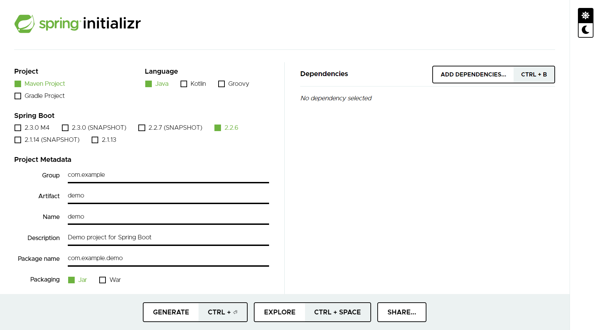
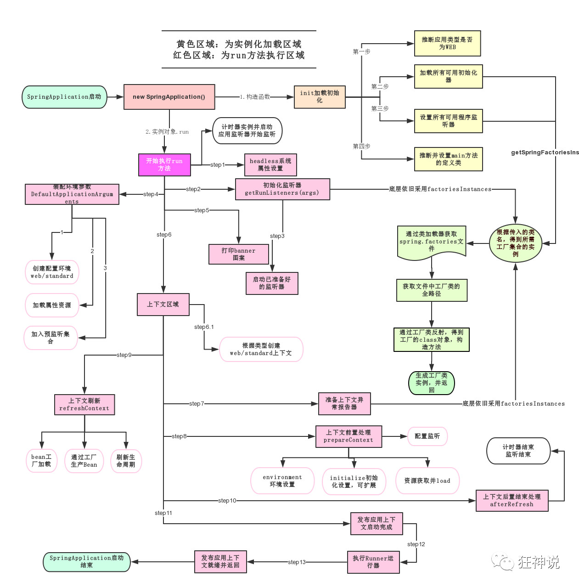
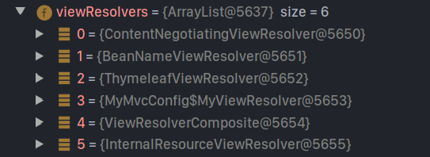
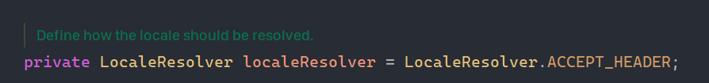
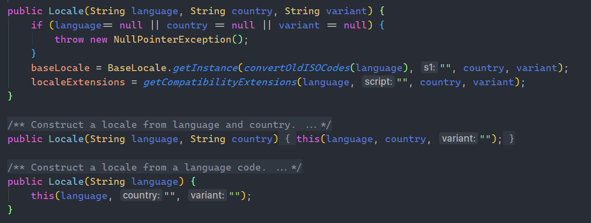
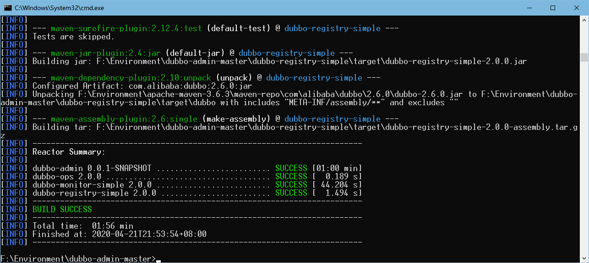

[TOC]

# 第一部分、SpringBoot概述

## 一、回顾Spring

> Spring是为了解决企业级应用开发的复杂性而创建的，简化开发。

==Spring是如何简化开发的呢？==

- 最小倾入性编程
- AOP 面向切面编程
- IOC  控制反转
- 声明式事务编程
- 通过切面和模板 减少代码量。

## 二、SpringBoot概述入门

> **为什么使用SpringBoot？**
>
> 集成了大量的常用的第三方库配置，这些第三方库开箱即用，SpringBoot已经为我们默认配置了很多东西，我们只需要约定那些例外的配置即可，很好地体现了==约定大于配置==的核心思想
>
> 优点：
>
> - 为所有 Spring 开发提供极其快速且广泛可访问的 getting-started 体验。
> - ==开箱即用==，但随着需求开始偏离默认值而迅速摆脱困境。（提供了很多默认的配置）
> - 为大型类项目(例如嵌入式服务器，安全性，metrics，运行状况检查和外部化 configuration)提供一系列 non-functional features common。
> - 绝对没有 code 生成，也不需要 XML configuration。

## 三、关于微服务

- 什么是微服务？

  > 微服务是一种架构风格，将MVC中的业务拆分成为一个个模块，然后按需组合模块。每个模块都可以单独运行生效。每一个功能模块都是可替换的。可独立升级。模块之间可使用http相互调用。而SpringBoot就是帮助我们快速的构建一个这样的模块。
  >
  > 但是微服务会给运维岗位增加负担。

- 单体应用到微服务架构

  > 将一个巨大的框架改成一个微服务框架时遇到的最大的问题在于改变通信方式。从内存的方法调用到RPC的简单转换会使通信性能变差。
  >
  > 单体应用架构存在的问题：
  >
  > - 部署成本高（无论是修改1行代码，还是10行代码，都要全量替换）
  > - 改动影响大，风险高（不论代码改动多小，成本都相同）
  > - 因为成本高，风险高，所以导致部署频率低（无法快速交付客户需求）
  >
  > - 当然还有例如无法满足快速扩容，弹性伸缩，无法适应云环境特性等问题。

[关于微服务]https://baijiahao.baidu.com/s?id=1600354904549354089&wfr=spider&for=pc


## 四、第一个SpringBoot程序

-  可以去官网创建项目https://start.spring.io/

- 也可以使用IDEA创建（IDEA中集成了这个网站）

  

导入项目：


项目导入后，即可运行，SpringBoot已经为我们配置好了一些默认配置，且==默认使用内嵌的Tomcat==，我们的项目开发代码全部集中在项目包下，注意是项目启动类的同级目录下建包。默认创建的项目启动类(与项目同名)不能删改。

- pom.xml中的存在一个父项目

  ```xml
  <parent>
      <groupId>org.springframework.boot</groupId>
      <artifactId>spring-boot-starter-parent</artifactId>
      <version>2.2.6.RELEASE</version>
      <relativePath/> <!-- lookup parent from repository -->
  </parent>
  ```

  > 为我们省去了DispatcherSevlet配置，MVC的相关配置等等一系列我们在Spring上需要手动配置的默认项。

- 

- SpringBoot中所有的外部依赖或组件都是以`spring-boot-starter`开头的,，而且有没有发现，dependency不用再加上version标签了。

- 官方原话：

  > *Spring Boot provides a number of “Starters” that let you add jars to your classpath. Our applications for smoke tests use the `spring-boot-starter-parent` in the `parent` section of the POM. The `spring-boot-starter-parent` is a special starter that provides useful Maven defaults. It also provides a `dependency-management` section so that you can omit `version` tags for “blessed” dependencies.*
  >
  > Spring Boot 提供了许多“Starters”，可以让 jars 添加到 classpath。我们的 sample application 已经在 POM 的`parent`部分使用了`spring-boot-starter-parent`。 `spring-boot-starter-parent`是一个特殊的 starter，提供有用的 Maven 默认值。它还提供[dependency-management](https://www.docs4dev.com/docs/zh/spring-boot/2.1.1.RELEASE/reference/using-boot-build-systems.html#using-boot-dependency-management)部分，以便您可以省略“该死的”依赖项的`version`标记。


- 启动类和main方法

  ```java
  @SpringBootApplication
  public class HelloSpringbootApplication {
  	public static void main(String[] args) {
  		SpringApplication.run(HelloSpringbootApplication.class, args);
  	}
  }
  ```

  官方文档的原话：

  > *The final part of our application is the `main` method. This is just a standard method that follows the Java convention for an application entry point. Our main method delegates to Spring Boot’s `SpringApplication` class by calling `run`. `SpringApplication` bootstraps our application, starting Spring, which, in turn, starts the auto-configured Tomcat web server. We need to pass `Example.class` as an argument to the `run` method to tell `SpringApplication` which is the primary Spring component. The `args` array is also passed through to expose any command-line arguments.*
  >
  > 大概意思是：
  >
  > 我们的启动类通过调用SpringApplication类的run方法，来将程序委托给SpringAppliction类，SpringApplication会引导并启动自动配置的Tomcat来启动我们的项目，我们只需要将我们启动类的Class类对象作为参数传给run方法，去告诉哪一个是我们程序的主元件。还通过 args 数组来公开任何命令行参数。

- 我们点开@SpringBootApplication注解的源码，可以发现一个注解：@EnableAutoConfiguration

  > 官方也给出了相关说明：这个注解告诉Spring根据你所导入的jar包，来猜测你需要如何配置Spring，并为你配置好你可能需要配置的所有默认项，这就是SpringBoot的魅力所在。


-  关于项目打包以及jar包的使用

  项目创建时已经为我们默认安装了maven的package插件，我们点击即可使用，或者使用`mvn package`命令来打包，

  生成的jar包，我们使用 `java -jar `命令即可运行指定的jar包。


- 编写我们自己的代码

  

  >  切记是再启动类的同级目录下建包写代码。
  >
  > 启动可以一键式启动，也可以使用终端命令行：`mvn spring-boot:run`
  >
  > 现在我们编写的controller,不用再去进行相关配置，相当于就是一个http接口，外部可以直接访问。

说些好玩的东西：

再resource目录下可以创建一个banner.txt放入网站上工具生成的图标就可以修改启动图标


看！是不是贼花里胡哨。

目录下的application.properties也并不是一无是处，比如修改默认端口可以使用`server.port`进行更改。


## 五、原理初步整理

> ==SpringBoot是如何进行自动装配，和自动配置组件的？==

1. 从启动类入手，`@SpringBootApplication`用于标注这是一个SpringBoot应用程序。

2. 进入@SpringBootApplication注解的源码，能发现除了四个 元注解外，还有三个注解：

   - `@SpringBootConfiguration`

   - `@EnableAutoConfiguration`

   - `@ComponentScan`

     第一项与SpringBoot配置相关(能够知道其底层任然是使用代理)，第二项是关于自动配置，第三项是用于项目的组件扫描。

     我们重点看第二个。

3. 进入`@EnableAutoConfiguration`的源码发现，一样还有一个注解和一个class文件的导入，分别是

   - @AutoConfigurationPackage

   - AutoConfigurationImportSelector.class

     顾名思义，一个与自动包配置相关，一个与自动配置的导入选择相关。我们继续深入查看注解。

4. 进入`@AutoConfigurationPackage`的源码，除了元注解，也有一个class文件的导入

   - AutoConfigurationPackage.Registrar.class

     自动配置包的注册器？

5. 由于无法继续深入，我们就从这个`Registrar.class`入手吧

   > 发现这只是一个AutoConfigurationPackage抽象类中的静态内部类，发现只是一个用于存储和注册自动配置包的类。

6. 逐层向外，`AutoConfigurationImportSelector.class`

   源码文档告诉我们DeferredImportSelector是用于处理auto-configuration的，而这个类就实现了DeferredImportSelector接口！

   根据源码阅读的指导，我们找到了这个方法`getAutoConfigurationEntry()`，方法名就是获取自动配置的入口，并且我们在其中发现了一条语句：

   ```java
   List<String> configurations = getCandidateConfigurations(annotationMetadata, attributes);
   ```

   

7. 进入`getCandidateConfigurations()`方法

   >  官方文档说明：**返回值被视为是自动配置类的类名，默认情况下这个方法或使用SpringFactoriesLoader和getSpringFactoriesLoaderFactoryClass()来加载候选项。**

   

8. 可见这个方法中的确出现了文档所说的两个东西，并使用`loadFactoryNames`关联了起来，看一下这个方法

   

9. 在`loadSpringFactories`方法中关于classloader使用了一个 三元运算

   当classload不为空时，从FACTORIES_RESOURCE_LOCATION中获取资源，否则使用默认类加载器也从这个常量位置获取 系统资源。

   然后当作url,然后会进行一系列封装作为返回值返回。

   需要注意的有两个点：

   - 第一是这个常量，`FACTORIES_RESOURCE_LOCATION`
   - 第二、这个返回值最终是被返回到`getCandidateConfigurations()`而在之前文档说过这个方法的返回值是作为自动配置类的类名,那么这个urls一定是与自动配置相关的。

10. 我们看一下这个常量是啥

    

    `META-INF/spring.factories`看得出来是一个文件，通过指导我们在spring-boot-autoconfigure.jar下发现了这个文件,当然不止这一处，官方也说了多个jar包中都可以存在，查找发现spring-boot.jar和spring-boot-devtools.jar中都有一个这样的文件。

    

11. 文件内容数量来看autoconfigure的spring.factories要更多一些,下一步我们进入这个文件看一下

    

    > 自动配置那一栏无一列外的都是`org.springframework.boot.autoconfigure.***AutoConfiguration`，这应该就是一个个自动配置类。我们点开一个熟悉的看看。

12. 打开WebMVCAutoConfiguration

    

    > 也许会有这样一个疑问，这么多自动配置类，那为什么SpringBoot只选择了部分生效呢？
    >
    > 在第一个SpringBoot程序中提到过官方说使用@EnableAutoConfiguration注解告知Spring通过你所导入的jar包和依赖来猜测你所需要的相关配置。
    >
    > 那么这个’猜测‘又是如何进行呢？它当天不具备人的猜想能力，而是通过自动配置的一个核心注解即`@ConditionalOn***`注解意思是符合...条件的，当符合条件时，就会使自动配置类生效。

    到这里整个@EnableAutoConfiguration注解就简单剖析完毕了。

### 简单总结

> 项目在启动时，@SpringBootApplication中的@EnableAutoConfiguration，使用AutoConfigurationImportSelector类为我们的应用程序从META-INF/spring.factories中选择出所有的自动配置类的全限定类名并加载成为Properties类汇总到一个List\<Stirng>中，过滤出我们需要的，使用反射的方式创建JavaConfig类汇总然后加入到IOC容器中。


### 启动运行原理图



图片来自于：狂神说公众号


## 六、配置SpringBoot

> ==SpringBoot官方推荐使用yaml配置文件==，当然使用properties也是可以的，但是配置文件名的给定的不能修改：`application.yml`或`application.properties`
>
> 可能会想问既然SpringBoot已经为我们自动装配好了组件，为什么我们还需要写配置文件呢？
>
> 配置文件可以让我们对应用程序高度自定义化，相比于传统的"配置地狱"，那些繁琐的默认配置SpringBoot为我们完成，只需要严格按照Spring的约定开发即可，其他的不同于默认配置的项由我们手动配置。

### YAML相关

> *YAML*是"YAML Ain't a Markup Language"（YAML不是一种[标记语言](https://baike.baidu.com/item/标记语言)）的[递归缩写](https://baike.baidu.com/item/递归缩写)。在开发的这种语言时，*YAML* 的意思其实是："Yet Another Markup Language"（仍是一种[标记语言](https://baike.baidu.com/item/标记语言)），但为了强调这种语言以数据做为中心，而不是以标记语言为重点，而用反向缩略语重命名。（百度百科）

### 简单入门YAML语法

YAML支持存放

- 对象
- 数组
- 纯量(单个不可再分的值)

YAML基本语法特征

- 严格区分大小写
- 以缩进区分层级关系
- 缩进禁止使用制表符(Tab)，一律使用空格缩进，缩进空格数没有要求，但是要==保证同级元素左对齐==
- 以`#`开头作为注释

#### 对象

```yml
person: 
  name: 官宇辰
  age: 20
  sex: 男
# 行内写法,整个有点抽风，但是语法就是这样
student: {name: 官宇辰, age: 20, sex: 男}
```

> 键值对语法：
>
> `key:(空格)value`切记不要漏了冒号后面的空格，否则会失效。
>
> 以缩进表示层级或所属关系，行内写法以`{}`包裹
>
> 对比properties
>
> `key=value`

#### 数组

```yaml
Month:
  - Jan
  - Feb
  - March
  - Apr
  - May

Date: [Mon, Tue, Wen, Thu, Fri, Sat, Sun]
```

> 层级写法
>
> `-(空格)item`
>
> 行内写法：以`[]`包裹

复杂格式

```yaml
persons:
  - person:
      name: 张三
      age: 19
  - person:
      name: 李四
      age: 22
```


### 使用YAML进行配置

Person类

```java
@Component
@Data
@ConfigurationProperties(prefix = "person")
public class Person {
    private String name;
    private int age;
    private boolean single;
    private Map<String, Integer> scores;
    private List<String> hobbies;
    private Date birth;
    private Dog dog;
}
```

> 当使用application.yml配置对象的默认值时需要以下几个步骤
>
> 1. 按需编写配置文件
>
>    ```yml
>    person:
>      name: sakura
>      age: 20
>      single: true
>      scores:
>        Math: 62
>        DB: 63
>        Java: 71
>      hobbies:
>        - 网球
>        - 音乐
>        - 代码
>      birth: 2000/8/17
>      dog: 
>        name: 小白
>        age: 1
>    ```
>
> 2. 在类上添加`@ConfigurationProperties`注解，并设置prefix与配置文件中的值对应。
>
>    ```java
>    @ConfigurationProperties(prefix = "person")
>    ```
>
>    > 使用这个注解需要导入一个依赖（配置处理器）
>    >
>    > ```xml
>    > <dependency>
>    >     <groupId>org.springframework.boot</groupId>
>    >     <artifactId>spring-boot-configuration-processor</artifactId>
>    >     <optional>true</optional>
>    > </dependency>
>    > ```
>
> 3. 当需要使用这个默认值对象时，使用@Autowire为其自动装配属性值
>
>    ```java
>    @Autowired
>    Person person;
>    ```

YAML配置还支持一些特殊(sao)操作(使用SpEL表达式)

1. 设置默认值

   ```yaml
   person:
     name: ${person.realName:官宇辰}_sakura
   ```

   > 例如：在装配person的name属性时，先查找是否有person.realName这个属性，若有直接使用，若未找到使用冒号后面的参数值‘官宇辰’，支持字符串拼接！拼接结果就是person.name=官宇辰_sakura

2. 使用SpEL表达式，直接引用

   ```yaml
   person:
     name: ${person.dog.name}
   ```

3. 使用随机数，或UUID

   ```yaml
   person:
     name: ${random.uuid}
     age: ${random.int(2,40)}
   ```

   > random.int和random.long可以控制随机范围，random.value适用于字符串类型数据


### 对比使用Properties配置

上面所有的东西使用Properties同样可以实现

好吧，map和对象我不知道咋整

person类

```java
@Component
@Data
@PropertySource("classpath:application.properties")

public class Person {
    @Value("${person.name}")
    private String name;

    @Value("${person.age}")
    private int age;

    @Value("${person.single}")
    private boolean single;

    private Map<String, Integer> scores;

    @Value("${person.hobbies}")
    private List<String> hobbies;

    @Value("${person.birth}")
    private Date birth;
    
    private Dog dog;
}
```

application.properties

```properties
person.name = sakura
person.age = 19
person.single = true
person.hobbies=网球,代码,音乐
person.birth=2000/8/17
```

> 如代码所示你仍然需要几个步骤：
>
> 1. 使用@PropertySource注解说明使用的配置文件
> 2. 在需要自动配置的属性上使用@Value注解和SpEL表达式与配置中一一对应。
> 3. 使用时也需要加上@Autowire注解
>
> 要用那些骚操作可以直接写在@Value中。
>
> 总之我不太喜欢这中配置方式，在我看来它的功能不及yml，因为有些类型我配不出来。而且需要每个对象与配置文件一一匹配，十分繁琐。

|                    | @ConfigurationProperties |  @Value  |
| :----------------- | :----------------------: | :------: |
| 功能               | 批量注入配置文件中的属性 | 一一指定 |
| 松散绑定(松散语法) |           支持           |  不支持  |
| SpEL               |          不支持          |   支持   |
| JSR303数据校验     |           支持           |  不支持  |
| 复杂类型的封装     |           支持           |  不支持  |

> 所谓==松散绑定==就是**配置文件和实际类中的字段名可以不完全相同**，例如配置文件中以‘-’分割单词可以匹配相应的使用驼峰命名的属性字段，又或者大小写不敏感，我猜想是分隔符'-'在进行装配的时候会被省略，**保证字母相同即可**。
>
> ==JSR303数据校验==：在字段增加一层过滤器验证，可以保证数据的合法性。


### JSR303校验（拓展）

在需要进行数据校验的类上使用`@Validate`注解，然后在需要进行数据校验的字段上使用相应的校验注解。

以下是源码中支持的注解

（**javax.validation.constraints**）和（**org.hibernate.validator.constraints**）


> 记住几个常用的即可@NotNull、@Email、@Pattern...


### 关于多配置文件的优先级


除了图中给出的四个位置，其他地方的配置文件均无法被自动识别。四个位置分别是

- 文件目录/config/.yml   					=》 file:/config/
- 文件根目录/.yml      				          =》 file:/
- 项目目录/resour/config/.yml         =》classpath:/config/
- 项目目录/.yml                                   =》classpath:/


### 关于多环境的切换

> 实际开发中，我们生产和测试以及项目上线都是使用的不同的环境，那么我们据需要对环境进行切换，相应的配置文件的内容也各不相同，properties和yaml都支持环境切换

#### properties多环境切换


**配置文件命名使用**==application-xxx.properties==，然后在默认的配置文件中使用`spring.profiles.active=xxx`配置来使对应的配置文件生效，实现环境切换

#### yaml多环境切换


> 一个文件使用`---`被模块化为三个环境，互不影响。使用`spring.profiles:`为每个环境模块起名，在默认配置模块中，使用`spring.profile.active:`来激活对应的模块


## 七、自动配置原理回顾

### 配置文件如何生效

在我们已经了解了配置文件的编写后，我们在回头来看那些配置类，还存在一些疑问。

1. 我们如何去干预已经写好的配置？
2. 我们自定义的配置如何被SpringBoot读取？


前面初步整理的时候我们找到一个所有自动配置类的全限定名的文件(`spring.factories`)，我们来挖一下这些自动配置类中设置了哪些默认属性。==所谓的自动配置也不过是将所有的启动器和组件都预先配置好，然后启动加载时只让满足要求的配置生效。==


我们选择我们熟悉的自动配置类（DispatcherServletAutoConfiguration）

1. 进到源码首先就是这样的场景

   

2. 而这张图就隐含着很多的内容

   

   

   这个就是已经默认为我们配置好的，启动加载时就会生效，无需我们手动配置

3. OK简单看完自动配置类，就能发现它们其实它们与SpringMVC中的JavaConfig十分相似，结构基本就是

   ```java
   //...
   @Configuration
   //...
   public class ClassName{
       //...
       @Bean
       public ... (){
           ...
       }
       
   }
   ```

4. 那我们现在进入正题，==我们的配置文件是如何干预写好的默认配置呢?==

   > 我们在学习yml时，知道使用`@ConfigurationProperties(prefix="xxx")`这样的配置，类就可以接收配置文件中关于xxx的配置信息，同时会发现我们在yml中进行配置时系统会自动提示。

   那么我们就选用server.port这项配置来简单看看是如何被加载的。

   ```yaml
   server:
     port: 8081
   ```

   当点击port时，会进入到ServerProperties类

   

   我们再使用一个与dispacherServlet相关的配置

   ```yaml
   spring:
     mvc:
       dispatch-options-request: true
   ```

   同样当点击配置项时，就会进入WebMvcProperties类

   > 到这里我们可以认为，我们==所写的每一个有效配置项，都存在一个xxxProperties配置类的来与之进行映射，便于读取我们的配置信息，然后使用相应的set方法来进行设置==

   ----

5. 现在出现第二个问题，==这些Properties类是如何与自动配置类关联起来的呢？==

   > 前面的分析我们知道我们写的配置信息能够被对应的Properties类识别到是归功于@ConfigurationProperties注解，我们的配置信息能够生效是因为类中有对应set方法来设置属性值。
   >
   > 可要使我们的配置能够完全生效，就必须联系自动配置类。我们不妨回头看看我们刚才进入的自动配置类再看看，我们漏掉了什么。

   ```java
   @EnableConfigurationProperties({ HttpProperties.class, WebMvcProperties.class })
   ```

   > 没错就是这行信息，`@EnableConfigurationProperties`注解使得我们的配置类与xxxProperties类产生了关联关系。

   

   > ==自动配置类就通过xxxProperties类中的默认属性值，来为Bean(组件)进行默认配置，而我们的配置文件也会因此间接生效。==


补充：

### 关于@Condition

我们再配置文件中打开debug日志

```yaml
debug: true
```

控制台打印一份环境的配置报告：


> 明显看出这些自动配置被划分为  **匹配激活**的和**未匹配的**，同时给出了匹配或未匹配的原因，发现后面括号中都有一个(OnxxxCondition)
>
> 这就呼应了那些自动配置类中使用的`@ConditionOnxxx`注解，初步整理时就提到了这个注解，这是一个条件注解，是SpringBoot自动配置的核心注解，==他能够根据你当前的代码来为你匹配你所需要组件已经自动配置类。==


`org.springframework.boot.autoconfigure.condition`在这个包下有很多与@Condition相关的内容


> 其实每个@ConditionOnxxx这种注解的源码用都必定使用了@Condition()注解和一个xxx.class进行组合，对实现就不进行深究，我们了解几个常见的。


​	


# 第二部分、SpringBoot Web开发

## 八、静态资源导入

### 静态资源存放路径

> 官方文档：
>
> *By default, Spring Boot serves static content from a directory called `/static` (or `/public` or `/resources` or `/META-INF/resources`) in the classpath or from the root of the `ServletContext`. It uses the `ResourceHttpRequestHandler` from Spring MVC so that you can modify that behavior by adding your own `WebMvcConfigurer` and overriding the `addResourceHandlers` method.*
>
> 译文：
>
> 默认情况下，Spring Boot 将从 classpath 中的`/static`(或`/public`或`/resources`或`/META-INF/resources`)目录或`ServletContext`的根目录中提供静态内容。它使用来自 Spring MVC 的`ResourceHttpRequestHandler`，因此您可以通过添加自己的`WebMvcConfigurerAdapter`并覆盖`addResourceHandlers`方法来修改该行为。

我们能得到的信息是：

- 有这样几个路径可以存放静态资源：
  - classpath:/static
  - classpath:/public
  - classpath:/resource
  - /META-INF/resource
- `WebConfigurerAdapter`中有一个`addResourceHandlers`方法是用于处理静态资源的

就带着这些信息我们去WebMvcAutoConfiguration的源码中看一看。

1. 果不其然我们找到了这个类

   

   > 它也使用了WebProperties，还有一个ResourceProperties，应该与资源配置相关

2. 我们也找到了对应的addResourceHandlers方法

   

   > **第一部分：**
   >
   > 检测配置文件中是否启动默认资源处理
   >
   > addMappings在官方源码中的解释是：*Whether to enable default resource handling.*，且设置的默认值是true
   >
   > 
   >
   > 也就是说不配置的话，就会跳过第一部分，那么什么时候会使得默认资源处理失效呢？
   >
   > ```yaml
   > spring:
   >   resources:
   >     add-mappings: false
   > 
   >   mvc:
   >     static-path-pattern: /xx/xxx
   > ```
   >
   > 1. addMapping配置为false,会使资源处理器失效
   > 2. 自定义静态资源访问路径（在原有的基础上改变访问路径还是可以正常访问的 例如：/resources/**）
   >
   > 这样这个方法就无效了，且默认的资源路径也会失效无法访问。
   >
   > ----
   >
   > **第二部分：**
   >
   > 提到了`/webjars/**`，这是个什么东西呢？
   >
   > =》简单说 就是将web前端的资源（js,css等）打包成jar包，而且有官网将一些通用的资源(JQuery，Vue.js等)打包并给出maven坐标
   >
   > 
   >
   > 我选择导入一个JQuery的资源看一下jar包的层次结构：
   >
   > ```xml
   > <dependency>
   >     <groupId>org.webjars</groupId>
   >     <artifactId>jquery</artifactId>
   >     <version>3.4.1</version>
   > </dependency>
   > ```
   >
   > 
   >
   > 按源码路径解析过程来看我们以下面路径就能拿到静态资源
   >
   > `localhost:8080/webjars/jquery/3.4.1/jquery.js`,事实验证的确如此。/webjars  = /WEB-INF/resource/webjars。
   >
   > 所有的webjars的包结构都符合这个图例。
   >
   > ---
   >
   > **第三部分：**
   >
   > 这个就是重点了，大部分的资源都会走这一步，它个代码结构与第二部分几乎一模一样只是改动了一些数据。
   >
   > 我们需要知道的几个参数：
   >
   > 1. `staticPathPattern`：静态资源的匹配路径
   >
   >    WebMvcProperties给出的结果
   >
   >    （使用    localhost:8080/资源名    就能访问，可以配置static-path-pattern进行修改）
   >
   >    
   >
   > 2. `staticLocations`：静态资源定位
   >
   >    
   >
   >    中间有一行代码是去ResouceProperties中取出了这个值，我们跟进去得出的结果
   >
   >    
   >
   >    常量值给出的路径刚好呼应我们在官方文档中获取的信息。
   >
   > ==简单总结：==
   >
   > 默认情况下，访问静态资源以`localhost:8080/静态资源名`就能访问静态资源，而静态资源生效就必要放在规定的这四个路径中。
   >
   > 
   >
   > 其他地方的静态资源默认情况下是无效的噢！

---

### 静态资源路径优先级

既然存在多个静态资源路径，那么就必然存在优先级问题  

当三个资源路径（排除webjars)下都存放一个同名的资源文件，优先级为：

1. classpath:/resources
2. classpath:/static（默认）
3. classpath:/public

### 静态资源访问

- /resources，/static，/public   : localhost:8080/xxx
- webjars： localhost:8080/webjars/xx/xx


## 九、首页定制

第一次启动SpringBoot时可以发现，它是没有WelcomePage的。官方文档也也有相关说明

> *Spring Boot supports both static and templated welcome pages. It first looks for an `index.html` file in the configured static content locations. If one is not found, it then looks for an `index` template. If either is found, it is automatically used as the welcome page of the application.*

文档中说到

1. 首先他会去扫描静态资源的位置(即刚才讲到的四个静态资源路径)查找是否存在index.html
2. 若没有找到，他会去寻找index的模板
3. 当找到其中之一九将其设置为Welcome Page

也是就是我们的==index.html 可以放在静态资源目录下，也可以使用模板(template)。==

需要说明的是==/resources/temlates中存放的页面只能通过 Controller进行跳转才能访问，且需要模板引擎的支持==


## 十、模板引擎 thymeleaf

### 什么是模板引擎？

> 模板引擎是为了==使用户界面与业务数据（内容）分离==而产生的，它可以生成特定格式的文档，用于网站的模板引擎就会生成一个标准的HTML文档。

### 有什么作用？

> 模板引擎可以让（网站）程序实现界面与数据分离，业务代码与逻辑代码的分离，这就大大提升了开发效率，良好的设计也使得代码重用变得更加容易。
>
> 我们司空见惯的模板安装卸载等概念，基本上都和模板引擎有着千丝万缕的联系。模板引擎==不只是可以让你实现代码分离（业务逻辑代码和用户界面代码），也可以实现数据分离（动态数据与静态数据），还可以实现代码单元共享（代码重用），甚至是多语言、动态页面与静态页面自动均衡（SDE）==等等与用户界面可能没有关系的功能。


### 如何使用？

thymeleaf3.x  相关依赖 

```xml
<dependency>
    <groupId>org.thymeleaf</groupId>
    <artifactId>thymeleaf-spring5</artifactId>
</dependency>
<dependency>
    <groupId>org.thymeleaf.extras</groupId>
    <artifactId>thymeleaf-extras-java8time</artifactId>
</dependency>
```

>之前我们写在templates中的页面在导入了thymeleaf依赖支持后才可以正常跳转。
>
>之前我们的Controller的返回值是被视图解析器解析才能得出对应的视图页面，我们配置了前缀（prefix）和后缀（suffix），那么我们使用了thymeleaf没有配置也能使用，必定是有默认的配置。
>
>打开ThymeleafProperties
>
>
>
>符合预期，==它只会处理templates下的.html文件。==

----

我们写一个html尝试使用

```java
@Controller
public class HelloController {
    @RequestMapping("/hello")
    public String hello() {
        return "hello";
    }
}
```

```html
<!DOCTYPE html>
<html lang="en">
<head>
    <meta charset="UTF-8">
    <title>Title</title>
</head>
<body>
<h1>hello world</h1>
</body>
</html>
```

>  那么既然是用于前后端分离数据，那么如何从前端获取数据呢？我们之前使用的JSP直接采用EL表达式从后端接收数据，那么html呢？
>
> 亲测传统的用法无法正常接收参数，现在thymeleaf就该上场了

1. 我们需要为html导入命名空间约束

   ```html
   <html xmlns:th="http://www.thymeleaf.org">
   ```

2. 接收数据

   > 前面提到下面这种传统用法是无法生效的
   >
   > ```html
   > <h1>${msg}</h1>
   > ```
   >
   > thymeleaf方式需要使用其命名空间th，在==引入约束后所有的html标签都被thymeleaf接管，每个标签的所有属性都可以使用th:xxx来进行设置。==所以正确的打开方式是这样
   >
   > ```html
   > <h1 th:text="${msg}"></h1>
   > <!--或者使用[[]] 不推荐-->
   > <h1>[[${msg}]]</h1>
   > ```
   >
   > 这样简直可以玩出花来：
   >
   > 

### thymeleaf基本使用

#### th:each

```html
<ul>
    <li th:each="hobby:${list}" th:text="${hobby}"></li>
</ul>
```


#### th:utext

可以转译html标签

```java
model.addAttribute("title", "<h1 style=\"color:red\">hello world</h1>");
```

```html
<div th:utext="${title}"></div>
```

转译后：

```html
<div>
	<h1 style="color:red">
        hello world
    </h1>
</div>
```

#### 普通用法

```html
<span th:text="3+2"></span>

<span th:text="(${score}>60)?('Great!'):('Oh!No!')"></span>
```

> 可以直接进行运算，也可以逻辑比较，更高级的三元运算也是可以的   `(条件)?(true):(false)`，字符串的拼接也可以完成。
>
> 注意文本使用==单引号==

还有很多th命名空间的强大用法


> thymeleaf基本语法中
>
> 链接或路径使用`@{}`
>
> 表达式使用`${}`
>
> 国际化消息使用`#{}`
>
> 引用fragment使用`~{}`


## 十一、关于拓展SpringMVC

auto-configuration 在 Spring 的默认值之上添加以下 features：

- 包含`ContentNegotiatingViewResolver`和`BeanNameViewResolver` beans。(视图解析器)
- 支持提供静态资源，包括对 WebJars 的支持
- 自动注册`Converter`，`GenericConverter`和`Formatter` beans。(自动封装和数据格式转换)
- 支持`HttpMessageConverters`
- 自动注册`MessageCodesResolver`
- 静态`index.html`支持。
- 自定义`Favicon`支持。
- 自动使用`ConfigurableWebBindingInitializer` bean

关于扩展配置官方有这样一段话。


> 译文：
>
> 1. 如果你想要保持原有的配置，并在此基础上添加一些扩展配置（包括拦截器、格式化器、视图控制器等），你可以创建你自己的@Configuration保证实现`WebMvcConfigurer` 但是不要使用@EnableWebMvc
> 2. 如果你想使用自定义的RequestMappingHandlerMapping实例，RequestMappingHandlerAdapter实例或者ExceptionHandlerExceptionResolver实例,  并且保持SpringMVC的定制化，可以声明一个名为`WebMvcRegistrations`的Bean.
> 3. 如果想完全控制SpringMVC，只需要在@Configuration的基础上增加@EnableWebMvc注解，或者只是将实现接口改为DelegatingWebMvcConfiguration类。


既然它谈到了支持定制视图解析器我们不妨来试试看。先看看它给出的两个视图解析器

1. `ContentNegotiatingViewResolver`和`BeanNameViewResolver`最大的共同点就是都实现了ViewResolver接口，那么我们就简单认为只要实现了`ViewResolver`就可以被当作视图解析器。

2. 我们开始写定制的视图解析器

   ```java
   @Configuration
   public class MyMvcConfig implements WebMvcConfigurer {
       
       // 注册到spring容器中
       @Bean
       ViewResolver getViewResolver() {
           return new MyViewResolver();
       }
       
       // 自定义的视图解析器
       public static class MyViewResolver implements ViewResolver {
           @Override
           public View resolveViewName(String viewName, Locale locale) throws Exception {
               return null;
           }
       }
   }
   ```

3. 好奇他是如何生效的

   ContentNegotiatingViewResolver中的`resolveViewName()`方法就已经回答了这个问题，首先会找到Spring容器中所有的候选视图解析器并封装成View 作为候选，然后从候选中得出最合适的视图解析器

   

4. 查看配置是否生效

   > 我们清楚SpringMVC接收的请求都会通过DispatcherServlet，且必定通用doDispatch方法，而dispatcherSevlet也会调用视图解析器，那我们就打断点来Debug一下。

   找到DispatcherServlet类，在doDispatch方法增加断点，启动应用程序，我们发送请求时，产生一个DispatcherServlet实例其中的viewResolver属性如图：

   

   并非只有一个视图解析器，而是一个视图解析器列表，除了第四个外我们基本都打过照面了。而且我们的定制视图解析器也生效了！


之前说到的官方关于MVC的扩展配置，给出 两种方案部分接管和全面接管

### 部分接管

> 只需要配置类实现`WebMvcConfigurer`接口，它提供了一系列的接口方法用于扩展配置


### 全面接管

> 官方关于全面定制MVC配置的方式也给出了两种：使用@EnableWebMvc注解，或者将实现类换为DelegatingWebMvcConfiguration
>
> 那么为什么修改了这两样东西就会有如此大的‘威力’呢？

我们先看一下这个注解和这个类的源码

在看@EnableWebMvc的源码时就能发现它只是导入了一个类：


那么肯定是`DelegatingWebMvcConfiguration`这个类的某些东西会使得MVC的自动配置失效


这个类继承了WebMvcConfigurationSupport类，既然是使得自动配置全面失效，那么肯定是触发了自动配置类上面的某个@Condition条件注解


很明显的看到自动配置类的确实有一条相关的条件注解，意思是当不存在WebMvcConfigurationSupport这个Bean时自动配置就会生效。而回顾官方给出的两种方法，无论哪一种都与这条注解冲突，故使得自动配置完全失效，由我们全面接管。


## 十二、国际化(i18n)

i18n是国际化**internationalization**的简写版

> 所谓国际化，就是在页面上实现语言的切换。

1. 首先需要创建针对不同语言的消息配置文件

   

2. 为了使这些消息信息能被检测到，我们需要在配置文件中配置说明消息配置的位置

   ```yaml
   spring:
     message:
     	basename: i18n/login
   ```

   > MessageSourceProperties中默认的basename是**message**

3. 在页面中引用这些消息

   > 注意：
   >
   > thymeleaf中引用国际化消息需要使用`#{}`

4. 实现页面的语言更替

   > 查阅网上的资料可知，需要进行语言切换就必须用到`LocaleResolver`即地区解析器，WebMvcAutoConfiguration中也正好有与之相关的Bean
   >
   > 
   >
   > 可见在MvcProperties中有相关属性。
   >
   > 
   >
   > MvcProperties给出了两个地区解析器，且==默认使用ACCEPT_HEADER，是基于解析请求头获取Locale信息的==

   我们在看一下这两个类的继承特征

   

   所以我们可以粗略认为==实现LocaleResolver接口就相当于是一个地区解析器。==

5. 编写自定义的地区解析器

   > 我们无法通过请求头获取地区信息，但可以通过请求参数获取，然后为语言切换按钮增加请求参数即可。

   编写MyLocaleResolver

   ```java
   public class MyLocaleResolver implements LocaleResolver {
   
       @Override
       public void setLocale(HttpServletRequest request, HttpServletResponse response, Locale locale) {
   
       }
   
       @Override
       public Locale resolveLocale(HttpServletRequest request) {
           return null;
       }
   }
   ```

   > 需要重写两个方法，第一个可以忽略，我们重点是针对我们的请求进行解析设置相应的Locale，而对于Locale我们需要了解：
   >
   > 
   >
   > 三种构造方式，我们使用第二种即可，传入语言和country，例如zh  CN或en  US

   为语言切换按钮设置如下的请求路径

   

   使用LocaleResolver对请求进行解析

   ```java
   public class MyLocaleResolver implements LocaleResolver {
   
       @Override
       public void setLocale(HttpServletRequest request, HttpServletResponse response, Locale locale) {
           locale = resolveLocale(request);
       }
   
       @Override
       public Locale resolveLocale(HttpServletRequest request) {
           // 获取请求中的locale信息
           String localeStr = request.getParameter("locale");
   
           // 若locale信息为空就返回默认值
           if (StringUtils.isEmpty(localeStr)) {
               return Locale.getDefault();
           }
   
           // 按标识划分为language和country
           String[] localeInfo = localeStr.split("_");
           
           // 创建Locale并返回
           return new Locale(localeInfo[0], localeInfo[1]);
       }
   }
   ```

6. 切记编写完自定义的组件，一定要注册到Spring容器中才能被扫描到。

   ```java
   @Bean
   public LocaleResolver localeResolver() {
       return new MyLocaleResolver();
   }
   ```

   

   > 通过调试，可以看到我们自定义编写的地区解析器已经生效了。

   


# 第三部分、数据库相关Spring-Data

## 十三、数据源

> ###  **什么是数据源**
>
> ​       JDBC2.0 提供了javax.sql.DataSource接口，它负责建立与数据库的连接，**当在应用程序总访问数据库时不必编写连接数据可的代码，直接引用DataSource获取数据库的连接对象即可。**==用于获取操作数据库Connection队象。==

我们直接在测试类中增加DataSource属性，并使用自动装配，来查看SpringBoot默认使用的是什么数据源

首先我们在配置文件中配置数据连接所需的相关配置信息：


测试连接

> 数据源我们使用自动装配。

```java
	
	@Autowired
    DataSource dataSource;

    @Test
    void contextLoads() {
        try {
            System.out.printf("datasource:", dataSource.getConnection());
            System.out.println(dataSource.getClass());
        } catch (SQLException throwables) {
            throwables.printStackTrace();
        }
    }
```


> 结果显而易见，SpringBoot使用的正是==Hikari作为默认数据源==。

并且在相关的自动配置类中，可以发现导入了很多数据源相关的类


且在DataSourceConfiguration配置类中配置了如下几种数据源，并且使用Bean包装成为组件


但是在默认情况下是只有Hikari是有效的，且提供了`Generic`类从DataSoourceProperties中获取数据源的相关配置，方便我们配置使用自己的数据源，我们如需要自定义使用数据源通过配置`spring.datasource.type`配置即可。


### JdbcTemplate

> Spring中提供了JdbcTemplate这个类，封装了大部分JDBC的相关操作，简化了代码，提供了丰富的方法来操作数据库。并且也被封装成为组件注册到了Spring的容器当中，我们自动装配即可拿来使用。
>
> 
>
> 

提供了大部分操作数据库的方法。

测试使用：

```java
@Autowired
JdbcTemplate jdbcTemplate;

@GetMapping("/queryUsers")
public String queryUsers() {
    String sql = "select id, name, password from mybatisstudy.user";
    List<Map<String, Object>> userList = jdbcTemplate.queryForList(sql);
    return userList.toString();
}
```

> 这里使用了万能Map接收查询结果，每个Map中有若干个键值对保存一条数据的若干个字段，每个Map就代表一条数据。

```java
@GetMapping("/addUser")
public String addUser() {
    String sql = "insert into mybatisstudy.user (id, name, password) values (5,'小李','666666');";
    jdbcTemplate.execute(sql);
    return "add Success";
}
```

> 值得注意的是，使用JdbcTemplate是自带事务的，会自动帮我们提交。
>
> 另外我们也可以使用预编译，使用update传入sql和相关参数即可,但是**参数数组的长度不要超过我们所需的参数个数。**

```java
@GetMapping("/addUser")
public String addUser() {
    String sql = "insert into mybatisstudy.user (id, name, password) values (?,?,?);";
    Object[] params = new Object[3];
    params[0] = 3;
    params[1] = "admin";
    params[2] = "7777777";
    jdbcTemplate.update(sql,params);
    return "add Success";
}
```

> 同样SQL语句是支持字符串拼接的。

```java
@GetMapping("/updateUser/{id}")
public String updateUser(@PathVariable("id") int id) {
    String sql = "update mybatisstudy.user set user.name = 'test',password = '111111' where id = " + id;
    jdbcTemplate.update(sql);
    return "update Success";
}
```

> 单个参数也是可以传的

```java
@GetMapping("/deleteUser/{id}")
public String deleteUser(@PathVariable("id") int id) {
    String sql = "delete from mybatisstudy.user where id = ?";
    jdbcTemplate.update(sql,id);
    return "delete Success";
}
```


> 这些众多的方法的底层，都是使用方法重载相互调用，最终还是使用JDBC最原生的方式来实现的。
>
> 
>
> 
>
> 以上简单回顾JDBC，以及了解SpringBoot封装JDBC如何使用，开发中还是将重心放在MyBatis上。
>
> 接下来了解配置自定义数据源。


## 十四、自定义数据源 Druid

> Druid是阿里巴巴开源平台上一个数据库连接池实现，结合了C3P0、DBCP、PROXOOL 等DB池的优点，同时加入了日志监控。
>
> 可以监控DB池执行SQL语句的情况。

导入依赖

```xml
<dependency>
    <groupId>com.alibaba</groupId>
    <artifactId>druid</artifactId>
    <version>1.1.22</version>
</dependency>
```

application.yml中进行配置

```yaml
spring:
  datasource:
    type: com.alibaba.druid.pool.DruidDataSource
```


### 如何配置Druid

1. 首先创建配置类，注册一个DruidDataSource实例对象到Spring容器中, 并绑定到配置文件中的spring.datasource

   ```java
   @Configuration
   public class DruidConfig {
   
       // 注册到Spring容器中，并绑定配置文件
       @ConfigurationProperties(prefix = "spring.datasource")
       @Bean
       public DataSource druidDataSource() {
           return new DruidDataSource();
       }
   
   }
   ```

   > 现在关于DruidDataSource的配置还只是个空壳，当我们需要使用到他的一些组件的时候，由于SpringBoot内置了Servlet容器就需要借助`ServletRegistrationBean`类来替代以前的web.xml  将我们配置好的组件注册到Spring容器中。

2. 配置使用后台监控功能

   ```java
   // 使用后台监控 statViewServlet
   @Bean
   public ServletRegistrationBean statViewServlet() {
       // 配置映射路径
       ServletRegistrationBean<Servlet> bean = new ServletRegistrationBean<>(new StatViewServlet(), "/druid/*");
   
       // 配置相关参数
       HashMap<String, String> initParameters = new HashMap<>();
       /*
        * 以下的配置参数的key是固定的 修改了就无法生效。
        * loginUsername loginPassword 是后台监控系统的登录用户名和密码
        */
       initParameters.put("loginUsername", "sakura");
       initParameters.put("loginPassword", "123456");
       // 允许谁能访问
       initParameters.put("allow", "localhost");
       // 禁止谁能访问
       initParameters.put("gyc", "localhost");
   
       bean.setInitParameters(initParameters);
   
       return bean;
   }
   ```


## 十五、整合MyBatis

Maven依赖导入

```xml
<!-- https://mvnrepository.com/artifact/org.mybatis.spring.boot/mybatis-spring-boot-starter -->
<dependency>
    <groupId>org.mybatis.spring.boot</groupId>
    <artifactId>mybatis-spring-boot-starter</artifactId>
    <version>2.1.2</version>
</dependency>

```

配置数据库连接

```yaml
spring:
    datasource:
        url: jdbc:mysql://localhost:3306/mybatisstudy?useUnicode=true&characterEncoding=utf-8&serverTimezone=Asia/Shanghai
        username: root
        password: 170312
        driver-class-name: com.mysql.cj.jdbc.Driver
```

创建Dao层包和Mapper接口

> Mapper接口中声明方法
>
> ==注意点：==
>
> 为了使Mapper接口能Spring识别到需要使用Spring`@Repository`注解(类似于@Component、@Controller、@Service等).
>
> 
>
> 为了Mapper 能在其他层中被自动装配，我们需要用到Mybatis的`@Mapper`注解，或者在启动类上使用`@MapperScan`注解来对某个包下的Mapper进行扫描，否者在自动装配Mapper时会报错，找不到bean,
>
> - 总结：
>
>   1. `@Mapper`和`@MapperScan`，选择其一使用，否则找不到Mapper,无法自动装配.
>
>      只是用这一个注解的话，在自动装配的时候会报错，但是不会影响使用。
>
>   2. `@Repository`只是让Spring识别这是一个Bean，能够消除自动装配时的报错。
>
>   3. **所以推荐两个注解一起使用**

启动前在配置文件中，增加Mybatis相关配置

```yaml
# mybatis相关配置
mybatis:
  type-aliases-package: com.sakura.pojo # 别名
  mapper-locations: /mybatis/mapper/*.xml # 定位xxxMapper.xml
```

> 我们现在一般将mapper.xml放在resource目录下，即classpath: ...

## 十九、整合Redis


# 第四部分、安全

## 十六、SpringSecurity

> SpringSecurity是一个==身份认证、权限控制==的安全框架，是SpringBoot默认的底层安全模块选型，我们使用它只需要导入Spring-boot-starter-security，然后进行简单配置即可使用

之前我们都是使用过滤器和拦截器来完成一些简单的身份认证，代码相对复杂，现在我们使用SpringSecurity安全框架来简化之前繁杂的代码。


导入依赖

```xml
<dependency>
    <groupId>org.springframework.boot</groupId>
    <artifactId>spring-boot-starter-security</artifactId>
</dependency>
```

配置SpringSecurity

1. 创建配置类继承`WebSecurityConfigurerAdapter`类,并使用`@EnableWebSecurity`标记

   ```java
   @EnableWebSecurity
   public class SecurityConfig extends WebSecurityConfigurerAdapter {
       
   }
   ```

2. 配置身份认证的相关配置

   > 官方文档的翻译: 
   >
   > *Spring Security 如何知道我们想要支持基于表单的身份验证？原因是`WebSecurityConfigurerAdapter`在`configure(HttpSecurity http)`方法中提供了一个默认的 configuration*
   >
   > 我们查看configure(HttpSecurity http)的相关源码，发现确实有相关的默认配置，且源码文档，提醒==我们不应调用super(), 否则会覆盖我们我配置。==
   >
   > 默认 configuration：
   >
   > - 确保对我们的 application 的任何请求都要求对用户进行身份验证
   > - 允许用户使用基于表单的登录进行身份验证
   > - 允许用户使用 HTTP 基本身份验证进行身份验证
   >
   > ==所以如果我们要使用身份认证就必须重写此方法，且去掉默认的super调用==

3. 自定义配置授权请求相关内容

   > 对于如何配置请求授权和身份认证官方给出了代码示例和解释
   >
   > 
   >
   > **小知识点注意：**
   >
   > 官方文档中提到：*使用`and()`方法表示关闭XML标记的 Java Configuration，它允许我们继续配置 parent。*
   >
   > 例如上面代码中使用了.add()，表示authorizeRequests()的相关配置结束，但我们任然可以配置HttpSecurity中的其他内容

   ```java
   @Override
   protected void configure(HttpSecurity http) throws Exception {
   
       // super.configure(http); 不调用父类默认配置
       http
           .authorizeRequests()
           // ‘/‘和'/index'所有人可以访问
           .antMatchers("/", "/index").permitAll()
           // '/level1/'下所有路径必须拥有vip1身份才能访问
           .antMatchers("/level1/**").hasRole("vip1")
           // ...
           .antMatchers("/level2/**").hasRole("vip2")  
           // 使用access() 要求用户 同时拥有多个身份 才能进行访问
           .antMatchers("/level3/**").access("hasRole('vip3') and hasRole('root')")
           // and()标志authorizeRequests配置结束，但仍然可以继续配置
           .and()
           // 表示没有授权就回到/login登录页面，前提是开启了login
           .formLogin(); 
   }
   ```

4. 身份认证

   > 需要重写`configure(AuthenticationManagerBuilder auth)`方法
   >
   > 使用withUser().password().roles()，设置用户的用户名、密码和身份认证信息

   ```java
   @Override
   protected void configure(AuthenticationManagerBuilder auth) throws Exception {
       auth.inMemoryAuthentication()
           // 为root用户认证vip1,vip2,vip3身份
           .withUser("root").password("123456").roles("vip1","vip2","vip3")
           .and()
           // 为sakura用户认证vip1,vip2,root身份
           .withUser("sakura").password("123456").roles("vip1","vip2","root")
           .and()
           // 为guest用户认证vip1身份
           .withUser("guest").password("123456").roles("vip1");
   }
   ```

   > 正常情况下 这些数据应该是从数据库中获取，这里展示的是从内存中获取，将用户信息存放在内存中，登陆时从内存中获取 ，进行认证。

5. 启动测试

   当我们不登录直接请求资源时，就跳转到SpringSecurity提供的登录页面要求进行登录

   

   我们使用我们配置的三个用户来尝试登录一下。于是就报错了 :)

   

   `PasswordEncoder`是个什么东西呢？

6. 密码编码加密PasswordEncoder

   > Spring Security 5发布版本中, 出于安全性的考虑调整了PasswordEncoder的实现与使用策略.
   >
   > 推荐使用`BCryptPasswordEncoder,` Pbkdf2PasswordEncoder, SCryptPasswordEncoder等

   

   > 官方已经提供了很多可用的加密实现策略，都是PasswordEncoder接口的实现类

   使用：

   ```java
   auth.inMemoryAuthentication()
                   .passwordEncoder(new BCryptPasswordEncoder())
                   .withUser("root").password(new BCryptPasswordEncoder().encode("123456")).roles("vip1","vip2","vip3","admin")
                   
   ```

   首先要使用`.passwordEncoder()`方法，并选定编码策略，然后password中使用编码策略的`.encode()`方法对密码进行编码

7. 再测试

   > 现在可正常登录，当低级权限的账户访问高级权限的资源时会**直接报403，响应类型是Forbidden**

8. 注销功能

   只需要在HttpSecurity中加上`logout()`即可开启注销功能，且可以使用`logoutSuccessUrl()`来指定注销成功后跳转的页面

   

   同时我们需要在前端页面增加注销按钮，并将请求路径设置为`/logout`

   

9. 主页定制化

   > 要求对应身份的用户应该只能看到他所能访问的内容，而其他高权限的内容不展现。
   >
   > 我们需要用到thymeleaf与SpringSecurity的整合包，以及一个新的的命名空间`sec`
   >
   > **但是可能出现版本问题**

   依赖

   ```xml
   <!-- https://mvnrepository.com/artifact/org.thymeleaf.extras/thymeleaf-extras-springsecurity4 -->
   <dependency>
       <groupId>org.thymeleaf.extras</groupId>
       <artifactId>thymeleaf-extras-springsecurity4</artifactId>
       <version>3.0.4.RELEASE</version>
   </dependency>
   ```

   在需要定制显示的模块上使用`sec:authorize="hasRole('xx')"`,表示当拥有xx角色属性时显示。但是我们启动后并没有生效，其原因就是应为SpringBoot的版本过新，无法生效，降到2.0.7即可

   

   目标达成。

   但是降级后又会出现一个问题就是，我们无法正常登出了，原因是旧版本的SpringBoot为了安全性打开了CSRF抵御（**CSRF跨站点请求伪造(Cross—Site Request Forgery)**）需要我们以POST方式请求/logout，我们可以在HttpSecurity中使用`.csrf().disable`来关闭此配置，就可以正常登出了。

10. “记住我”功能实现

    与登出功能一样，在httpSecurity中`.rememberme()`

11. 定制登录页面

    > 当前我们使用的是SpringSecurity设计的登录页面，我需要使用我们自己的登录页面

    首先我们需要对`.formlogin()`进行一些配置

    

    `.loginPage`：指明登录页面的路径，当我们需要登录时就会请求这个路径，当登录的表单的action路径与之相同时就可直接使用

    `.loginProcessingUrl`：当表单的action提交路径与loginPage不同时，使用此项来配置表单信息获取路径，以方便SpringSecurity能获取到我们登录的信息

    **小知识点：**HttpSecurity中使用`successForwardUrl()`设置登录成功后跳转的页面。

    > 在涉及表单提交时，也会出现新的问题，就是我们的表单的提交信息无法被SpringSecurity识别的问题，SpringSecurity接收的用户名和密码的参数名默认值是username,password
    >
    > 

    所以尽可能保证我们的表单中这两项也保证与其一致，或者使用`.usernamePaeameter()`和`passwordParameter()`,来指定我们的表单中哪项是表示用户名或密码，来确保能被正确接收。

    

    同样在我们的页面中实现记住我功能，需要在我们的前端页面增加checkbox并设置name属性，然后我们对.rememberMe使用`.rememberMeParameter()`填好设置的前端设置的参数name来接收前端的传来的值。


## 十七、Shiro

### 什么是Shiro

> - Apache Shiro是一个Java的安全权限框架。
> - 不仅可以用在JavaEE框架，也可以在JavaSE框架中使用
> - 可以完成==**认证、授权、加密、会话管理、Web集成、缓存**==等


架构了解:

三个重要对象：

- `Subject`、`SecurityManager`、`Realm`


完整架构：


参考文章<https://www.jianshu.com/p/4affb4f79edf>（务必认真阅读）

### 快速开始

1. 依赖导入

   ```xml
    <dependency>
        <groupId>org.apache.shiro</groupId>
        <artifactId>shiro-core</artifactId>
        <version>1.4.1</version>
   </dependency>
   
   <!-- configure logging -->
   <dependency>
       <groupId>org.slf4j</groupId>
       <artifactId>jcl-over-slf4j</artifactId>
       <version>1.7.30</version>
   </dependency>
   <dependency>
       <groupId>org.slf4j</groupId>
       <artifactId>slf4j-log4j12</artifactId>
       <version>1.7.30</version>
   </dependency>
   <dependency>
       <groupId>log4j</groupId>
       <artifactId>log4j</artifactId>
       <version>1.2.17</version>
   </dependency>
   ```

2. 配置文件log4j.properties，shiro.ini

3. 启动允许

   > **注意**：有可能在启动类在导入包会错导成：com.sun.org.slf4j.internal下的Logger和LoggerFactory，正确导入的包应该是`org.slf4j`下的。


### SpringBoot集成Shiro

1. 导入依赖

   ```xml
   <dependency>
       <groupId>org.apache.shiro</groupId>
       <artifactId>shiro-spring</artifactId>
       <version>1.5.2</version>
   </dependency>
   ```

2. 编写Shiro配置类

   ```java
   @Configuration
   public class ShiroConfig {
   
       // 将自定义的Realm注册到Spring容器
       @Bean
       public Realm diyRealm() {
           return new DIYRealm();
       }
   
       // 安全管理员
       @Bean(name = "securityManager")
       public DefaultWebSecurityManager getDefaultWebSecurityManager(@Qualifier("diyRealm") Realm diyReaml) {
           // 通过接收一个Realm创建一个SecurityManager
           // 也可以通过set方式设置Realm
           DefaultWebSecurityManager securityManager = new DefaultWebSecurityManager(diyReaml);
   
           return securityManager;
       }
   
       // Shiro过滤器工厂
       @Bean
       public ShiroFilterFactoryBean getShiroFilterFactoryBean(@Qualifier("securityManager") SecurityManager securityManager) {
   
           ShiroFilterFactoryBean shiroFilterFactoryBean = new ShiroFilterFactoryBean();
           // 设置一个安全管理员
           shiroFilterFactoryBean.setSecurityManager(securityManager);
           return shiroFilterFactoryBean;
       }
   }
   ```
   
3. Realm是应用与Shiro之间的桥梁，Shiro提供的Realm已经可以满足我们大部分需求，当然我们也可以通过实现Realm接口实现自定义Realm

   ```java
   // 自定义的Realm:相当于Shiro和应用的连接桥
   public class DIYRealm extends AuthorizingRealm {
   
       // 授权
       @Override
       protected AuthorizationInfo doGetAuthorizationInfo(PrincipalCollection principalCollection) {
           System.out.println("Authorization==>执行了一次授权");
           return null;
       }
   
       // 认证
       @Override
       protected AuthenticationInfo doGetAuthenticationInfo(AuthenticationToken authenticationToken) throws AuthenticationException {
           System.out.println("Authentication==>执行了一次认证");
           return null;
       }
   }
   ```

#### 使用Shiro内置过滤器实现登录拦截

1. 在配置类中的过滤器工厂中，设置请求拦截

   ```java
   @Bean
       public ShiroFilterFactoryBean getShiroFilterFactoryBean(@Qualifier("securityManager") SecurityManager securityManager) {
   
           ShiroFilterFactoryBean shiroFilterFactoryBean = new ShiroFilterFactoryBean();
           // 设置一个安全管理员
           shiroFilterFactoryBean.setSecurityManager(securityManager);
   
           // 过滤器链
           Map<String, String> filterChainMap = new LinkedHashMap<>();
           // 配置请求拦截 "authc": 通过认证才能访问
           filterChainMap.put("/user/**", "authc");
           shiroFilterFactoryBean.setFilterChainDefinitionMap(filterChainMap);
   
           // 设置登录的请求 不配置：默认走/login.jsp
           shiroFilterFactoryBean.setLoginUrl("/toLogin");
           
           return shiroFilterFactoryBean;
       }
   ```

   > 这样设置后，所以/user下的请求都会被拦截，要求通过身份验证才能访问，于是就会请求我们设置的登录请求路径到达登录页面，(**若不设置LoginUrl，则默认请求/login.jsp**)
   >
   > filterChainMap中还可以put多个请求路径拦截，且可以设置不同的拦截方案。

   

#### 实现用户认证

1. 编写登录控制器，接收表单信息

   ```java
   @Controller
   public class LoginController {
   
       @PostMapping("/login")
       public String login(String username, String  password, Model model) {
           // 获取当前用户
           Subject currentUser = SecurityUtils.getSubject();
           // 传入username和 password 创建令牌
           UsernamePasswordToken token = new UsernamePasswordToken(username, password);
   
           // 执行登录操作，开始身份认证
           try {
               currentUser.login(token);
           } catch (UnknownAccountException uae) {
               model.addAttribute("info", "用户名有误");
               return "login";
           } catch (IncorrectCredentialsException ice) {
               model.addAttribute("info", "密码错误");
               return "login";
           } catch (LockedAccountException lae) {
               model.addAttribute("info", "账户被锁定");
               return "login";
           }
           return "index";
       }
   }
   ```

   

2. 自定义的Realm中实现身份认证

   ```java
   // 认证
   @Override
   protected AuthenticationInfo doGetAuthenticationInfo(AuthenticationToken authenticationToken) throws AuthenticationException {
       System.out.println("Authentication==>执行了一次认证");
   
       // 用户名、密码 (正常情况应该是去数据库中取出)
       String username = "root";
       String password = "123456";
   
       UsernamePasswordToken token = (UsernamePasswordToken) authenticationToken;
   
       // 若用户名不符 抛出 UnknownAccountException异常
       if (!token.getUsername().equals(username)) {
           return null;
       }
   
       // SimpleAccount 是 AuthenticationInfo接口的实现类
       // 进行密码校验 不可见...
       return new SimpleAccount("",password,"");
   }
   
   
   
   ```

   

   > - 通过`SecurityUtils`获取Subject(即当前和应用交互的对象也可以被视为用户)
   > - 将从接收到username,和password封装成令牌。
   > - 调用`subject.login(token)`,此时会转到我们自定义的Realm中进行身份认证
   >   - 首先我们应该从**数据库中取出对应的用户的Username和Password进行校验**，这里我们使用伪造的用户名和密码
   >   - 返回 new `SimpleAccount`传入principle、password和 realmName 进行密码校验，principle通过token获取后，实际就是当前交互的用户名。
   >   - 校验过程中若出错会抛出异常
   > - catch异常进行处理。

3. 整合MyBatis，从数据库中获取信息进行认证。

   只需要将Service层自动装配到Realm中，调用Service取出数据库中的对象，然后获取用户名和密码进行相关校验。


**补充小知识：**

> 加密：
>
> Shiro是支持密码加密的，使用`CredentialsMatcher接口`的实现类进行加密，而我们自定义的配置中默认使用`SimpleCredentialsMatcher`，密码是未进行加密的。
>
> 
>
> 
>
> **盐值加密**：
>
> 一个数据库中可能存在不同用户使用相同的密码，可以通过添加盐值，来使得不同用户即使密码相同，加密后不同。


#### 实现请求授权

现在我们就要修改Realm中的`doGetAuthorizationInfo`方法了，在此之前，我们需要去过滤器中，设置一些页面权限的东西。

在快速入门的例子中使用`xxx:xx`的字符串来表示权限，我们也按这种格式设置权限。

```java
// "perms[""]": 需要特定的权限才能访问
filterChainMap.put("/user/add", "perms[user:add]");
// 例如: /user/update需要有 user:update 权限才能请求成功。
filterChainMap.put("/user/update", "perms[user:update]");
```

我们启动尝试一下，


会提示我们未授权，证明我们已经开启了权限控制。

**小知识点**：

可以通过`shiroFilterFactoryBean.setUnauthorizedUrl("/unAuthorised");`设置未授权请求的跳转页面。


> 发现一个**问题**，就是当我们在过滤器中配置时，当/user/**的登录拦截的put顺序位于授权配置之前时，我们的授权配置就会失效，也就是请求并不会处理授权问题。
>
> 
>
> 
>
> 但是互换位置后就可以使用了。

接下来我们在Realm中进行用户授权操作。

```java
// 授权
@Override
protected AuthorizationInfo doGetAuthorizationInfo(PrincipalCollection principalCollection) {
    System.out.println("Authorization==>执行了一次授权");

    // 此类是AuthorizationInfo的实现类
    SimpleAuthorizationInfo info = new SimpleAuthorizationInfo();

    // 增加 user:add权限
    info.addStringPermission("user:add");

    return info;
}
```

这样些代码过于死板，不符合业务逻辑，我们应该从数据库的用户信息表中get用户的权限，并设置。所以我们需要修改User表增加authority字段


修改doGetAuthorizationInfo:

**注意点：**

> 由于我们需要从用户的信息中获取权限信息，所以我们需要通过某种方法来get当前用户，之前我们在登录认证的最后返回的`SimpleAccount()`中个principal设置的是`“”`,我们可以将这个参数设置为User对象，就可以在任何地方使用`getPrinciple()`获得这个对象

```java
@Override
protected AuthorizationInfo doGetAuthorizationInfo(PrincipalCollection principalCollection) {
    System.out.println("Authorization==>执行了一次授权");

    // 此类是AuthorizationInfo的实现类
    SimpleAuthorizationInfo info = new SimpleAuthorizationInfo();

    // 获取用户
    Subject currentUser = SecurityUtils.getSubject();

    /*
     * 这里为了使用我能够获取对象，我们需要在登录认证的时候在SimpleAccount
     * 中的 principal参数设置 user对象 才能通过 subject.getPrinciple获取 User对象
     */
    User user = (User) currentUser.getPrincipal();
    // 获取用户权限
    String userAuthority = user.getAuthority();
    System.out.println(userAuthority);

    if (userAuthority != null) {
        // 将用户的权限字符串分割 放入容器
        Collection<String> authorities = Arrays.asList(userAuthority.split(","));
        // 授权
        info.addStringPermissions(authorities);
    }

    return info;
}
```


### Shiro整合thymeleaf

依赖导入

```xml
<dependency>
    <groupId>com.github.theborakompanioni</groupId>
    <artifactId>thymeleaf-extras-shiro</artifactId>
    <version>2.0.0</version>
</dependency>
```

命名空间

```html
xmlns:shiro="http://www.thymeleaf.org/thymeleaf-extras-shiro"
或者
xmlns:shiro="http://www.pollix.at/thymeleaf/shiro"
```

注册ShiroDialect到Spring容器中

```java
@Bean
public ShiroDialect getShiroDialect() {
    return new ShiroDialect();
}
```

修改前端页面

```html
<div shiro:hasPermission="'user:add'">
    <a th:href="@{/user/add}">add</a>
</div>
<div shiro:hasPermission="user:delete">
    <a th:href="@{/user/delete}">delete</a>
</div>
```

> 使用`shiro:hasPermission="xxx"`来设置当用户拥有xxx权限时显示，没有权限时隐藏。


实现登录和注销按钮的控制显示

1. 我们需要从session(shiro内置了session管理)中获取用户登录状态

   ```java
   // 从数据库取值
   User user = userService.getUserByName(token.getUsername());
   
   // 若用户不存在 抛出 UnknownAccountException异常
   if (user==null) {
       return null;
   }
   Subject currentUser = SecurityUtils.getSubject();
   Session session = currentUser.getSession();
   // 将用户放入 session方便取用
   session.setAttribute("loginUser", user);
   ```

   当用户登录成功时将对象放入session，可以在当前应用下随处获取这个对象。

2. 修改前端页面

   ```html
   <button th:if="${session.get('loginUser')==null}"><a th:href="@{/toLogin}">登录</a></button>
   <button th:if="${session.get('loginUser')!=null}"><a th:href="@{/logout}">注销</a></button>
   ```

   通过判断对象是否为空，来得出是否登录，若未登录只显示登录按钮，若已经登陆只显示注销按钮。

3. Controller层注销接口

   ```java
   @RequestMapping("/logout")
   public String logout() {
       Subject currentUser = SecurityUtils.getSubject();
       // 退出
       Session session = currentUser.getSession();
       session.removeAttribute("loginUser");
       currentUser.logout();
       return "index";
   }
   ```

   当请求注销时，应调用Subject的`logout()`方法，并移除session中的对象。


# 第五部分、分布式

## 十八、任务

### 1、异步任务

> 什么是异步任务？
>
> 例如当我们访问一个网站时，如果不开启异步处理，就必须等待网页内容加载完毕后然后一起显示，在数据处理和资源加载这段时间我们就只能等待，看着空白页面一直加载，大大降低了用户体验。
>
> 而开启异步任务后，访问页面时，我们可以将数据处理和资源加载设置为异步任务，使用多线程去处理，先尽可能先在加载出部分内容，让用户感受不到资源加载的过程。

不使用异步任务：


在SpringBoot中使用异步任务 只需要用到`@Async`注解，并且在启动类上使用`@EnableAsync`开启异步任务的注解支持


### 2、邮件任务

1. 导入mail-starter

   ```xml
   <dependency>
       <groupId>org.springframework.boot</groupId>
       <artifactId>spring-boot-starter-mail</artifactId>
   </dependency>
   ```

2. JavaWeb阶段我们进行邮件发送需要这些配置

   

3. 同样SpringBoot中在导入包以后也能找到一个MailProperties,其中也包含了这些属性

   

4. 而在`MailSenderPropertiesConfiguration`这个类中，出现了一个方法将配置文件信息设置给了一个sender

   

   这就可以只到我们发送邮件必会使用这个`JavaMailSenderImpl`类。这个类中将我们之前复杂的发送过程进行了封装 ，变成了一个个send()方法，支持两种类型的发送，`SimpleMailMessage`和`MimeMessage` 

   并且这个类在配置前就在Spring中注册了，我们可以使用自动装配进行使用。

5. 首先我们进行简单配置

   

   总共就这么点，还有三个已经有默认配置的

   ```properties
   # 设置qq邮件服务器
   spring.mail.host=stmp.qq.com
   # 设置邮件发送协议 默认是 stmp 可以省略
   spring.mail.protocol=stmp
   # 设置邮件发送方的信息
   spring.mail.username=xxxxxxxxxx@qq.com
   spring.mail.password=xxxxxxxxxx
   ```

6. 编写邮件发送任务

   - 基本框架

     

   - 使用SimpleMailMessage的方法，为其设置内容和参数

     ```java
     public void sendSimpleMail() {
         SimpleMailMessage simpleMailMessage = new SimpleMailMessage();
     
         // 设置发送方和接收方
         simpleMailMessage.setFrom("xxxxxxxxx@qq.com");
         simpleMailMessage.setTo("xxxxxx@qq.com");
         // 设置邮件标题
         simpleMailMessage.setSubject("Sakura使用SpringBoot测试邮件发送功能");
         // 设置邮件内容
         simpleMailMessage.setText("内容仅供测试测试");
     
         mailSender.send(simpleMailMessage);
     }
     ```

     这是简单的邮件发送，我们接下来尝试带附件和样式的邮件发送

   - ==发送MimeMessage==

     ```java
     public void sendMimeMessage() {
         // 使用 MailSender创建一个 MimeMessage
         MimeMessage mimeMessage = mailSender.createMimeMessage();
     
         // 借助 MimeMessageHelper 编辑邮件
         try {
             MimeMessageHelper helper = new MimeMessageHelper(mimeMessage, true);
             helper.setFrom("xxxxxxxxxx@qq.com");
             helper.setTo("xxxxxxxx@qq.com");
             helper.setSubject("测试发送MimeMessage");
             // 设置内容 并支持 Html格式解析
             helper.setText("<h1 style='color:red'>内容仅供测试</h1>", true);
     
             // 添加附件，可以以 流 、文件 、数据源 方式添加
             File attachment = new File("F:\\IDEA_JAVA\\springboot-08-task\\src\\main\\resources\\static\\image\\渐变.png");
             helper.addAttachment("莫名其妙的图片.png", attachment);
     
         } catch (MessagingException e) {
             e.printStackTrace();
         }
         mailSender.send(mimeMessage);
     }
     ```

     与SimpleMailMessage不同点。

     - MimeMesssage对象创建由`JavaMailSender.creatMimeMessage()`完成

     - 需要借助MimeMessageHelper来辅助完成邮件内容的设置。

     **注意点**：

     **当需要添加附件时，在创建Helper时，需要额外使用参数，表示这是一个multipart邮件**


### 3、定时任务

> 学习定时任务，首先需要用到两个类和两个注解

- TaskSchedualer  任务调度者
- TaskExecutor 任务执行者
- @EnableScheduling 开启定时任务的注解功能
- @Scheduled 安排定时任务

除此以外我们还需要学习**cron表达式**，可以参照[Linux学习笔记](F:\GitProject\GitLearn\MarkDown\Linux学习文件\Linux学习笔记-实操篇.md)中的任务调度的相关内容，稍微有区别的是Linux中的任务调度最小只支持分钟，而这里使用的cron表达式可以精确到秒。

### cron表达式

**一、结构**

​		`* * * * * * [*]` 

　　cron从左到右（用空格隔开）：秒  分  小时  每月的第几天  月份 星期几 【年份】

**二、各字段的含义**

| 字段                     | 允许值                                 | 允许的特殊字符  |
| ------------------------ | -------------------------------------- | --------------- |
| 秒（Seconds）            | 0~59的整数                             | , - * /         |
| 分（*Minutes*）          | 0~59的整数                             | , - * /         |
| 小时（*Hours*）          | 0~23的整数                             | , - * /         |
| 日期（*DayofMonth*）     | 1~31的整数（但是你需要考虑你月的天数） | ,- * ? / L W C  |
| 月份（*Month*）          | 1~12的整数或者 JAN-DEC                 | , - * /         |
| 星期（*DayofWeek*）      | 1~7的整数或者 SUN-SAT （1和7=SUN）     | , - * ? / L C # |
| 年(可选，留空)（*Year*） | 1970~2099                              | , - * /         |

它们所支持特殊字符：

`,` ：主要是用于构成数组

​		例如 `0 0 3,6,9,12,15 * * ? ` 在每天的3时，6时，9时，12时，15时 触发执行任务

`/`：主要用于做有时间规律的任务安排

​		例如 `0 5/15 9 * * ?` 是表示 每天的9时的 5分开始 每15分钟执行一次

`-`：用于表示范围

​		`0 0 0 26-28 * ?`表示 每月的26号到28号，每天的0点0分0秒 执行一次任务

`?`：==只能用于 日期域  和 星期域，注意点就是这两个域绝对不允许同时为*，也不支持同时设置参数，只能一		个设置参数另一个为？==

​		因为日期和星期几是无法做到月月统一的，所以?的含义就是忽略对此域的判断。

​		`0 0 7 ? * 2 `就表示每个月的星期二 不管是几号 七点钟执行一次任务

​		==这个星期域，有很多不确定，Java中0、7均为星期日，1-6为星期一到星期六，为了更好理解 可以使用		星期的缩写==

`L`：同样只用用在日期域和星期域，意为月分的最后xx

​		`0 0 7-15 L * ? ` 表示每个月的最后一天的7-15点每小时整点执行任务。**星期中使用L代表星期六**，同样		也支持缩写   FRIL 表示最后一个星期五

`#`：只用于星期域  表示第几个星期几

​		`3#2` 表示 第二个星期三，同样也是支持缩写的。 **Java的定时任务是不支持使用#的**


学习完cron表达式，我可以开始安排我们的定时任务。

1. 启动类上使用`@EnableScheduling`，开启定时任务的注解功能
2. 在我们需要设置定时的任务方法上使用`@Scheduled(cron="")` 并设置好定时

示例：

```java
@Service
public class TimedTaskService {
    public static int count = 1;

    @Scheduled(cron = "40/2 30 * ? * TUE")
    public void sayHello() {
        System.out.println("hello！任务被执行" + count++);
    }
}
```


## 二十、分布式 Dubbo + Zookeeper + SpringBoot

**什么是分布式系统？**

> *分布式系统是若干个独立计算机的集合，这个计算机对于用户来说就像单个相关系统* 
>
> ​																																——《分布式系统原理与范型》
>
> 分布式是由**一组通过网络(Http)进行通信的**，**为了完成共同的任务而协调工作的**  计算机节点  组成的系统。

个人理解：

> 一个系统分布在多台主机(服务器)上，进行协同工作，而用户在访问使用系统时，却无法感受到，只能知道是一个系统。

**为什么出现分布式？**

> 当数据量变大，计算量随之变大，存储任务变重的时候，一台机器(单个节点)的硬件条件和性能不足以带动整个软件应用时，就需要使用多个节点来解决这一问题。但是同时也会引出单机系统上没有的问题，例如节点之间的信息交换，为此又引入了更多的协议和机制，也就产生了更多的问题..
>
> 行业的发展就是不断解决问题，产生问题，然后再解决问题...


### RPC(远程过程调用)

Remote Procedure Call

我们前面提到的多个节点之间通信，使用Http，还有一种通信方式就是这里的RPC。

推荐阅读<https://www.jianshu.com/p/2accc2840a1b>

RPC的两个核心

- 通信
- 序列化： 方便数据传输


### Dubbo(基于Java开源的RPC框架)


工作过程：


- Provider(提供者)

- Consumer(消费者)

- Registy(注册中心)

- Monitor(监控中心)

  

0. 启动
1. 提供者将服务主动暴露，注册到服务中心
2. 消费者从服务中心“订购”(申请调用)服务
3. 服务中心提示消费者 “取用” (调用)
4. 消费者调用容器中对于的服务
5. 过程由监控中心进行监控

这个里面的注册中心，Dubbo官方给出了很多种，推荐使用**Zookeeper**


### Zookeeper安装

下载解压后，**管理员身份启动bin目录下的zkServer.cmd**

首次启动，可能闪退

- 一，是由于找不到  conf/zoo.cfg 文件
- 二，包内没有lib 目录需要下载完整版将lib复制一份


直接将/conf/zoo_sample.cfg 复制一份重命名即可。

配置文件中默认的Zookeeper的端口**clientPort=2181**

成功启动：


然后启动zkCli.cmd 尝试连接。

### Dubbo安装

dubbo-admin 是一个后台监控系统，需要联合使用zookeeper

GitHub :  [Dubbo-admin]<https://github.com/apache/dubbo-admin/tree/master>

解压目录


在dubbo-admin中的src/resources/application.properties 确认下一注册中心zookeeper的url


接下来我们需要对个项目进行打包，然后使用。

Maven打包命令`mvn clean package -Dmaven.test.skip=true`,然后我们静待它完成。



然后我们可以在dubbo-admin/target/目录下看到我们刚才打完的jar包。我们直接使用`java -jar`启动即可。

**启动前必须要开启zookeeper哦，否则就无法启动成功。**

启动成功的提示：


然后现在我们就可以通过7001端口来访问dubbo-admin的管理系统

**用户名和密码默认都是root**


> Dubbo-admin 并不是我们开发所必须的只是一个监控管理后台，提供了可视化界面方面我们管理。我们使用dubbo只需要导入dubbo的jar包即可。


## 二十一、测试使用Dubbo+Zookeeper

1. 首先我们需要启动我们的zookeeper和Dubbo-admin 方便我们等下测试查看结果

2. 创建一个provider Module（服务提供者）和一个consumer Module (服务消费者)，这是两个不同的module。

3. 分别导入依赖

   ```xml
   <!-- Dubbo Spring Boot Starter -->
   <dependency>
      <groupId>org.apache.dubbo</groupId>
      <artifactId>dubbo-spring-boot-starter</artifactId>
      <version>2.7.6</version>
   </dependency>
   
   <!-- https://mvnrepository.com/artifact/com.101tec/zkclient -->
   <dependency>
       <groupId>com.101tec</groupId>
       <artifactId>zkclient</artifactId>
       <version>0.11</version>
   </dependency>
   ```

   关于zookeeper的依赖导入有一些问题需要注意,需要解决一些日志冲突。

   ```xml
   <!--引入Zookeeper-->
   <dependency>
       <groupId>org.apache.curator</groupId>
       <artifactId>curator-framework</artifactId>
       <version>2.12.0</version>
   </dependency>
   <dependency>
       <groupId>org.apache.curator</groupId>
       <artifactId>curator-recipes</artifactId>
       <version>2.12.0</version>
   </dependency>
   <dependency>
       <groupId>org.apache.zookeeper</groupId>
       <artifactId>zookeeper</artifactId>
       <version>3.6.0</version>
       <!--排除这个slf4j-log4j12-->
       <exclusions>
           <exclusion>
               <groupId>org.slf4j</groupId>
               <artifactId>slf4j-log4j12</artifactId>
           </exclusion>
       </exclusions>
   </dependency>
   ```

后面我们分成两个部分进行

---


### 服务提供端

1. 建Service包，编写Service接口和实现类

   

2. 然后，我需要对dubbo进行配置

   ```properties
   # 应用名 不要带除了 “-”,“.”,"_" 以外的特殊符号
   dubbo.application.name=service-provider
   # 注册中心地址
   dubbo.registry.address=zookeeper://127.0.0.1:2181
   # 要扫描注册服务的包
   dubbo.scan.base-packages=com.sakura.service
   ```

   > 有几个注意点：
   >
   > 1. application.name中最好不要使用中文和特殊字符(除 `-` `.`  `_` )
   > 2. 设置扫描包时，对应包中的接口实现类 使用@Service注解,一定的Dubbo中的@Service,而为了避免与Dubbo的注解冲突，我们就使用@Component来代替以前使用的Spring的@Service

3. 启动

   这里会连接Zookeeper，所以务必保证zookeeper是正常开启的。成功启动后，我们启动dubbo-admin 访问哪个后台管理系统就可以看到我们注册中心的已被注册的服务。

   

   可以看到一些详细信息

   

---


### 服务消费端

1. 编写消费服务的Service类

   

   > 有三个注意点：
   >
   > 1. 由于我们需要从注册中心调用，所以为了让注册中心我们请求的是什么方法，我们就必须有一个服务提供者的服务接口，让我们知道有哪些服务被注册到了注册中心，我们可以“消费”，获取这个接口有两中方法：
   >    - pom.xml的GAV坐标(Maven)
   >    - 在项目中创建一个包名和接口名完全相同的接口，内容全盘复制。就像图中的红框一样。
   > 2. 在使用这个服务的接口时，需要使用@Reference（切记是Dubbo的注解）,(一般本地注入是使用@Autowire ,完成的任务都是一样的。)
   > 3. 这里我们使用的@Service就不再是Dubbo的注解，因为我们不需要将其扫描注册到注册中心，只需要注册到Spring容器中。

2. 配置文件

   ```properties
   # 消费者需要主动暴露 自己的应用名
   dubbo.application.name=service-consumer
   # 注册中心的 URL
   dubbo.registry.address=zookeeper:/127.0.0.1:2181
   ```

3. 在测试类中进行尝试使用,或者使用controllerd 

4. 启动项目后，也会连接zookeeper，然后我们再来看后台管理系统

   消费者出现了：

   

   详细信息：

   

---

以上就是简单的过程实现步骤。