# 员工管理系统（SpringBoot）

## 1、dao与pojo准备

```java
package com.sakura.dao;

import com.sakura.pojo.Department;
import com.sakura.pojo.Employee;
import org.springframework.beans.factory.annotation.Autowired;
import org.springframework.stereotype.Repository;

import java.util.Collection;
import java.util.HashMap;
import java.util.Map;

/**
 * @author 桜
 * @version 1.0
 **/
@Repository
public class EmployeeDao {

    private static Map<Integer, Employee> employees = null;

    private DepartmentDao departmentDao;

    @Autowired
    public void setDepartmentDao(DepartmentDao departmentDao) {
        this.departmentDao = departmentDao;
    }

    static {
        employees = new HashMap<>();
        employees.put(10001, new Employee(10001, "AA", "AA@qq.com", 1, new Department(101, "市场部")));
        employees.put(10002, new Employee(10002, "BB", "BB@qq.com", 0, new Department(102, "财务部")));
        employees.put(10003, new Employee(10003, "CC", "CC@qq.com", 0, new Department(103, "人事部")));
        employees.put(10004, new Employee(10004, "DD", "DD@qq.com", 1, new Department(104, "后勤部")));
        employees.put(10005, new Employee(10005, "EE", "EE@qq.com", 0, new Department(105, "开发部")));
        employees.put(10006, new Employee(10006, "FF", "FF@qq.com", 1, new Department(106, "运营部")));
    }

    private static Integer initId = 10007;

    /**
     * @param employee
     * 增加
     */
    public void addEmployee(Employee employee) {
        if (employee.getId() == null) {
            employee.setId(initId);
            initId++;
        }
        employee.setDepartment(departmentDao.getDepartmentById(employee.getDepartment().getId()));

        employees.put(employee.getId(), employee);
    }

    /**
     * @param id
     * 删
     */
    public void deleteEmployee(Integer id) {
        employees.remove(id);
    }

    /**
     * @return
     * 查所有员工
     */
    private Collection<Employee> getAllEmployee() {
        return employees.values();
    }

    /**
     * @param id
     * @return
     * id查询
     */
    public Employee getEmployeeById(Integer id) {
        return employees.get(id);
    }
}
```

...

使用静态变量模拟数据库

## 2、使用Thymeleaf处理静态资源

所有静态资源的url使用`@{}`

添加视图控制器

```java
@Configuration
public class MyMvcConfig implements WebMvcConfigurer {


    /**
     * @param registry
     * 添加视图跳转控制器
     */
    @Override
    public void addViewControllers(ViewControllerRegistry registry) {
        // 当访问路径为‘/’或'/index.html'时候跳转到index.html
        registry.addViewController("/").setViewName("index");
        registry.addViewController("/index.html").setViewName("index");

    }
}
```

...


## 3、页面国际化(i18n)

internationalization: i18n

见springboot笔记第12节


## 4、登录控制

```java
@Controller
public class LoginController {

    @RequestMapping("/user/login")
    public String userLogin(@RequestParam("username") String username,
                            @RequestParam("password") String password,
                            Model model) {
        if (!StringUtils.isEmpty(username) && "123456".equals(password)) {
            return "redirect:/main.html";
        } else {
            model.addAttribute("msg", "用户名或密码错误");
            return "index";
        }
    }
}
```

增加视图映射

```java
registry.addViewController("/main.html").setViewName("dashboard");
```


## 5、配置拦截器

1. 用户登录成功后Session中添加标志

   ```java
   session.setAttribute("userInfo", username);
   ```

2. 根据标志位，处理请求

   ```java
   public class LoginHandlerInterceptor implements HandlerInterceptor {
       @Override
       public boolean preHandle(HttpServletRequest request, HttpServletResponse response, Object handler) throws Exception {
           HttpSession session = request.getSession();
           String userInfo = (String) session.getAttribute("userInfo");
           if (StringUtils.isEmpty(userInfo)) {
               request.setAttribute("msg", "当前权限不足，请先登录");
               request.getRequestDispatcher("/index.html").forward(request, response);
               return false;
           }
           return true;
       }
   }
   ```

3. 配置类中增加拦截器，并配置拦截路径和白名单。

   ```java
   @Override
       public void addInterceptors(InterceptorRegistry registry) {
           registry.addInterceptor(new LoginHandlerInterceptor())
                   .addPathPatterns("/**")
                   .excludePathPatterns("/","/index.html", "/css/**","/js/**","/img/**","/user/login");
       }
   }
   ```

## 6、显示员工列表

1. 抽取公共页面

   > 将抽取的部分独立成为一个html文件，thymeleaf中使用 `th:fragment`为公共部分取名
   >
   > 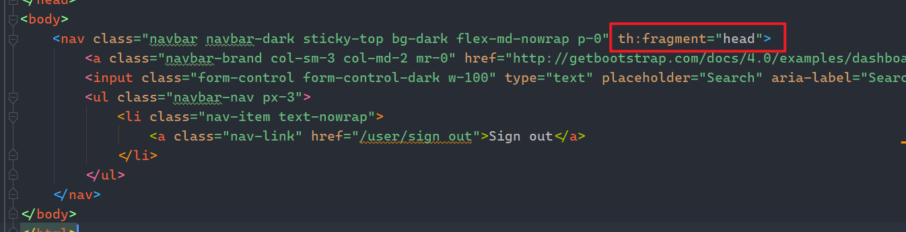
   >
   > 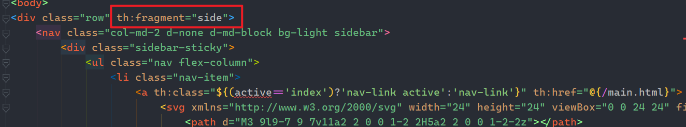
   >
   > 在需要使用的地方通过`th:insert`或`th:replace`引用
   >
   > 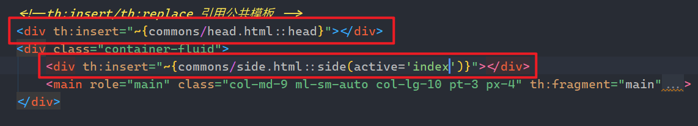
   >
   > 引用fragment的语法是`~{file::fragment}` 需要指定是哪个文件中的哪个fragment，使用`::`表示所属关系。
   >
   > 在引用fragment时候是可以携带参数的。

2. 将数据显示到页面中

   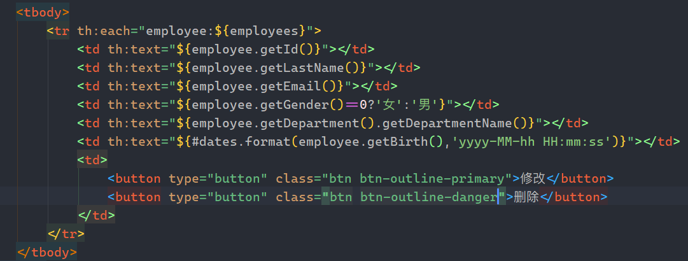

   > 在thymeleaf中提供了很多的工具类,在表达式用使用`#`即可查看，目前使用过的有`#strings`和`#dates`

## 7、添加员工

1. 编写视图跳转接口

   ```java
   @GetMapping("/addEmp")
   public String toAddPage() {
       return "emp/add";
   }
   ```

2. 修改前端页面，增加新页面用于提交新增用户表单

   员工列表页面增加跳转按钮

   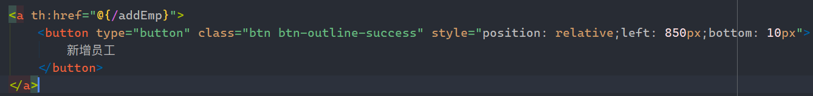

   在使用公共页面的基础上，修改显示内容为用户表单

   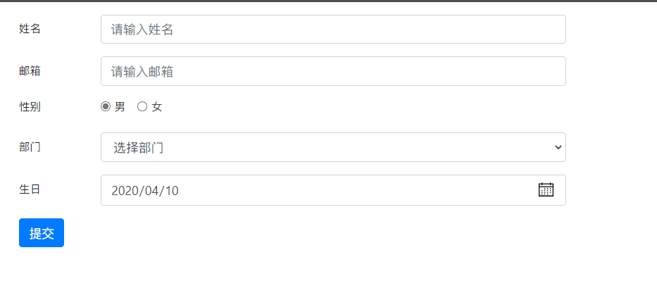

3. 编写接口接收用户表单

   > 我们发现一个问题，我们所提供的表单中的部门选择无法实现动态显示。只能够写死，这样不易于维护。
   >
   > 解决：我们在请求到表单页面时，在Controller中查询所有部门信息，并携带至表单页面，然后使用th:each循环显示。

   - 在新增页面跳转的接口中增加如下代码

   ```java
   Collection<Department> departments = departmentDao.getDepartments();
           model.addAttribute("departments", departments);
   ```

   - 使用th:each将部门信息显示出来

   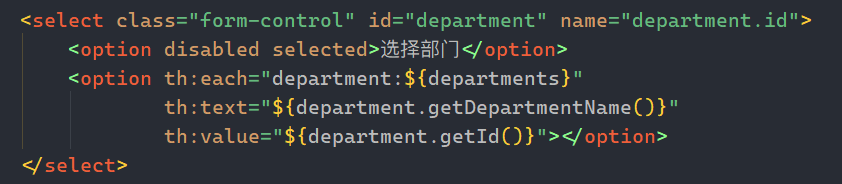

   > ==关于日期注意点：==
   >
   > 当我们使用bootstrap的input中date时，传入的日期字符串格式是`yyyy-MM-dd`，而MVC的配置项中有一项`date-format`配置
   >
   > 
   >
   > 而其默认是使用`yyyy/MM/dd`
   >
   > 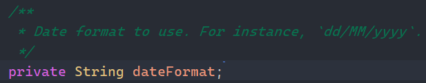
   >
   > 所以如要使用date类型的input，一定要配置日期格式为`yyyy-MM-dd`
   >
   > ----
   >
   > 第二个注意点：
   >
   > 由于我们的员工对象中的部门是一个对象，而我们无法使用单个输入框直接返回一个对象，所以可以只返回部门的id，然后在Dao层获取员工部门的id然后为其赋值。同样id是交由Dao层去为我们处理。
   >
   > 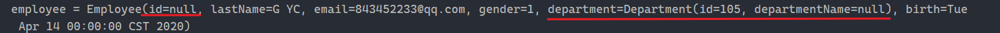
   >
   > 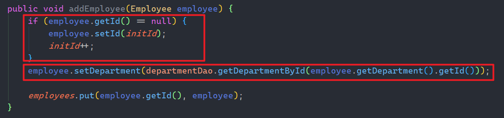
   
   ```java
   @PostMapping("/addEmp")
       public String addEmp(Employee employee) {
           System.out.println("employee = " + employee);
           employeeDao.addEmployee(employee);
           return "redirect:/empList";
   }
   ```
   
   > 相对于之前的视图跳转接口，虽然是同一个请求（/addEmp），但是由于请求方式的不同，所执行的方法也就不同，这就是RestFul风格。


## 8、修改信息

当我们选择某一个员工信息进行修改需要以下步骤：

1. 请求时携带员工的ID,方便获取数据

   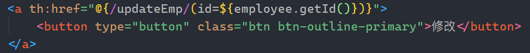

2. Controller层获取ID,查找用户,并携带参数跳转到修改页面

   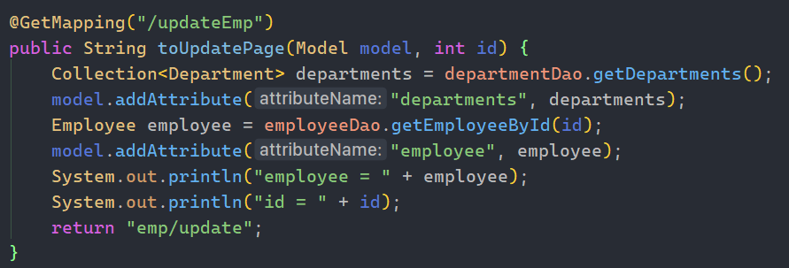

3. 将后端获取的数据显示到页面上

   使用新增员工的表单，使用模板引擎，通过判断，还原原先的员工信息。

   > ==注意同样是date的表单数据，显示前需要将后端获取的date数据进行格式化才能正常显示==
   >
   > 为了保证表单提交时能过准确定位是哪个员工，所以需要增加一个隐藏域默认设置为员工的id信息。

4. 用户修改完毕，提交表单给控制层

   控制层调用Dao层方法，按ID查找对指定员工覆盖之前的信息

   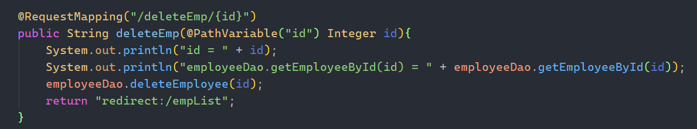


## 8、定制404页面

只需在模板文件夹下创建/error文件夹，然后将404.html放入文件夹下，即可生效。


