[toc]

# SpringCloud

## 一、为什么学习SpringCloud

> 在SpringBoot里面，我们提到了并简单了解了分布式系统架构，相较于传统的单机系统，他确实带来了性能的优化降低了成本，但是也不免出现一些问题：
>
> - 这么多分布式的服务，客户端如何访问？
> - 这些服务器之间如何通信？
> - 这些服务如何进行管理？
> - 如果分布式系统中，挂掉了一个节点怎么解决？
>
> 对于以上的问题，市面上出现了很多相应的解决方案：
>
> 1. 最开始的是SpringCloud Netfilx提出
>
>    对于以上四个问题分别给出了对应的方案：
>
>    - Zuul(网关，提供智能路由、访问过滤等功能)
>    - Feign(声明式服务调用组件) 使用Http的通信方式
>    - Eureka(服务注册与发现)
>    - Hystrix(容错管理，实现断路器模式) 熔断机制
>
>    以上是一套一站式的解决方案，遗憾的是官方在2018年底宣布停止维护
>
> 2. 后来就是Apache Zookeeper + Dubbo 解决方案
>
>    仅仅解决了其中两个问题，不够完善
>
> 3. 然后再就是SpringCloud Alibaba，目前十分热门

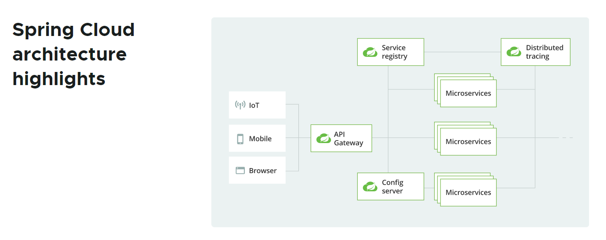

SpingCloud是基于SpringBoot提供的一套微服务的解决方案，==包括服务的注册与发现、配置中心、全链路监控、服务网关、负载均衡、熔断器等组件==，除了基于NetFilx的开源组件做高度的抽象封装之外，还有一些选型中立的开源组件。


## 二、SpringBoot与SpringCloud的关系

- SpringBoot专注于快速方便的开发单个个体微服务。
- SpringCloud是关注全局的微服务协调整治框架，他将SpringBoot开发的一个个单体微服务整合、管理，为各个微服务之间提供：配置管理、服务发现、断路器、路由、微代理、事件总线、全局锁、决策竞选、分布式会话等等集成服务。
- SpringBoot并不依赖于SpringCloud,可以单独开发使用，但反之则不行。


## 三、项目搭建

1. 依赖导入

   ```xml
   <!--修改打包方式 jar=>pom -->
       <packaging>pom</packaging>
   
       <properties>
           <project.build.sourceEncoding>UTF-8</project.build.sourceEncoding>
           <java.version>1.8</java.version>
           <maven.compiler.source>1.8</maven.compiler.source>
           <maven.compiler.target>1.8</maven.compiler.target>
           <log4j.version>1.2.17</log4j.version>
           <lombok.version>1.18.12</lombok.version>
       </properties>
   
   <dependencyManagement>
       <dependencies>
           <!-- spring-cloud 依赖导入-->
           <dependency>
               <groupId>org.springframework.cloud</groupId>
               <artifactId>spring-cloud-dependencies</artifactId>
               <version>Greenwich.SR5</version>
               <type>pom</type>
               <scope>import</scope>
           </dependency>
   
           <!--spring-boot 依赖导入-->
           <dependency>
               <groupId>org.springframework.boot</groupId>
               <artifactId>spring-boot-dependencies</artifactId>
               <version>2.2.6.RELEASE</version>
               <type>pom</type>
               <scope>import</scope>
           </dependency>
       </dependencies>
   </dependencyManagement>
   ```

   > 以上两个是 项目的依赖以及一些基本的项目配置，这些再我们用SpringBoot构建项目时，在父依赖里面就为我们增加动导入了。这里我们使用Maven构建项目就需要自己导入

   接下来还要导入：springboot-starter、mybatis-spring-boot-starter、mysql-connection、druid、log4j、junit、lombok、以及后续我们可能需要在build中加上打包插件。

2. 编写服务通用module：springcloud-api

   例如pojo等

3. 编写服务提供者module（Provider）

   简单的Mapper、Service、Controller,使用POM导入通用module的坐标，方便拿到POJO

4. 服务消费者module (Consumer)

   > 这里开始与之前的dubbo+zookeeper的模式产生了些许差别，同样是从远程调用获取服务，使用dubbo+zookeeper需要消费者首先具有完全相同的接口，然后使用@Referance注解，**这里由于消费者端是不应该有Service的，只是简单地取用即可。我们使用RestTemplate来代替。**

   用法：

   `RestTemplate`这个类主要地方法大多和`POST`|`GET`|`PATCH`|`DELETE`|`PUT`|`OPTIONS`等相关，很明显这些都是Http请求方法，所以我们就可以借助这些方法来通过HTTP获取远程服务。当然它还提供了execute方法可以自定义请求方法。

   纵观这些方法，离不开这几个参数：

   - `String url`    远程服务的URL
   - `@Nullable Object request`  这个仅在PATCH、POST、PUT中可见，可以为空，个人猜测应该是一个请求的实体类。
   - `Class<T> responseType`     响应的类型，即服务的响应类型，也即消费者所期望的响应类型。
   - `Object... uriVariables` `Map<String, ?> uriVariables`  这个就是我们请求服务时所携带的参数，一般可以是多个对象，或者也可以使用Map来封装。

   

   由于这个类没有被注册到Spring容器中，所以是需要我们自己编写配置来注册这个类的。

   然后再消费者的RestController中直接使用 **xxxForEntity，xxxForObject** 并填写相关参数即可请求到远程服务。

   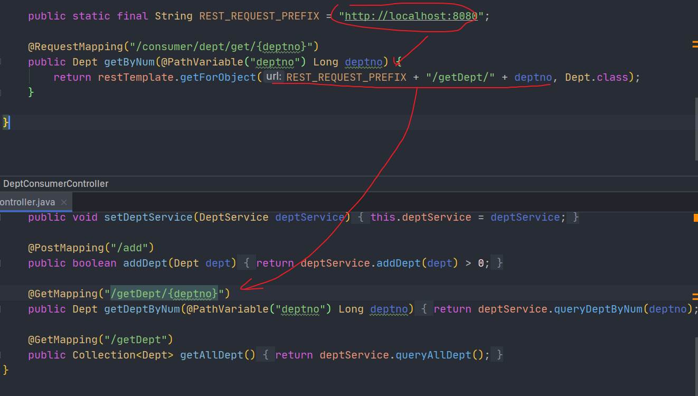

   也是可以使用字符串拼接，来进行参数传递哦，使用post、get..取决于远程服务的接口规定的请求方式

   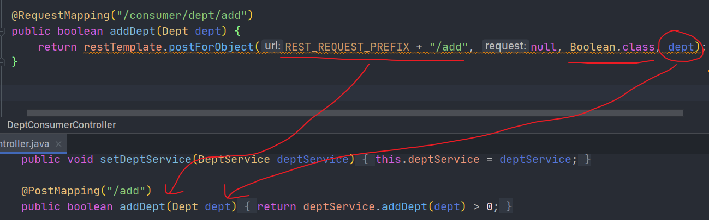


通过以上的代码编写，我们就可以实现从远程调用已经写好的服务，将调用与服务分开，降低了耦合度。相比于dubbo+zookeeper使用RPC方式各有优劣。


## 四、Euraka服务注册与发现

### Eureka概述

- 是Netflix的一个子模块，也是核心模块，设计时遵循AP原则。

- 用于定位服务，以实现云端中间层服务发现和故障转移，其功能与zookeeper类似，C/S模式。

- 两大组件：

  - **EurekaServer**：各节点启动后，会自动将自己的服务在Eureka中进行注册。
  - **EurekaClien**：是一个Java客户端，用于简化和EurekaServer的交互，内置了一个使用轮询负载算法的负载均衡器，应用启动后，将会向EurekaServer发送“心跳”(默认周期为30秒)，若EurekaServer在多个周期没有接收到节点的心跳，就将把这个服务节点从服务注册表中移除。

  

- 三大角色

  1. EurekaServer 提供服务注册与发现
  2. ServiceProvider 服务提供者，将服务注册到Eureka
  3. ServiceConsumer  服务消费者，从Eureka中获取已注册服务，消费使用。


### 入门简单使用

先导入依赖（注意这里SpringBoot有版本要求,建议使用2.1.10）

`EurekaServer`

```xml
<dependency>
    <groupId>org.springframework.cloud</groupId>
    <artifactId>spring-cloud-starter-netflix-eureka-server</artifactId>
</dependency>
```

直接进行配置

```yaml
server:
  port: 7001

eureka:
  instance:
    hostname: localhost # Eureka服务端的实例名称

  client:
    register-with-eureka: false # 表示不将自己注册到 EurekaServer (一般提供者端置为true)
    fetch-registry: false # 表不用获取注册表(一般消费者端置为true)
    # 以上两者为false 表明自己就是服务注册中心

    service-url: #设置访问路径，源码中有默认值，见下图：
      # 使用引用的方式设置
      defaultZone: http://${eureka.instance.hostname}:${server.port}/
```

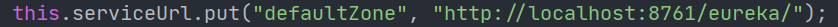

源码中ServiceUrl是一个HashMap，是可以put多个值的。

**关键一步就是要在启动类上使用@EnableEurekaServer注解**

启动后浏览器地址访问 localhost:7001 即可进入监控页面

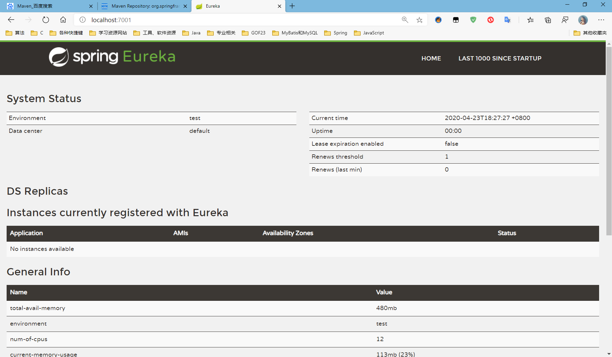


### 将服务提供者的服务注册到EurekaServer

在服务提供者Module中进行以下操作

Eureka-starter依赖导入

```xml
<dependency>
    <groupId>org.springframework.cloud</groupId>
    <artifactId>spring-cloud-starter-eureka</artifactId>
    <version>1.4.7.RELEASE</version>
</dependency>
```

添加配置

```yaml
eureka:
  client:
    service-url:
      # 配置服务注册的位置
      defaultZone: http://localhost:7001/eureka/
  instance:
    # 修改服务的描述信息
    instance-id: springcloud-provider-dept-8001
```

主启动类添加注解开启服务自动注册

`@EnableEurekaClient`

然后我们先启动EurekaServer，然后启动服务提供端，进入监控页面就会出现以下内容

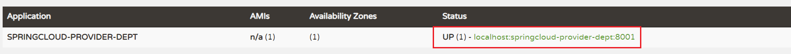

红框里这个状态描述是可以通过配置文件修改的。


我们现在断开服务提供端，等待一会刷新页面就会出现报错

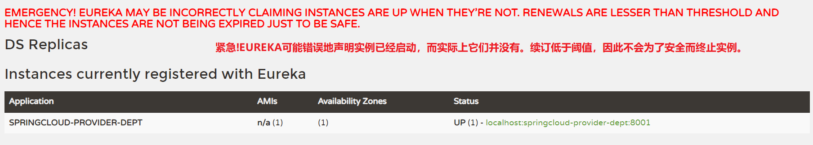

这是一种自我保护机制。

当EurekaServer在一段时间内(一般为90秒)未能接收到某个微服务的心跳，EurekaServer会注销该实例，但是**不会清除这个微服务的信息，而是对其信息进行保留。在自我保护模式中，EurekaServer不会盲目清除微服务**，这种机制使得Eureka集群更加健壮和稳定。

也可以使用`eureka.server.enable-self-preservation = false`来**禁止自我保护模式（不推荐）**


模拟集群搭建：

我们可以将EurekaServer的环境进行多份复制，通过修改host 来模拟一些域名，以模拟多个主机构建成集群，每个EurekaServer之间需要进行关联

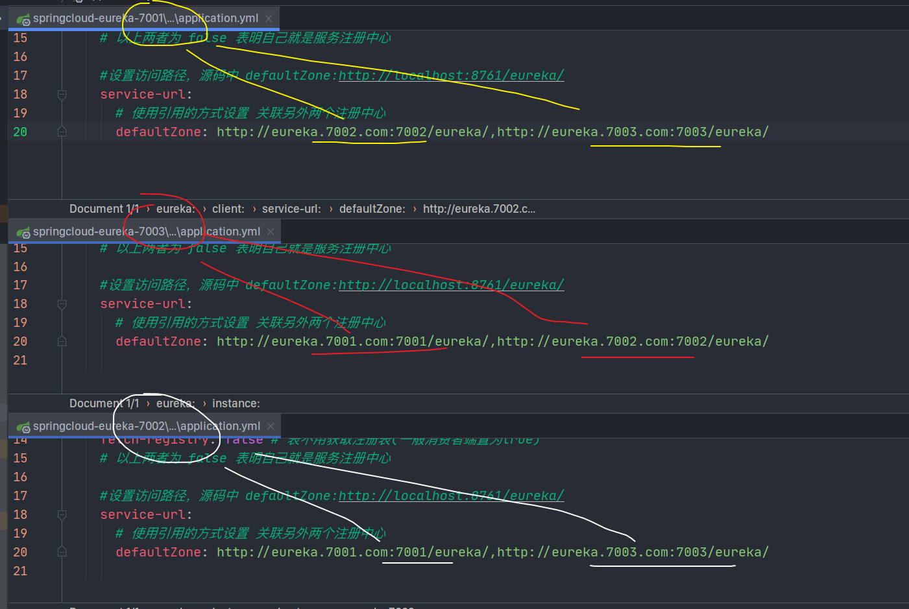

然后在启动集群后，就会产生这个效果

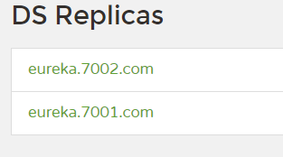

就是一个注册中心，拥有多个副本，并且服务提供者，只需要注册到其中任意一个注册中心，其他副本都可见。


### CAP原则

与CAP原则进行对比的就是ACID原则

RDBMS(MySQL、Oracle、SqlServer) ==> ACID原则

- 原子性、一致性、隔离性、持久性

NoSQL(Redis、MongoDB) ===>CAP原则

- 强一致性（Consistency）
- 可用性（Availability）
- 分区容错性（Partition tolerance）

> **CAP的三进二规则：无法同时满足三个，CA、CP、AP**

==CPA理论的核心==

- 一个分布式系统**不可能同时**很好地**满足**强一致性、可用性和分区容错性。
- NoSQL数据库按CAP原则划分为三个类分别是CA、CP、AP其特点分别是
  - CA：单点集群，通常扩展性较差。
  - CP：通常性能不高
  - AP：对一致性的要求低


### Eureka对比Zookeeper

由于CAP原则的三者是无法同时满足的。但由于在**分布式系统中分区容错性(P)是必要的**，所以就**只能在一致性(C)和可用性(A)之间衡量**

- Zookeeper采用的是CP
- Eureka采用的是AP


#### Zookeeper

当从注册中心获取服务列表是，可以容忍服务信息是几分钟前的，但是绝对不能容忍服务直接down掉不可用。换句话说就是**对可用性的要求要高于一致性。**在使用Zookeeper作为服务注册中心，会发生以下这种情况

当主节点的因为网络故障与其他节点失去联系的时候，这时候剩余的节点会重新选取一个leader节点，而选举的这段时间内整个集群都是不可用的，也就导致了所有注册服务的瘫痪，如果选举时间过长，就会极大降低系统的稳定性。而在云部署的环境中这样的情况发生的频率是极高的。虽然最终服务是可以恢复的但是频繁出现服务长期不可用是无法容忍的。


#### Eureka

Eureka就很好的避免这个问题，它保证了可用性，牺牲了一致性。在Eureka集群中不存在master节点，所有节点之间是平等的，即使中间一个节点故障也不影响其他节点的正常工作，当服务注册访问了一个不可用的节点也会自动接入其他可用的节点，除此以外Eureka的自我保护机制也体现出了很大的优势。

当连续15分钟内85%的节点都没有正常的心跳，那么Eureka就会判断是客户端与注册中心出现了网络故障，此时自我保护机制就会采取以下措施：

- Eureka不再从服务注册列表中移除由于长时间没有收到心跳而过期的服务。
- Eureka仍然能过接收新的服务注册和服务查询的请求，但是不会同步到其他节点上（保证当前节点可用）
- 当网络恢复稳定后，重新开始进行同步。


==总结来看，Eureka可以很好地应对因网络故障导致部分节点失去联系地情况，而不会向Zookeeper那样是整个注册服务瘫痪。唯一地缺点就是Eureka的注册服务的数据同步不那么即时。==


## 五、Ribbon负载均衡

### 什么是Ribbon

- 一款客户端负载均衡的工具
- Ribbon自动帮助我们基于某种规则(例如简单轮询，随机连接等)去连接这些机器，来实现负载均衡
- Ribbon也方便我们实现自定义的负载均衡算法。

### 什么是负载均衡

- 负载均衡(LB)、LoadBalance，在微服务或分布式集群中常用的一种应用。

- 简单来说，就是将大量的用户请求平均分摊到多台服务器上，来降低单台服务器的负载，从而达到系统的高可用(HA)

- 常见的负载均衡的软件Nginx,LVS等

- 负载均衡的分类

  - 集中式

    即在服务的消费方和提供方之间使用独立的LB设施，例如Nginx(反向代理服务器)，由该设施负责把访问请求通过某种策略均匀转发到服务提供方

  - 进程式

    将LB逻辑集成到消费方，消费方从服务注册中心获知有哪些地址可用，然后自己再从这些地址中选出合适的服务器。

    ==Ribbon就属于进程式LB==,他只是一个类库，集成与消费方进程，消费方通过它来获取服务提供方的地址。


### 集成Ribbon到消费端

导入依赖

Ribbon 和 Eureka

```xml
<!--Ribbon-->
<dependency>
    <groupId>org.springframework.cloud</groupId>
    <artifactId>spring-cloud-starter-netflix-ribbon</artifactId>
    <version>2.2.2.RELEASE</version>
</dependency>

<!--Eureka-->
<dependency>
    <groupId>org.springframework.cloud</groupId>
    <artifactId>spring-cloud-starter-eureka</artifactId>
    <version>1.4.7.RELEASE</version>
</dependency>
```

配置文件中配置Eureka

```yaml
# Eureka
eureka:
  client:
    register-with-eureka: false #不向注册中心注册自己
    service-url:
      defaultZone: http://eureka.7001.com:7001/eureka/,http://eureka.7002.com:7002/eureka/
```

在服务消费端，我们通过RestTemplate去访问注册中心，所有要为 RestTemplate组件设置负载均衡。使用`@LoadBalanced`注解

```java
@LoadBalanced
@Bean
public RestTemplate getRestTemplate() {
    return new RestTemplate();
}
```

由于启用了负载均衡，我们请求服务列表的地址不再是固定的了，而是以服务名为准

```java
// public static final String REST_REQUEST_PREFIX = "http://localhost:8001";
// 开启LB后
public static final String REST_REQUEST_PREFIX = "http://SPRINGCLOUD-PROVIDER-DEPT";
```

然后先启动注册中心Eureka,再启动服务提供端，最后启动消费端，此时仍然能够正常访问获取服务。


为了使我们更能明显的感觉到负载均衡的存在，我们需要复制创建多个服务提供者，方便我们的消费端进行选择。并且同时创建了三个数据库。

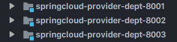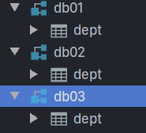

当我们开启注册中心后，然后启动三个服务提供者，在注册中心中就能显示到，这一个服务同时有三个提供者。

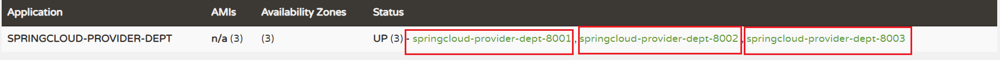

而当消费者去调用服务时，每次请求的结果都可以看出来是从不同的提供者那里调用的同一个服务

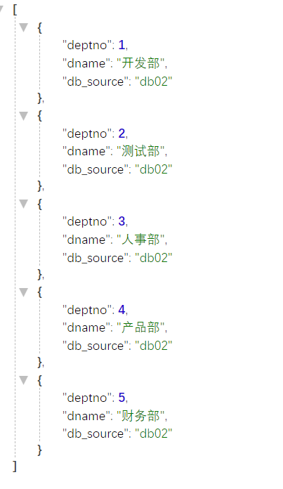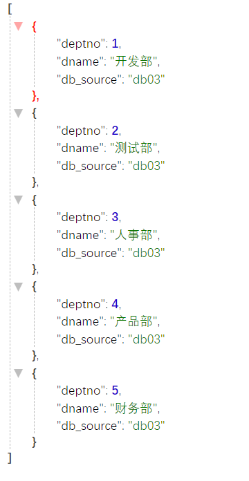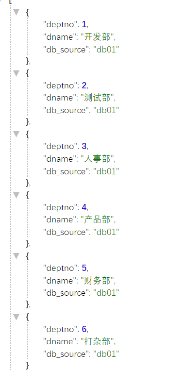

> 有没有发现三次请求结果的db_source都不相同，这就能很好地表现出负载均衡的存在！且使用的负载均衡的算法是类似于==轮询==的方式


### 设置负载均衡算法和自定义算法

在负载均衡中`IRule`是每一个负载均衡算法都需要实现的接口，它的实现类大多是负载均衡的算法：

`RoundRobinRule`：轮询调度算法、

`RandomRule`：随机调度算法等等、

`ZoneAvoidanceRule`：复合判断Server所在Zone的性能和Server的可用性选择Server，在没有Zone的环境下，类似于轮询。这是**Ribbon默认的负载均衡算法。**

IRule接口：

```java
public interface IRule {
    Server choose(Object var1);

    void setLoadBalancer(ILoadBalancer var1);

    ILoadBalancer getLoadBalancer();
}
```

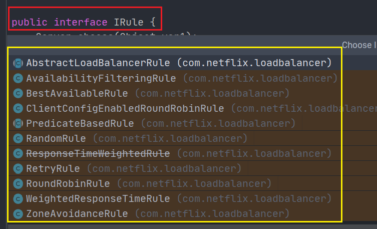

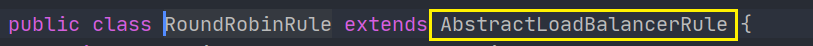

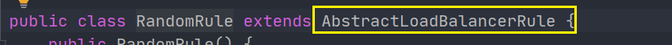

**那么这些负载均衡算法我们如何使用呢？**

只需要在Ribbon的配置类中将写好的负载均衡算法 注册到容器中。这是一种**不规范**的操作，但是可以生效。

```java
@Bean
public IRule randomRule() {
    return new RandomRule();
}
```


**正确的做法**，应该是在组启动类上使用`@RibbonClient`注解
指定服务的名字 和 负载均衡算法配置类的Class。

```java
@RibbonClient(name = "SPRINGCLOUD-PROVIDER-DEPT",configuration = MyLoadBalancerRuleConfig.class)
```

然后创建RibbonRuleConfig类，这个类的<a href="#tip1">位置有特殊要求</a>，并使用@Configuration标志为配置类，然后在这个类中去注册负载均衡的算法。

```java
@Configuration
public class RibbonRuleConfig {

    @Bean
    public IRule rule() {
        return new RandomRule();
    }
}
```


这些负载均衡的算法都是通过继承`AbstractLoadBalancerRule`来间接实现IRule接口

```java
public abstract class AbstractLoadBalancerRule implements IRule, IClientConfigAware {
    private ILoadBalancer lb;

    public AbstractLoadBalancerRule() {
    }

    public void setLoadBalancer(ILoadBalancer lb) {
        this.lb = lb;
    }

    public ILoadBalancer getLoadBalancer() {
        return this.lb;
    }
}
```

通常**算法规则都是重写IRule的choose方法中的**，并且此方法中只有中间部分是算法的核心，其他部分在不同的算法中是相同的。

```java
public Server choose(ILoadBalancer lb, Object key){
    
}
```

那么也就是说如果我们想要自定义算法的话，就需要继承AbstractLoadBalancerRule类，然后重写IRule的choose方法，然后将其注册到Spring容器中即可。


<a name="tip1">自定义Ribbon配置类的位置</a>

> **我们这里创建自定义的RibbonConfiguration应该是@Configration，并且不应该放在Application上下文中**，因为Ribbon和SpringBoot都会有上下文，前者是子上下文，后者是主上下文，若放在了启动类的上下文中，就会产生**父子上下文重叠**的情况，配置就会被所有RibbonClient共享, 从而导致一系列奇葩错误。

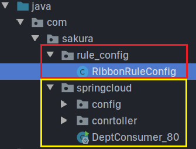

**自定义算法：**

```java
public class MyRule extends AbstractLoadBalancerRule {

    /**
     * 当前服务器提供服务的次数
     */
    private int count = 0;

    /**
     * 当前提供服务的服务器
     */
    private int currentServerIndex = 0;

    public Server choose(ILoadBalancer lb, Object key) {
        // 没有负载均衡
        if (lb == null) {
            return null;
        }
        Server server = null;

        while (server == null) {
            if (Thread.interrupted()) {
                return null;
            }
            // 获取可用的服务
            List<Server> upList = lb.getReachableServers();
            // 获取所有服务
            List<Server> allList = lb.getAllServers();

            int serverCount = allList.size();
            // 没有服务
            if (serverCount == 0) {
                return null;
            }

            //=====此部分是算法的核心内容==============

            // 每个服务器提供五次服务，然后轮换。
            if (count < 5) {
                count++;
            } else {
                count = 0;
                currentServerIndex++;
                if (currentServerIndex == upList.size()) {
                    currentServerIndex = 0;
                }
                count++;
            }
            
            server = upList.get(currentServerIndex);

            //======================================

            // 没有获取到服务
            if (server == null) {
                Thread.yield();
                continue;
            }

            if (server.isAlive()) {
                return (server);
            }

            // Shouldn't actually happen.. but must be transient or a bug.
            server = null;
            Thread.yield();
        }

        return server;

    }
    
    @Override
    public Server choose(Object key) {
        return choose(getLoadBalancer(), key);
    }

    @Override
    public void initWithNiwsConfig(IClientConfig clientConfig) {
    }
}
```

**在RibbonRuleConfig中注册自定义算法**

```java
@Configuration
public class RibbonRuleConfig {

    @Bean
    public IRule rule() {
        return new MyRule();
    }
}
```

**启动类上配置@RibbonClient**

```java
@RibbonClient(name = "SPRINGCLOUD-PROVIDER-DEPT",configuration = RibbonRuleConfig.class)
```


## 六、Feign负载均衡

Feign是声明式的WebService客户端。

Ribbon中我通过服务名去访问服务，**Feign中通过接口方式调用微服务。**
使用Feign我们只需要创建一个接口，并使用一个注解就可以完成配置。

### 使用步骤

创建一个服务消费者module,导入 Eureka、web、feign依赖

```xml
<!--feign-->
<dependency>
    <groupId>org.springframework.cloud</groupId>
    <artifactId>spring-cloud-starter-feign</artifactId>
    <version>1.4.7.RELEASE</version>
</dependency>
```

我们需要在我们的服务通用module中 创建一个service包和DeptService接口并使用@FeignClient注解，这里要和我们之前使用Ribbon 的服务消费者完全区别开来。不再使用RestTemplate。有点类似与dubbo+zookeeper的那一套做法，**直接引用Service**。

1. 首先我们创建DeptService，加上@FeignClient、@Component，然后将服务提供者的Service接口复制一份。因为最终是访问会经过服务提供者的Service，所以要保持一致。

   ```java
   @Component
   @FeignClient(name = "SPRINGCLOUD-PROVIDER-DEPT")
   public interface DeptService {
   
       @PostMapping("/add")
       Integer addDept(Dept dept);
   
       @GetMapping("/getDept/{deptno}")
       Dept queryDeptByNum(@PathVariable("deptno") Long deptno);
   
       @GetMapping("/getDept")
       Collection<Dept> queryAllDept();
   
   }
   ```

   > 由于我们不再使用服务名去请求接口也不再使用RestTemplate，而是直接使用接口去访问微服务，就需要使用注解 注明微服务的名称以及微服务中可用服务的访问路径，我们在服务消费端的Controller中直接调用Service的方法，就能准确地定位到微服务。

服务消费端使用接口方法，代替RestTemplate

```java
@Controller
public class DeptConsumerController {

    @Autowired
    DeptService deptService;

    @RequestMapping("/consumer/dept/get/{deptno}")
    public Dept getByNum(@PathVariable("deptno") Long deptno) {
        return deptService.queryDeptByNum(deptno);
    }

    @RequestMapping("/consumer/dept/get")
    public Collection<Dept> getAll() {
        return deptService.queryAllDept();
    }

    @RequestMapping("/consumer/dept/add")
    public Integer addDept(Dept dept) {
        return deptService.addDept(dept);
    }
}
```

我们来看看两者的对比：

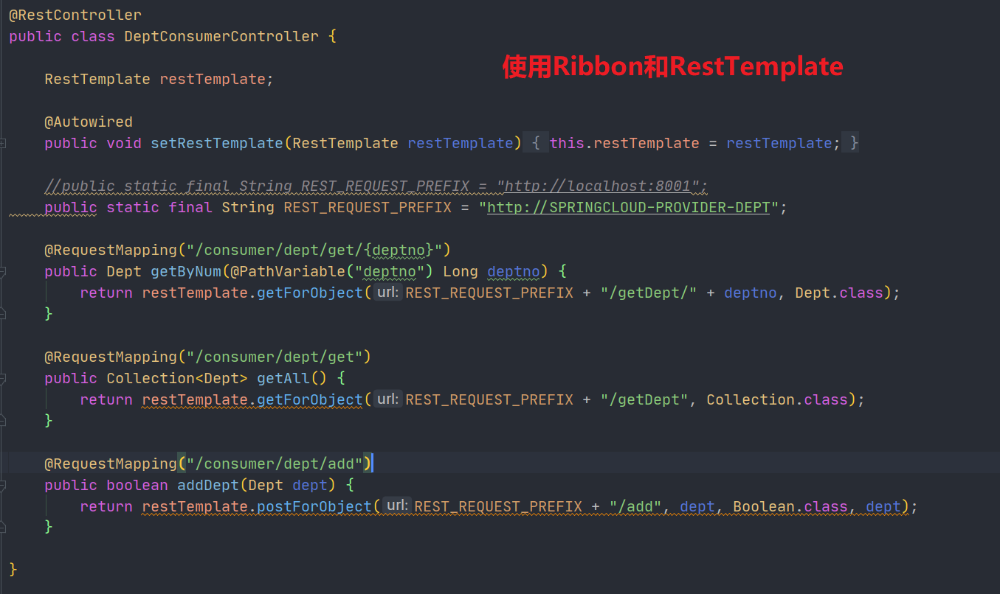

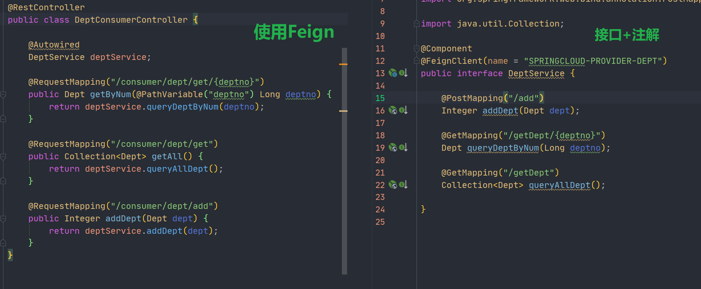

> 明显后者更加简洁，更符合面向接口编程的规范。

最后我们在主启动类上加上注解使接口的注解生效

```java
@EnableFeignClients(basePackages = "com.sakura.springcloud")
```


## 七、Hystrix服务熔断

参考官方资料：https://github.com/Netflix/Hystrix/wiki


### 什么是Hystrix

- Hystrix是一个用于处理分布式系统的延迟和容错的开源库
- Hystrix通过隔离服务之间的访问点、停止级联失败和提供回退选项来实现这一点，所有这些都可以提高系统的整体弹性。
- 保证一个多服务依赖的应用，不会因为其中一个服务的故障而导致整体服务的失败。

### Hystrix产生的目的

Hystrix被设计的目标是：

1. 对通过第三方客户端库访问的依赖项（通常是通过网络）的延迟和故障进行保护和控制。
2. 在复杂的分布式系统中阻止级联故障。
3. 快速失败，快速恢复。
4. 回退，尽可能优雅地降级。
5. 启用近实时监控、警报和操作控制。

### Hystrix解决什么问题

复杂分布式体系结构中的应用程序有许多依赖项，每个依赖项在某些时候都不可避免地会失败。如果主机应用程序没有与这些外部故障隔离，那么它有可能被他们拖垮。

> 例如，对于一个依赖于30个服务的应用程序，每个服务都有99.99%的正常运行时间，你可以期望如下：
>
> 99.9930 = 99.7% 可用
>
> 也就是说一亿个请求的0.03% = 3000000 会失败
>
> 如果一切正常，那么每个月有2个小时服务是不可用的

**Hystrix能：**

- 服务降级
- 服务熔断
- 服务限流
- 接近实时的监控
- ...


**一切正常：**


当其中有一个**系统有延迟时，它可能阻塞整个用户请求**：


在**高流量的情况下**，一个后端依赖项的延迟可能导致所有服务器上的**所有资源在数秒内饱和**（PS：意味着后续再有请求将无法立即提供服务）


### 服务熔断——断路器

> “断路器”本身是一种开关装置，当某个服务单元发生故障之后，**通过断路器的故障监控(类似于熔断保险丝)，向服务的调用方返回一个故障服务预期的、可处理的备选响应(FallBack)，而不是长时间等待或者抛出“调用方法无法处理”的异常，这样就保证了服务调用方的线程不会被长时间处于不必要的占用状态**，从而避免了故障在分布式系统中的蔓延、累积导致服务雪崩。


### 测试使用“断路器”

1. 创建一个新的服务提供者springcloud-provider-dept-hystrix-8001

   hystrix依赖导入

   ```xml
   <dependency>
       <groupId>org.springframework.cloud</groupId>
       <artifactId>spring-cloud-starter-hystrix</artifactId>
       <version>1.4.7.RELEASE</version>
   </dependency>
   ```

2. 完全复制普通服务提供端的代码

3. 对Controller层稍作修改，使用`@HystrixCommand`注解，设置服务熔断回调方法

   ```java
   @HystrixCommand(fallbackMethod = "hystrixGetDeptByNum") // 设置失败回调方法
   @GetMapping("/getDept/{deptno}")
   public Dept getDeptByNum(@PathVariable("deptno") Long deptno) {
   
       Dept dept = deptService.queryDeptByNum(deptno);
   
       if (dept == null) {
           throw new RuntimeException(deptno + "未找到，或者不存在");
       }
   
       return dept;
   }
   
   /**
    * @param deptno
    * @retur 错误的 Dept
    * 备用的方法
    */
   public Dept hystrixGetDeptByNum(@PathVariable("deptno") Long deptno) {
       return new Dept()
               .setDeptno(deptno)
               .setDname("此部门不存在")
               .setDb_source("this database is not found");
   }
   ```

   > 经过修改以后，当访问/getDept/{deptno}时，一旦数据库中查不到数据，就会抛出异常，然后就会调用备用的方法hystrixGetDeptByNum。

4. 还要一步就是主启动类上注解开启断路器

   **`@EnableCircuitBreaker`**


**对比**

开启断路器

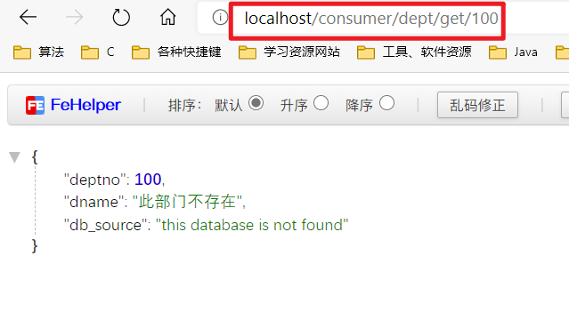

未启用

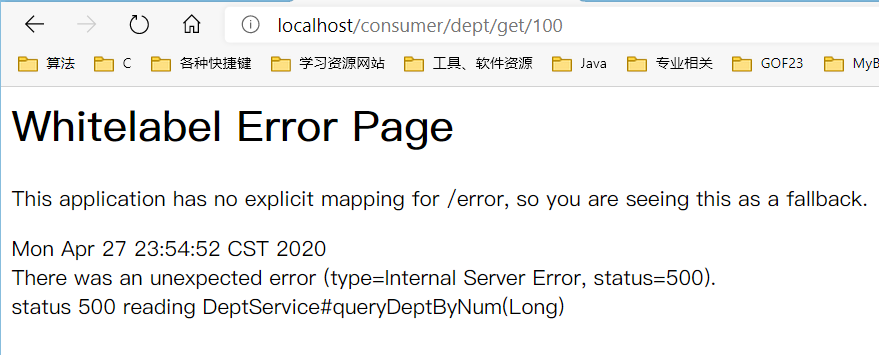


### 服务降级

> 当在某个时间段，有一台服务服务量远大于其他服务时，整体资源不足时就需要忍痛暂时关闭哪些闲置的服务，来支持访问量高的服务。而那些正在访问闲置服务的用户需要得到反馈信息，而不是直接扑空，否者这样会降低用户的使用体验。

我们要在服务消费端的接口中稍作修改

1. 在服务通用Module中我们已经使用Feign创建了一个接口，现在我们需要创建一个失败回调方法工厂类，当用户通过接口访问服务出错时，就会走对应这个类中的失败回调方法。

   - 首先我们要创建工厂类实现FallBack接口，重写create方法

     ```java
     @Component
     public class DeptServiceFallBackFactory implements FallbackFactory {
         @Override
         public Object create(Throwable throwable) {
             return null;
         }
     }
     ```

   - 在create()方法中 new一个DeptService接口，并实现接口中的方法，就是对应的接口中方法的失败回调方法。

     ```java
     @Component
     public class DeptServiceFallBackFactory implements FallbackFactory {
         @Override
         public Object create(Throwable throwable) {
             DeptService fallBackService = new DeptService() {
                 @Override
                 public Integer addDept(Dept dept) {
                     return 0;
                 }
     
                 @Override
                 public Dept queryDeptByNum(Long deptno) {
                     return new Dept()
                             .setDeptno(0L)
                             .setDname("当前服务不可用，稍后再试")
                             .setDb_source("this database is not found");
                 }
     
                 @Override
                 public Collection<Dept> queryAllDept() {
                     ArrayList<Dept> list = new ArrayList<>();
                     list.add(new Dept()
                             .setDeptno(0L)
                             .setDname("当前服务不可用，稍后再试")
                             .setDb_source("this database is not found"));
                     return list;
                 }
             };
             return fallBackService;
         }
     }
     ```

2. 为了让接口与这个工厂类联系起来，我们需要使用在接口中之前使用`@FeignClient()`注解，fallBackFactory属性设置这个类的

   ```java
   @FeignClient(name = "SPRINGCLOUD-PROVIDER-DEPT", fallbackFactory = DeptServiceFallBackFactory.class)
   ```

3. 在服务消费者中配置文件中设置开启服务降级

   ```java
   feign:
     hystrix:
       enabled: true
   ```

4. 启动测试

   - 当服务一切正常时，不会出现问题

   - 现在我们模拟服务降级暂时关闭服务器。

     此时我们再访问就会得到反馈结果：

     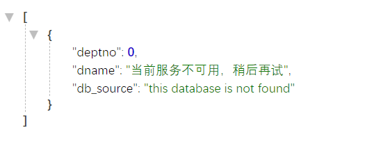

     对比不使用服务降级，服务关闭，用户请求没有反馈

     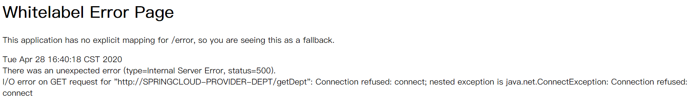


### 对比服务熔断和服务降级

**服务熔断：**

> 处理的是服务的提供端，针对某一个服务出现异常(过载)时，为了防止对整体系统的影响，进行服务熔断，并给出反馈。是一种保护措施，所以很多地方把熔断亦称为过载保护。

**服务降级：**

> 处理的是服务的消费端，站在整个web应用的负载考虑，关闭闲置的服务，此时服务不可访问，但其本身并没有出错，访问暂时关闭的服务时，会通过消费端预先准备的缺省回调，给出反馈。


> **相似处**
> ==目的很一致==，都是从可用性可靠性着想，为防止系统的整体缓慢甚至崩溃，采用的技术手段；
> ==最终表现类似==，对于两者来说，最终让用户体验到的是某些功能暂时不可达或不可用；
> ==粒度一般都是**服务**级别==，当然，业界也有不少更细粒度的做法，比如做到数据持久层（允许查询，不允许增删改）；
> ==自治性要求很高==，熔断模式一般都是服务基于策略的自动触发，降级虽说可人工干预，但在微服务架构下，完全靠人显然不可能，开关预置、配置中心都是必要手段；
>
> **区别：**
> ==触发原因不太一样==，服务熔断一般是某个服务（下游服务）故障引起，而服务降级一般是从整体负荷考虑；
> ==管理目标的层次不太一样==，熔断其实是一个框架级的处理，每个微服务都需要（无层级之分），而**降级一般需要对业务有层级之分（比如降级一般是从最外围服务开始）**
>
> 原文链接：https://blog.csdn.net/guwei9111986/article/details/51649240


### HystrixDashBoard——监控

**使用：**

1. 首先确认每个服务提供端都有**服务监控的Actuator依赖和Hystrix依赖**

   ```xml
   <!--actuator 服务监控信息 -->
   <dependency>
       <groupId>org.springframework.boot</groupId>
       <artifactId>spring-boot-starter-actuator</artifactId>
   </dependency>
   <!--Hystrix-->
   <dependency>
       <groupId>org.springframework.cloud</groupId>
       <artifactId>spring-cloud-starter-hystrix</artifactId>
       <version>1.4.7.RELEASE</version>
   </dependency>
   ```

2. 创建一个Module 专用于监控

   导入HystrixDashBoard依赖、Web依赖

   ```xml
   <dependency>
       <groupId>org.springframework.cloud</groupId>
       <artifactId>spring-cloud-starter-hystrix-dashboard</artifactId>
       <version>1.4.7.RELEASE</version>
   </dependency>
   ```

3. 配置文件，配置端口9001(端口随意)

4. 启动类上使用`@EnableHystrixDashBoard`开启监控服务

5. 启动，访问 localhost:9001/hystrix，进入如下界面

   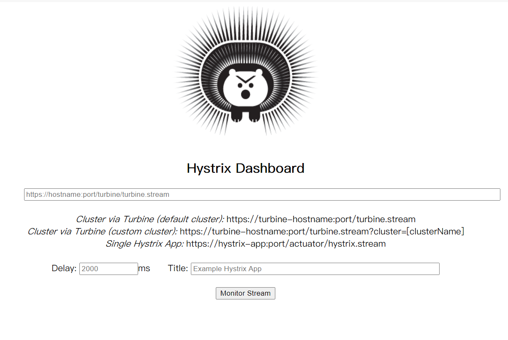

当我们需要监控某个服务的时候，为服务提供者增加一个Servlet

```java
@Bean
public ServletRegistrationBean<Servlet> hystrixMetricsStreamServlet(){
    ServletRegistrationBean<Servlet> registrationBean = new ServletRegistrationBean<>(new HystrixMetricsStreamServlet(), "/actuator/hystrix.stream");
    return registrationBean;
}
```

然后启动注册中心，服务提供者，监控系统和服务消费者。

访问localhost:8001/actuator/hystrix.stream
当服务没有消费者消费时，没有data产生，只有ping代表服务的心跳，它还活着

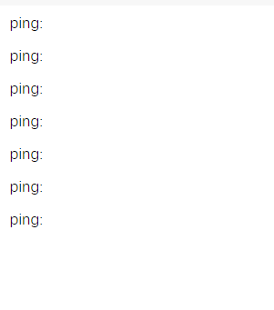

而一旦有消费者访问了**带有 `@HystrixCommand`注解**的Controller方法，就会产生data(监控数据)，出现以下这种效果。我们就可以使用DashBoard来分析这些数据，进行展示。

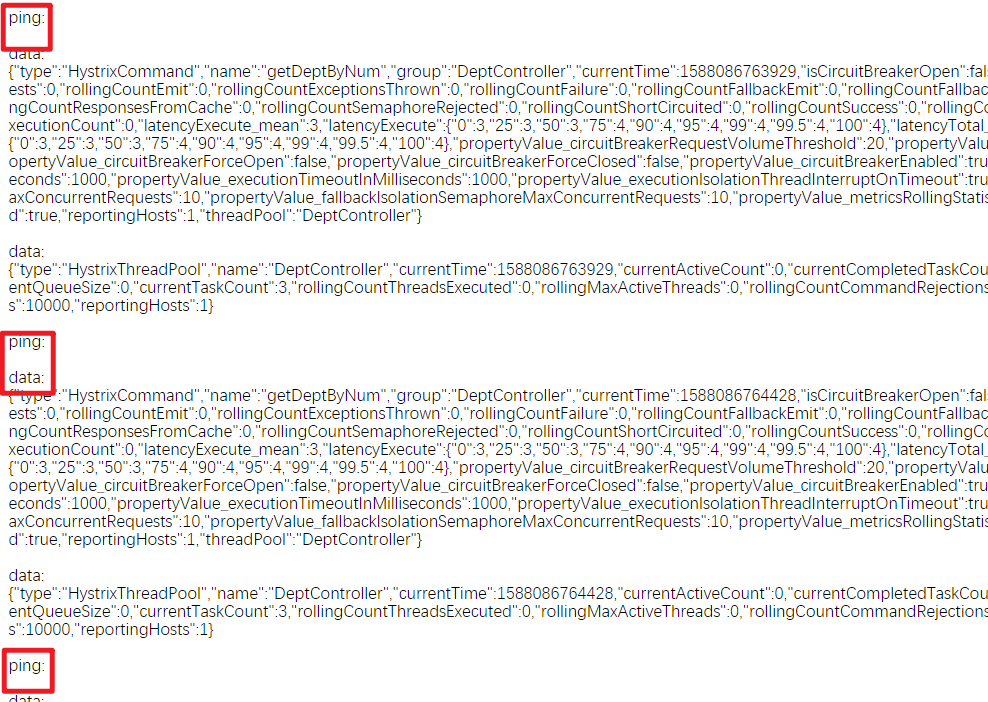


> 同时在监控页面中地址栏输入localhost:8001/actuator/hystrix.stream，就相当于可视化界面来监控这个服务。包括这个服务的各个方法的访问频率等。

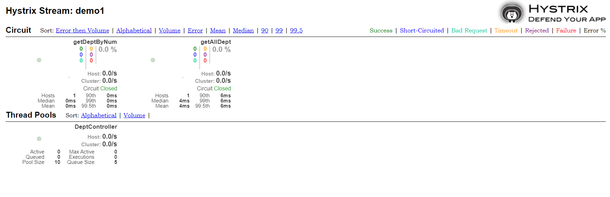

> 注意：
>
> 1. 在服务提供者中**只有带有@HystrixCommand注解的方法，才能被监控到**，其他方法是无法监控到的。
> 2. 若服务没有被访问，或者访问的服务方法没有@HystrixCommand注解，是不会产生监控数据的

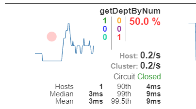

- 圆：它有颜色和大小之分，颜色代表服务的健康程度、大小代表流量大小。
  健康度从绿色、黄色、橙色、红色递减。
  通过该实心圆的展示，我们就可以在大量的实例中快速的发现故障实例和高压力实例。
- 线：记录2 分钟内流量的相对变化，我们可以通过它来观察到流量的上升和下降趋势。
- 六个数字
  - <span style="color:green">**成功数**</span>
  - <span style="color:blue">**熔断次数**</span>
  - <span style="color:#00DDDD">**错误请求数**</span>
  - <span style="color:orange">**超时此数**</span>
  - <span style="color:purple">**拒绝次数**</span>
  - <span style="color:red">**失败次数**</span>
- 百分数：短期内服务错误次数的占比
- Circuit：断路状态（熔断状态）


## 八、Zuul路由网关

### 概述

**什么是Zuul?**

> Zuul包含了对**请求的路由和过滤**两个主要功能
>
> 路由功能：负责将外部请求转发到具体的微服务实例上，是==实现外部访问统一入口的基础。==
>
> 过滤器功能：负责对请求的处理过程进行干预，实现==请求校验，服务聚合等功能的基础。==

Zuul和Eureka进行整合，将Zuul自身注册为Eureka服务治理下的应用，同时从Eureka中获得其他微服务的消息，也即以后的访问微服务都要通过Zuul跳转后获得。

Zuul在整个微服务系统中扮演网关的角色。

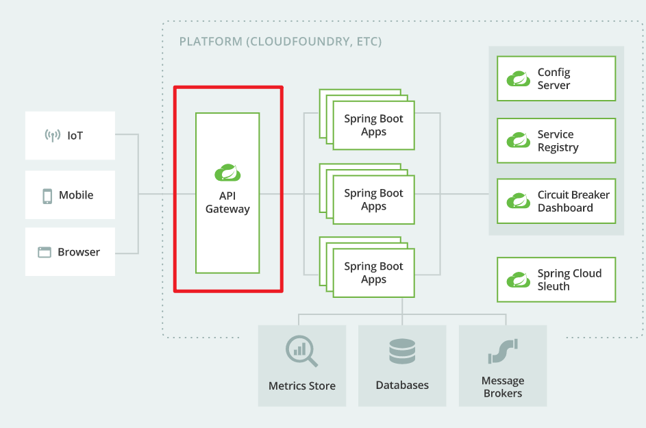

### 配置使用：

首先要注意，Zuul也是需要注册到Eureka中进行统一管理的！！

1. 导入SpringWeb、Zuul和Eureka依赖

   ```xml
   <!--Zuul-->
   <dependency>
       <groupId>org.springframework.cloud</groupId>
       <artifactId>spring-cloud-starter-zuul</artifactId>
       <version>1.4.7.RELEASE</version>
   </dependency>
   ```

2. 编写配置

   ```yaml
   server:
     port: 9527
   
   # 服务名
   spring:
     application:
       name: springcloud-gateway
   
   eureka:
     client:
       service-url:
         defaultZone: http://eureka.7001.com:7001/eureka/,http://eureka.7002.com:7002/eureka/,http://eureka.7003.com:7003/eureka/
     instance:
       instance-id: springcloud-gateway-zuul
       prefer-ip-address: true
   
   # 服务的信息
   info:
     app.name: sakura-springcloud
     company.name: sakura-Gyc
   ```

   将Zuul注册到Eureka，由于Zuul是服务于整个微服务系统的 所以配置内容稍后我们会进行补充。

3. 主启动类上使用`@EnableZuulService`注解。


这是我们通过消费端去访问服务的url:
通过访问消费端的Controller间接调用服务提供端的Controller

```
http://localhost/consumer/dept/get
```

这是我们直接请求服务提供者的Controller的url
直接调用服务提供端的Controller

```
http://localhost:8001/getDept
```

这是我们通过zuul访问服务的url
通过服务名定位服务 ，然后调用对应的Controller

```
http://localhost:9527/springcloud-provider-dept/getDept
```

> Zuul可以配置拒绝掉哪些不合乎规范的请求，以及一些其他请求相关的配置 例如服务请求路径修改，隐藏url种服务名，增加固定前缀等。


**服务代理：**

```yaml
zuul:
  routes:
    mydept.serviceId: springcloud-provider-dept
    mydept.path: /mydept/**
  ignored-services: springcloud-provider-dept
```

加上这段配置后，之前使用服务名方式访问就无法使用了，例如：

原来可以这样访问：

```
http://localhost:9527/springcloud-provider-dept/getDept
```

现在这种方式不可用了因为 在配置中springcloud-provider-dept这个服务被ignore，而我们只能通过Zuul作为代理去访问服务，

```
http://localhost:9527/mydept/getDept
```


> 当有多个微服务时，将所有的微服务都加入ignored-services 用`*`表示，然后为每个微服务设置代理访问路径。就达到了隐藏服务名的目标。


**网关固定前缀：**

```yaml
zuul:
  prefix: sakura
```

所有请求都需要加上固定的前缀，才能通过网关进行下一步路由，否者连网关都过不去！在使用多个网关是可以使用，以区别各个网关。

前面例子中url就要修改成

```
http://localhost:9527/sakura/mydept/getDept
```


## 九、SpringCloudConfig

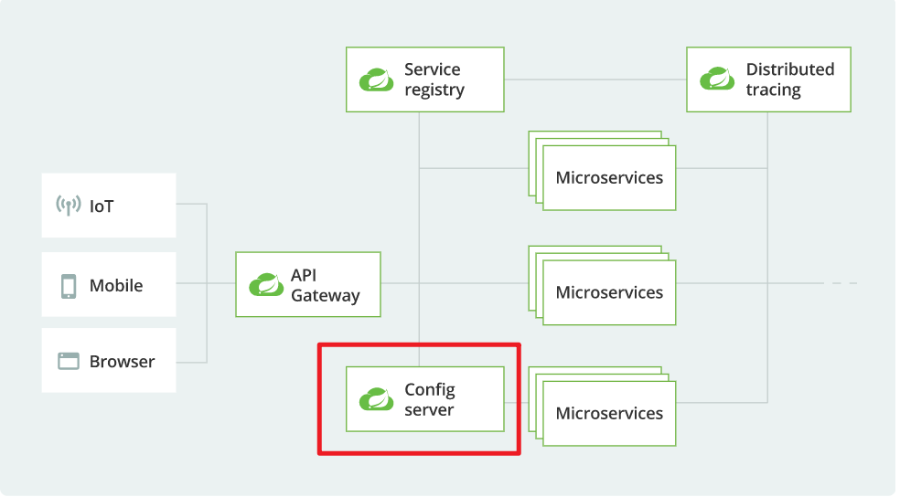

>  **我们的微服务系统，往往需要和配置文件进行合作，而我们的配置信息存放位置一般有两种，一种是本地Local，还有一种就是远程Remote，而官方推荐使用ConfigServer 就是基于git进行存储的。**


**SpringCloud-config-server**

spring-cloud-config 依赖导入

```xml
<dependency>
    <groupId>org.springframework.cloud</groupId>
    <artifactId>spring-cloud-config-server</artifactId>
    <version>2.1.2.RELEASE</version>
</dependency>
```

配置文件编写

```yaml
server:
  port: 3344
spring:
  application:
    name: springcloud-config-server
  cloud:
    config:
      server:
        git:
          uri: https://gitee.com/s5akura/gitstudy.git # 对应 git仓库的 https
```

启动类上加上`@EnableConfigServer`注解

我们事先在仓库中放了这样一个多文档的配置文件

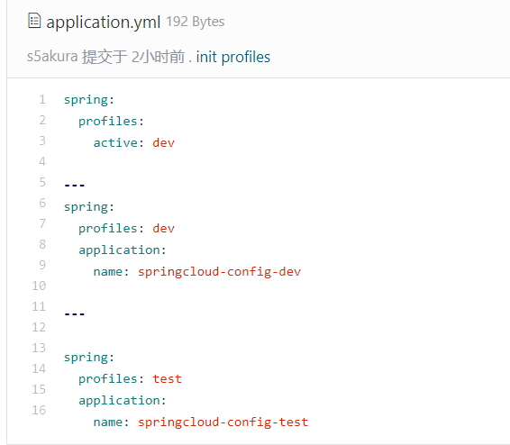

然后我启动后访问下这个配置文件：

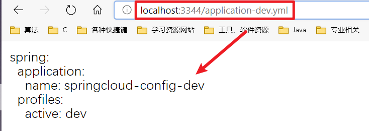

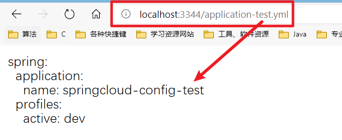

其他访问方式

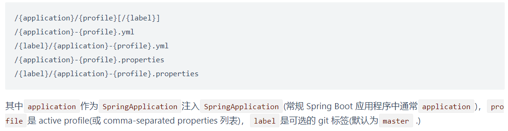


**Spring-Cloud-Config-Client**

依赖

```xml
<dependency>
    <groupId>org.springframework.cloud</groupId>
    <artifactId>spring-cloud-config-client</artifactId>
    <version>2.1.2.RELEASE</version>
</dependency>
```

编写配置

由于我们是从远程去获取配置信息，所以我们这里需要写在`bootstrap.yml`中，这也是springboot支持的配置文件命名，它与application.yml配置的区别是，bootstrap.yml是系统级的配置，在程序引导时执行，而application.yml是应用级，是在应用。**通常使用BootStrap.yml来获取并配置application.yml中需要的配置信息.**


application.yml

```yaml
# 应用级信息
# 这边配置一些基本信息，其他信息从远程获取
spring:
  application:
    name: springcloud-config-client
```

bootstrap.yml

```yaml
# 系统级配置信息
# 配置获取远程配置信息
spring:
  cloud:
    config:
      # 从哪里获取配置信息、对应我们的config-server
      uri: http://localhost:3344
      # 对应git仓库中的文件名
      name: application
      # 配置文件中哪一个profile
      profile: dev
      # git分支
      label: master

      # http://localhost:3344/application/dev/master/
      # config-server 通过这种请求路径也是可以获取配置信息的，只不过这里对其进行了拆分
```

设置好启动类，我们先启动Config-server，然后启动config-client

这是我们预先写好放在远程仓库的配置信息

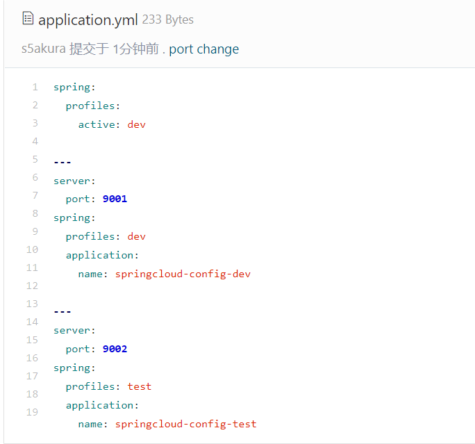

由于我们设置的是读取dev的配置信息。在我们启动config-client时，

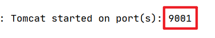

证明在应用启动前，通过bootstrap.yml就已经从远程读取到了信息，并为application.yml配置好了。

那么如果远程和本地的配置中，**有属性名冲突，那谁的优先级更高呢**？

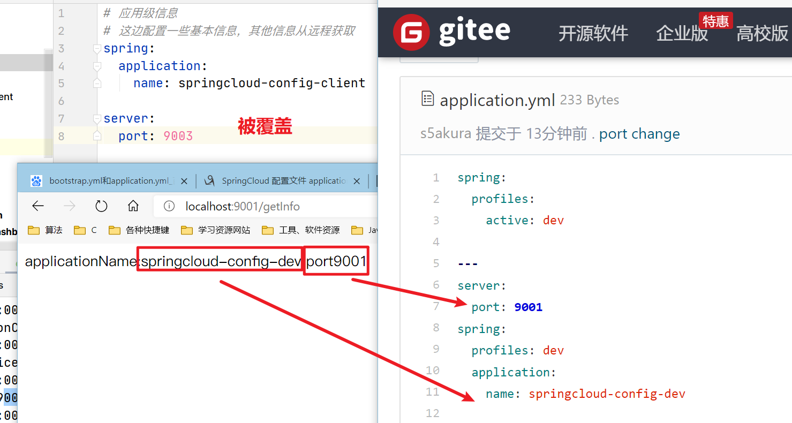

> 经过我们的测试，简单得出结论就是，bootstrap.yml从远程获取的配置选项，发生冲突时会覆盖本地的原有配置。也就是说**优先按远程的配置进行设置。**