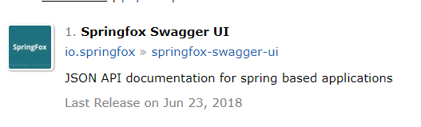
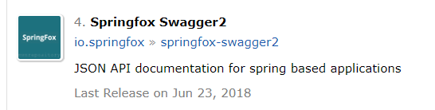
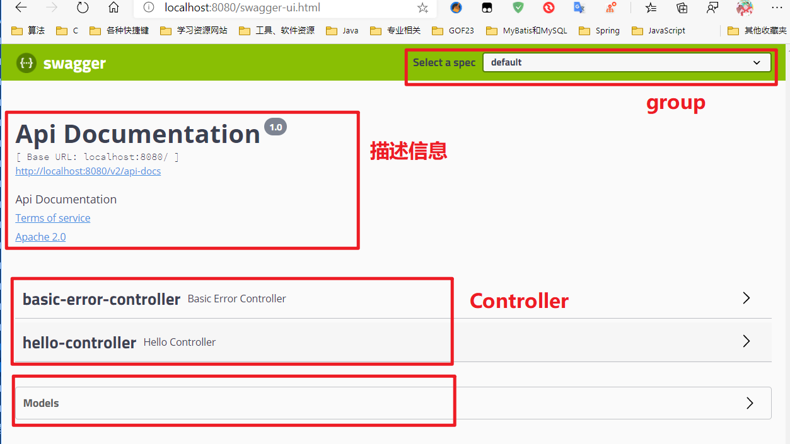
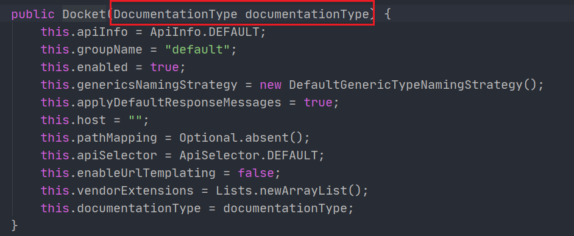
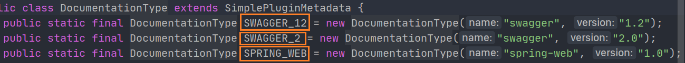
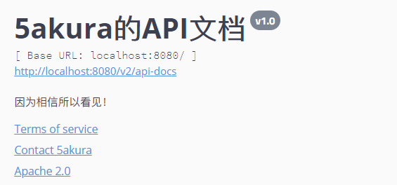
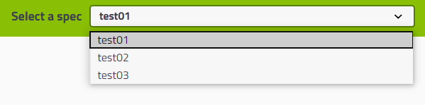
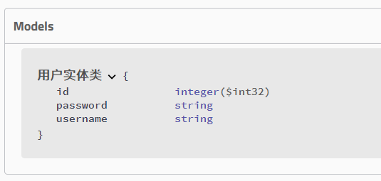
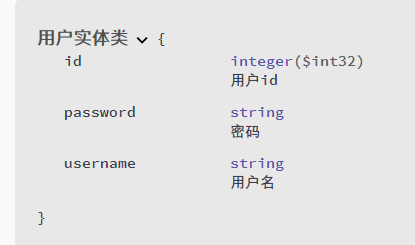
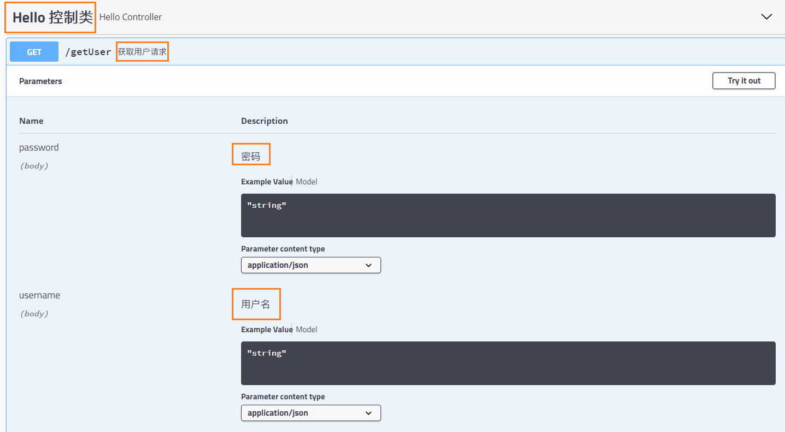

# Swagger


前提要求：学习SpringBoot、了解前后端分离。

## 背景

> **前后端分离**过程中：
>
> 前端需要通过后端的接口来获取数据进行展示，而当前端需求变化时后端相应的接口代码也会改变。
>
> 前端经常抱怨后端给的接口文档与实际情况不一致。后端又觉得编写及维护接口文档会耗费不少精力，经常来不及更新。
>
> 其实无论是前端调用后端，还是后端调用后端，都期望有一个好的接口文档。但是这个接口文档对于程序员来说，就跟注释一样，经常会抱怨别人写的代码没有写注释，然而自己写起代码起来，最讨厌的，也是写注释。所以仅仅只通过强制来规范大家是不够的，随着时间推移，版本迭代，接口文档往往很容易就跟不上代码了。

- 号称世界上最流行的API框架
- RestFul API 文档在线生成工具**（文档与API定义同步更新）**
- Postman：API测试工具，前端专用于测试后端接口的工具。


## 使用

需要jar包springfox:

- swagger2
- ui



```xml
<!-- https://mvnrepository.com/artifact/io.springfox/springfox-swagger-ui -->
<dependency>
    <groupId>io.springfox</groupId>
    <artifactId>springfox-swagger-ui</artifactId>
    <version>2.9.2</version>
</dependency>
<!-- https://mvnrepository.com/artifact/io.springfox/springfox-swagger2 -->
<dependency>
    <groupId>io.springfox</groupId>
    <artifactId>springfox-swagger2</artifactId>
    <version>2.9.2</version>
</dependency>
```


1. 导入依赖

2. 编写最简单的hello world接口

3. **配置Swagger**

   - 创建配置类，使用`@Configuration`和`@EnableSwagger2`注解

   - 此时就可以启动进入 swagger-ui   http://localhost:8080/swagger-ui.html

     

   - Swagger支持对描述信息的自定义需要一个`Docket`实例，在配置类中加入这个组件使用@Bean，在创建这个类时需要参数。`DocumentationType`

     

     源码中给出了三个可选项

     

     这里我们使用`SWAGGER_2`，我们还可以使用docket的方法来进一步配docket实例。

   - 可以发现Docket实例中有一个`apiInfo`属性,这个对象中内容就对应我们在ui页面中的描述信息那一栏。

     ```java
     static {
             DEFAULT = new ApiInfo("Api Documentation", 
                                   "Api Documentation", 
                                   "1.0", 
                                   "urn:tos", 
                                   DEFAULT_CONTACT, 
                                   "Apache 2.0", 
                                   "http://www.apache.org/licenses/LICENSE-2.0", 
                                   new ArrayList());
         }
     ```

     分别对应：标题、描述、版本、服务条款URL、作者信息、许可证、许可证URL

     这也就是Default ApiInfo，至于这个DEFAULT_CONTACT常量也是初始化好的,分别是name,url,email

     ```java
     public static final Contact DEFAULT_CONTACT = new Contact("", "", "");
     ```

     由于类中没有给出set方法，所以只能通过构造器来创建。

     

     - 完整配置类

     ```java
     @Configuration
     @EnableSwagger2
     public class SwaggerConfig {
     
     
         @Bean
         public Docket docket() {
             return new Docket(DocumentationType.SWAGGER_2)
                 .apiInfo(apiInfo());
         }
     
         public ApiInfo apiInfo() {
             Contact contact = new Contact("5akura", "", "843452233@qq.com");
             return new ApiInfo("5akura的API文档",
                     "因为相信所以看见！",
                     "v1.0",
                     "urn:tos",
                     contact,
                     "Apache 2.0",
                     "http://www.apache.org/licenses/LICENSE-2.0",
                     new ArrayList());
         }
     }
     ```
   ```
     
   - 定制化后结果
     
       
   
   
   
   
   
   
   
   
   ```

4. **配置接口扫描**

   > 使用`docket.select().build()`进行相关配置

   ```java
   @Bean
   public Docket docket() {
       return new Docket(DocumentationType.SWAGGER_2)
               .apiInfo(apiInfo())
               .select()
               .apis(RequestHandlerSelectors.basePackage("com.sakura.swagger.controller"))
               .build();
   }
   ```

   `.apis()`中用到一个类`RequestHandlerSelectors`,提供了很多种方式

   - `.basePackage("")` 扫描指定包
   - `.any()` 扫描所有
   - `.none()`  所有都不扫描
   - `withMethodAnnotation(xxx.class)`  只扫描使用xxx注解的方法的接口
   - `withClassAnnotation(xxx.class)`  只扫描使用xxx注解的类中的接口

   

   `.path()` 中用到一个类`PathSelectors`,也提供了类似的方法

   - `any()和none()`
   - `regex()` 使用正则表达式匹配的路径下的接口
   - `ant()` 过滤路径下接口不扫描

   

   **小知识**

   使用`.enable()`来决定Swagger是否启动

   **问题：如何根据运行的环境来决定Swagger是否启动？**(例如：生产和测试环境下启用，上线环境不启用)

   思路：首先获取运行环境，通过运行环境来决定是否启用，结合我们之前讲的多环境切换。

   ```java
   @Bean
   public Docket docket(Environment environment) {
   
       // 设置 需要启用 Swagger的环境
       Profiles profiles = Profiles.of("dev", "test");
       // 判断是否处于 设定的环境中。
       boolean flag = environment.acceptsProfiles(profiles);
   
       return new Docket(DocumentationType.SWAGGER_2)
           .apiInfo(apiInfo())
           .select()  .apis(RequestHandlerSelectors.basePackage("com.sakura.swagger.controller"))        .build()
           // 配置是否启用 Swagger
           .enable(flag);
   }
   ```

5. 配置API文档的分组

   **当多个docket存在时就需要通过分组来区分不同的API文档。**

   

   使用`.groupName()`即可为当前docket设置组名。

   ```java
   @Bean
   public Docket docket2(Environment environment){
       return new Docket(DocumentationType.SWAGGER_2)
               .groupName("test02");
   }
   
   @Bean
   public Docket docket3(Environment environment){
       return new Docket(DocumentationType.SWAGGER_2)
               .groupName("test03");
   }
   ```

6. 为了方便其他人能够看懂我们所写的接口和Model ,Swagger提供和一系列注释功能

   **注意：当我们的接口中 的方法返回值是一个对象时，对象的类就会再Model中显示。**

   ```java
   @GetMapping("getUser")
   public User getUser() {
       User user = new User();
       return user;
   }
   ```

   

   而再实体类上，我们可以使用`@ApiModel("")` 为实体类添加注释，`@ApiModelProperty("")`为实体类的属性添加注释

   效果：

   并且我们也可以对我们的接口进行注释：

   Controller类上使用`@Api(tags = "")`为Controller类进行注释，使用`@ApiOperation("")`对每一个接口方法进行注释，`@ApiParam`为接口方法中的参数注释

   效果：