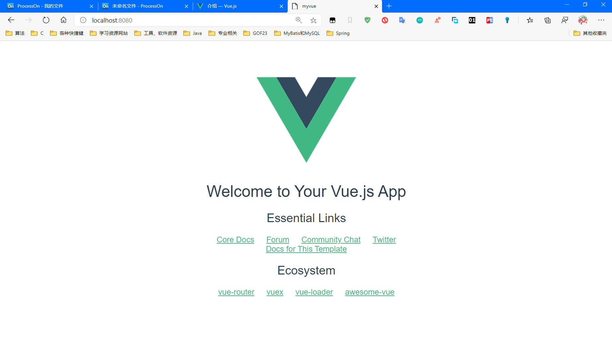

# Vue

## 一、什么是Vue

- 开发者：[尤雨溪(中国)](https://baike.baidu.com/item/%E5%B0%A4%E9%9B%A8%E6%BA%AA/2281470?fr=aladdin)
- 一套用于构建用户界面的渐进式框架，发布于2014年2月，与其他大型框架不同的是，Vue被设计为可以自顶向下逐层应用。
- Vue核心库只==关注视图层(HTML+CSS)。==
- 便于与第三方库（网络通信：axios，页面跳转：vue-router , 状态管理：vuex）或者既有项目整合。

## 二、相关技术栈

### 前端

- HTML(容易)

- CSS(难点、重点)

  > 企业中开发，多用CSS预处理器，用编程的方式来自动生成输出CSS

- JS(重点)

  > JS框架：
  >
  > - jQuery
  >
  > - Angular（Java程序员开发）
  >
  >   > 将MVC搬到了前端，增加了模块化开发的理念，采用TypeScript(微软)开发
  >
  > - React（Facebook出品）
  >
  >   > 提出了虚拟Dom的概念
  >   >
  >   > 需要学JSX语言
  >
  > - Vue
  >
  >   > 渐进式：逐步实现新特性的意思
  >   >
  >   > ==综合了Angular和React==
  >   >
  >   > 特色：**属性计算**
  >   >
  >   > 强调模块化
  >
  > - Axios（前端通信框架）

- UI框架

  1. ElementUI（饿了么）
  2. AmazeUI
  3. Bootstrap（Twitter）
  4. Ant-Design（阿里巴巴）

### 后端

- NodeJS

  > 由于过于笨重，作者声称已经放弃了NodeJS，开始开发新的架构==Deno==

- NodeJS及项目管理工具

  1. Express: NodeJS框架

  2. NPM：项目综合管理工具，类似于Java开发中的Maven


### 关于前后端分离

模式也好，技术也罢，没有好坏优劣之分，只有合不合适；

前后端分离的开发思想主要是基于`SoC（关注度分离原则）`，让前后端职责更清晰，分工合作更高效。


## 三、入门使用

### MVVM

- Model-View-ViewMode，一种软件架构设计模式。
- 事件驱动编程方式
- 源自于MVC模式

> 将前端的视图层(View)[Html，CSS，Template]，与ViewModel[JavaScript]实现==双向绑定==，ViewModel又可以通过Ajax和Json与服务端建立联系，从而从后端拿到数据，并动态修改前端视图，而不再需要频繁去修改前端的View的模板。
>
> 
>
> 视图状态和行为都封装在ViewModel里，这样使得ViewModel可以完整的去描述View层。由于实现了双向绑定，又得益于JS的即时编译运行的动态特性，View的内容会由ViewModel实时地展现，而不必再使用原生的JS去操作Dom元素去更新View。
>
> 
>
> MVVM的核心就是：==DOM监听与数据绑定==
>
> 它是连接view和model的桥梁。它有两个方向：
>
> 一是将【模型】转化成【视图】，即将后端传递的数据转化成所看到的页面。实现的方式是：数据绑定。
>
> 二是将【视图】转化成【模型】，即将所看到的页面转化成后端的数据。实现的方式是：DOM 事件监听。
>
> 这两个方向都实现的，我们称之为数据的双向绑定。
>
> 

```html
<body>
    <div id="p1">
        <!-- 模板 -->
        {{message}} <!--hello vue-->
    </div>

    <script src="../vue-js/vue.js"></script>
    <script>
        // vm 绑定 id=p1的Dom元素
        var vm = new Vue({
            el: "#p1",
            data: {
                message: "hello vue"
            }
        });
    </script>
</body>
```


### v-if、v-else、v-else-if

```vue
<body>
    <!--根据绑定ViewModel中的数据判断显示哪个标签-->
    <div id="p1">
        <h1 v-if="message==='A'">A</h1>
        <h1 v-else-if="message==='B'">B</h1>
        <h1 v-else>C</h1>
    </div>

    <script src="../vue-js/vue.js"></script>
    <script>
        // vm 绑定 id=p1的Dom元素
        var vm = new Vue({
            el: "#p1",
            data: {
                message: "A"
            }
        });
    </script>
</body>
```

### v-for

```vue
<body>

    <div id="p1">
        <ul v-for="(letter, index) in letters" :key="index">
            <li>{{letter.element}}-->{{index}}</li>
        </ul>
    </div>

    <script src="../vue-js/vue.js"></script>
    <script>
        // vm 绑定 id=p1的Dom元素
        var vm = new Vue({
            el: "#p1",
            data: {
                letters: [
                    {"element":"A"},
                    {"element":"B"},
                    {"element":"C"}
                ]
            }
        });
    </script>
</body>
```


### 绑定事件v-on

```html
<body>
    
    <div id="p1">
        <!--绑定按钮点击事件-->
        <button v-on:click="showMsg">Click Me</button>
    </div>
    
    <script src="../vue-js/vue.js"></script>
    <script type="text/javascript">
        var vm = new Vue({
            el: "#p1",
            data: {
                message: "hello Vue"
            },
            methods: {
                showMsg: function () {
                    alert(this.message);
                }
            }
        })
    </script>
</body>
```

> v-on: click="xxx" 可缩写为 @click="xxx"


> 前面的例子只是实现了View绑定ViewModel实时更新，而在有一些用户可以操作的地方可以实现，Model随View变化实时更新，例如文本框输入，下拉框，单选框，多选框等..
>
> 使用v-model 于ViewModel对象实现双向绑定。

### v-model 

```html
<body>
    <div id="div1">
        <input type="text" id="text" value="1111" v-model="message" /> 输入的是：{{message}}
        <p>
            性别
            <input type="radio" value="男" v-model="sex">男
            <input type="radio" value="女" checked  v-model="sex">女
            选择的是：{{sex}}
        </p>
        <p>
            省份
            <select v-model="province">
                <option value=""></option>
                <option value="湖北" selected>湖北</option>
                <option value="湖南">湖南</option>
                <option value="上海">上海</option>
                <option value="广东">广东</option>
                <option value="江苏">江苏</option>
            </select>
            {{province}}
        </p>
    </div>
    
    <script src="../vue-js/vue.js"></script>
    <script type="text/javascript">
        var vm = new Vue({
            el: "#div1",
            data: {
                message: "输入名字",
                sex: "男",
                province: "",
            }
        })
    </script>
</body>
```

> ==注意点：==
>
> 当使用了v-model双向绑定时，表单的一些默认值都会失效，例如text的value，radio的checked，select中option的selected。都会被忽略 ，而是==从绑定的Vue实例中取值。==

### v-bind


```html
<div id="p1">
        <span v-bind:title="message">悬停查看动态绑定信息</span>
    </div>
```

> v-bind: title="xxx"可缩写为   :title="xxx"

### 组件

> 使用Vue . component() 自定义标签

```html
<body>

    <div id="p1">
        <sakura v-for="(hobby, index) in hobbys" :key="index" v-bind:things="hobby"></sakura>
    </div>

    <script src="../vue-js/vue.js"></script>
    <script type="text/javascript">
    
        Vue.component("sakura",{
            template: "<h1>我喜欢-->{{things}}</h1>",
            props:['things']
        })

        var vm = new Vue({
            el: "#p1",
            data: {
                hobbys: ["代码","网球","音乐"]
            }
        })
    </script>

</body>
```

> 组件中：使用props来接收标签中绑定的信息，然后用于template(模板)中，然后使用模板显示到页面上去。


结果：


## 四、Axios

> 用于解决Vue.js的通信需求。

cdn:

```html
<script src="https://unpkg.com/axios/dist/axios.min.js"></script>
```

### mounted()  钩子函数

```html
<body>
    <div id="app">
        <div>
            <p>姓名：{{info.name}}</p>
            <p>年龄：{{info.age}}</p>
            <p>爱好：{{info.hobby}}</p>
            <p>所在省份和城市:{{info.address.province}}省{{info.address.city}}市</p>
            <p><a v-bind:href="info.blog">个人博客</a></p>
        </div>
    </div>

    <script src="../vue-js/vue.js"></script>
    <script src="https://unpkg.com/axios/dist/axios.min.js"></script>
    <script>
        var vm = new Vue({
            el: "#app",
            data() {
                return {
                    info: {
                        "name": null,
                        "age": null,
                        "sex": null,
                        "address": {
                            "country": null,
                            "city": null
                        },
                        "hobby":[],
                        "blog":null
                    }
                }
            },
            mounted() {
                axios.get("./info.json").then((response) => {
                    this.info = response.data
                });
            }
        })
    </script>
</body>
```


> mounted:**在模板渲染成html后调用**，通常是初始化页面完成后，再对html的Dom节点进行一些需要的操作。上述例子是将数据从json文件中取出。并将数据放入data函数中作为属性对象return。然后与之绑定的视图即可取出数据并展示。
>
> **注意这里的==data(){}==，和之前的==data:{}== 效果相同，但是在组件化项目中，为了避免组件之间的data中存在同名的变量，所以使用data(){} ,并使用return返回属性对象，因为不用return(即后者写法)，data中的变量是全局可见的。**


## 五、计算属性

> 当我们经常需要用到的一些属性，是需要在已有属性上做一些修改得到的属性，或者说是不经常改变的属性，我们可以使用属性，如果在视图中的模板中放入过多的逻辑，会让代码难以维护，可以尝试利用计算属性，来创建一个与已有属性相关的属性。

- 例如当我们需要频繁使用到message的倒序串时

  不使用计算属性：

  ```html
  <div id="app">
          message<h3>{{message}}</h3>
          Reverse message<h3>{{message.split('').reverse().join('')}}</h3>
      </div>
      <script src="../vue-js/vue.js"></script>
      <script type="text/javascript">
          var vm = new Vue({
              el:"#app",
              data() {
                  return {
                      message:"Hello"
                  }
              },
          })
      </script>
  ```

  > 我们没调用一次就需要在模板中添加相应的逻辑，大量的使用会提高代码维护的难度。

  使用计算属性：

  ```html
  <body>
      <div id="app">
          message<h3>{{message}}</h3>
          <!-- 直接使用计算属性 -->
          reverse message<h3>{{reverseMsg}}</h3>
      </div>
  
      <script src="../vue-js/vue.js"></script>
      <script type="text/javascript">
          var vm = new Vue({
              el: "#app",
              data() {
                  return {
                      message: "Hello"
                  }
              },
              // 使用计算属性
              computed: {
                  reverseMsg: function () {
                      return this.message.split('').reverse().join('');
                  }
              },
          })
      </script>
  </body>
  ```

  > 使用了Vue实例对象的`computed`属性，并声明了reverseMsg属性，并为其增加了一个函数用做reverseMsg属性的getter函数，且这个属性依赖于message，一旦message发生变化，相应的reverseMsg也会发生变化。

**计算属性是基于它们的响应式依赖进行缓存的**

> 说到这，你可能会疑问为什么不使用`methods`属性，视图直接调用方法就可以，当然最终效果是一样的。
>
> ```html
> <div id="app">
>     message<h3>{{message}}</h3>
>     <!-- 使用Method -->
>     reverse message<h3>{{reverseMsg2()}}</h3>
> </div>
> 
> <script src="../vue-js/vue.js"></script>
> <script type="text/javascript">
>     var vm = new Vue({
>         el: "#app",
>         data() {
>             return {
>                 message: "Hello"
>             }
>         },
>         methods: {
>             reverseMsg2:function(){
>                 return this.message.split('').reverse().join('');
>             }
>         },
>     })
> </script>
> ```
>
> 但是两者之间有一个最大的不同就是，**计算属性是基于它们的响应式依赖进行缓存的**，而是同方法则是每次刷新页面都需要调用方法重新计算。而所谓响应式依赖进行缓存，==意思就是当计算属性所依赖的属性不发生变化时，可以直接从缓存中直接取出值，而不需要执行函数，唯有当依赖属性变化后，才会执行函数重新求值。==
>
> 这样的机制对比使用方法节省了大量的资源。


## 六、插槽slot

```html
<body>

    <div id="app">
        <student-info>
            <info-title slot="slot-title" v-bind:elemtitle="infoTitle"></info-title>
            <item slot="slot-element" v-for="hobby in hobbies" :item="hobby"></item>
        </student-info>
    </div>

    <script src="../vue-js/vue.js"></script>
    <script type="text/javascript">
        Vue.component("student-info", {
            template: '<div >\
                        <slot name="slot-title"></slot>\
                        <ul>\
                            <slot name="slot-element"></slot>\
                        </ul>\
                    </div>'
        });

        Vue.component("info-title", {
            props: ['elemtitle'],
            template: '<h1>{{elemtitle}}</h1>'
        });
        Vue.component("item", {
            props: ['item'],
            template: '<li>{{item}}</li>'
        });

        var vm = new Vue({
            el: "#app",
            data() {
                return {
                    infoTitle:"Sakura的爱好",
                    hobbies: ["网球", "代码", "音乐", "电影"]
                }
            },
        })
    </script>
</body>
```

> 结合代码立即思想，插槽一般就是为后端数据预留位置方便放入数据，按照已经设计好的样式只需要向其中填充数据即可，一般配合组件模板使用。

## 七、自定义事件

> 使用`this.$emit()`,实现自定义的事件

```html
<body>

    <div id="app">
        <student-info>
            <info-title slot="slot-title" v-bind:elemtitle="infoTitle"></info-title>
            <item slot="slot-element" v-for="(hobby,index) in hobbies" :key="index" :item="hobby" :index="index" @remove="RemoveHobby"></item>
        </student-info>
    </div>

    <script src="../vue-js/vue.js"></script>
    <script type="text/javascript">
        Vue.component("student-info", {
            template: '<div >\
                        <slot name="slot-title"></slot>\
                        <ul>\
                            <slot name="slot-element"></slot>\
                        </ul>\
                    </div>'
        });

        Vue.component("info-title", {
            props: ['elemtitle'],
            template: '<h1>{{elemtitle}}</h1>'
        });
        Vue.component("item", {
            props: ['item', 'index'],
            template: '<li>{{item}}&nbsp;<button @click="RemoveItem">不喜欢</button></li>',
            methods: {
                RemoveItem: function (index) {
                    console.log(this.index);
                    this.$emit('remove',this.index);
                }
            }
        });

        var vm = new Vue({
            el: "#app",
            data() {
                return {
                    infoTitle: "Sakura的爱好",
                    hobbies: ["网球", "代码", "音乐", "电影"]
                }
            },
            methods: {
                RemoveHobby: function (index) {
                    var hobby = this.hobbies.splice(index, 1);
                    console.log(index);
                    alert(`删除了${hobby}`)
                }
            },
        })
    </script>
</body>
```


## 八、node.js安装和配置

官网下载安装后，使用`node -v`和`npm -v`，检查是否安装成功。

后续npm安装模块会默认安装到C盘，如果C盘空间不大可以改到其他地方，这里以转移到node安装的目录下作为演示：

1. 在安装目录下创建两个文件夹:file_folder:

   node_global、node_cache

2. 使用cmd执行下列命令：（例如我的安装路径是F:\Environment\Nodejs）

   ```cmd
   npm config set prefix "F:\Environment\Nodejs\node_global"
   npm config set cache "F:\Environment\Nodejs\node_cache"
   ```

3. 在**系统环境变量**中创建【NODE_PATH】

   设置变量值为: **F:\Environment\Nodejs\node_global\node_modules**

4. 修改**用户变量**中的【Path】

   默认是C盘用户目录下AppData\Roaming\npm ,  修改为：**F:\Environment\Nodejs\node_global**

==注意==：使用npm安装，要带上-g 选项，否则会安装在当前目录下。


## 九、第一个vue-cli程序

环境要求：

> npm install cnmp -g  国内加速安装
>
> npm install vue-cli  Vue脚手架安装

1. cmd 进入你要创建项目的位置

2. 使用``vue init webpack `+项目名 创建项目，项目选项参照下图

   依次是：

   - 项目名、
   - 项目描述、
   - 作者、
   - 创建方式、
   - 是否安装vue-router(可后期手动添加)、
   - 是否使用ESLint代码语法检查、(可后期手动添加)
   - 是否启用单元测试、(可后期手动添加)
   - 是否创建完成自动初始化(可选择手动初始化)

   

3. 创建完成后生成一个项目文件夹

   

4. cmd 进入项目文件夹，进行手动初始化并启动。

   ```cmd
   cd myvue
   # 根据package.json下载相关依赖
   npm install
   # 启动项目
   npm run dev
   ```

   > 若安装过程中出错按照提示修复。

5. 启动项目

   

   

> **若想要修改端口号，可以在项目文件夹中的/config/index.js中修改port，默认为8080**

## 十、Webpack学习使用

> webpack是一个现代JavaScript应用程序的静态模块打包器。其功能于web项目中maven的作用十分相似。它 能把各种资源都作为模块来处理和打包。
>
> 由于现在开发多使用ES6，而浏览器支持版本是ES5，我们就需要对项目进行打包然后降级。

### 安装Webpack

```cmd
npm install webpack -g
npm install webpack-cli -g
```

创建一个普通的项目：

hello.js

```javascript
//ES6规范 暴露一个变量
export var sayHello = `hello world`;
// 暴露一个方法
export function sayGoodBye(){
    document.write("<h1>GoodBye</h1>")
}
```

main.js

```javascript
//ES6规范 引入
import { sayHello,sayGoodBye } from "./hello"
console.log(sayHello);
sayGoodBye();
```

> CommonJS的规范使用export和require

webpack.config.js

```javascript
// CommonsJS方式打包
module.exports = {
    // 程序入口
    entry:'./modules/main.js',
    // 输出位置
    output:{
        filename:"./js/bundle.js"
    }
};
```


> 终端进入项目文件夹后，使用`webpack`命令，会打包生成bundle.js文件

index.html

```html
<!DOCTYPE html>
<html lang="en">
<head>
    <meta charset="UTF-8">
    <meta name="viewport" content="width=device-width, initial-scale=1.0">
    <title>Document</title>
</head>
<body>
    <script src="./dist//js//bundle.js"></script>
</body>
</html>
```

> 引入生成的bundle.js后，就会执行打包时配置好的入口main.js中的代码。
>
> 

## 十一、vue-router

下载插件

```html
npm install router --save-dev
```

组件：

main.vue、content.vue

```vue
// main.vue
<template>
  <h2 id="main">哈哈哈，我是主页</h2>
</template>

<script>
export default {
  name:"main-page"
}
</script>

<style scoped>
  #main{
    color: darkgreen;
    background: antiquewhite;
  }
</style>

// content.vue
<template>
    <h2 id="content">嘿嘿嘿，我是内容</h2>
</template>

<script>
export default {
    name:"content-page",
}
</script>

<style scoped>
    #content{
        color: chocolate;
        background-color: beige;
    }
</style>
```

配置vue-route

index.js(每个文件夹下默认index.js为主配置，会自动加载)

```javascript
import Vue from "vue";
import VueRouter from "vue-router";
// 导入组件
import Content from "../components/Content";
import Main from "../components/Main";

// 启用路由
Vue.use(VueRouter);

// 配置并导出路由
export default new VueRouter({
  routes: [{
      // 路由路径
      path: "/main",
      // name要与组件的name保持一致
      name: "main-page",
      // 跳转的组件
      component: Main
    },
    {
      path: "/content",
      name: "content-page",
      component: Content
    }
  ]
});
```

main.js中注册路由

```javascript
import Vue from 'vue'
import App from './App'
import router from "./router"

Vue.config.productionTip = false;

new Vue({
  el: '#app',
  // 注册路由
  router,
  components: { App },
  template: '<App/>'
});
```

> 这是整个项目的总配置，所以使用的插件都要注册，不知道为啥，这里只能使用router这个命名，其他命名都会出错。
>
> 导入时只需要指明主index.js所在文件夹即可。

App.vue

```vue
<template>
  <div id="app">
    <h1>Vue-router</h1>
    <router-link to="/main">主页</router-link>
    <router-link to="/content">内容</router-link>
    <router-view></router-view>
  </div>
</template>

<script>
    export default {
        name: 'App'
    }
</script>

<style>
...
</style>

```

> 这里使用`router-link`和`router-view`，分别用于路由跳转，和跳转组件内容的显示。
>
> router-link中的to：相当于a标签中的href，对应router的index.js中已经配置好的路由路径，即可跳转到指定的模块。


## 十二、Vue+Element