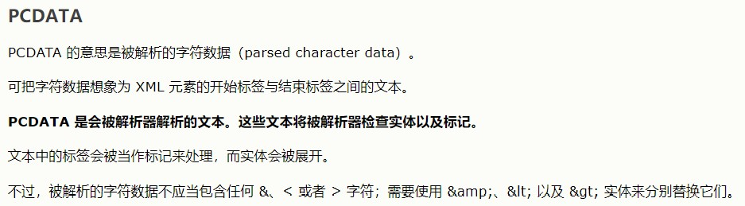
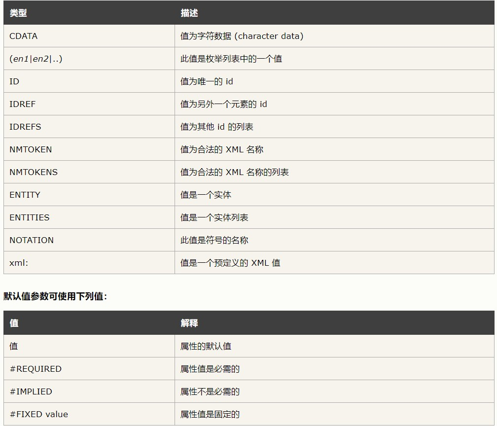

# XML

## xml简介

1. xml，可扩展标记语言（eXtensiable Markup Language），使用简单的标记来描述数据，是一种标记语言。
2. xml是一种非常灵活的语言，没有固定的标签，所有的标签都是可以自定义的。
3. xml通常被用于信息的记录和传递，因此，xml经常被用于充当配置文件。

## 格式良好的XML

1. 声明信息（用于描述XML的版本，和编码信息。）

    ```xml
    <?xml version="1.0" encoding="UTF-8"?>
    ```

2. xml有且仅有一个根元素
3. xml中，代码大小写敏感
4. 标签用·`<>`，是成对出现的，要正确嵌套
5. 属性值要使用双引号 `"属性值"`
6. 注释的写法

    ```xml
    <!--这是注释信息-->
    ```

---

## DTD简介

1. DTD，文档类型定义（Document Type Definition）
2. DTD用于约束XML的文档格式，保证XML是一个有效的xml文件
3. DTD可以分为两种:
   - 内部DTD（写在xml文件里面）
   - 外部DTD（单独形成文件）

## 内部DTD使用

1. 内部DTD的定义

    ```xml-dtd
    <!DOCTYPE 根元素 [元素声明]>

    <!--空元素-->
        <!ELEMENT 元素名称 EMPTY>

    <!--标签中不允许再产生子标签 只能填写数据—-->
        <!ELEMENT 元素名称 (#PCDATA)>

    ```

    > 

2. 元素声明语法

   ```xml-dtd
   <!ELEMENT 元素名 (子元素[,子元素,....])>
   ```

3. 数量词
   > +:表示出现1次或多次
   > ?:表示出现0次或1次
   > *:表示出现任意次

4. 属性声明

   ```xml-dtd
   <!ATTLIST 元素名称 属性名称 属性类型 默认值>
   ```

   > 

5. 带有内部DTD的完整XML代码示例：

   ```  xml-dtd
   <?xml version="1.0" encoding="UTF-8"?>

   <!--声明内部DTD-->
   <!DOCTYPE scores [
       <!ELEMENT scores (student+)>
       <!ELEMENT student (name, course, score)>
       <!ATTLIST student id CDATA #REQUIRED>
       <!ELEMENT name (#PCDATA)>
       <!ELEMENT course (#PCDATA)>
       <!ELEMENT score (#PCDATA)>
   ]>
   <scores>
       <student id = "1">
           <name>王同</name>
           <course>java</course>
           <score>89</score>
       </student>
       <student id = "2">
           <name>李佳</name>
           <course>sql</course>
           <score>58</score>
       </student>
       <student id="3">
           <name>官宇辰</name>
           <course>xml</course>
           <score>87</score>
       </student>
   </scores>
   ```

## 外部DTD的使用

1. 创建独立的dtd文件
    [外部DTD文件](scores.dtd)

    ```xml-dtd
    <?xml version="1.0" encoding="UTF-8"?>

        <!ELEMENT scores (student+)>
        <!ELEMENT student (name, course, score)>
        <!ATTLIST student id CDATA #REQUIRED>
        <!ELEMENT name (#PCDATA)>
        <!ELEMENT course (#PCDATA)>
        <!ELEMENT score (#PCDATA)>
    ```

2. 从外部引入DTD文件（dtd文件与xml在同一文件夹下）

   ```xml-dtd
   <!DOCTYPE 根元素 SYSTEM "文件名">
   ```

---

## XML的解析

- 对xml文件进行操作，包括创建xml，对xml文件进行增删改查。

## 常见的XML解析技术

1. ### DOM解析 --> (官方提高的解析方式)

   - 基于xml树结构解析，适用于多次访问XML

2. ### SAX解析

   - 基于事件，适用于数据量大的XML

3. ### JDOM解析

   - 第三方，免费开源的解析方式，比DOM解析块

4. ### DOM4J --> (DOM for Java)

   - JDOM升级版，使用接口

## DOM4J解析XML

1. 解析XML的入口
   
   >需要先拿到一个Document对象
2. 具体步骤：
   - 1、创建SAXReader对象，用于读取xml对象

        ```java
        SAXReader reader = new SAXReader();
        ```

   - 2、读取XML文件 得到Document对象

        ```java
        Document doc = reader.read(new File("Java_XML/scores.xml"));
        ```

   - 3、获取根元素，然后依次迭代

        ```java
        Element root = doc.getRootElement();
        //4、获取根元素下所有的子元素
        Iterator<?> it = root.elementIterator();
        while (it.hasNext()) {
            //取出元素
            Element e = (Element) it.next();
            System.out.println(e.getName());
            //获取属性
            Attribute id = e.attribute("id");
            System.out.println(id.getName() + "=" + id.getValue());
            //获取student子元素
            Iterator it2 = e.elementIterator();
            Element name = e.element("name");
            Element course = e.element("course");
            Element score = e.element("score");
            // 输出
            System.out.println(name.getName() + ":" + name.getText());
            System.out.println(course.getName() + ":" + course.getText());
            System.out.println(score.getName() + ":" + score.getText());

            System.out.println("-------------------");
        }
        ```

## DOM4J生成XML

1. 具体步骤
   - 1、通过DocumentHelper生成一个Document对象

        ```java
                Document doc = DocumentHelper.createDocument();
        ```

   - 2、构建XML文件内容

        ```java
        //2、添加根元素(返回Element) 可以链式调用方便添加子元素
        Element root = doc.addElement("books");
        //3、为根元素添加子元素
        Element book = root.addElement("book");
        //4、为book元素添加属性
        book.addAttribute("id", "bk01");
        //5、为book添加子元素
        Element name = book.addElement("name");
        Element author = book.addElement("author");
        Element price = book.addElement("price");
        //6、为子元素添加文本
        name.addText("爱情公寓");
        author.addText("张伟");
        price.addText("68");
        ```

   - 3、使用XMLWriter 格式良好输出并释放资源

        ```java
        OutputFormat format = OutputFormat.createPrettyPrint();

        XMLWriter xmlWriter = new XMLWriter(new FileWriter(new File("Java_XML/book.xml")), format);
        xmlWriter.write(doc);

        xmlWriter.close();
        ```
